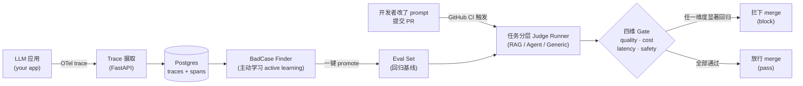
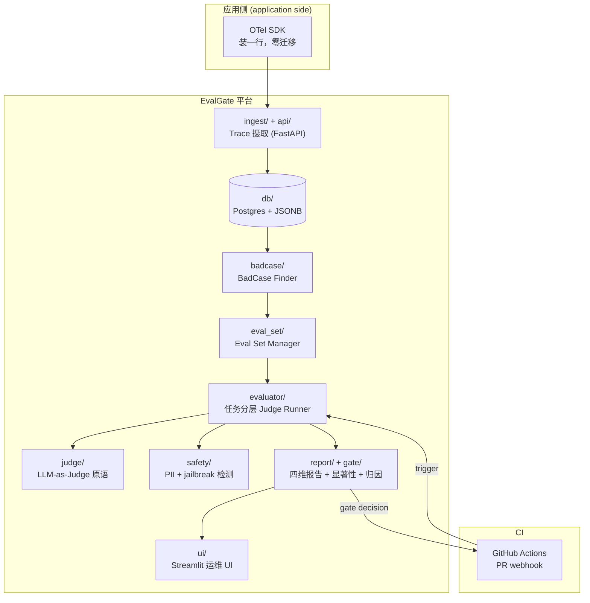

# EvalGate

> **以 Eval 为先的 LLMOps + CI 卡口** —— 把线上 LLM trace 转化为多维度回归门，
> 让有问题的 PR 在合入前就被拦下来。

[](https://github.com/AndyUneducated/eval-gate/actions/workflows/ci.yml)
[](https://github.com/AndyUneducated/eval-gate/actions/workflows/eval-gate.yml)
[](https://github.com/astral-sh/ruff)
[](https://codecov.io)
[](LICENSE)
[](https://github.com/AndyUneducated/eval-gate)

[](https://www.python.org/downloads/)
[](https://docs.astral.sh/uv/)
[](https://fastapi.tiangolo.com/)
[](https://docs.pydantic.dev/)
[](https://www.sqlalchemy.org/)
[](https://alembic.sqlalchemy.org/)
[](https://www.postgresql.org/)
[](https://opentelemetry.io/)
[](https://github.com/BerriAI/litellm)
[](https://docs.ragas.io/)
[](https://microsoft.github.io/presidio/)
[](https://streamlit.io/)
[](https://docs.docker.com/compose/)
[](https://docs.pytest.org/)
[](https://pre-commit.com/)

---

## 为什么做 EvalGate

LLM 类 PR 上墙时通常只挂一个数字 —— *"pass rate 降了 0.5%，应该没事"* —— 而这个数字同时在四个维度上是错的。一个真正能用的 CI 卡口必须同时拒绝 **质量、成本、延迟、安全** 四类回归，并且要有足够的统计严谨度撑住随机性 judge，还要把锅指到具体的 intent / tag 上。

| PR 作者关心什么 | 真正要算清这个问题，你需要什么 | 朴素的 eval pass-rate 卡口为什么不够 |
|---|---|---|
| *"回答质量退步了吗？"* | 按任务跑 bootstrap-CI 的 pass rate | 随机性 LLM judge 在相同输入下也会漂 1–3 个点；朴素差值要么把噪声当回归，要么漏掉真的回归。 |
| *"这个 PR 是不是更贵了？"* | 按 tag / intent 切的 token 消耗变化 | 平均 *"+5% tokens"* 会盖住 *"billing intent +50%、其它打平"* —— 而后者恰恰才是你想抓的回归。 |
| *"用户会不会变卡？"* | 看 p95 延迟，不是均值 | p50 可以稳如老狗，长尾却已经炸了，用户感受到的是长尾。 |
| *"是不是开了新的安全口子？"* | 拆成 4 个子维度：PII 入 / PII 漏出、jailbreak 尝试 / jailbreak 顺从 | 单一的 *"违规率"* 把 *"有人试图越狱"*（输入）和 *"模型真的照办了"*（输出）混在一起 —— 这两个信号方向相反，修复手段也完全不同。 |
| *"这次回归是真的还是噪声？"* | 每个维度都要 bootstrap CI + 显著性标签 | 没有显著性，每个 PR 要么靠运气绿、要么靠运气红，一周之内卡口就会被人关掉。 |
| *"是在哪退步的？"* | 每份报告都附 tag / intent 归因表 | 聚合数字没法对应到具体负责人；按 tag 切的明细行可以。 |

EvalGate 把每个维度路由到合适的统计方法，并把结果汇总到同一条 PR 评论里，让卡口的判断是事实，而不是一句口头评价。

## 它到底做什么

EvalGate 摄取你的 LLM 应用发出的 OpenTelemetry（OTel）trace，通过不确定性采样（uncertainty sampling）挖出 **BadCase**，在每个 PR（Pull Request）上跑一套 **任务感知 judge（task-aware judge）**（RAG / Agent / 通用），当四维卡口触发时直接 **拦下合入（block merge）**。

整条流水线一图看懂：



四维卡口（gate）各自盯什么：

| 维度（axis） | 盯什么 | 怎么判显著 |
|---|---|---|
| **quality** | pass rate（通过率） | bootstrap-CI 显著性，顶住随机 eval 噪声 |
| **cost** | token 消耗回归 | bootstrap-CI |
| **latency** | p95 延迟回归（不是均值） | 阈值（threshold） |
| **safety** | PII（Presidio 检测）+ jailbreak（关键词 + LLM 分类器）违规率 | 拆成 4 个子维度，见下 |

safety 轴的 4 个子维度（sub-metric）：`pii_input_rate`（输入含 PII）/ `pii_output_leak_rate`（输出泄漏 PII）/ `jailbreak_attempt_rate`（越狱尝试）/ `jailbreak_compliance_rate`（模型照办越狱）。

回归会按 `tag` / `intent` 做归因（attribution），因此报告写的是
*"billing intent 掉了 8 个点"*，而不是 *"pass rate 掉了 0.5%"*。

> **状态**：Phase 0–13 已落地 —— OTel ingest、任务分层 judge runner、RAG / Agent / Safety evaluator、四维 gate、Streamlit 运维 UI 全部端到端跑通，**CI 卡口已从 fixtures 切到真 judge 流水线**（Phase 12），并新增 **Shadow Mode**（生产流量上无害评测 candidate，Phase 13 · 见 [`docs/SHADOW.md`](docs/SHADOW.md)）。
> 详见 [`docs/ROADMAP.md`](docs/ROADMAP.md)。

## 架构总览

各组件如何对应到源码模块（`src/evalgate/`）：



完整的产品 + 技术 spec 见 [`docs/design.md`](docs/design.md)。

## 项目文档

| 文件 | 写了什么 |
|---|---|
| [`docs/design.md`](docs/design.md) | 完整的产品 + 技术 spec —— 功能、架构、取舍的唯一信息源，先看这个。 |
| [`docs/ROADMAP.md`](docs/ROADMAP.md) | 分阶段的交付计划（每个阶段大约 1 人天），用 `[DONE]` / `[NEXT]` / `[TODO]` 跟踪。 |
| [`docs/SHADOW.md`](docs/SHADOW.md) | Shadow Mode（Phase 13）3 行接入指南 —— 生产流量上无害评测 candidate。 |
| [`DECISIONS.md`](DECISIONS.md) | ADR 风格的关键技术决策日志（为什么用 OTel、为什么 PG+JSONB、为什么砍掉 prompt UI ……）。 |
| [`JOURNAL.md`](JOURNAL.md) | 倒序的里程碑日志 —— 每个上线阶段一段话。 |

## 快速开始

```bash
# 1. 装 uv（https://docs.astral.sh/uv/），然后：
uv sync

# 2. 起 Postgres
make db-up

# 3. 跑测试
make test

# 4. 用 demo fixtures 试一下多维度卡口
uv run python scripts/seed_demo.py
uv run evalgate gate \
  --baseline examples/fixtures/baseline.json \
  --candidate examples/fixtures/candidate.json
# exit 0 = 卡口通过，exit 1 = 检测到回归（CI 会用这个返回码）
```

## CI 卡口（Phase 12 · 真 judge 端到端）

`eval-gate` workflow 在每个 PR 上跑的不再是静态 fixtures，而是一条真 judge 流水线
（[`scripts/phase12_ci_gate.py`](scripts/phase12_ci_gate.py)）：

1. seed 一个混合 reference eval set（[`examples/ci_demo`](examples/ci_demo)：generic + rag + agent +
   safety 一个集里全覆盖）；
2. 用 **main 分支的 prompt**（`prompts/baseline.yaml`）跑一遍 judge；
3. 用 **PR 分支的 prompt**（`prompts/candidate.yaml`）跑一遍 judge；
4. 两组 records 过 `build_gate_report` → 四维报告 + RAG/agent 的 quality 子项 + safety 子项 + tag 归因。

prompt 以 YAML 维护、commit 在仓库里（git-native prompt 管理）。CI 跑 `EVALGATE_MOCK_LLM=1`
——离线、确定性、零 token 成本：mock 下 baseline / candidate 在同一个集上各轴一致，gate 通过，所以
CI 这步是一条**端到端连通性检查**（每个 task type 都产出非 error record、报告含全部四轴 + 子项）。

本地想看真模型下的真信号（削弱版 candidate 触发回归）：

```bash
make ci-gate        # mock，等价于 CI 跑的
make ci-gate-real   # 真模型，需要本机 Ollama 装好 qwen3.5:9b + qwen3-embedding:8b
```

`make ci-gate-real` 会在削弱版 candidate 上让 gate **FAIL** 并在归因里点名是哪个 tag / 哪个 RAG 子项退步
（实测一次 baseline+candidate 两轮共 8 次评测，端到端约 **140s**）。把 `examples/ci_demo` 换成你自己的
consumer app + prompt，就能把卡口接到你自己的 pipeline 上。

## 开发

| 命令 | 作用 |
|---|---|
| `make install` | 把所有依赖（含 dev 工具）装到 `.venv/` |
| `make dev` | 用 Docker 启动本地 Postgres |
| `make test` | 跑 pytest |
| `make lint` | Ruff check + format 检查 |
| `make format` | 自动修复 lint + format |
| `make db-up` / `make db-down` | 管理本地 Postgres |
| `make ui` | 在 `http://127.0.0.1:8501` 启动 Streamlit 运维 UI（通过 HTTP 调 `evalgate-api`） |
| `make shadow-smoke` | Phase 13 Shadow Mode 端到端 smoke（离线：1k 流量 → 滚动报告 → 报警） |

## 运维 UI（Phase 11）

`src/evalgate/ui/` 下是只读的 Streamlit UI。它只走 FastAPI 后端的 `/v1/*`（绝不直接连 DB），
所以它跟 CLI / CI 用的是同一套 REST 表面，是这套 API 的真实消费方。

```bash
make db-up                      # 起 Postgres
uv run alembic upgrade head     # 跑 migrations
uv run python scripts/seed_demo.py
uv run evalgate-api             # 一个 shell — 8000 端口
make ui                         # 另一个 shell — 8501 端口，会自动开浏览器
```

四个页面：

1. **Traces** —— 分页列表 + span 树详情；"Promote to eval set" 按钮包了
   `POST /v1/eval-sets/{id}/cases/from-trace/{trace_id}`。
2. **Eval Sets** —— 新建 eval set；选中后可以看它的 cases。
3. **Reports** —— 选一个 eval set、两个 `eval_runs`（baseline / candidate），
   渲染四维卡口结论 + 子维度（RAG / safety）+ tag 归因。
4. **Generate Trace** —— 在 UI 里直接造一条 demo trace 推到后端，方便空库快速体验。

API 地址用 `EVALGATE_API_URL` 配置（默认 `http://127.0.0.1:8000`）。

## 贡献

欢迎 PR —— 详细流程见 [CONTRIBUTING.md](./CONTRIBUTING.md)。
特别欢迎：新增 judge 任务、补充新的卡口维度、为非 OTel 的 trace 源写 adapter。

## License

Apache-2.0，详见 [LICENSE](LICENSE)。
