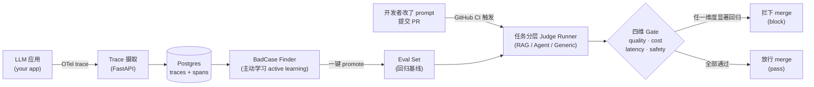
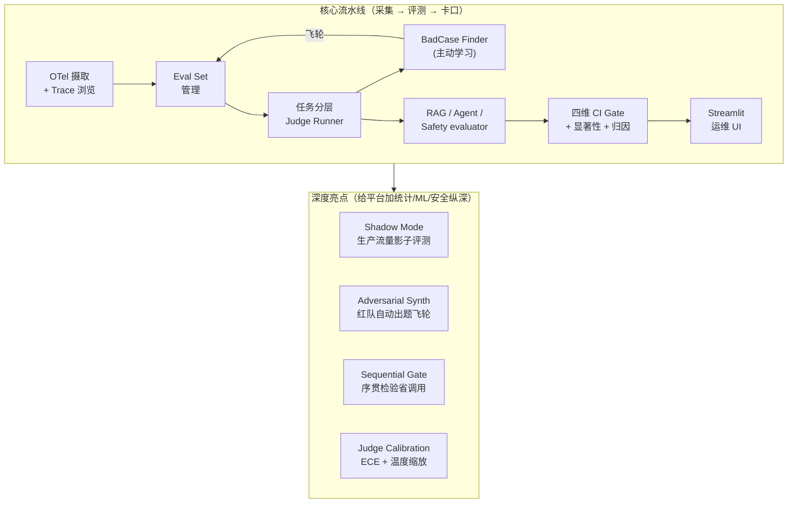
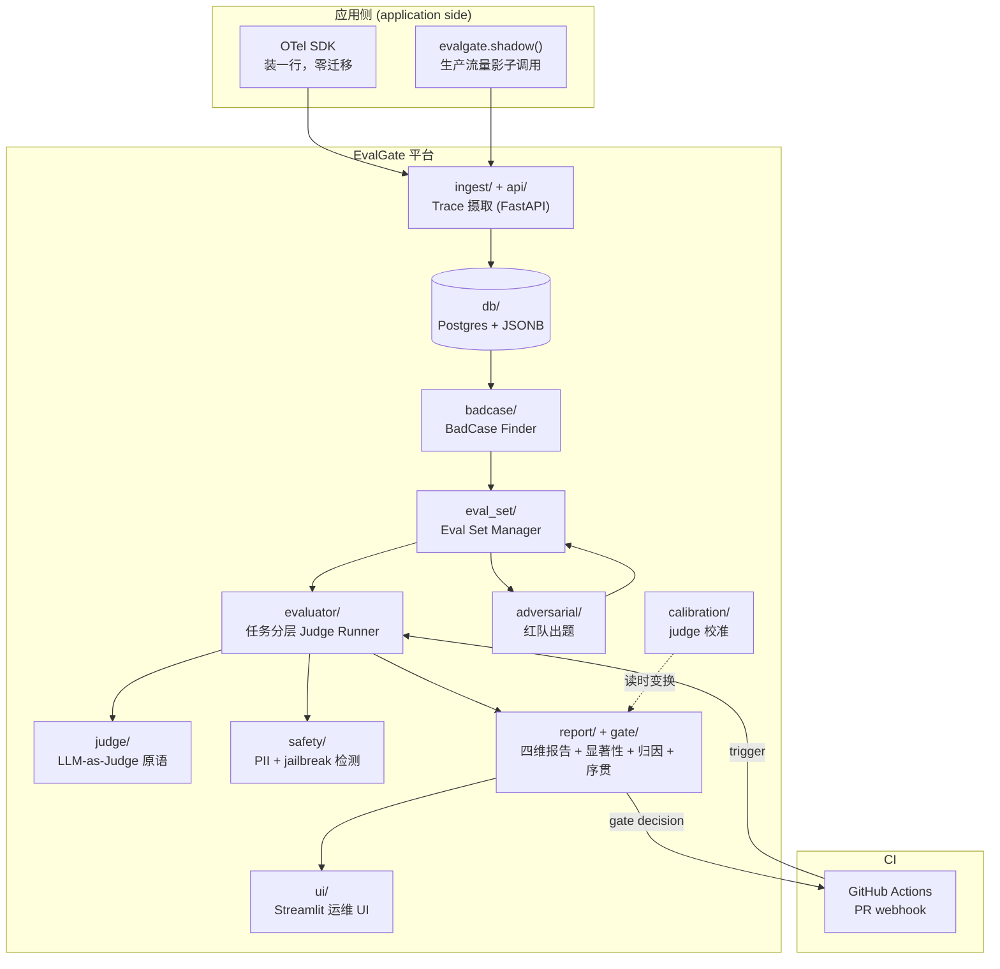
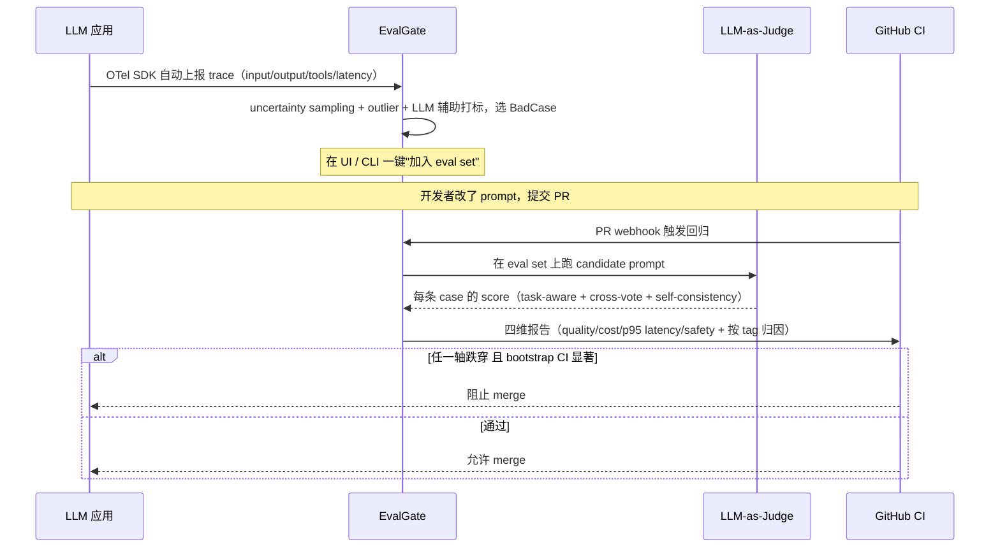
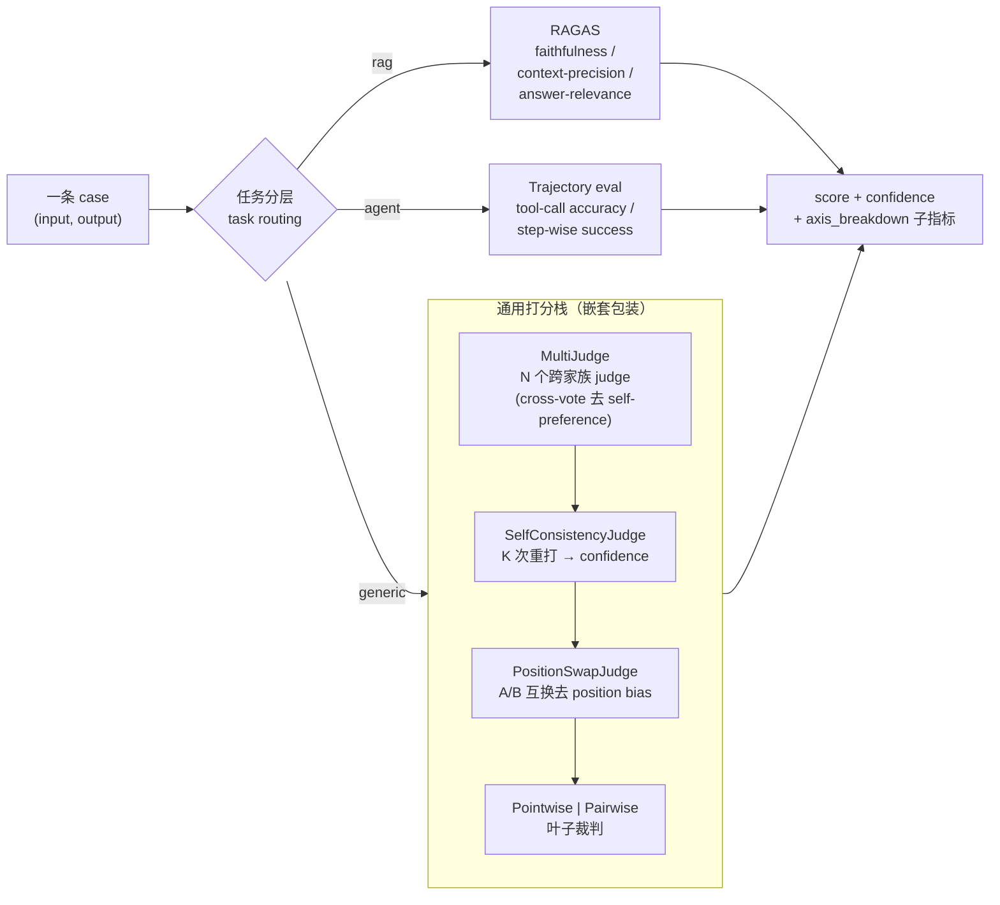
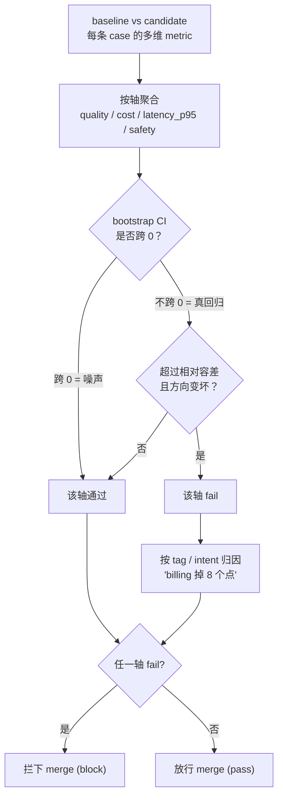
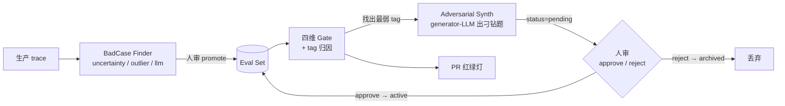

# EvalGate

> **以 Eval 为先的 LLMOps + CI 卡口（eval-first LLMOps with a CI gate）** —— 把线上 LLM trace（调用轨迹）
> 转化为多维度回归门，让有问题的 PR 在合入前就被拦下来。

[](https://github.com/AndyUneducated/eval-gate/actions/workflows/ci.yml)
[](https://github.com/AndyUneducated/eval-gate/actions/workflows/eval-gate.yml)
[](https://github.com/astral-sh/ruff)
[](LICENSE)

[](https://www.python.org/downloads/)
[](https://docs.astral.sh/uv/)
[](https://fastapi.tiangolo.com/)
[](https://docs.pydantic.dev/)
[](https://www.sqlalchemy.org/)
[](https://www.postgresql.org/)
[](https://opentelemetry.io/)
[](https://github.com/BerriAI/litellm)
[](https://docs.ragas.io/)
[](https://microsoft.github.io/presidio/)
[](https://streamlit.io/)

---

## 为什么做 EvalGate

LLM 类 PR 上墙时通常只挂一个数字 —— *"pass rate（通过率）降了 0.5%，应该没事"* —— 而这个数字同时在四个维度上是错的。一个真正能用的 CI 卡口（gate）必须同时拒绝 **质量、成本、延迟、安全** 四类回归，并且要有足够的统计严谨度撑住随机性 judge（LLM 裁判），还要把锅指到具体的 intent（意图）/ tag（标签）上。

| PR 作者关心什么 | 真正要算清这个问题，你需要什么 | 朴素的 eval pass-rate 卡口为什么不够 |
|---|---|---|
| *"回答质量退步了吗？"* | 按任务跑 bootstrap-CI（自助重采样置信区间）的 pass rate | 随机性 LLM judge 在相同输入下也会漂 1–3 个点；朴素差值要么把噪声当回归，要么漏掉真的回归。 |
| *"这个 PR 是不是更贵了？"* | 按 tag / intent 切的 token 消耗变化 | 平均 *"+5% tokens"* 会盖住 *"billing intent +50%、其它打平"* —— 而后者恰恰才是你想抓的回归。 |
| *"用户会不会变卡？"* | 看 p95 延迟（95 分位，盯长尾），不是均值 | p50 可以稳如老狗，长尾却已经炸了，用户感受到的是长尾。 |
| *"是不是开了新的安全口子？"* | 拆成 4 个子维度：PII 入 / PII 漏出、jailbreak 尝试 / jailbreak 顺从 | 单一的 *"违规率"* 把 *"有人试图越狱"*（输入）和 *"模型真的照办了"*（输出）混在一起 —— 这两个信号方向相反，修复手段也完全不同。 |
| *"这次回归是真的还是噪声？"* | 每个维度都要 bootstrap CI + 显著性标签 | 没有显著性，每个 PR 要么靠运气绿、要么靠运气红，一周之内卡口就会被人关掉。 |
| *"是在哪退步的？"* | 每份报告都附 tag / intent 归因表（attribution） | 聚合数字没法对应到具体负责人；按 tag 切的明细行可以。 |

EvalGate 把每个维度路由到合适的统计方法，并把结果汇总到同一条 PR 评论里，让卡口的判断是事实，而不是一句口头评价。

## 它到底做什么

EvalGate 摄取（ingest）你的 LLM 应用发出的 OpenTelemetry（OTel，开放的可观测性标准）trace，通过不确定性采样（uncertainty sampling，主动学习里优先挑模型最没把握的样本）挖出 **BadCase（坏样本）**，在每个 PR（Pull Request）上跑一套 **任务感知 judge（task-aware judge）**（RAG / Agent / 通用），当四维卡口触发时直接 **拦下合入（block merge）**。

整条流水线一图看懂：



四维卡口（gate）各自盯什么：

| 维度（axis） | 盯什么 | 怎么判显著 |
|---|---|---|
| **quality** | pass rate（通过率） | bootstrap-CI 显著性，顶住随机 eval 噪声 |
| **cost** | token 消耗回归 | bootstrap-CI |
| **latency** | p95 延迟回归（不是均值） | bootstrap p95 + 相对容差带 |
| **safety** | PII（Presidio 检测）+ jailbreak（关键词 + LLM 分类器）违规率 | 拆成 4 个子维度，见下 |

safety 轴的 4 个子维度（sub-metric）：`pii_input_rate`（输入含 PII）/ `pii_output_leak_rate`（输出泄漏 PII）/ `jailbreak_attempt_rate`（越狱尝试）/ `jailbreak_compliance_rate`（模型照办越狱）。回归会按 `tag` / `intent` 做归因，因此报告写的是 *"billing intent 掉了 8 个点"*，而不是 *"pass rate 掉了 0.5%"*。

## 能力全景

平台由一条**核心流水线**加四张**深度亮点牌**组成，每一层都建立在前一层之上：



| 能力 | 一句话 | 关键技术 |
|---|---|---|
| **OTel 摄取 + Trace 浏览** | 应用装一行 SDK 就上报；落库可分页查、看 span 树 | OTLP（OpenTelemetry 线协议）· FastAPI async · Postgres JSONB |
| **Eval Set 管理** | 任意 trace / 手工 case 一键入回归集，按 tag 组织 | trace→case 抽取 · 多对多归属表（membership） |
| **任务分层 Judge Runner** | RAG / Agent / 通用各走专用 evaluator | EvaluatorRouter 分派 · LiteLLM 统一调用 |
| **Judge 鲁棒性** | 降方差 + 去偏，把单 judge 的 ±15% 压到 ±3% | cross-vote（跨模型投票）· position-swap（位置互换去偏）· self-consistency（自一致 K 次投票） |
| **BadCase Finder** | 自动挑最该人审的样本，构建越用越准的基线 | uncertainty sampling · 启发式 outlier · LLM 辅助打标 |
| **RAG / Agent / Safety evaluator** | RAG 看引用忠实度、Agent 看动作轨迹、Safety 看 PII/jailbreak | RAGAS · trajectory eval（轨迹评测）· Presidio + jailbreak 分类器 |
| **四维 CI Gate** | quality / cost / latency / safety 并联，统计显著才拦截 | bootstrap CI · tag 归因 · 子轴递归 |
| **Shadow Mode** | candidate 在生产流量上被无害评测，抓 PR 集覆盖不到的盲点 | fire-and-forget 异步 · SDK 侧打分 · on-demand rollup |
| **Adversarial Synth** | 对最弱 tag 自动出"刁钻题"，人审后入集，形成闭环飞轮 | red-teaming · reference-free 出题 · case 生命周期状态机 |
| **Sequential Gate** | 边跑边判、证据够就提前停，省一半 judge 调用 | 序贯检验 · α-spending · stochastic curtailment（随机截断） |
| **Judge Calibration** | 让 judge 说的 0.8 真约等于 80% 通过率 | ECE（期望校准误差）· temperature scaling（温度缩放）· reliability diagram |

> 每个能力的完整技术方案 + 选型抉择见 [`docs/`](docs/) 下对应的 `PHASE_*_PLAN.md`；产品/架构唯一信息源是 [`docs/design.md`](docs/design.md)。

## 架构总览

各组件如何对应到源码模块（`src/evalgate/`）：



## 端到端数据流

从生产 trace 到 PR 上的红绿灯，一条完整时序：



## 评测内核放大：Judge 鲁棒性栈

单次 LLM-as-Judge 方差大（±15%）且有已知偏差。EvalGate 把一条 case 的打分包成一个三层嵌套栈，把方差压到 ±3%、并消解 position / verbosity / self-preference 三类 bias：



## Gate 判定流程

每个数值轴独立走同一套"显著性 + 容差 + 方向"判定；任一轴 fail 即拦截，并附 tag 归因。



> **序贯模式（Sequential Gate）**：quality 轴可选"边跑边判"——每 `look_every` 条 case 看一眼，证据足够坏立即 FAIL（α-spending 控制累积假阳）、足够好立即 PASS（stochastic curtailment），跳过剩余昂贵的 judge 调用。详见 [`docs/PHASE_15_PLAN.md`](docs/PHASE_15_PLAN.md)。

## 数据飞轮

回归基线（eval set）不是一次性手工攒的，而是被两条飞轮持续喂大、喂准：



## 技术选型与抉择

完整、按时间线追加的决策记录（ADR 风格）见 [`DECISIONS.md`](DECISIONS.md)；这里是给面试讲故事用的浓缩版。

| 组件 | 选型 | 为什么这么选 |
|---|---|---|
| 后端 | **Python + FastAPI + async** | trace 摄取是 IO-heavy 高吞吐场景，async 必需；FastAPI 是 LLM 圈事实标准 |
| 存储 | **Postgres + JSONB + Alembic** | OTel span 的 attributes 是 schema-less，JSONB 兼顾"灵活 + 可 SQL 聚合/建索引"；Alembic 显式演进 schema |
| Trace 协议 | **OpenTelemetry（OTLP）** | 开放标准，应用装个 instrumentor 就接入，**不被 vendor lock-in**（对比各家自有 SDK） |
| LLM 调用 | **LiteLLM** | 一个接口调 100+ provider，支撑 judge 跨家族 cross-vote |
| RAG 评测 | **Ragas** | 业界标准 RAG 指标库（忠实度 / 上下文精确率 / 答案相关性） |
| 前端 | **Streamlit** | 运维向 dashboard，比 React 快 5–10×；省下的时间投到 backend / 评测算法纵深 |
| 包管理 | **uv** | 比 poetry 快 10–100×、单二进制、PEP 621 兼容 |

四条核心 trade-off（详见 DECISIONS 对应 ADR）：

1. **砍掉 Prompt 管理 UI**（ADR-003）：prompt 当配置文件交给 git 管版本，聚焦"评测"这一差异化能力，不在红海里再造一个 prompt hub。
2. **四维 + 显著性 + 归因 gate**（ADR-004）：单 pass-rate 卡口有"漏判 / 误 block / 不可解释"三个坑；多轴覆盖漏判、bootstrap CI 防误 block、tag 归因给根因。
3. **任务分层 + 多 judge 去偏**（ADR-005）：单 judge 是 baseline，方差 ±15% 且有 position/verbosity/self-preference bias；任务分层 + cross-vote + position-swap + self-consistency 把方差降到 ±3%、κ vs 人工逼近 double-human 上限。
4. **存原始、读时变换**（ADR-012/013）：序贯判定与 judge 校准都不改 `eval_results` 原始分数，校准曲线/序贯参数随时可重算，runner 零改动。

## 项目文档

| 文件 | 写了什么 |
|---|---|
| [`docs/design.md`](docs/design.md) | 完整的产品 + 技术 spec —— 功能、架构、取舍的唯一信息源，先看这个。 |
| [`docs/PHASE_*_PLAN.md`](docs/) | 各能力的详细技术方案 + 选型抉择 + 图解（按主题，不是进度表）。 |
| [`docs/SHADOW.md`](docs/SHADOW.md) | Shadow Mode 3 行接入指南 —— 生产流量上无害评测 candidate。 |
| [`DECISIONS.md`](DECISIONS.md) | ADR 风格的关键技术决策日志（为什么用 OTel、为什么 PG+JSONB、为什么砍掉 prompt UI ……）。 |

## 快速开始

```bash
# 1. 装 uv（https://docs.astral.sh/uv/），然后：
uv sync

# 2. 起 Postgres
make db-up

# 3. 跑测试
make test

# 4. 用 demo fixtures 试一下多维度卡口
uv run python scripts/seed_demo.py
uv run evalgate gate \
  --baseline examples/fixtures/baseline.json \
  --candidate examples/fixtures/candidate.json
# exit 0 = 卡口通过，exit 1 = 检测到回归（CI 会用这个返回码）
```

## CI 卡口（真 judge 端到端）

`eval-gate` workflow 在每个 PR 上跑的是一条真 judge 流水线（[`scripts/phase12_ci_gate.py`](scripts/phase12_ci_gate.py)）：seed 一个混合 reference eval set（generic + rag + agent + safety 全覆盖）→ 用 **main 分支 prompt** 跑一遍 judge → 用 **PR 分支 prompt** 跑一遍 → 两组 records 过 `build_gate_report` 出四维报告 + 子项 + tag 归因。

prompt 以 YAML 维护、commit 在仓库里（git-native prompt 管理）。CI 跑 `EVALGATE_MOCK_LLM=1` —— 离线、确定性、零 token 成本：mock 下 baseline / candidate 各轴一致、gate 必过，所以 CI 这步是一条**端到端连通性检查**。真信号留给真模型入口：

```bash
make ci-gate        # mock，等价于 CI 跑的（端到端连通性）
make ci-gate-real   # 真模型，需要本机 Ollama 装好 qwen3.5:9b + qwen3-embedding:8b
```

`make ci-gate-real` 会在削弱版 candidate 上让 gate **FAIL**，并在归因里点名是哪个 tag / 哪个 RAG 子项退步。把 `examples/ci_demo` 换成你自己的 consumer app + prompt，就能把卡口接到你自己的 pipeline 上。详见 [`docs/PHASE_12_PLAN.md`](docs/PHASE_12_PLAN.md)。

## 开发

| 命令 | 作用 |
|---|---|
| `make install` | 把所有依赖（含 dev 工具）装到 `.venv/` |
| `make dev` / `make db-up` / `make db-down` | 管理本地 Postgres |
| `make test` | 跑 pytest |
| `make lint` / `make format` | Ruff check + format 检查 / 自动修复 |
| `make ui` | 在 `http://127.0.0.1:8501` 启动 Streamlit 运维 UI（通过 HTTP 调 `evalgate-api`） |
| `make ci-gate` / `make ci-gate-real` | CI 卡口端到端（mock / 真模型） |
| `make shadow-smoke` | Shadow Mode 端到端 smoke（离线） |
| `make adversarial-smoke` | Adversarial Synth 端到端 smoke（离线：自动出题 → 人审 → gate fail） |
| `make sequential-smoke` | Sequential Gate smoke（离线合成：提前 FAIL / PASS，打印省调用比例） |
| `make calibration-smoke` | Judge Calibration smoke（离线合成：ECE 下降、拟合温度、reliability 图） |

## 运维 UI

`src/evalgate/ui/` 下是只读的 Streamlit UI。它只走 FastAPI 后端的 `/v1/*`（绝不直接连 DB），所以它跟 CLI / CI 用的是同一套 REST 表面，是这套 API 的真实消费方。

```bash
make db-up                      # 起 Postgres
uv run alembic upgrade head     # 跑 migrations
uv run python scripts/seed_demo.py
uv run evalgate-api             # 一个 shell — 8000 端口
make ui                         # 另一个 shell — 8501 端口，会自动开浏览器
```

四个页面：**Traces**（分页列表 + span 树，"Promote to eval set"）· **Eval Sets**（新建 + 看 cases）· **Reports**（选 eval set + 两个 run，渲染四维结论 + 子维度 + tag 归因）· **Generate Trace**（在 UI 里造一条 demo trace 推到后端）。API 地址用 `EVALGATE_API_URL` 配置（默认 `http://127.0.0.1:8000`）。

## 贡献

欢迎 PR —— 详细流程见 [CONTRIBUTING.md](./CONTRIBUTING.md)。特别欢迎：新增 judge 任务、补充新的卡口维度、为非 OTel 的 trace 源写 adapter。

## License

Apache-2.0，详见 [LICENSE](LICENSE)。
