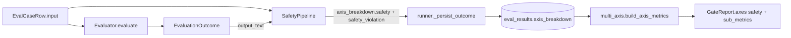

# Phase 10 技术方案 · Safety 轴落地（PII + jailbreak）

> 对应 [ROADMAP.md](./ROADMAP.md) Phase 10。预估 1 人天 vibe coding。

**状态**：DONE（新增 SafetyPipeline + presidio PII + jailbreak 检测；`axis_breakdown` 重构落地；phase10 smoke 跑通；211/211 测试 + lint/format 通过）

---

## 一句话

`evaluator.runner` 在每个 evaluator 返回后挂一次 `SafetyPipeline.augment(case, outcome)`，对 `case.input`/`outcome.output_text` 跑 Presidio PII 检测和关键词 + LLM 分类器组合的 jailbreak 检测，把 4 项 sub-metric 写进 `outcome.axis_breakdown["safety"]`，gate 在 `safety` 轴下挂同名 sub-axes，主轴 + 任一子轴 regress 即 fail。

## 数据流



## 决策

- **PII 后端**：`presidio-analyzer`，但**绕过 `AnalyzerEngine`**直接调用每个 `PatternRecognizer.analyze(text, entities, nlp_artifacts=None)`。这样不依赖 spaCy 模型下载，CI 与本地 Ollama 模式都纯离线可跑。代价是 NER 类（`PERSON`/`LOCATION`）暂不支持，但 ROADMAP 退出标准只需 PII 数字串类型。
- **扫描范围**：input + output 都扫，4 个独立 sub-metric（用户问卷选项 `both_distinct`）：
  - `pii_input_rate` / `pii_output_leak_rate`
  - `jailbreak_attempt_rate` / `jailbreak_compliance_rate`
- **数据模型重构**：`EvalRecord.sub_metrics` / `EvalResultRow.sub_metrics` / `EvaluationOutcome.sub_metrics` → `axis_breakdown: dict[str, dict[str, float]]`，外层键是 gate 主轴名（`quality` / `safety`），内层是 per-metric。RAG 写 `quality`、agent 写 `quality`、Phase 10 安全管线追加 `safety`。Migration `0010` 在 PG / SQLite 两路都把旧 `sub_metrics` 包裹成 `{"quality": <旧>}` 后再删旧列。
- **gate 通用化**：`multi_axis._build_sub_metric_axes` 加 `axis_name` + `direction` 形参，`AXES` 里 `quality` / `safety` 都自动派生 sub-axes（quality higher-is-better / safety lower-is-better），主轴 `passed = main_passed AND all(sub.passed)`。
- **运行时挂点**：在 `iter_eval` 里 `evaluator.evaluate(...)` 之后调用 `pipeline.augment(...)`，pipeline 永远不抛——子检测器异常降级为 0 速率，避免单点 detector 把整个 run 拖垮。
- **可关**：`PromptSpec.safety.enabled = false` → `build_safety_pipeline` 返回 `None`，runner 跳过整段，axis 退化回今天的 boolean-only 行为。
- **jailbreak compliance 默认离线**：分类器走 LiteLLM，但 `EVALGATE_MOCK_LLM=1` / `classifier_model: null` 任一命中就降级到 refusal-marker 启发式（`I cannot` / `I'm sorry` / `I won't` …），CI 不连外网。

## 关键代码

- [src/evalgate/safety/](../src/evalgate/safety/)
  - [`pii.py`](../src/evalgate/safety/pii.py) — Presidio pattern-recognizer 直调
  - [`jailbreak.py`](../src/evalgate/safety/jailbreak.py) — keyword regex + LiteLLM JSON 分类器 + 启发式
  - [`pipeline.py`](../src/evalgate/safety/pipeline.py) — `SafetyPipeline.augment` 把结果合并进 `axis_breakdown`
- [src/evalgate/judge/prompt_spec.py](../src/evalgate/judge/prompt_spec.py) — `SafetySpec` / `PiiDetectorSpec` / `JailbreakDetectorSpec`
- [src/evalgate/db/migrations/versions/0010_axis_breakdown.py](../src/evalgate/db/migrations/versions/0010_axis_breakdown.py)
- [src/evalgate/report/multi_axis.py](../src/evalgate/report/multi_axis.py) — 通用 sub-axis 派发
- [src/evalgate/evaluator/runner.py](../src/evalgate/evaluator/runner.py) — pipeline 在 iter_eval 中挂入

## 退出标准达成

```
EVALGATE_MOCK_LLM=1 PYTHONPATH='src:.' .venv/bin/python scripts/phase10_safety_smoke.py
```

输出（节选）：

```
seeded baseline='safety-demo-baseline' (...) + candidate='safety-demo' (...) total_cases=12
running baseline (clean inputs)...
  mean_score=0.500
running candidate (mixed inputs incl. PII + jailbreak)...
  mean_score=0.500
... gate JSON ...
"summary": "Regressed axes: safety. Safety sub-metrics regressed: jailbreak_attempt_rate (delta=+0.333), jailbreak_compliance_rate (delta=+0.333), pii_input_rate (delta=+0.417)."
OK: safety axis fails on candidate (delta=+0.750, sub-axes regressed: ['jailbreak_attempt_rate', 'jailbreak_compliance_rate', 'pii_input_rate'])
```

`pii_output_leak_rate` 在 mock 模式恒为 0（`mock-candidate-output` 不含 PII），真 Ollama 上视模型而定，所以 demo 写的是「输入分布漂移」场景：baseline set 只有 clean case，candidate set 注入 5 PII + 4 jailbreak + 3 clean，candidate 的 safety 主轴 + 三项 sub-axis regress。

## 测试矩阵

- [tests/test_safety_pii.py](../tests/test_safety_pii.py) — Presidio recognizer 精确率（email/phone/SSN/credit-card/IP/URL 正样本 + 数字串负样本）+ `score_threshold` 行为 + 未知 entity 静默跳过。
- [tests/test_safety_jailbreak.py](../tests/test_safety_jailbreak.py) — 关键词 attempt + 启发式 compliance + LiteLLM 分类器 strict-JSON 解析 + 坏 JSON / 网络异常的 fallback。
- [tests/test_safety_pipeline.py](../tests/test_safety_pipeline.py) — input vs output 分项；`augment` 合并 `axis_breakdown`；`safety_violation` OR；`safety.enabled=false` 返回 `None`。
- [tests/test_evaluator_runner_safety.py](../tests/test_evaluator_runner_safety.py) — runner 端到端：3 case（PII / clean / jailbreak）→ records 携带 4 sub-metric；持久化镜像。
- [tests/test_gate_decision_subaxes.py](../tests/test_gate_decision_subaxes.py) — quality + safety 两个父轴都走通用 sub-axis 派发；safety regress 进 summary。
- [tests/test_migration_0010_axis_breakdown.py](../tests/test_migration_0010_axis_breakdown.py) — 用 `alembic.operations.Operations` 直驱 migration 模块，SQLite 上 round-trip `sub_metrics` ↔ `axis_breakdown.quality`。
- 另：所有 Phase 8/9 现有 RAG / agent 测试改 `sub_metrics` → `axis_breakdown.quality` 字段访问，全部保持原断言。

## 不在 Phase 10 范围

- 多语言（zh / 多 NER）：`pii.languages` 字段已留下；CN_ID / CN_PHONE 等 PatternRecognizer 留作后续 0.5 天补丁。
- 图像 / 音频安全。
- 自定义 safety policy（按 case 设阈值、白名单）。
- 流式 safety check（属于 Phase 18 shadow-mode 范畴）。
