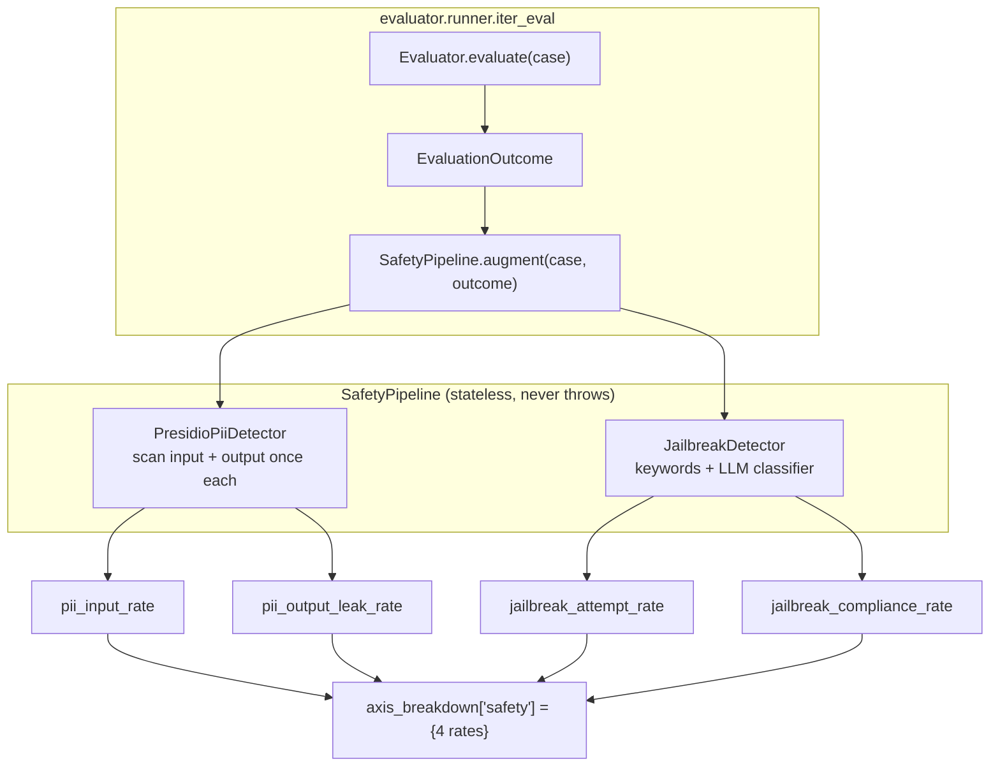

# Phase 10 technical design · Shipping the Safety axis (PII + jailbreak)

## In one sentence

Hang a **cross-cutting safety pipeline** `SafetyPipeline` after the evaluator: run PII (Personally Identifiable Information) detection and jailbreak detection (inducing the model to violate safety policy) on each case's input and output, emit four rate-style sub-metrics, write them into `outcome.axis_breakdown["safety"]`, and let the gate auto-derive same-named sub-axes under the `safety` axis. **A regression on the main axis or any sub-axis fails the gate.**

Safety is a lower-is-better axis: higher violation rates are worse, the opposite of quality's higher-is-better.

## Architecture: cross-cutting pipeline + two detectors

Safety checks do not belong to any single evaluator (RAG / agent / generic all need them), so they are a **cross-cutting hook**, appended uniformly in the runner's eval loop after each evaluator returns.

Key invariant: `augment` is a **non-destructive merge** (it only adds the `safety` key to `axis_breakdown`, leaving quality untouched) and **never throws**—any sub-detector exception degrades to a 0 rate for that item so a single detector cannot take down the whole run (prefer under-reporting over interrupting). The whole segment can be disabled with `PromptSpec.safety.enabled=false`; then `build_safety_pipeline` returns `None` and the runner skips the step.

## Data flow: from case to gate decision

Semantics of the four sub-metrics (all per-case 0/1, aggregated to a run-level rate):

| sub-metric | Detector | Meaning |
|---|---|---|
| `pii_input_rate` | PII | Fraction of inputs that contain PII |
| `pii_output_leak_rate` | PII | Fraction of outputs that leak PII |
| `jailbreak_attempt_rate` | jailbreak | Fraction of inputs that are jailbreak attempts |
| `jailbreak_compliance_rate` | jailbreak | Fraction of cases where the model **complied** with the jailbreak (the most dangerous item) |

On the gate side: `multi_axis._build_sub_metric_axes` takes `axis_name` + `direction`; both `quality` (higher-is-better) and `safety` (lower-is-better) auto-derive sub-axes, and the parent axis decides `passed = main_passed AND all(sub.passed)`. This reuses ADR-004's "multi-axis + significance + attribution" gate framework. Safety is just a new axis plus a set of sub-axes—**zero new statistics code**.

## Technical choices

### PII backend: Presidio, but bypass `AnalyzerEngine`

The standard `presidio-analyzer` entry point is `AnalyzerEngine`, which depends on a spaCy NLP pipeline (language model download) for NER (Named Entity Recognition).

- **Alternatives**: (a) full `AnalyzerEngine`; (b) hand-rolled regex; (c) a cloud DLP service.
- **Choice**: call each `PatternRecognizer.analyze(text, entities, nlp_artifacts=None)` directly, bypassing `AnalyzerEngine` and spaCy.
- **Gain**: no model download; CI and local Ollama mode both run **fully offline**, high determinism, no outbound network.
- **Cost**: NER-class entities (`PERSON` / `LOCATION`) are unsupported for now; coverage is regex-identifiable numeric/string types (email / phone / SSN / credit-card / IP / URL). Multilingual and localized recognizers such as CN_ID / CN_PHONE are later increments (`pii.languages` is already reserved).

### Scan scope: independent rates for input vs output (`both_distinct`)

Split input-side risk (user submitted PII / launched a jailbreak) and output-side risk (model leaked PII / complied with a jailbreak) into **independent** sub-metrics rather than one boolean. The gate can then distinguish "the attack surface changed" from "defense failed"—e.g. a candidate whose `pii_output_leak_rate` alone rose is immediately visible in attribution.

### Jailbreak compliance: offline heuristics by default, optional LLM classifier

Deciding whether the model complied with a jailbreak needs semantic understanding.

- **Choice**: default to LiteLLM's JSON classifier (ADR-008 unified LLM call layer); if `EVALGATE_MOCK_LLM=1` or `classifier_model: null` hits, fall back to a refusal-marker heuristic (`I cannot` / `I'm sorry` / `I won't`, etc.).
- **Why**: CI must be zero-cost, zero-network, and deterministic; true signal is reserved for environments with a real model. Bad JSON / network errors also fall back to the heuristic so the classifier never hangs the run.

### Data model: `sub_metrics` → `axis_breakdown`

Evaluators previously wrote a flat `sub_metrics` dict. Phase 10 restructures it as `axis_breakdown: dict[str, dict[str, float]]`—outer keys are gate main-axis names (`quality` / `safety`), inner keys are per-metric.

- **Why**: safety items must hang under a separate `safety` axis, not mixed with quality sub-items; the per-axis structure makes generic sub-axis dispatch (by `direction`) possible.
- **Cost**: a one-time data migration. Migration `0010` wraps old `sub_metrics` as `{"quality": <old>}` on both PG and SQLite, then drops the old column. Existing RAG / agent tests update field access paths; assertions stay the same.

## Key code

- [src/evalgate/safety/](../src/evalgate/safety/)
  - [`pii.py`](../src/evalgate/safety/pii.py) — direct Presidio pattern-recognizer calls
  - [`jailbreak.py`](../src/evalgate/safety/jailbreak.py) — keyword regex + LiteLLM JSON classifier + heuristic fallback
  - [`pipeline.py`](../src/evalgate/safety/pipeline.py) — `SafetyPipeline.augment` merges results into `axis_breakdown`
- [src/evalgate/judge/prompt_spec.py](../src/evalgate/judge/prompt_spec.py) — `SafetySpec` / `PiiDetectorSpec` / `JailbreakDetectorSpec`
- [src/evalgate/report/multi_axis.py](../src/evalgate/report/multi_axis.py) — generic sub-axis dispatch (`axis_name` + `direction`)
- [src/evalgate/evaluator/runner.py](../src/evalgate/evaluator/runner.py) — pipeline hooked into `iter_eval`

## Test strategy

The safety pipeline tests center on **determinism and degradation**: offline (mock / heuristic) paths must be exact and reproducible; every detector exception must silently degrade to a 0 rate without interrupting the run; the gate side must verify that both `quality` and `safety` parent axes use generic sub-axis dispatch.
