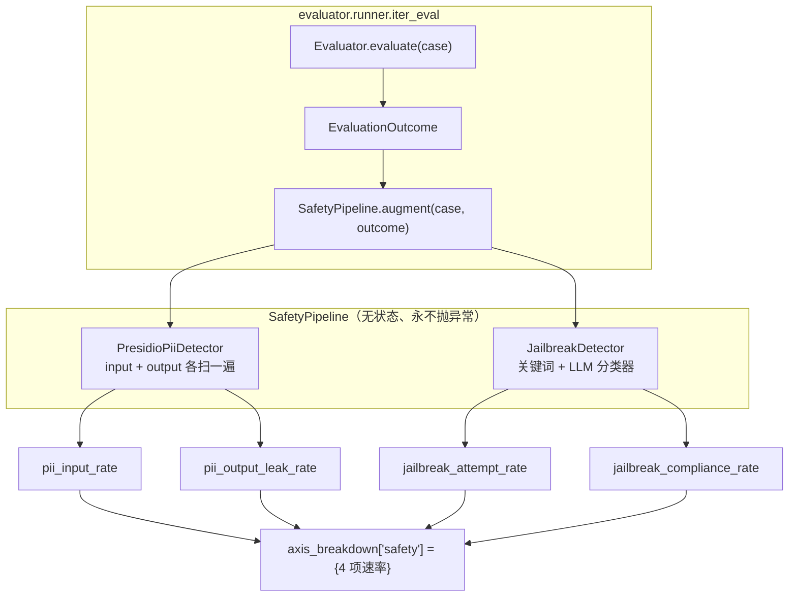
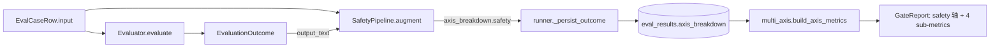

# Phase 10 技术方案 · Safety 轴落地（PII + jailbreak）

## 一句话

在 evaluator 之后挂一个**横切的安全管线** `SafetyPipeline`：对每个 case 的输入与输出跑 PII（Personally Identifiable Information，个人身份信息）检测和 jailbreak（越狱，诱导模型违反安全策略）检测，产出 4 个速率型 sub-metric（子指标/子轴），写进 `outcome.axis_breakdown["safety"]`，gate 在 `safety` 轴下自动派生同名 sub-axes，**主轴或任一子轴 regress（回归劣化）即 fail**。

安全是 lower-is-better（越低越好的方向）的轴：违规率越高越糟，与 quality 的 higher-is-better 相反。

## 架构：横切管线 + 两个检测器

安全检测不属于任何单一 evaluator（RAG / agent / generic 都需要），所以做成一个**跨切面 hook**，在 runner 的评测循环里、每个 evaluator 返回之后统一追加。

关键不变量：`augment` 是**非破坏性合并**（只往 `axis_breakdown` 里加 `safety` 键，不动 quality），且**永不抛异常**——任一子检测器异常都降级为该项 0 速率，避免单点 detector 把整个 run 拖垮（宁可少报，不可中断）。可通过 `PromptSpec.safety.enabled=false` 整段关闭，此时 `build_safety_pipeline` 返回 `None`，runner 跳过该步。

## 数据流：从 case 到 gate 判定

4 个 sub-metric 的语义（皆为 per-case 0/1，聚合成 run 级速率）：

| sub-metric | 检测器 | 含义 |
|---|---|---|
| `pii_input_rate` | PII | 输入里含 PII 的比例 |
| `pii_output_leak_rate` | PII | 输出里泄露 PII 的比例 |
| `jailbreak_attempt_rate` | jailbreak | 输入是越狱尝试的比例 |
| `jailbreak_compliance_rate` | jailbreak | 模型**顺从**了越狱的比例（最危险项） |

gate 侧：`multi_axis._build_sub_metric_axes` 接受 `axis_name` + `direction` 两个形参，`quality`（higher-is-better）与 `safety`（lower-is-better）都自动派生 sub-axes，主轴判定 `passed = main_passed AND all(sub.passed)`。这复用了 ADR-004 的"多轴 + 显著性 + 归因" gate 框架，安全只是新增的一条轴 + 一组子轴，**零新统计代码**。

## 技术选型与抉择

### PII 后端：Presidio，但绕过 `AnalyzerEngine`

`presidio-analyzer` 的标准入口是 `AnalyzerEngine`，它依赖 spaCy NLP pipeline（需下载语言模型）来做 NER（Named Entity Recognition，命名实体识别）。

- **备选**：(a) 走完整 `AnalyzerEngine`；(b) 自己写正则；(c) 调云端 DLP 服务。
- **选择**：直接调每个 `PatternRecognizer.analyze(text, entities, nlp_artifacts=None)`，绕过 `AnalyzerEngine` 与 spaCy。
- **收益**：不需要下载模型，CI 与本地 Ollama 模式都**纯离线**可跑，确定性高、无外网依赖。
- **代价**：NER 类实体（`PERSON` / `LOCATION`）暂不支持，只覆盖正则可识别的数字串类型（email / phone / SSN / credit-card / IP / URL）。多语言、CN_ID / CN_PHONE 等本地化识别器作为后续增量（`pii.languages` 字段已预留）。

### 扫描范围：input 与 output 各算独立速率（`both_distinct`）

把输入侧风险（用户提交了 PII / 发起越狱）与输出侧风险（模型泄露 PII / 顺从越狱）拆成**各自独立**的 sub-metric，而非合并成一个布尔。这样 gate 能区分"攻击面变了"和"防御失效了"两类回归——例如某 candidate 的 `pii_output_leak_rate` 单独上升，归因一眼可见。

### jailbreak compliance：默认离线启发式，可选 LLM 分类器

判断"模型是否顺从了越狱"需要语义理解。

- **选择**：默认走 LiteLLM 的 JSON 分类器（ADR-008 统一 LLM 调用层）；但 `EVALGATE_MOCK_LLM=1` 或 `classifier_model: null` 任一命中就降级到 refusal-marker 启发式（识别 `I cannot` / `I'm sorry` / `I won't` 等拒绝标记）。
- **理由**：CI 必须零成本、零外网、确定性；真信号留给接了真模型的环境。坏 JSON / 网络异常同样 fallback 到启发式，绝不让分类器把 run 拖挂。

### 数据模型：`sub_metrics` → `axis_breakdown`

原先各 evaluator 直接写一个扁平 `sub_metrics` dict。Phase 10 把它重构成 `axis_breakdown: dict[str, dict[str, float]]`——外层键是 gate 主轴名（`quality` / `safety`），内层是 per-metric。

- **理由**：安全子项必须挂在独立的 `safety` 轴下，而非和 quality 子项混在一起；分轴结构让 gate 的通用 sub-axis 派发（按 `direction` 区分方向）成为可能。
- **代价**：一次性的数据迁移。migration `0010` 在 PG / SQLite 两路把旧 `sub_metrics` 包裹成 `{"quality": <旧>}` 后再删旧列；现有 RAG / agent 测试相应改字段访问路径，断言不变。

## 关键代码

- [src/evalgate/safety/](../src/evalgate/safety/)
  - [`pii.py`](../src/evalgate/safety/pii.py) — Presidio pattern-recognizer 直调
  - [`jailbreak.py`](../src/evalgate/safety/jailbreak.py) — 关键词 regex + LiteLLM JSON 分类器 + 启发式 fallback
  - [`pipeline.py`](../src/evalgate/safety/pipeline.py) — `SafetyPipeline.augment` 把结果合并进 `axis_breakdown`
- [src/evalgate/judge/prompt_spec.py](../src/evalgate/judge/prompt_spec.py) — `SafetySpec` / `PiiDetectorSpec` / `JailbreakDetectorSpec`
- [src/evalgate/report/multi_axis.py](../src/evalgate/report/multi_axis.py) — 通用 sub-axis 派发（`axis_name` + `direction`）
- [src/evalgate/evaluator/runner.py](../src/evalgate/evaluator/runner.py) — pipeline 在 `iter_eval` 中挂入

## 测试策略

安全管线的测试核心是**确定性与降级**：离线（mock / 启发式）路径要精确、可复现，每个检测器的异常都要能静默降级为 0 速率而不中断 run，gate 侧要验证 `quality` / `safety` 两个父轴都走通用 sub-axis 派发。
