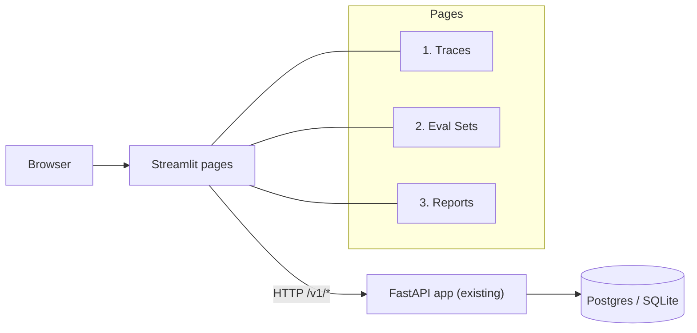

# Phase 11 技术方案 · Streamlit Ops UI v1

> 对应 [ROADMAP.md](./ROADMAP.md) Phase 11。预估 1 人天 vibe coding。

**状态**：DONE（新增 `src/evalgate/ui/` streamlit 多 page app + 最小 `/v1/runs*` REST 增量；测试 / lint / format 通过）

> **后续更新（历史快照）**：下文规划的 `src/evalgate/eval_run/repository.py` 最终实现为 `judge.persistence` 里的 `list_runs` / `list_records` helper + `api/routers/evals.py`，并无独立 `eval_run/` 包。UI 后续（Phase 11.1）又加了第 4 个 page `4_Generate_Trace.py`（见文末补丁），现共 4 个 page。

---

## 一句话

新建独立包 `src/evalgate/ui/`，一个 streamlit 多 page app（Traces / Eval Sets / Reports）只通过 **HTTP** 调现有 `/v1/*` REST API（不直连 DB），让 ops 在浏览器走完 “看 trace → 选 case promote → run → 看 4 轴 + tag 归因 + sub-axes 报告” 全流程。

## 数据流



## 关键设计决策

- **UI 通过 REST 调 API，绝不直连 DB**：UI 进程是“另一个服务”，与已有 FastAPI 完全解耦：
  - 不让 streamlit 进程长持 SQLAlchemy async session（streamlit 的执行模型对 asyncio 不友好）。
  - 同一份 API 既给 CLI、CI 用，又给 UI 用，单一真理源。
  - 调试时可以 `httpx`/curl 直接复现请求。
- **多 page 用 streamlit 原生的 `pages/` 文件约定**（`1_Traces.py` / `2_Eval_Sets.py` / `3_Reports.py`），不引入额外路由库。
- **HTTP client 抽 thin wrapper**：`evalgate.ui.api_client.EvalGateClient`（基于 `httpx.Client`，**同步**——streamlit 主线程同步调用最简单），统一 base URL 与超时；所有 page 模块通过 client.get/post，不在 page 文件里散装 URL。
- **Reports 页直接复用 GateReport JSON**：4 轴卡片 + `axis_breakdown` sub-axes 表 + `attribution` tag 表；不重新建 schema。
- **eval_runs 没现成 list/detail REST，新增最小增量**：`GET /v1/runs?eval_set_id=&limit=` + `GET /v1/runs/{run_id}` + `GET /v1/runs/{run_id}/records`。前两者读 `EvalRunRow`，第三者把 `EvalResultRow` 映射成 `EvalRecord`（已有 pydantic）。
- **Reports 的 baseline / candidate 选择**：UI 上提供两个下拉 → UI 拉两组 records → POST 现有 `POST /v1/evals/run` 得 `GateReport`。这样不在 server 端规定“谁是基线”，UI 自由组合，避免新增隐含约定。
- **不做认证 / RBAC**：v1 本机 ops 工具，绑 `127.0.0.1`；后续要远程再上反向代理。
- **不做实时刷新 / SSE**：手动 `Refresh` 按钮 + streamlit 的 `cache_data(ttl=)` 控制。
- **mock-friendly 测试**：UI 单测用 `httpx.MockTransport` 拦截外部 HTTP，验证 client 的请求路径/参数与 pydantic 解析；纯函数 helpers 单独测。**不启动 streamlit runtime**——streamlit 没有可靠的 headless 渲染断言。

## 关键代码

```
src/evalgate/ui/
├── __init__.py
├── api_client.py           # EvalGateClient (httpx.Client wrapper) + EvalGateAPIError
├── format.py               # pure helpers: humanize_latency / axis_status / sort_attribution
├── Home.py                 # streamlit landing (links to pages, API health badge)
└── pages/
    ├── 1_Traces.py
    ├── 2_Eval_Sets.py
    └── 3_Reports.py
```

新 REST endpoint（[`src/evalgate/api/routers/evals.py`](../src/evalgate/api/routers/evals.py)）：

```text
GET  /v1/runs?eval_set_id=&limit=    # list runs (latest first)
GET  /v1/runs/{run_id}               # one run meta
GET  /v1/runs/{run_id}/records       # per-case EvalRecord-shaped list
```

新增 service helper：[`src/evalgate/eval_run/repository.py`](../src/evalgate/eval_run/repository.py) —— `list_runs(session, *, eval_set_id, limit)` + `list_records(session, run_id) -> list[EvalRecord]`，复用 `judge.persistence.list_results` 把 `EvalResultRow` 映射成 `EvalRecord`（包括 `axis_breakdown` 直接透传）。

## 三个 page 的核心交互

**1. Traces** — 顶部筛选条（`limit` slider / `service` text / `since` datetime）→ 主区 trace 表 → 点击行进入 detail → 右栏 span tree（缩进 + JSON expander） → `Promote to eval set` 下拉调 `add_case_from_trace`。

**2. Eval Sets** — `Create new set` 表单；下拉选 set → 详情区显示 cases 表（id / task_type / tags / source_trace_id）。

**3. Reports** — 选 eval_set → 拉 runs（最新在前）→ 双下拉 `baseline_run` / `candidate_run` → `Run gate` 触发：
- 拉两组 records → POST `/v1/evals/run` → 拿 GateReport。
- 主区 4 轴 metric 行（quality / cost / latency_p95 / safety；`passed` 颜色绿/红）。
- 每个有 `sub_metrics` 的轴下挂展开表（quality 下挂 ragas / agent 子项；safety 下挂 4 项 PII / jailbreak 比率）。
- tag 归因表（按 worst delta 排序）。
- 顶部 banner：`report.summary` 直接展示。

## 启动方式

- 新增 `make ui`：`uv run streamlit run src/evalgate/ui/Home.py --server.port 8501 --server.address 127.0.0.1`。
- README 加一行 `make ui` + 一节 “UI”（说明先 `make db-up && make api-up`，再 `make ui`）。
- `pyproject.toml` 主依赖加 `streamlit>=1.36`；`httpx` 已在 dev，挪到主依赖。

## 退出标准（与 ROADMAP 对齐）

`make db-up && uv run python scripts/seed_demo.py && uv run evalgate-api` 后另开 shell `make ui`，浏览器走完：

1. **Traces** 页能看到 demo trace，列表 + 详情 OK；
2. 任选一条 trace → 选 demo eval set → `Promote` → **Eval Sets** 页能看到新增 case；
3. 命令行跑过 `evalgate run` 至少两次后，**Reports** 页选两个 run → 看到 4 轴报告卡片，且 quality / safety 的 sub-axes 都正确渲染。

## 测试矩阵（5 个，全 offline）

- `tests/test_runs_endpoint.py` —— `/v1/runs` 列表 + 详情；`limit` 与 `eval_set_id` 过滤；404。
- `tests/test_runs_records_endpoint.py` —— `/v1/runs/{id}/records` 把 result row → EvalRecord（含 `axis_breakdown` 透传 + Phase 8/10 RAG / safety 字段）。
- `tests/test_evals_run_with_records.py` —— 端到端：seed 两个 run → HTTP 拉 records → POST `/v1/evals/run` → GateReport。
- `tests/test_ui_api_client.py` —— `httpx.MockTransport` 验证 `EvalGateClient` 的 URL / params / pydantic 解析 / 错误码 → `EvalGateAPIError`。
- `tests/test_ui_format.py` —— 纯函数 helpers（百分比 / latency 单位 / axis 颜色 / attribution 排序）。

## 不在 Phase 11 范围

- 触发 `evalgate run` 的“一键跑”按钮（Phase 12+：UI 触发后台 worker）。
- 用户 / 团队 / RBAC / 审计。
- Streamlit 之外的前端（React / Next.js）。
- 历史趋势曲线（多 run 时序）。
- Streamlit runtime 集成测试（headless 渲染不可靠，回报不成比例）。

---

## 11.1 补丁 · UI Generate-Trace tab + `/v1/dev/seed-trace`

**状态**：DONE

UI 加第 4 个 tab `pages/4_Generate_Trace.py`，让浏览器里能直接造 demo trace。守住 Phase 11 “UI 只过 /v1/* HTTP” 的边界：

- **新模块 `src/evalgate/dev/trace_seeder.py`**：`TraceSpec` / `SpanSpec` / `LlmSpanSpec` pydantic 模型 + `TEMPLATES = {rag, agent, safety, plain}` + 纯函数 `build_otlp_envelope(spec) -> dict`（构造 OTLP-JSON envelope）。零 IO、零 streamlit 依赖、单测覆盖。
- **新路由 `src/evalgate/api/routers/dev.py`**：`POST /v1/dev/seed-trace`，body 为 `TraceSpec`，内部喂给已有的 `parse_otlp_json` + `persist_spans`，返回 `{"trace_ids":[...], "span_count":N}`。挂在 `/v1` 前缀下，tag `dev`，dev-only 语义在 router docstring 显式标注。
- **UI page 表单**：sidebar 模板选择 + Apply 按钮（把 TEMPLATES 写进 `session_state`）；主区分 Connection / Root span / Retriever / Tool / LLM / Advanced 六块，每个字段 `help="required/optional · <用途>"`；Generate 按钮 → `EvalGateClient.seed_demo_trace(spec)` → 显示 `trace_ids` + page_link 跳 Traces tab。
- **Server-side 不真调 LLM**：`prompt` / `mock_response` 只作为 span attribute 写入，保持 demo 离线幂等。`examples/demo_app/pipeline.py` 保留不动。
- **依赖零新增**：复用现有 `opentelemetry-proto`（ingest parser 用），UI 没碰 OTel SDK。

补丁测试：`tests/test_trace_seeder.py`（unit）+ `tests/test_dev_seed_trace.py`（API integration，沿用 conftest 的 aiosqlite ASGI client）。
