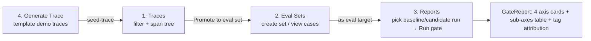

# Phase 11 technical design · Streamlit Ops UI

## In one sentence

The standalone package `src/evalgate/ui/` is a Streamlit multi-page app that **only calls the existing `/v1/*` REST API over HTTP, never the database directly**, so ops can run the full loop in a browser: inspect traces → promote cases into an eval set → run evals → read the 4-axis + tag attribution + sub-axes report.

## Architecture: the UI is "just another API consumer"

The UI process is **fully decoupled** from the existing FastAPI service—it is a peer of the CLI and CI, another client. All data goes through the same REST API.


Why HTTP-only, no direct DB:

1. **Single source of truth**: the same API serves CLI, CI, and UI, so behavior is consistent—the UI cannot show something the gate did not compute.
2. **Avoid asyncio friction**: Streamlit's execution model (rerun the page script from the top on every interaction) is hostile to long-held SQLAlchemy async sessions; HTTP + a sync `httpx.Client` is the least painful.
3. **Reproducibility**: any UI action can be replayed with `curl` / `httpx` against the same request for debugging.

All URL / parameter logic lives in the thin wrapper `evalgate.ui.api_client.EvalGateClient` (sync `httpx.Client`). Page files only call `client.xxx()` methods and do not assemble URLs. Non-2xx responses raise `EvalGateAPIError` (status + parsed body); pages render with `st.error()`.

## Core interactions of the four pages



- **Traces** — top filter bar (`limit` / `service` / `since`) → trace table → click a row for detail → right-hand span tree (indent + JSON expander) → `Promote to eval set` dropdown calls `add_case_from_trace`.
- **Eval Sets** — `Create new set` form; dropdown selects a set → cases table (id / task_type / tags / source_trace_id).
- **Reports** — pick eval_set → load runs (newest first) → two dropdowns for `baseline_run` / `candidate_run` → `Run gate`: load both record sets → `POST /v1/evals/run` → take `GateReport`, render 4 axis metric rows (quality / cost / latency_p95 / safety, passed green/red), expand sub-axes tables under each axis (RAGAS / agent items under quality; 4 PII / jailbreak rates under safety), a tag attribution table sorted by worst delta, and `report.summary` at the top.
- **Generate Trace** — sidebar template (`rag` / `agent` / `safety` / `plain`) → form fields → `POST /v1/dev/seed-trace` to mint a demo trace in the browser, keeping the "UI only talks `/v1/*` HTTP" boundary.

## Technical choices

### UI framework: Streamlit, not React/Next.js (ADR-006)

- **Context**: this is an ops-facing data display tool; the project's strategic weight is backend / eval algorithms.
- **Choice**: Streamlit in a single container, no frontend/backend split.
- **Gain**: dashboards are 5–10× faster to write than React; the audience (ML engineers / DevOps) needs to see the data clearly; time saved on frontend goes to evaluators and deploy.
- **Cost**: highly custom interaction (complex drag-and-drop) is out of reach, which this scenario does not need; Streamlit session state is a bit unintuitive. If SaaS / multi-tenant shows up later, switch to Next.js—the data layer is already REST, so the frontend is swappable.

### Reports baseline / candidate: UI composes freely; the server does not designate a baseline

The UI offers two run dropdowns, loads both record sets, then `POST /v1/evals/run` for the report. **Benefit**: no server-side implicit "who is baseline" convention; combinations are free. GateReport JSON is reused as-is; no new schema.

### Minimal REST increments, not a DB backdoor for the UI

eval_runs had no list/detail REST, so three read-only endpoints were added ([`api/routers/evals.py`](../src/evalgate/api/routers/evals.py)):

```text
GET /v1/runs?eval_set_id=&limit=   # list runs (newest first)
GET /v1/runs/{run_id}              # single run meta
GET /v1/runs/{run_id}/records      # per-case EvalRecord shape
```

The service layer reuses `judge.persistence` helpers `list_runs` / `list_records`, mapping `EvalResultRow` to the existing `EvalRecord` (`axis_breakdown` passed through)—instead of a UI-only direct-DB path, keeping the "UI always goes through the API" boundary clean.

### No auth / no live refresh

v1 is a local ops tool, bound to `127.0.0.1`, with no auth / RBAC (add a reverse proxy if remote access is needed later); no SSE / live refresh—manual `Refresh` plus `cache_data(ttl=)`. These are intentional: satisfy ops self-use first, leave complexity for when it is actually needed.

### Test strategy: mock HTTP, do not start the Streamlit runtime

UI unit tests intercept outbound HTTP with `httpx.MockTransport`, checking `EvalGateClient` request paths / params / pydantic parsing / error codes. Pure helpers (percentages, latency units, axis colors, attribution sort) are tested separately. **Do not start the Streamlit runtime**—it has no reliable headless render assertions; integration tests would not pay for themselves.

## Key code

```text
src/evalgate/ui/
├── api_client.py           # EvalGateClient (httpx.Client) + EvalGateAPIError
├── format.py               # pure helpers: humanize_latency / axis_status / sort_attribution
├── layout.py               # shared layout components
├── Home.py                 # landing (page links + API health badge)
└── pages/
    ├── 1_Traces.py
    ├── 2_Eval_Sets.py
    ├── 3_Reports.py
    └── 4_Generate_Trace.py
```

`Generate Trace` server companions: pure-function trace builder `src/evalgate/dev/trace_seeder.py` (`TraceSpec` / `SpanSpec` models + `build_otlp_envelope` for OTLP-JSON, zero IO, zero Streamlit dependency) + dev-only router `src/evalgate/api/routers/dev.py` (`POST /v1/dev/seed-trace`, feeding existing `parse_otlp_json` + `persist_spans`). The server does not call an LLM; `prompt` / `mock_response` are written only as span attributes so the demo stays offline and idempotent.

## How to start

```bash
make db-up && make api-up   # start DB + FastAPI first
make ui                     # streamlit run src/evalgate/ui/Home.py --server.address 127.0.0.1
```

Dependencies: `streamlit>=1.36` added to main deps in `pyproject.toml`; `httpx` moved from dev to main.
