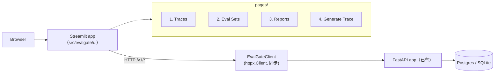
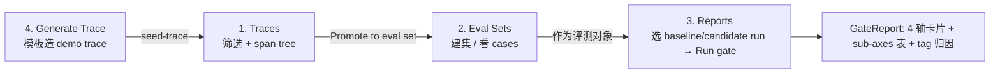

# Phase 11 技术方案 · Streamlit Ops UI

## 一句话

独立包 `src/evalgate/ui/` 是一个 Streamlit 多 page app，**只通过 HTTP 调现有 `/v1/*` REST API，绝不直连数据库**，让运维在浏览器走完"看 trace → 选 case promote 进 eval set → 跑评测 → 看 4 轴 + tag 归因 + sub-axes（子指标/子轴）报告"的全流程。

## 架构：UI 是"又一个 API 消费方"

UI 进程与已有 FastAPI 服务**完全解耦**——它是和 CLI、CI 平级的另一个客户端，所有数据都经同一份 REST API 取得。



为什么坚持 HTTP-only、不直连 DB：

1. **单一真理源**：同一份 API 给 CLI、CI、UI 用，行为一致，不会出现"UI 看到的和 gate 算的不一样"。
2. **避开 asyncio 摩擦**：Streamlit 的执行模型（每次交互从头重跑 page 脚本）对长持 SQLAlchemy async session 很不友好；HTTP + 同步 `httpx.Client` 最省心。
3. **可复现**：任何 UI 行为都能用 `curl` / `httpx` 直接重放同一个请求来调试。

所有 URL / 参数逻辑收敛在 thin wrapper `evalgate.ui.api_client.EvalGateClient`（基于**同步** `httpx.Client`），page 文件只调 `client.xxx()` 方法，不散装 URL；非 2xx 统一抛 `EvalGateAPIError`（带 status + 解析后的 body），page 用 `st.error()` 渲染。

## 四个 page 的核心交互



- **Traces** — 顶部筛选条（`limit` / `service` / `since`）→ trace 表 → 点行进 detail → 右栏 span tree（缩进 + JSON expander）→ `Promote to eval set` 下拉调 `add_case_from_trace`。
- **Eval Sets** — `Create new set` 表单；下拉选 set → cases 表（id / task_type / tags / source_trace_id）。
- **Reports** — 选 eval_set → 拉 runs（最新在前）→ 双下拉选 `baseline_run` / `candidate_run` → `Run gate`：拉两组 records → `POST /v1/evals/run` → 拿 `GateReport`，渲染 4 轴 metric 行（quality / cost / latency_p95 / safety，passed 绿/红）、每轴下挂 sub-axes 展开表（quality 下挂 RAGAS / agent 子项；safety 下挂 4 项 PII / jailbreak 比率）、按 worst delta 排序的 tag 归因表，顶部直接展示 `report.summary`。
- **Generate Trace** — sidebar 选模板（`rag` / `agent` / `safety` / `plain`）→ 表单填字段 → `POST /v1/dev/seed-trace` 在浏览器里直接造 demo trace，守住"UI 只过 `/v1/*` HTTP"的边界。

## 技术选型与抉择

### UI 框架：Streamlit 而非 React/Next.js（ADR-006）

- **背景**：这是运维向数据展示工具，项目战略重心在 backend / eval 算法。
- **选择**：Streamlit 单容器，前后端不分离。
- **收益**：写 dashboard 比 React 快 5–10 倍；目标用户（ML 工程师 / DevOps）只要看清数据；省下的前端时间投到 evaluator 与部署。
- **代价**：做不了高度自定义交互（复杂拖拽），但本场景用不上；Streamlit session state 模型略反直觉。后期若有 SaaS / 多租户需求再切 Next.js——因为数据层已是 REST，前端是可换件。

### Reports 的 baseline / candidate：UI 自由组合，不在 server 端钦定基线

UI 提供两个 run 下拉，拉两组 records 后 `POST /v1/evals/run` 得报告。**好处**是不在服务端硬编码"谁是基线"这种隐含约定，组合自由；GateReport JSON 直接复用，不重建 schema。

### 新增最小 REST 增量，而非给 UI 开 DB 后门

eval_runs 原本没有 list/detail REST，于是新增三个只读端点（[`api/routers/evals.py`](../src/evalgate/api/routers/evals.py)）：

```text
GET /v1/runs?eval_set_id=&limit=   # list runs（最新在前）
GET /v1/runs/{run_id}              # 单个 run meta
GET /v1/runs/{run_id}/records      # per-case EvalRecord 形状
```

service 层复用 `judge.persistence` 的 `list_runs` / `list_records` helper，把 `EvalResultRow` 映射成已有的 `EvalRecord`（`axis_breakdown` 直接透传）——而不是为 UI 单开一条直连 DB 的路径，保持"UI 永远走 API"的边界纯净。

### 不做认证 / 实时刷新

v1 是本机运维工具，绑 `127.0.0.1`，不做 auth / RBAC（后续要远程再上反向代理）；不做 SSE / 实时刷新，用手动 `Refresh` 按钮 + `cache_data(ttl=)`。这些都是"先满足 ops 自用、把复杂度留给真有需求时"的有意取舍。

### 测试策略：mock HTTP，不启 Streamlit runtime

UI 单测用 `httpx.MockTransport` 拦截外部 HTTP，验证 `EvalGateClient` 的请求路径 / 参数 / pydantic 解析 / 错误码，纯函数 helpers（百分比、latency 单位、axis 颜色、attribution 排序）单独测。**不启动 Streamlit runtime**——它没有可靠的 headless 渲染断言，集成测试回报不成比例。

## 关键代码

```text
src/evalgate/ui/
├── api_client.py           # EvalGateClient (httpx.Client) + EvalGateAPIError
├── format.py               # 纯 helpers: humanize_latency / axis_status / sort_attribution
├── layout.py               # 共享布局组件
├── Home.py                 # landing（页面链接 + API health badge）
└── pages/
    ├── 1_Traces.py
    ├── 2_Eval_Sets.py
    ├── 3_Reports.py
    └── 4_Generate_Trace.py
```

`Generate Trace` 配套服务端：纯函数 trace 构造器 `src/evalgate/dev/trace_seeder.py`（`TraceSpec` / `SpanSpec` 模型 + `build_otlp_envelope` 构造 OTLP-JSON，零 IO、零 Streamlit 依赖）+ dev-only 路由 `src/evalgate/api/routers/dev.py`（`POST /v1/dev/seed-trace`，喂给已有的 `parse_otlp_json` + `persist_spans`）。服务端不真调 LLM，`prompt` / `mock_response` 只作为 span attribute 写入，保持 demo 离线幂等。

## 启动方式

```bash
make db-up && make api-up   # 先起 DB + FastAPI
make ui                     # streamlit run src/evalgate/ui/Home.py --server.address 127.0.0.1
```

依赖：`pyproject.toml` 主依赖加 `streamlit>=1.36`，`httpx` 由 dev 挪到主依赖。
