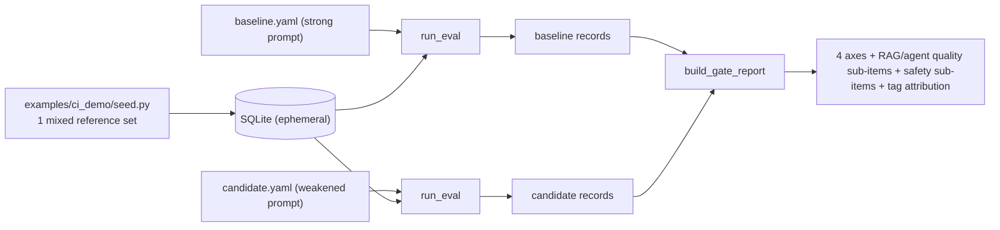
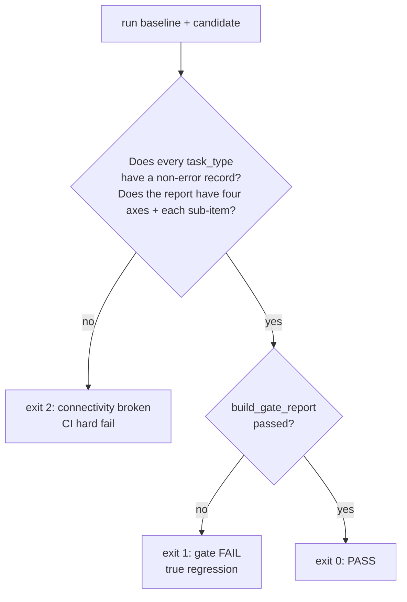

# Phase 12 technical design · Real CI gate end-to-end (replace fixtures)

## In one sentence

Replace the `eval-gate` CI workflow from "seed fake fixtures → `evalgate gate`" with a **real judge pipeline**: seed a mixed reference eval set → run once with the baseline prompt → run once with the candidate prompt → feed both record sets through `build_gate_report` for a four-axis report. CI runs a mock judge (offline, deterministic fake judge, constant scores); true signal is left to local `make ci-gate-real`.

## Core idea: wire it up, do not write new algorithms

All CLI primitives landed in Phases 2–10—the `{"records":[...]}` that `evalgate run` emits is exactly the input to `build_gate_report`. Phase 12 = **wiring + one consumer-app sample + one orchestrator**, zero new algorithms, zero new dependencies.

Key insight: **one prompt YAML covers every task equivalence class**. `build_router` ([router.py](../src/evalgate/evaluator/router.py)) auto-registers `generic` / `rag` / `agent` evaluators based on whether the YAML has `retriever` / `rag_evaluator` / `agent_runtime` blocks; the `safety` block appends safety sub-axes for every case. Unify every case input on the `question` key and a shared `user_template` (`Context: {contexts}` + `Question: {question}`; non-RAG cases render `{contexts}` as empty), and a single `run` exercises every evaluator branch plus the safety pipeline.

## Orchestrator data flow

The orchestrator lives in [`scripts/phase12_ci_gate.py`](../scripts/phase12_ci_gate.py), structured like the other phase smoke scripts:



The mixed set `ci-demo-ref` ([examples/ci_demo/seed.py](../examples/ci_demo/seed.py)) covers four equivalence classes at once, sized to finish within 5 minutes:

- **generic** ×2: 1 ordinary billing question + 1 input that carries both PII (Personally Identifiable Information) and a jailbreak instruction (the same case lights up `pii_input_rate` and `jailbreak_attempt_rate`).
- **rag** ×1: billing question + gold reference context.
- **agent** ×1: builtin tools + gold `expected_trajectory`.
- **safety**: appended automatically on every case (PII via offline Presidio; jailbreak `classifier_model: null` → refusal heuristic, 0 extra LLM calls).

## Exit code is the gate verdict

The orchestrator's exit codes separate "the pipeline is broken" from "the prompt regressed"—that split is the design core:



Connectivity assertions: every task_type (generic / rag / agent) has a non-error record in both rounds; the report contains the four axes `quality` / `cost` / `latency_p95` / `safety`; `quality.sub_metrics` ⊇ RAG (faithfulness / context_precision / answer_relevance) + agent (tool_call_accuracy / step_wise_success); `safety.sub_metrics` == the four rates.

## Technical choices

### CI runs a mock judge; real models go through an explicit manual entry (ADR-009)

- **Context**: running a real LLM on GitHub Actions has three pitfalls—token spend / putting API keys in CI secrets; the judge is stochastic so PR-to-PR conclusions jitter and are hard to reproduce; and most PRs in this repo are unrelated to prompt quality (docs, ingest), so real evals of them are both expensive and produce meaningless "regression" noise.
- **Choice**: CI runs `EVALGATE_MOCK_LLM=1`; judge / candidate / ragas all go through the LiteLLM mock. Under mock, the pointwise judge always returns 0.5, so baseline / candidate match on every axis of the same set → the gate always passes.
- **Semantics**: this step is an **end-to-end connectivity smoke** (assert every task_type is non-error, report has four axes + each sub-item), not regression hunting.
- **Why**: CI should test "the pipeline is not broken," not "is this PR's prompt good"—the latter only matters after a consumer repo is wired, on *their* prompt PRs. A deterministic mock keeps the gate from randomly red/green due to judge jitter, so the team will not turn the gate off after a "false block" (exactly the failure mode ADR-004 exists to avoid).
- **True signal**: the weakened candidate (`candidate.system` cut to "answer in one sentence," dropping grounding / safety discipline) only exposes quality / safety regressions under a real model, so the "worse prompt → fail + attribution" demo lives in `make ci-gate-real` (local Ollama) or `workflow_dispatch` to drop the mock path.

### DB: ephemeral SQLite (throwaway temp SQLite)

- **Context**: `evalgate run` writes to a DB, but CI originally had none.
- **Choice**: with no `DATABASE_URL`, create a temp `.db` + `Base.metadata.create_all` (no alembic), matching the other phase smoke scripts.
- **Why**: no Postgres service; the CI job is stateless with no external deps; same dialect-agnostic repository code path as local (ADR-002).

### Two committed prompts simulate main / PR dual refs (ADR-003)

`baseline.yaml` (simulates main) and `candidate.yaml` (simulates a PR) differ only in `name` + `candidate.system`, both committed in-repo—satisfying "prompts as config files under git." A true `git checkout main -- prompt.yaml` dual-ref fetch is left for later; two YAMLs are behavior-equivalent and easier to reproduce.

### Agent `max_steps=3` rather than 2

The mock action loop is step0=tool[0] / step1=tool[1] / step2=final_answer; a 2-step expected trajectory still needs the 3rd step to emit `final_answer`. `max_steps=2` ends in `max_steps_exceeded` → error record → connectivity assertion fails. Setting 3 lets the mock produce a clean non-error agent record, and the real-mode call budget stays low. This is a small but critical trade-off: "leave one extra step for the deterministic mock path."

## Key code

```text
examples/ci_demo/
├── seed.py                  # mixed reference set: 2 generic + 1 rag + 1 agent
└── prompts/
    ├── baseline.yaml        # strong prompt (simulates main)
    └── candidate.yaml       # weakened prompt (simulates PR), only name + candidate.system differ

scripts/phase12_ci_gate.py   # orchestrator: seed -> run(base) -> run(cand) -> gate
```

CI workflow ([.github/workflows/eval-gate.yml](../.github/workflows/eval-gate.yml)): drop the old `seed_demo.py` + static fixtures steps; run the orchestrator under `EVALGATE_MOCK_LLM=1` to produce `gate-report.json`; keep upload-artifact + PR comment (render four axes + attribution table) + enforce; leave `workflow_dispatch` as the entry that can switch to a real model.

## How to start

```bash
make ci-gate        # mock, equivalent to CI (offline, deterministic, zero tokens)
make ci-gate-real   # real model; local Ollama with qwen3.5:9b + qwen3-embedding:8b
```
