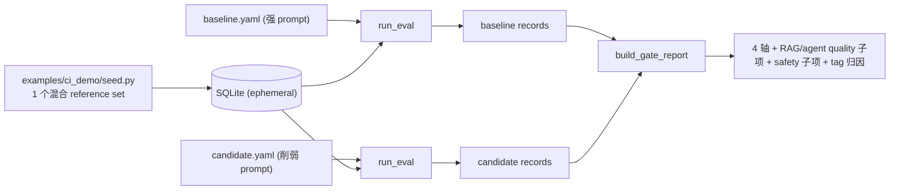
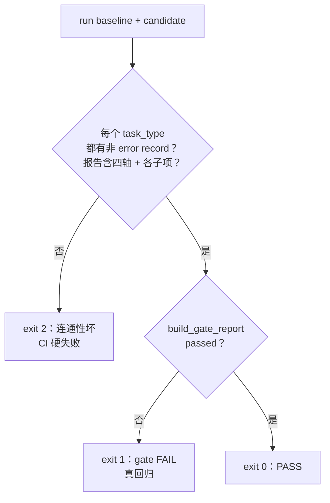

# Phase 12 技术方案 · 真实 CI Gate 端到端（替换 fixtures）

## 一句话

把 `eval-gate` CI workflow 从「seed 假 fixtures → `evalgate gate`」换成一条**真 judge 流水线**：seed 一个混合 reference eval set → 用 baseline prompt 跑一遍 → 用 candidate prompt 跑一遍 → 两组 records 过 `build_gate_report` 得四轴报告。CI 跑 mock judge（离线确定性的假裁判，恒定打分），真信号留给本机 `make ci-gate-real`。

## 核心思路：接线，不写新算法

所有 CLI 原语在 Phase 2–10 已就位——`evalgate run` 产出的 `{"records":[...]}` 正好是 `build_gate_report` 的入参。Phase 12 = **接线 + 一份 consumer-app 样例 + 一个 orchestrator**，零新算法、零新依赖。

关键洞察：**一份 prompt YAML 即可覆盖全部任务等价类**。`build_router`（[router.py](../src/evalgate/evaluator/router.py)）按 YAML 里有没有 `retriever` / `rag_evaluator` / `agent_runtime` 块自动注册 `generic` / `rag` / `agent` evaluator，`safety` 块对所有 case 追加安全子轴。只要把所有 case 的 input 统一成 `question` 键、用统一 `user_template`（`Context: {contexts}` + `Question: {question}`，非 RAG case 的 `{contexts}` 自然渲染成空），单次 `run` 就跑遍所有 evaluator 分支 + safety pipeline。

## 编排器数据流

orchestrator 在 [`scripts/phase12_ci_gate.py`](../scripts/phase12_ci_gate.py)，结构对齐各 phase 的 smoke 脚本：



混合集 `ci-demo-ref`（[examples/ci_demo/seed.py](../examples/ci_demo/seed.py)）一次覆盖四个等价类，规模控制在 5 分钟内：

- **generic** ×2：1 条普通 billing 问题 + 1 条同时夹带 PII（Personally Identifiable Information，个人身份信息）和 jailbreak（越狱，诱导模型违反安全策略）指令的输入（同一 case 点亮 `pii_input_rate` 与 `jailbreak_attempt_rate`）。
- **rag** ×1：billing 问题 + 金标 reference context。
- **agent** ×1：复用 builtin 工具 + 金标 `expected_trajectory`。
- **safety**：对所有 case 自动追加（PII 走 Presidio 离线；jailbreak `classifier_model: null` → refusal 启发式，0 次额外 LLM 调用）。

## 退出码即 gate 裁决

orchestrator 的退出码把"流水线坏了"和"prompt 回归了"两件事分开，这是设计的核心：



连通性断言：每个 task_type（generic / rag / agent）两轮里都有非 error record；报告含 `quality` / `cost` / `latency_p95` / `safety` 四轴，`quality.sub_metrics` ⊇ RAG（faithfulness / context_precision / answer_relevance）+ agent（tool_call_accuracy / step_wise_success），`safety.sub_metrics` == 4 项速率。

## 技术选型与抉择

### CI 跑 mock judge，真模型走显式手动入口（ADR-009）

- **背景**：GitHub Actions 上跑真 LLM 有三个坑——烧 token / 需把 API key 放进 CI secret；judge 是随机性的，PR 间结论会抖、难复现；而本仓库自身的 PR 多与 prompt 质量无关（改文档、改 ingest），真评测它们既贵又会产生无意义的"回归"噪声。
- **选择**：CI 跑 `EVALGATE_MOCK_LLM=1`，judge / candidate / ragas 全走 LiteLLM mock。mock 下 pointwise judge 恒返 0.5，baseline / candidate 在同集上各轴完全一致 → gate 必过。
- **语义**：这步是**端到端连通性 smoke**（断言每个 task_type 非 error、报告含四轴 + 各子项），不是抓回归。
- **理由**：CI 应测"流水线没断"，不是"这个 PR 的 prompt 好不好"——后者只在 consumer 仓库接入后、在它们自己的 prompt PR 上才有意义。确定性 mock 让卡口不会因 judge 抖动随机红/绿，团队就不会因"误 block"去关掉卡口（正是 ADR-004 要避免的失败模式）。
- **真信号**：削弱版 candidate（`candidate.system` 砍成"一句话答"、丢掉接地 / 安全纪律）只有在真模型下才暴露 quality / safety 回归，所以"改差 prompt → fail + 归因"的演示放在 `make ci-gate-real`（本机 Ollama）或 `workflow_dispatch` 去 mock 这一路。

### DB 用 ephemeral SQLite（用完即弃的临时 SQLite）

- **背景**：`evalgate run` 要写库，但 CI 原本没有 DB。
- **选择**：无 `DATABASE_URL` 时建临时 `.db` + `Base.metadata.create_all`（不跑 alembic），沿用各 phase smoke 脚本的做法。
- **理由**：免去起 Postgres service，CI job 无状态、无外部依赖；与本机同构，跑的是同一套 dialect-agnostic（方言无关）repository 代码路径（ADR-002）。

### 两份 committed prompt 模拟 main / PR 双 ref（ADR-003）

`baseline.yaml`（模拟 main 分支）与 `candidate.yaml`（模拟 PR 分支）只差 `name` + `candidate.system`，都 commit 在仓库里——满足"prompt 当配置文件交给 git 管"。真正的 `git checkout main -- prompt.yaml` 双 ref 取法留作后续；当前用两份 YAML 模拟，行为等价且更易复现。

### agent `max_steps=3` 而非 2

mock 的动作循环是 step0=tool[0] / step1=tool[1] / step2=final_answer；2 步的 expected trajectory 需要第 3 步才能发出 `final_answer`，`max_steps=2` 会以 `max_steps_exceeded` 收尾 → error record → 连通性断言失败。设 3 让 mock 产出干净的非 error agent record，真模式调用预算也仍低。这是"为确定性 mock 路径预留一步"的小而关键的取舍。

## 关键代码

```text
examples/ci_demo/
├── seed.py                  # 混合 reference set: 2 generic + 1 rag + 1 agent
└── prompts/
    ├── baseline.yaml        # 强 prompt（模拟 main）
    └── candidate.yaml       # 削弱 prompt（模拟 PR），只差 name + candidate.system

scripts/phase12_ci_gate.py   # orchestrator: seed -> run(base) -> run(cand) -> gate
```

CI workflow（[.github/workflows/eval-gate.yml](../.github/workflows/eval-gate.yml)）：删掉旧的 `seed_demo.py` + 静态 fixtures 两步，改为 `EVALGATE_MOCK_LLM=1` 跑 orchestrator 生成 `gate-report.json`；保留 upload-artifact + PR 评论（渲染四轴 + 归因表）+ enforce；`workflow_dispatch` 留作可切真模型的入口。

## 启动方式

```bash
make ci-gate        # mock，等价于 CI 跑的（离线、确定性、零 token）
make ci-gate-real   # 真模型，需本机 Ollama 装好 qwen3.5:9b + qwen3-embedding:8b
```
