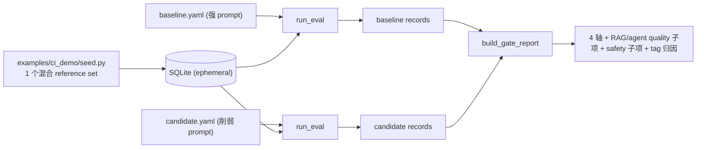

# Phase 12 技术方案 · 真实 CI Gate 端到端（替换 fixtures）

> 对应 [ROADMAP.md](./ROADMAP.md) Phase 12。预估 1 人天 vibe coding。

**状态**：DONE（新增 `examples/ci_demo/` consumer-app 样例 + `scripts/phase12_ci_gate.py` orchestrator；重写 `eval-gate.yml`；`make ci-gate` / `ci-gate-real`；全测试 / lint / format 通过；mock ~6s 绿，真模型 ~140s 触发 gate fail）

---

## 一句话

把 `eval-gate` workflow 从「seed 假 fixtures → `evalgate gate`」换成一条**真 judge 流水线**：seed 一个混合 reference eval set → 用 baseline prompt 跑一遍 judge → 用 candidate prompt 跑一遍 → 两组 records 过 `build_gate_report` 得四维报告。CI 跑 mock（离线、确定性、零成本，作连通性 smoke），真信号留给本机 `make ci-gate-real`。

## 数据流



## 核心思路

所有 CLI 原语 Phase 2–10 已就位（`evalgate run` 产出的 `{"records":[...]}` 正好是 `build_gate_report` 的入参）。Phase 12 = **接线 + 一份 consumer-app 样例 + 一个 orchestrator**，不写新算法、不加新依赖。

关键洞察：**一份 prompt YAML 即可覆盖全部任务等价类**。`build_router`（[router.py](../src/evalgate/evaluator/router.py)）按 YAML 里有没有 `retriever`/`rag_evaluator`/`agent_runtime` 块自动注册 `generic`/`rag`/`agent` evaluator，`safety` 块对所有 case 追加安全子轴。只要把所有 case 的 input 统一成 `question` 键、用一个统一 `user_template`（`Context: {contexts}` + `Question: {question}`，非 RAG case 的 `{contexts}` 自然渲染成空），单次 `run` 就能跑遍所有 evaluator 分支 + safety pipeline。

## 等价类与每类条数（控 5 分钟）

一个混合集 `ci-demo-ref`（[examples/ci_demo/seed.py](../examples/ci_demo/seed.py)）：

- **generic** ×2：1 条普通 billing 问题 + 1 条同时夹带 PII（email + 信用卡）和 jailbreak 指令的输入（一条 case 同时点亮 `pii_input_rate` 与 `jailbreak_attempt_rate`）。
- **rag** ×1：复用 [examples/rag_demo/corpus.json](../examples/rag_demo/corpus.json) 的 billing 问题 + 金标 reference context。
- **agent** ×1：复用 Phase 9 builtin 工具（`lookup_invoice` / `fetch_policy` / ...）+ 金标 `expected_trajectory`。
- **safety**：对上面所有 case 自动追加（PII = Presidio 离线；jailbreak `classifier_model: null` → refusal 启发式，0 次额外 LLM 调用）。

## 关键设计决策

- **DB 用 SQLite ephemeral**：CI workflow 原本没有 DB，而 `evalgate run` 要写库。沿用各 phase smoke 脚本的做法（`Base.metadata.create_all`，不跑 alembic），免去 Postgres service，CI / 本机一致，dialect-agnostic repository 同一份代码路径（ADR-002）。
- **CI 走 mock，确定性 pass**（见 [DECISIONS.md ADR-009](../DECISIONS.md)）：mock 下 pointwise judge 恒返 0.5，baseline / candidate 在同一个集上各轴完全一致 → gate 必过。所以 CI 这步语义是**端到端连通性 smoke**（断言每个 task_type 非 error、报告含四轴 + RAG/agent quality 子项 + safety 子项），不是抓回归——避免烧 token、避免拿本仓库无关 PR 当「回归」误 block。
- **「改差 prompt → fail + 归因」的演示放在真模型这一路**：mock 的 0.5 平分看不出 prompt 质量回归；真模型下削弱版 candidate（`candidate.system` 砍成「一句话答」、丢掉接地 / 安全纪律）才会暴露 quality / safety 退步。这正是 Phase 17 录屏素材。
- **agent `max_steps=3` 而非 2**：mock 的动作循环 step0=tool[0] / step1=tool[1] / step2=final_answer，2 步 expected trajectory 需要第 3 步才能发出 `final_answer`；`max_steps=2` 会以 `max_steps_exceeded` 收尾 → error record → 连通性断言失败。设 3 让 mock 产出干净的非 error agent record，真模式调用预算也仍低。
- **两份 committed prompt 模拟 main / PR 双 ref**：`baseline.yaml`（main 分支）与 `candidate.yaml`（PR 分支）只差 `name` + `candidate.system`，commit 在仓库里 → 满足「git-native prompt 管理」（ADR-003）。真正的 `git checkout main -- prompt.yaml` 双 ref 取法留作后续。

## 关键代码

```
examples/ci_demo/
├── __init__.py
├── seed.py                  # 混合 reference set: 2 generic + 1 rag + 1 agent
└── prompts/
    ├── baseline.yaml        # 强 prompt（main 分支）
    └── candidate.yaml       # 削弱 prompt（PR 分支），只差 name + candidate.system

scripts/phase12_ci_gate.py   # orchestrator: seed -> run(base) -> run(cand) -> gate
```

orchestrator（[scripts/phase12_ci_gate.py](../scripts/phase12_ci_gate.py)）结构对齐 [scripts/phase10_safety_smoke.py](../scripts/phase10_safety_smoke.py)：

- 默认 SQLite ephemeral（无 `DATABASE_URL` 时建临时 `.db` + `create_all`）；`--mock` / `EVALGATE_MOCK_LLM` 两用。
- `seed` → `run_eval(baseline)` → `run_eval(candidate)`（同一个 set，两个 prompt）→ `build_gate_report`。
- 连通性断言：每个 task_type（generic / rag / agent）在两轮里都有非 error record；gate 报告含 `quality`/`cost`/`latency_p95`/`safety` 四轴，`quality.sub_metrics` ⊇ RAG（faithfulness / context_precision / answer_relevance）+ agent（tool_call_accuracy / step_wise_success），`safety.sub_metrics` == 4 项速率。
- 打印 elapsed + gate pass/fail。退出码：**2 = 连通性坏**（CI 硬失败）/ **1 = gate fail**（真回归）/ **0 = pass**。

CI workflow（[.github/workflows/eval-gate.yml](../.github/workflows/eval-gate.yml)）：删 `seed_demo.py` + `examples/fixtures` 两步，改为 `EVALGATE_MOCK_LLM=1` 跑 orchestrator 生成 `gate-report.json`；保留 upload-artifact + github-script PR 评论（脚本复用原逻辑）+ enforce；`workflow_dispatch` 留作可切真模型入口。

## 启动方式

```bash
make ci-gate        # mock，等价于 CI 跑的（离线、确定性、零 token）
make ci-gate-real   # 真模型，需要本机 Ollama 装好 qwen3.5:9b + qwen3-embedding:8b
```

## 退出标准（与 ROADMAP 对齐）

1. `make ci-gate`（mock）：每个等价类非 error，gate 报告含四轴 + RAG/agent quality 子项 + safety 子项；exit 0。**实测 ~6s 绿。**
2. `make ci-gate-real`（qwen3.5:9b + qwen3-embedding:8b）：连通性断言全过，总耗时 < 5 分钟。**实测 ~140s（两轮 8 次评测）**，削弱版 candidate 触发 `quality` 轴 fail，summary 点名 `answer_relevance` 子项（delta=-0.127）+ 最差 tag `rag`。
3. CI workflow 在 PR 上绿灯（mock 必过），PR 评论渲染四轴 + 归因表。

## 一个 surprise（记一笔）

实现时一度把 example/test 里的 `ollama/qwen3.5:9b` 当成「不存在的占位 tag」想换成 `qwen2.5:7b`，还翻转了 [tests/test_no_legacy_models.py](../tests/test_no_legacy_models.py) 守卫。跑真实验证时 `ollama list` 才发现本机装的恰恰是 `qwen3.5:9b` / `qwen3.6:27b` / `qwen3-embedding:8b`（自定义本地 tag），仓库约定与守卫一直是对的——全部回滚，`ci_demo` 直接用本机已装的 `qwen3.5:9b` + `qwen3-embedding:8b`。教训：改「看起来是死配置」的东西前，先核对运行环境事实。

## 不在 Phase 12 范围

- 真正的 main-branch vs PR-branch `git checkout` 双 ref 取 prompt（用两份 committed YAML 模拟）。
- CI 里跑真实模型（保留 `workflow_dispatch` + 去 mock 的开关，但默认 mock）。
- 统计严谨度调参 / 复现实验（Phase 17）。
- consumer 仓库侧的接入脚手架（本 phase 只给 `examples/ci_demo/` 作参考形态）。
