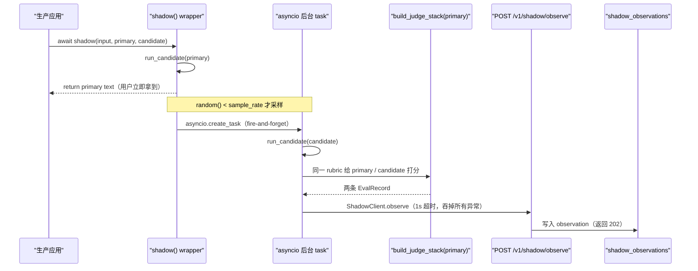
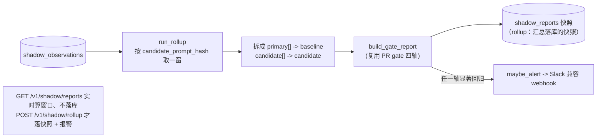

# Phase 13 · Shadow Mode（影子模式：生产流量上并发跑候选但不返回给用户）

## 核心思路

生产应用想验证一份新 prompt/模型（candidate），又不敢直接让它面对真实用户。Shadow Mode（影子模式，在真实生产流量上**并发**跑候选，结果只用于评测、不返回给用户）解决这个问题：

```python
from evalgate.shadow import shadow
answer = await shadow(case_input, primary=primary_spec, candidate=candidate_spec)
```

`shadow(...)` 包住主调用：primary 正常返回给用户；按 `sample_rate` 命中采样时，**后台并发**跑 candidate，用同一套 judge 给两边打 reference-free（无参考答案的评分）分数，打包成两条 `EvalRecord`，再 fire-and-forget（发后不管的异步调用，1s 超时即丢）推到后端。后端按 candidate 的 prompt hash 聚合，滚动窗口直接复用 PR gate 的四轴判定；任一轴显著变差就发 webhook 报警。

> 用户接入只要上面这 3 行，完整使用文档见 [SHADOW.md](./SHADOW.md)。

## 端到端时序

shadow 调用对生产主路径**零阻塞**：primary 一返回，调用方就拿到结果，candidate 的跑分/上报全在后台 task 里，慢或挂都不影响用户。



按需触发的汇总与报警是另一条独立链路（on-demand，不依赖任何常驻定时器）：



`cost` 轴是 lower-is-better，candidate 贵 20% → 显著 → fail，这是 demo 故意制造的回归信号。

## 技术选型与抉择

> 取舍来源：ADR-010（SDK 侧打分 + on-demand rollup，不引入 scheduler）。

### 谁来打分：SDK 客户端侧 vs 后端 worker

shadow 没有人工 ground truth，primary / candidate 都得先有一个 reference-free judge 分才能变成 `EvalRecord`。

- **选定：SDK 客户端侧打分。** 复用 `build_judge_stack(primary)` 给两边用**同一 rubric**打分（同一把尺子才公平）。SDK 已为跑 candidate 持有 `PromptSpec` 和 LiteLLM 通道，就地打分省掉"把两段输出回传后端、后端再起 judge worker"的往返。
- **代价：** judge 的 token 成本/延迟落在调用方进程——但都在后台 task 里，不阻塞主路径。candidate 若想用更严的 rubric，需要显式扩展。
- **收益：** 后端退化成**纯写 + 聚合**的薄层。observe 的 payload 正好是早已固化的 `EvalRecord` 契约，后端无需理解 prompt 配置。

### 滚动报告：内置 scheduler vs on-demand rollup

"每小时滚动算一次四轴 + 报警"这种周期任务，要不要在服务里塞定时器/常驻 worker？

- **选定：on-demand + 显式 rollup。** `GET /v1/shadow/reports` 实时算窗口内四轴（不落库）；`POST /v1/shadow/rollup`（及 `evalgate shadow rollup` CLI）才落一份 `shadow_reports` 快照并触发报警。生产用 cron 调这个幂等 CLI。
- **为什么不引 APScheduler / 常驻 task：** 对 1 人天的 phase 是过度工程；cron 调幂等 CLI 更贴合"git-native / 配置外置"的项目调性，且 `compute_shadow_report` 是纯函数、易测。
- **代价：** "多久滚一次"成了部署方的运维选择，报警延迟 = rollup 周期，服务不保证实时。

### 聚合：复用 PR gate vs 另写一套统计

- **选定：复用 `gate.decision.build_gate_report`。** `compute_shadow_report` 把一窗 observation 拆成 `primary_record[]`→baseline、`candidate_record[]`→candidate，原样喂 gate。于是 shadow 与 PR CI **共用一套**四轴 + bootstrap CI（自助法置信区间）+ tag 归因 + `axis_breakdown` 子轴定义，零新统计代码。

### 主路径保护：fire-and-forget 的工程细节

- 采样命中时 `asyncio.create_task` 起后台任务，调用方**永不 await**；HTTP 推送 1s 硬超时且**吞掉所有异常**（`ShadowClient.observe` / `_shadow_eval_and_push` 双层 try）。EvalGate 慢或挂都不能拖慢/打断生产请求——这是 shadow 敢上生产的前提。
- 后台 task 强引用存进模块级 `_BACKGROUND_TASKS`（asyncio 只持弱引用，否则可能被 GC），`drain_background_tasks()` 供测试/优雅关停排空。这是 fire-and-forget 的已知坑，已封装。

### 其余约定

- **分组键 `candidate_prompt_hash`：** `spec_hash(spec)` = PromptSpec canonical JSON 的 sha256，字节相同的配置塌缩成同一条 shadow 流（内容寻址）。
- **报警可降级：** POST 一个 `{"text": …}`（Slack incoming-webhook 形状，多数通用 receiver 也吃），不引入 Slack SDK；无 `EVALGATE_SHADOW_WEBHOOK_URL` 时降级为 structlog warning，本地/CI 无需外部端点。
- **时间窗口跨方言鲁棒：** SQLite 存 naive、PG 存 aware；rollup 在 Python 里 `_as_aware` 归一后再按窗口过滤，不依赖 DB 端 datetime 比较语义。

## 关键代码

- [src/evalgate/shadow/](../src/evalgate/shadow/)
  - [`sdk.py`](../src/evalgate/shadow/sdk.py) — `shadow(...)` 包装 + `ShadowClient`（fire-and-forget / 1s 超时）+ `spec_hash` + `_BACKGROUND_TASKS` / `drain_background_tasks`
  - [`persistence.py`](../src/evalgate/shadow/persistence.py) — observation / report 的增查（dialect-agnostic）
  - [`rollup.py`](../src/evalgate/shadow/rollup.py) — `compute_shadow_report`（纯函数）/ `compute_live_report`（加窗口）/ `run_rollup`（落快照 + 报警，可注入 `alerter`）
  - [`alert.py`](../src/evalgate/shadow/alert.py) — `format_alert` / `send_alert` / `maybe_alert`（Slack 兼容 + 无 webhook 降级）
- [src/evalgate/api/routers/shadow.py](../src/evalgate/api/routers/shadow.py) — `POST /v1/shadow/observe`（202）/ `GET /v1/shadow/reports` / `POST /v1/shadow/rollup`
- [src/evalgate/db/models.py](../src/evalgate/db/models.py) — `ShadowObservationRow` / `ShadowReportRow`
- [src/evalgate/core/schemas.py](../src/evalgate/core/schemas.py) — `ShadowObserveRequest` / `ShadowReportOut`（observe 的 `EvalRecord` 契约）

测试策略：以纯函数（`compute_shadow_report`）+ 确定性 RNG 覆盖采样命中/不命中、cost 回归判定、fire-and-forget 吞异常与降级路径，端到端用离线 1k 流量 smoke 串起来。

## 运维与体验

```bash
# 离线端到端：1k 流量 -> 滚动四轴 report -> cost 回归 -> 报警
make shadow-smoke

# 运维侧：对某个 candidate prompt hash 滚动出报告（落快照 + 报警），生产用 cron 调
evalgate shadow rollup --candidate-hash <hash> --window-hours 24
# 只看不落库
evalgate shadow report --candidate-hash <hash>
```
