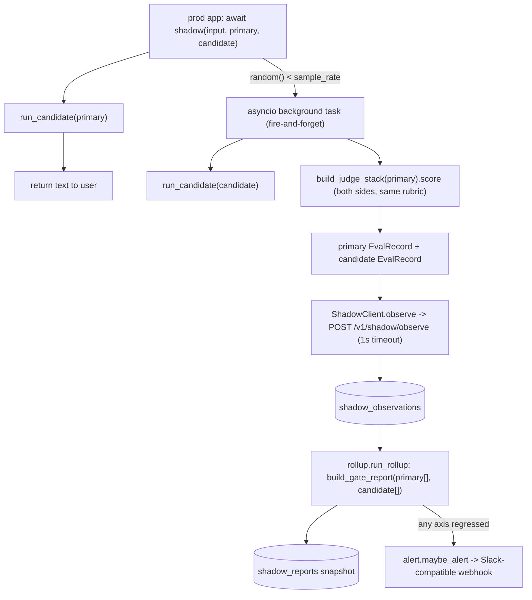

# Phase 13 技术方案 · Shadow Mode（线上流量上做无害评测）

> 对应 [ROADMAP.md](./ROADMAP.md) Phase 13。预估 1 人天 vibe coding。

**状态**：DONE（新增 `evalgate.shadow` SDK + `/v1/shadow/*` 三端点 + `shadow_observations` / `shadow_reports` 两表 + 0012 migration + 滚动 4 轴 report 复用 `build_gate_report` + Slack 兼容报警；phase13 smoke 1k 流量跑通；新增 20 个测试，全量 342/342 + lint/format 通过）

---

## 一句话

生产应用用 `evalgate.shadow(case_input, primary=…, candidate=…, sample_rate=0.1)` 包一层主调用：primary 正常返回给用户，命中采样时**后台并发**跑 candidate、用同一套 judge **SDK 侧打分**，把 `(primary, candidate)` 两条 `EvalRecord` **fire-and-forget**（1s 超时即丢）推到 `POST /v1/shadow/observe`；后端按 `candidate_prompt_hash` 聚合，滚动窗口直接喂回 `build_gate_report`（primary=baseline / candidate=candidate），任一轴显著变差就发 webhook 报警。

## 数据流



## 关键设计决策（已与用户对齐）

- **SDK 侧打分（不是后端打分）**：shadow 没有人工 ground truth，primary / candidate 都需要一个 reference-free judge 分数才能变成 `EvalRecord`。我们在 SDK 里复用 `build_judge_stack(primary)` 给两边打分（同一 rubric 才公平），后端因此保持**纯写 + 聚合**的薄层，且 observe 的 payload 正好是早就为 Phase 13 固化的 `EvalRecord` 契约（见 [core/schemas.py](../src/evalgate/core/schemas.py)）。
- **on-demand report + 显式 rollup（无 scheduler 依赖）**：`GET /v1/shadow/reports` 实时算窗口内 4 轴；`POST /v1/shadow/rollup`（及 `evalgate shadow rollup` CLI）才落一份 `shadow_reports` 快照并触发报警。生产可用 cron 调 rollup，本仓库不引入 in-process 定时器。
- **fire-and-forget，绝不阻塞主路径**：采样命中时 `asyncio.create_task` 起后台任务，调用方永不 await；HTTP 推送 1s 硬超时且**吞掉所有异常**（`ShadowClient.observe` / `_shadow_eval_and_push` 双层 try）。EvalGate 慢或挂都不能拖慢/打断生产请求。后台 task 强引用存进模块级 `_BACKGROUND_TASKS`（asyncio 只持弱引用，否则可能被 GC），`drain_background_tasks()` 供测试/优雅关停排空。
- **聚合复用 PR gate**：滚动 report 不写新的统计代码——`compute_shadow_report` 把一窗 observation 拆成 `primary_record[]` → baseline、`candidate_record[]` → candidate，原样喂 `gate.decision.build_gate_report`，于是 shadow 与 PR CI **共用一套 4 轴 + bootstrap CI + tag 归因 + `axis_breakdown` 子轴**定义。cost 轴 lower-is-better，candidate 贵 20% → 显著 → fail。
- **`candidate_prompt_hash` 作分组键**：`spec_hash(spec)` = PromptSpec canonical JSON 的 sha256，两份字节相同的配置塌缩成同一条 shadow 流。
- **报警 greenfield、Slack 兼容、可降级**：POST 一个 `{"text": …}`（Slack incoming-webhook 形状，多数通用 receiver 也吃），不引入 Slack SDK。无 `EVALGATE_SHADOW_WEBHOOK_URL` 时降级为 structlog warning，本地/CI 不需要外部端点。
- **时间窗口跨方言鲁棒**：SQLite 存 naive、PG 存 aware；rollup 在 Python 里 `_as_aware` 归一后再按窗口过滤，不依赖 DB 端 datetime 比较语义。

## 关键代码

- [src/evalgate/shadow/](../src/evalgate/shadow/)
  - [`sdk.py`](../src/evalgate/shadow/sdk.py) — `shadow(...)` 包装 + `ShadowClient`（fire-and-forget / 1s 超时）+ `spec_hash` + `_BACKGROUND_TASKS` / `drain_background_tasks`
  - [`persistence.py`](../src/evalgate/shadow/persistence.py) — `add_observation` / `list_observations` / `add_report` / `list_reports`（dialect-agnostic）
  - [`rollup.py`](../src/evalgate/shadow/rollup.py) — `compute_shadow_report`（纯函数）/ `compute_live_report`（加窗口）/ `run_rollup`（落快照 + 报警；可注入 `alerter`）
  - [`alert.py`](../src/evalgate/shadow/alert.py) — `format_alert` / `send_alert` / `maybe_alert`（Slack 兼容 + 无 webhook 降级）
- [src/evalgate/api/routers/shadow.py](../src/evalgate/api/routers/shadow.py) — `POST /v1/shadow/observe`（202）/ `GET /v1/shadow/reports` / `POST /v1/shadow/rollup`，在 [api/main.py](../src/evalgate/api/main.py) 注册
- [src/evalgate/db/models.py](../src/evalgate/db/models.py) — `ShadowObservationRow` / `ShadowReportRow`
- [src/evalgate/db/migrations/versions/0012_create_shadow_tables.py](../src/evalgate/db/migrations/versions/0012_create_shadow_tables.py)
- [src/evalgate/core/schemas.py](../src/evalgate/core/schemas.py) — `ShadowObserveRequest` / `ShadowReportOut`
- [src/evalgate/core/config.py](../src/evalgate/core/config.py) — `Settings.shadow_webhook_url`（`EVALGATE_SHADOW_WEBHOOK_URL`）
- [src/evalgate/cli.py](../src/evalgate/cli.py) — `evalgate shadow report` / `evalgate shadow rollup`
- [examples/shadow_demo/](../examples/shadow_demo/) — `primary.yaml` / `candidate.yaml`（候选削弱 + 贵）/ `app.py`（3 行接入示例）
- [scripts/phase13_shadow_smoke.py](../scripts/phase13_shadow_smoke.py) — 离线 1k 流量端到端 smoke

## 启动方式

```bash
# 离线端到端：1k 流量 -> 滚动 4 轴 report -> cost 回归 -> 报警
make shadow-smoke

# 客户端 3 行接入示例（需 evalgate-api 在跑；mock 模式无需 Ollama）
EVALGATE_MOCK_LLM=1 EVALGATE_API_URL=http://127.0.0.1:8000 \
    PYTHONPATH='src:.' uv run python -m examples.shadow_demo.app

# 运维侧：对某个 candidate prompt hash 滚动出报告（落快照 + 报警）
evalgate shadow rollup --candidate-hash <hash> --window-hours 24
# 只看不落库
evalgate shadow report --candidate-hash <hash>
```

接入只要 3 行（见 [docs/SHADOW.md](./SHADOW.md)）：

```python
from evalgate.shadow import shadow
answer = await shadow(case_input, primary=primary_spec, candidate=candidate_spec)
```

## 退出标准达成（与 ROADMAP 对齐）

```
PYTHONPATH='src:.' uv run python scripts/phase13_shadow_smoke.py
```

输出（节选）：

```
seeding 1000 shadow observations (candidate cost +20%)...
rolling report over n=1000 observations:
  [PASS] quality      baseline=0.7482 candidate=0.7482 delta=+0.0000 significant=False
  [FAIL] cost         baseline=0.0020 candidate=0.0024 delta=+0.0004 significant=True
  [PASS] latency_p95  baseline=1169.0500 candidate=1169.0500 delta=+0.0000 significant=False
  [PASS] safety       baseline=0.0000 candidate=0.0000 delta=+0.0000 significant=False
overall: FAIL  |  alerted=True
summary: Regressed axes: cost.
```

- demo app 接入 shadow（[examples/shadow_demo/app.py](../examples/shadow_demo/app.py)）：3 行包装，primary 返回用户、candidate 后台跑。
- 跑 1k 次主流量，shadow report 给出 4 轴对比：smoke 落 1000 条 observation，滚动 report 含 `quality` / `cost` / `latency_p95` / `safety` 四轴。
- 故意让 candidate cost 高 20% 触发报警：cost 轴 `delta=+0.0004`（lower-is-better）显著 regress → `passed=False` → 报警触发、`shadow_reports.alerted=True`。

## 测试矩阵

- [tests/test_shadow_persistence.py](../tests/test_shadow_persistence.py) — observation / report 增查；按 `candidate_prompt_hash` 过滤；`passed` / `alerted` 字段。
- [tests/test_shadow_rollup.py](../tests/test_shadow_rollup.py) — cost 回归判定（40 样本显著）；`run_rollup` 落快照 + 触发注入 alerter；passing 时**不**报警；窗口外 observation 被排除。
- [tests/test_shadow_endpoint.py](../tests/test_shadow_endpoint.py) — observe 返 202；30 条聚合出 cost 回归；rollup 落库返回；空窗口 pass。
- [tests/test_shadow_sdk.py](../tests/test_shadow_sdk.py) — 采样命中/不命中（确定性 RNG）；fire-and-forget 吞掉推送异常；record 形状 + hash；`ShadowClient.observe` 状态码；`spec_hash` 内容寻址稳定。
- [tests/test_shadow_alert.py](../tests/test_shadow_alert.py) — `format_alert` 点名失败轴；`send_alert` 发 Slack `{"text"}` payload；错误码返 False；无 webhook 降级 no-op；显式 webhook 走 send。

## 不在 Phase 13 范围

- 公网部署 / 真实外部 caller（ROADMAP 明确不阻塞于此；demo 走 localhost 即完整演示）。
- in-process 定时器 / 后台 worker 自动滚动（用 cron 调 `evalgate shadow rollup`）。
- 后端侧打分 / judge worker（本期是 SDK 侧打分）。
- shadow 结果反写 eval set / 自动出题（属 Phase 14 Adversarial Synth）。
- per-tag / 多 candidate A/B/N 的分组对比与去重（当前按单一 `candidate_prompt_hash` 聚合）。
