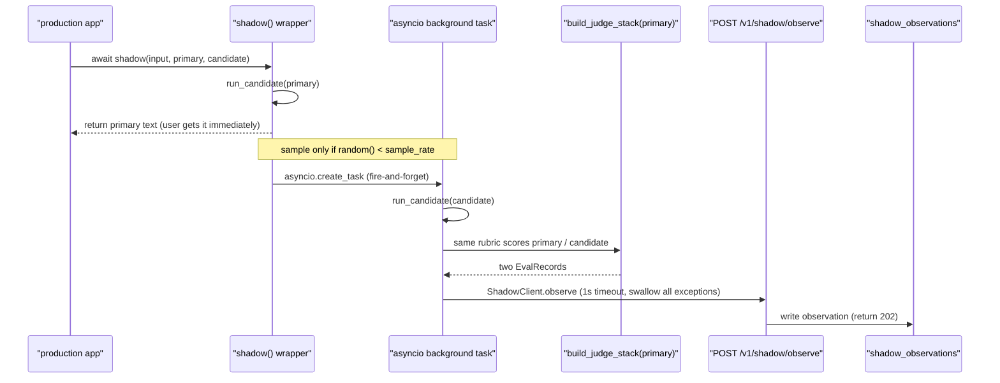
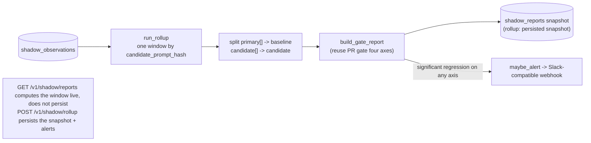

# Phase 13 · Shadow Mode (run the candidate concurrently on production traffic without returning it to the user)

## Core idea

A production app wants to validate a new prompt/model (candidate) without putting it in front of real users. Shadow Mode solves this: on real production traffic, **concurrently** run the candidate; results are for eval only and are not returned to the user.

```python
from evalgate.shadow import shadow
answer = await shadow(case_input, primary=primary_spec, candidate=candidate_spec)
```

`shadow(...)` wraps the primary call: primary returns to the user as usual; when `sample_rate` hits, the candidate runs **in the background concurrently**, both sides are scored with the same judge (reference-free), packed into two `EvalRecord`s, and fire-and-forget pushed to the backend (1s timeout then drop). The backend aggregates by the candidate's prompt hash; a rolling window reuses the PR gate's four-axis decision; a significant worsening on any axis fires a webhook alert.

> Callers only need the 3 lines above; full usage is in [SHADOW.md](./SHADOW.md).

## End-to-end sequence

A shadow call is **zero-blocking** on the production hot path: as soon as primary returns, the caller has the result. Candidate scoring/reporting lives in a background task; slowness or hangs never affect the user.



On-demand rollup and alerting is a separate independent path (on-demand, no resident timer):



The `cost` axis is lower-is-better; a candidate 20% more expensive → significant → fail. That is a regression signal the demo plants on purpose.

## Technical choices

> Trade-offs from ADR-010 (score on the SDK client + on-demand rollup, no scheduler).

### Who scores: SDK client vs backend worker

Shadow has no human ground truth; both primary and candidate need a reference-free judge score before they can become `EvalRecord`s.

- **Choice: score on the SDK client.** Reuse `build_judge_stack(primary)` so both sides are scored with the **same rubric** (same ruler is the only fair comparison). The SDK already holds `PromptSpec` and the LiteLLM channel to run the candidate; scoring in place avoids round-tripping both outputs to a backend judge worker.
- **Cost:** judge token cost/latency lands in the caller process—but all in a background task, not on the hot path. A stricter rubric for the candidate would need an explicit extension.
- **Gain:** the backend shrinks to a thin **write + aggregate** layer. The observe payload is the already-frozen `EvalRecord` contract; the backend need not understand prompt config.

### Rolling reports: built-in scheduler vs on-demand rollup

Should a periodic "hourly four-axis + alert" job live as a timer / resident worker in the service?

- **Choice: on-demand + explicit rollup.** `GET /v1/shadow/reports` computes four axes for the live window (no persist); `POST /v1/shadow/rollup` (and `evalgate shadow rollup` CLI) persists a `shadow_reports` snapshot and fires alerts. Production calls this idempotent CLI from cron.
- **Why not APScheduler / a resident task:** over-engineering for a 1-person-day phase; cron + an idempotent CLI matches the project's git-native / config-outside-the-app tone, and `compute_shadow_report` is a pure function, easy to test.
- **Cost:** "how often to roll" is an ops choice for the deployer; alert latency = rollup period; the service does not guarantee real-time.

### Aggregation: reuse the PR gate vs a second stats stack

- **Choice: reuse `gate.decision.build_gate_report`.** `compute_shadow_report` splits one window of observations into `primary_record[]`→baseline and `candidate_record[]`→candidate, then feeds the gate as-is. Shadow and PR CI **share** four axes + bootstrap CI + tag attribution + `axis_breakdown` sub-axis definitions—zero new statistics code.

### Hot-path protection: fire-and-forget engineering details

- On a sample hit, `asyncio.create_task` starts a background task; the caller **never awaits**. HTTP push has a 1s hard timeout and **swallows every exception** (double try in `ShadowClient.observe` / `_shadow_eval_and_push`). EvalGate being slow or down must not slow or break production requests—that is the precondition for putting shadow in production.
- Background tasks are held by a strong module-level `_BACKGROUND_TASKS` (asyncio only holds weak refs, otherwise GC can drop them). `drain_background_tasks()` is for tests / graceful shutdown. This is a known fire-and-forget pitfall, already encapsulated.

### Other conventions

- **Grouping key `candidate_prompt_hash`:** `spec_hash(spec)` = sha256 of PromptSpec canonical JSON; byte-identical configs collapse into one shadow stream (content-addressed).
- **Alerts can degrade:** POST a `{"text": …}` (Slack incoming-webhook shape; most generic receivers accept it too), no Slack SDK. With no `EVALGATE_SHADOW_WEBHOOK_URL`, degrade to a structlog warning so local/CI need no external endpoint.
- **Time windows robust across dialects:** SQLite stores naive, PG stores aware; rollup normalizes with `_as_aware` in Python then filters by window, without depending on DB datetime comparison semantics.

## Key code

- [src/evalgate/shadow/](../src/evalgate/shadow/)
  - [`sdk.py`](../src/evalgate/shadow/sdk.py) — `shadow(...)` wrapper + `ShadowClient` (fire-and-forget / 1s timeout) + `spec_hash` + `_BACKGROUND_TASKS` / `drain_background_tasks`
  - [`persistence.py`](../src/evalgate/shadow/persistence.py) — observation / report insert+query (dialect-agnostic)
  - [`rollup.py`](../src/evalgate/shadow/rollup.py) — `compute_shadow_report` (pure) / `compute_live_report` (windowed) / `run_rollup` (persist snapshot + alert, injectable `alerter`)
  - [`alert.py`](../src/evalgate/shadow/alert.py) — `format_alert` / `send_alert` / `maybe_alert` (Slack-compatible + no-webhook degrade)
- [src/evalgate/api/routers/shadow.py](../src/evalgate/api/routers/shadow.py) — `POST /v1/shadow/observe` (202) / `GET /v1/shadow/reports` / `POST /v1/shadow/rollup`
- [src/evalgate/db/models.py](../src/evalgate/db/models.py) — `ShadowObservationRow` / `ShadowReportRow`
- [src/evalgate/core/schemas.py](../src/evalgate/core/schemas.py) — `ShadowObserveRequest` / `ShadowReportOut` (observe `EvalRecord` contract)

Test strategy: cover sample hit/miss, cost-regression decisions, fire-and-forget exception swallowing, and degrade paths with pure functions (`compute_shadow_report`) + a deterministic RNG; stitch end-to-end with an offline 1k-traffic smoke.

## Ops and UX

```bash
# offline e2e: 1k traffic -> rolling four-axis report -> cost regression -> alert
make shadow-smoke

# ops: roll a report for a candidate prompt hash (persist snapshot + alert); production calls from cron
evalgate shadow rollup --candidate-hash <hash> --window-hours 24
# view only, do not persist
evalgate shadow report --candidate-hash <hash>
```
