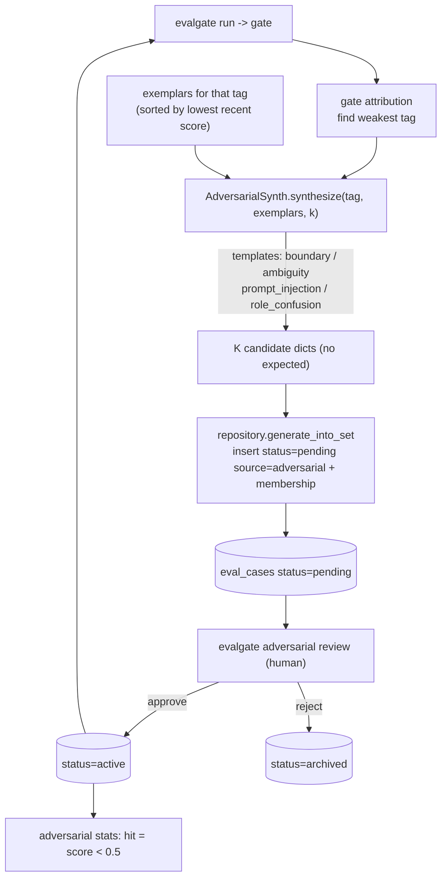
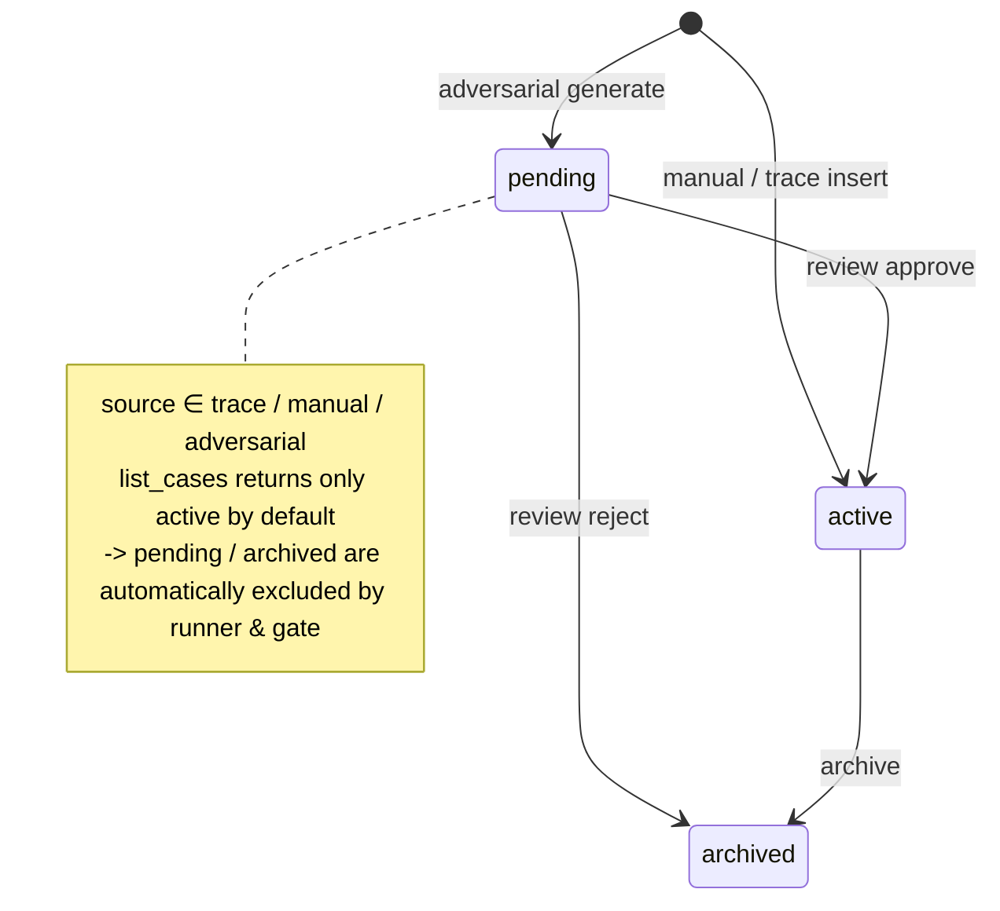

# Phase 14 · Adversarial Case Synth (red-team auto-generation: LLMs actively construct attack tests)

## Core idea

Long-running evals "overfit" the existing cases: the gate stays green while weaknesses remain. Red-teaming (actively constructing attack tests to expose weaknesses) lets the eval set evolve itself—take the weakest tag from gate attribution, have a generator-LLM synthesize K "hard cases" against it in one shot (boundary values / ambiguous reference / prompt injection / role confusion), persist them as `status=pending source=adversarial`. **The runner reads only `active` cases by default, so generated cases never slip into the gate automatically.** After human review approve (→active) / reject (→archived), approved cases enter the eval set and the next eval round.

That is a closed-loop flywheel (eval signals drive generation, generation feeds back into eval): **eval → find weakness → auto-generate → human review → eval again**.

## Closed-loop flywheel



Injection templates reuse `DEFAULT_JAILBREAK_KEYWORDS` from [safety/jailbreak.py](../src/evalgate/safety/jailbreak.py), so approved injection cases regress the gate's `jailbreak_*` sub-axes—the flywheel's "expose weakness" effect is **visible immediately**.

## Case lifecycle state machine

The single source of truth is two columns on `EvalCaseRow`: `status` (whether it participates in eval) × `source` (origin). **The safety invariant "pending never enters the gate" is implemented only by `list_cases` defaulting to `statuses=("active",)`**—no special case in the runner.



`runner.py` `iter_eval` reads cases via `list_cases`, so **zero runner changes** automatically see only active; display paths (GET detail / CLI `show`) pass `statuses=None` explicitly to see everything.

## Technical choices

> Trade-offs from ADR-011 (case status/source invariant lives in the data-access layer; reference-free adversarial cases; hit uses an absolute threshold).

### Where the safety invariant lives: runner special-case vs data-access layer

"Unreviewed cases must never enter the gate"—otherwise the flywheel pollutes itself.

- **Choice: sink it into the data-access layer.** Add `status` + `source` on `EvalCaseRow`; restructure `eval_set.repository.list_cases` with a `statuses` filter **defaulting to `("active",)`**.
- **Why not a runner check:** put the rule at the narrowest data entrance so the runner, a future sequential gate, and any `list_cases` consumer get the guarantee automatically—nobody can forget a special-case.

### Should adversarial cases generate gold answers?

- **Choice: reference-free—generate only `input`, never gold `expected`.** The judge uses the existing reference-free pointwise path; zero new code.
- **Why:** red-team value is "expose weakness," not "supply a standard answer." Generating gold too means the LLM's gold itself needs review (untrustworthy)—negative ROI.

### Definition of a "hit": absolute threshold vs relative drop

- **Choice: hit = candidate's latest score `< 0.5` (absolute threshold, tunable via `stats --threshold`).**
- **Why not "relative drop ≥ X% vs some baseline":** a relative drop needs a "baseline run," and which run is baseline is itself a noise source; an absolute threshold is comparable across runs and immediately explainable ("below 0.5 means we were stumped").
- **Cost:** 0.5 is a magic number, and the mock judge always returns 0.5 so mock never naturally triggers a hit—offline smoke's primary assertion therefore uses **safety-axis regression** (approved injection cases introduce attack surface for the candidate); true hits are left to real mode + unit tests.

### Other conventions

- **synth never throws:** transport failure or JSON parse failure → degrade to fewer (even 0) cases, never interrupt the flywheel. Cost: "ask for 10, maybe get 7"; callers must tolerate that. Mock mode produces cases deterministically from templates; CI is fully offline.
- **Generator reuses a cheap model:** `adversarial_generator_model` defaults to `ollama/qwen3.5:9b` (same as the badcase finder); override with env `EVALGATE_ADVERSARIAL_GENERATOR_MODEL` / CLI `--model`.
- **Refactor `list_cases` signature in place, no backward-compat shim:** the project is still being built; a signature change is cleaner than a parallel function. All call sites were reviewed.

## Key code

- Data model: [core/schemas.py](../src/evalgate/core/schemas.py) adds `CaseStatus` (pending/active/archived) / `CaseSource` (trace/manual/adversarial) enums; `EvalCaseOut` adds `status` + `source`; [db/models.py](../src/evalgate/db/models.py) `EvalCaseRow` adds two columns (`status` indexed); migration [`0013`](../src/evalgate/db/migrations/versions/0013_add_case_status_source.py) adds columns + backfills `source='trace'`.
- Adversarial package [src/evalgate/adversarial/](../src/evalgate/adversarial/):
  - [`synth.py`](../src/evalgate/adversarial/synth.py) — generation only. `ADVERSARIAL_TEMPLATES` (four templates, each with generation instructions); `synthesize(*, tag, exemplars, k, model, mock)` builds a strict-JSON prompt, calls `acompletion_json`, parses with tolerance, mirrors exemplar input keys; `GeneratedCase` (`input`/`template`/`rationale`/`tags`, no `expected`).
  - [`repository.py`](../src/evalgate/adversarial/repository.py) — persistence + lifecycle. `generate_into_set` (lowest recent-score exemplars for the tag → synth → insert as pending/adversarial) / `review_case` (approve→active, reject→archived) / `list_pending` / `stats` (latest `eval_results.score`, hit = `< threshold`).
- Shared change [eval_set/repository.py](../src/evalgate/eval_set/repository.py): `list_cases(..., statuses=("active",))`, `add_case` takes `status`/`source`, `add_case_from_trace` passes `source=trace`.
- REST [api/routers/adversarial.py](../src/evalgate/api/routers/adversarial.py): generate / list pending / review / stats.
- CLI [cli.py](../src/evalgate/cli.py): `evalgate adversarial generate | review | stats`.

Test strategy: repository unit tests lock the core invariants (**runner view excludes pending**, review state flips, stats hit rate uses latest results); synth unit tests cover mock determinism and bad-JSON tolerance; e2e offline smoke walks the full generate→exclude→approve/reject→safety-regression flywheel.

## Manual flywheel

```bash
# offline e2e: generate 10 -> verify pending excluded -> approve 6 / reject 4 -> safety axis regression -> gate fail
make adversarial-smoke

# one manual round
evalgate adversarial generate --set billing --tag billing --k 10 --mock
evalgate adversarial review   --set billing                 # list pending
evalgate adversarial review   --set billing --approve <case_id>
evalgate adversarial stats    --set billing
```
