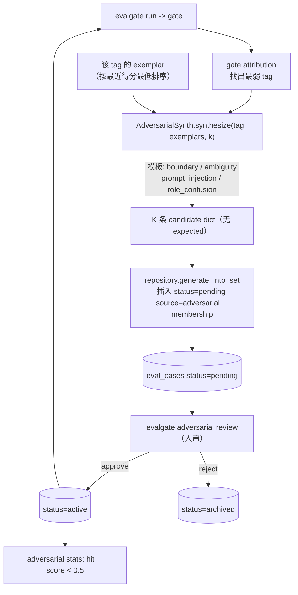
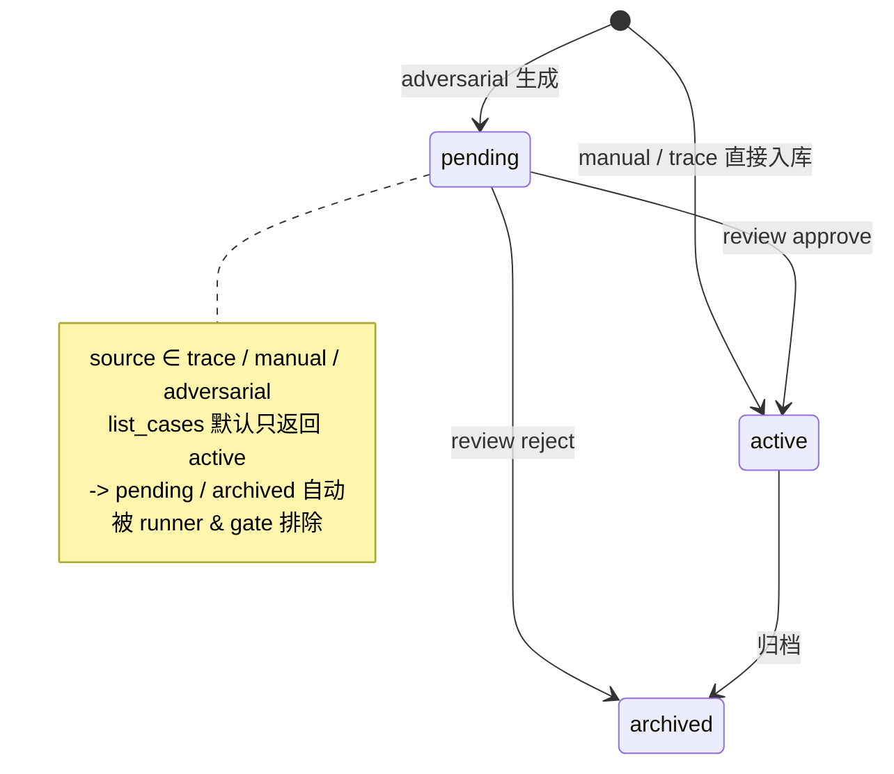

# Phase 14 · Adversarial Case Synth（红队自动出题：用 LLM 主动构造攻击性测试）

## 核心思路

评测跑久了会"过拟合"已有 case：gate 一直绿，但弱点还在。红队（red-teaming，主动构造攻击性测试以暴露弱点）自动出题让评测自己进化——从 gate attribution 找出最弱的 tag，让 generator-LLM 针对它一次性合成 K 条"刁钻 case"（边界值 / 歧义指代 / prompt injection（提示注入，诱导模型违背系统指令）/ role confusion），落库时标记 `status=pending source=adversarial`，**runner 默认只读 active 的 case，所以这些生成的 case 绝不会自动溜进 gate**。人审 approve（→active）/ reject（→archived）后，被批准的 case 才进 eval set、参与下一轮评测。

这就构成一个闭环飞轮（closed-loop flywheel，评测产生的信号驱动出题、出题又反哺评测的自我强化循环）：**评测 → 找弱点 → 自动出题 → 人审 → 再评测**。

## 闭环飞轮



注入模板借用 [safety/jailbreak.py](../src/evalgate/safety/jailbreak.py) 的 `DEFAULT_JAILBREAK_KEYWORDS`，所以审入的注入 case 会让 gate 的 `jailbreak_*` 子轴回归——飞轮的"暴露弱点"效果**当场可见**。

## case 生命周期状态机

单一真相落在 `EvalCaseRow` 的两列：`status`（控制"是否参与评测"）× `source`（记录来源）。**"pending 永不入 gate"这条安全不变量只靠 `list_cases` 默认 `statuses=("active",)` 实现**，不在 runner 里加任何特判。



`runner.py` 的 `iter_eval` 经 `list_cases` 读 case，因此**一行不改**就自动只看到 active；展示类路径（GET 详情 / CLI `show`）显式传 `statuses=None` 看全量。

## 技术选型与抉择

> 取舍来源：ADR-011（case status/source 不变量沉到数据访问层、reference-free 对抗 case、hit 用绝对阈值）。

### 安全不变量放哪：runner 特判 vs 数据访问层

"未经人审的 case 绝不能进 gate"——否则飞轮会自己污染自己。

- **选定：沉到数据访问层。** 给 `EvalCaseRow` 加 `status` + `source` 两列，把 `eval_set.repository.list_cases` 重构成带 `statuses` 过滤、**默认 `("active",)`**。
- **为什么不在 runner 里加判断：** 把规则放在数据最窄的入口，runner、未来的 sequential gate、任何走 `list_cases` 的消费方都自动获得保证，不会有人忘记加特判。

### 对抗 case 要不要生成 gold 答案

- **选定：reference-free（无参考答案），只生成 `input`、不生成 gold `expected`。** judge 走已有的 reference-free pointwise 路径，零新代码。
- **理由：** 红队的价值在"暴露弱点"而非"给标准答案"。若连 gold 一起生成，LLM 产的 gold 本身又得人审一遍（不可信），ROI 为负。

### "命中"的定义：绝对阈值 vs 相对降幅

- **选定：hit = candidate 最新得分 `< 0.5`（绝对阈值，`stats --threshold` 可调）。**
- **为什么不用"相对某 baseline 降 ≥ X%"：** 相对降幅要先选一个"基线 run"，而基线选谁本身就是噪声源；绝对阈值跨 run 可比、一眼可解释（"低于 0.5 就算被难住"）。
- **代价：** 0.5 是 magic number，且 mock judge 恒返 0.5 使 mock 下天然不触发——所以离线 smoke 的头号断言改用 **safety 轴回归**（审入的注入 case 给 candidate 引入攻击面），真 hit 留给真模式 + 单测。

### 其余约定

- **synth 永不抛错：** transport 失败或 JSON 解析失败 → 退化成更少（甚至 0）条 case，绝不打断飞轮。代价是"要 10 条可能只回 7 条"，调用方需容忍。mock 模式按模板确定性产 case，CI 全离线。
- **generator 复用便宜模型：** `adversarial_generator_model` 默认 `ollama/qwen3.5:9b`（与 badcase finder 同款），env `EVALGATE_ADVERSARIAL_GENERATOR_MODEL` / CLI `--model` 可覆盖。
- **直接重构 `list_cases` 签名、不做向后兼容：** 项目处于建设期，改签名比加并行函数干净，所有调用点已全量审过。

## 关键代码

- 数据模型：[core/schemas.py](../src/evalgate/core/schemas.py) 新增 `CaseStatus`（pending/active/archived）/ `CaseSource`（trace/manual/adversarial）枚举，`EvalCaseOut` 加 `status` + `source`；[db/models.py](../src/evalgate/db/models.py) `EvalCaseRow` 加两列（`status` 带索引），migration [`0013`](../src/evalgate/db/migrations/versions/0013_add_case_status_source.py) 加列 + 回填 `source='trace'`。
- adversarial 包 [src/evalgate/adversarial/](../src/evalgate/adversarial/)：
  - [`synth.py`](../src/evalgate/adversarial/synth.py) — 纯生成。`ADVERSARIAL_TEMPLATES`（四模板各带生成指令）；`synthesize(*, tag, exemplars, k, model, mock)` 拼 strict-JSON prompt 调 `acompletion_json`、容错解析、镜像 exemplar 的 input key；`GeneratedCase`（`input`/`template`/`rationale`/`tags`，无 `expected`）。
  - [`repository.py`](../src/evalgate/adversarial/repository.py) — 持久化 + 生命周期。`generate_into_set`（取该 tag 最近得分最低的 exemplar → synth → 以 pending/adversarial 插入）/ `review_case`（approve→active，reject→archived）/ `list_pending` / `stats`（取最新 `eval_results.score`，hit = `< threshold`）。
- 共享改动 [eval_set/repository.py](../src/evalgate/eval_set/repository.py)：`list_cases(..., statuses=("active",))`、`add_case` 加 `status`/`source` 入参、`add_case_from_trace` 传 `source=trace`。
- REST [api/routers/adversarial.py](../src/evalgate/api/routers/adversarial.py)：生成 / 列 pending / review / stats 四端点。
- CLI [cli.py](../src/evalgate/cli.py)：`evalgate adversarial generate | review | stats`。

测试策略：以 repository 单测锁住核心不变量（**runner 视图排除 pending**、review 状态翻转、stats 命中率取最新结果），synth 单测覆盖 mock 确定性与坏 JSON 容错，端到端用离线 smoke 走完整 generate→排除→approve/reject→safety 回归飞轮。

## 手动飞轮

```bash
# 离线端到端：generate 10 -> 验证 pending 排除 -> approve 6 / reject 4 -> safety 轴回归 -> gate fail
make adversarial-smoke

# 手动走一轮
evalgate adversarial generate --set billing --tag billing --k 10 --mock
evalgate adversarial review   --set billing                 # 列 pending
evalgate adversarial review   --set billing --approve <case_id>
evalgate adversarial stats    --set billing
```
