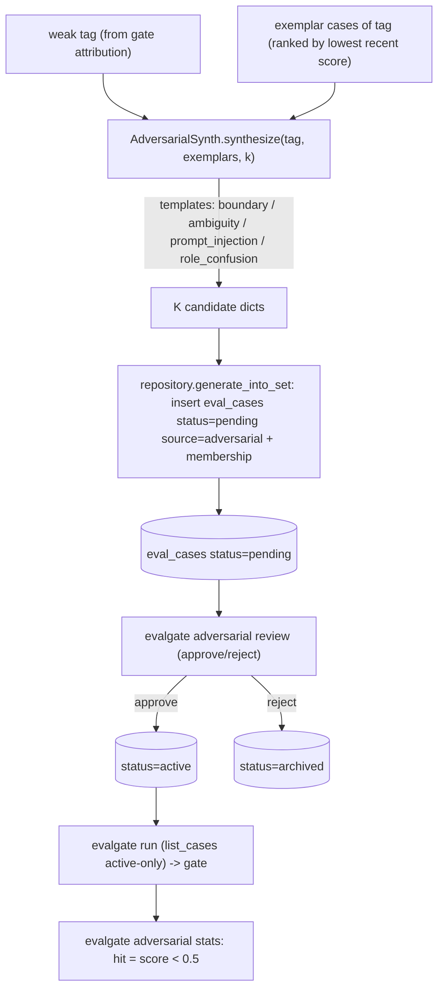

# Phase 14 技术方案 · Adversarial Case Synth（红队自动出题）

> 对应 [ROADMAP.md](./ROADMAP.md) Phase 14。预估 1 人天 vibe coding。

**状态**：DONE（新增 `evalgate.adversarial` 包：`synth.py` 生成 + `repository.py` 生命周期 + `/v1/.../adversarial/*` 四端点 + `evalgate adversarial` CLI 三子命令 + `eval_cases` 加 `status`/`source` 两列 + 0013 migration；`eval_set.repository.list_cases` 加 `statuses` 过滤，默认 active-only，runner/gate 不改一行即自动排除 pending；phase14 smoke 离线跑通；新增 34 个测试，全量绿 + lint/format 通过）

---

## 一句话

从 gate attribution 找出最弱 tag → generator-LLM 一次 strict-JSON 调用产 K 条"刁钻 case"（边界值 / 歧义指代 / prompt injection / role confusion），落库时 `status=pending source=adversarial`，**runner 默认只读 active 所以绝不入 gate**；人审 `approve`（→active）/ `reject`（→archived）后才进 eval set，再跑一次评测——`evalgate adversarial stats` 给出命中率（hit = candidate 最新得分 `< 0.5` 的绝对阈值）。形成 "评测 → 找弱点 → 自动出题 → 人审 → 再评测" 的闭环飞轮。

## 数据流



关键不变量：`eval_set.repository.list_cases` 新增 `statuses` 过滤，**默认 `("active",)`**，于是 [runner.py](../src/evalgate/evaluator/runner.py)（`iter_eval` 调 `list_cases`）和每次 gate run 自动排除 `pending`/`archived` case——runner 一行不改。

## 关键设计决策（已与用户对齐）

- **hit = 绝对阈值（candidate `score < 0.5`），不是相对降幅**：阈值语义稳定、跨 run 可比，不依赖某个 baseline run 的选取；`evalgate adversarial stats --threshold` 可调。
- **adversarial case 是 reference-free（无 gold `expected`）**：红队出题的价值在"暴露弱点"而非"给标准答案"；judge 以 reference-free pointwise 打分（与现有 generic 路径一致），省掉"生成 gold 还得再人审一遍"的二次成本。
- **case 生命周期 = `status` × `source` 两列，单一真相在 `EvalCaseRow`**：`status` ∈ pending/active/archived 控制"是否参与评测"，`source` ∈ trace/manual/adversarial 记录来源。pending 永不进 gate 这一安全属性，**只靠 `list_cases` 的默认过滤实现**——不在 runner 里加特判，未来任何走 `list_cases` 的消费方都自动获得该保证。
- **不向后兼容、直接重构 `list_cases` 签名**：加 `statuses` keyword（默认 active-only），detail / `show` 等"信息展示"路径显式传 `statuses=None` 看全量。GET 详情 / CLI show 现在每条 case 都带 `status`/`source` 字段。
- **synth 永不抛错**：transport 失败或 JSON 解析失败 → 退化成更少（甚至 0）条 case，绝不打断调用方；mock 模式按模板确定性产 case，CI 全离线。
- **generator 复用 cheap-model 默认**：`adversarial_generator_model` 默认 `ollama/qwen3.5:9b`（与 badcase finder 同款便宜模型），env `EVALGATE_ADVERSARIAL_GENERATOR_MODEL` / CLI `--model` 可覆盖。
- **prompt injection 模板复用 safety 关键词**：注入模板借 [safety/jailbreak.py](../src/evalgate/safety/jailbreak.py) 的 `DEFAULT_JAILBREAK_KEYWORDS`，生成的注入 case 自然被 safety 轴识别——于是审入的注入 case 会让 gate 的 `jailbreak_*` 子轴回归，闭环可见。

## 数据模型 + migration

- [src/evalgate/core/schemas.py](../src/evalgate/core/schemas.py)：新增 `class CaseStatus(StrEnum)`（pending/active/archived）、`class CaseSource(StrEnum)`（trace/manual/adversarial）；`EvalCaseOut` 加 `status` + `source`。
- [src/evalgate/db/models.py](../src/evalgate/db/models.py) `EvalCaseRow`：加 `status`（默认 `active`，带索引）+ `source`（默认 `manual`）两列。
- migration [`0013_add_case_status_source.py`](../src/evalgate/db/migrations/versions/0013_add_case_status_source.py)：`add_column` 两列（`server_default` 让历史行有值）+ `create_index` + 回填 `UPDATE eval_cases SET source='trace' WHERE source_trace_id IS NOT NULL`；`downgrade` 反向删列。SQLite round-trip 单测覆盖。

## adversarial 包（新建 `src/evalgate/adversarial/`）

- [`synth.py`](../src/evalgate/adversarial/synth.py) — 纯生成：
  - `ADVERSARIAL_TEMPLATES`：boundary / ambiguity / prompt_injection / role_confusion，每个带生成指令。
  - `async def synthesize(*, tag, exemplars, k=10, model, mock) -> list[GeneratedCase]`：拼一个 strict-JSON prompt 让模型跨模板产 k 条，调 [judge/protocol.py](../src/evalgate/judge/protocol.py) 的 `acompletion_json`，容错解析；镜像 exemplar 的 input key（默认 `"question"`）。mock 模式按模板循环产确定性 case。
  - `GeneratedCase` dataclass：`input` / `template` / `rationale` / `tags`（= `[tag, "adversarial", template]`），无 `expected`。
- [`repository.py`](../src/evalgate/adversarial/repository.py) — 持久化 + 生命周期：
  - `generate_into_set(...)`：解析 set → 取该 tag 的 exemplar（按最近 `eval_results.score` 升序，无结果的按最新）→ `synthesize` → 每条以 `status=pending source=adversarial` 插入（复用 `set_repo.add_case`，连带 membership）。
  - `review_case(*, case_id, decision)`：`approve`→active；`reject`→archived；未知 id 抛 `CaseNotFoundError`（404），非法 decision 抛 `ValueError`（422）。
  - `list_pending(...)`：列出待审的 adversarial pending case。
  - `stats(*, set_id_or_name, threshold=0.5)`：对 `source=adversarial status=active` 的 case 取最新 `eval_results.score`，`hit = score < threshold`，返回 `{total, evaluated, hits, hit_rate, threshold}`。

## eval_set repository 改动（共享）

[src/evalgate/eval_set/repository.py](../src/evalgate/eval_set/repository.py)：
- `list_cases(session, set_id, *, statuses=("active",))` — 按 `EvalCaseRow.status` 过滤；`None` = 全部。
- `add_case(...)` 加 `status` + `source` 入参（默认 active/manual）；`add_case_from_trace` 传 `source=trace`。
- GET 详情 / CLI `show` 传 `statuses=None` 保持信息完整（每条 case 带 `status`/`source`）。

## REST API（[src/evalgate/api/routers/adversarial.py](../src/evalgate/api/routers/adversarial.py)，在 [api/main.py](../src/evalgate/api/main.py) 注册）

- `POST /v1/eval-sets/{set_id}/adversarial?tag=<t>&k=10` → 生成 pending case，返回创建列表。
- `GET  /v1/eval-sets/{set_id}/adversarial/pending` → 列出待审 adversarial case。
- `POST /v1/adversarial/{case_id}/review` body `{decision: "approve"|"reject"}` → 翻转 status。
- `GET  /v1/eval-sets/{set_id}/adversarial/stats?threshold=0.5` → 命中率报告。
- mock 经 `is_mock_llm()` / `?mock=1` 生效（同 badcase router）。

## CLI（`evalgate adversarial ...`，见 [cli.py](../src/evalgate/cli.py)）

- `evalgate adversarial generate --set <id|name> --tag <t> [--k 10] [--model M] [--mock]`
- `evalgate adversarial review --set <id|name>`（无 decision 时列出 pending；`--approve <case_id>` / `--reject <case_id>` 翻转）
- `evalgate adversarial stats --set <id|name> [--threshold 0.5]`

## 配置

[core/config.py](../src/evalgate/core/config.py)：`adversarial_generator_model: str = "ollama/qwen3.5:9b"`（env `EVALGATE_ADVERSARIAL_GENERATOR_MODEL` / CLI `--model` 可覆盖）。

## 启动方式

```bash
# 离线端到端：generate 10 -> 验证 pending 排除 -> approve 6 / reject 4 -> safety 轴回归 -> gate fail
make adversarial-smoke

# 真实 Ollama（额外断言 candidate 真的在对抗 case 上得分 < 0.5）
EVALGATE_MOCK_LLM=0 PYTHONPATH='src:.' uv run python scripts/phase14_adversarial_smoke.py

# 手动飞轮
evalgate adversarial generate --set billing --tag billing --k 10 --mock
evalgate adversarial review   --set billing                 # 列 pending
evalgate adversarial review   --set billing --approve <case_id>
evalgate adversarial stats    --set billing
```

## 退出标准达成（与 ROADMAP 对齐）

```
make adversarial-smoke
```

输出（节选）：

```
generated 10 adversarial cases
exclusion OK: pending run still has 4 cases (no leak)
reviewed: approved 6, rejected 4
inclusion OK: candidate run has 10 cases incl. all approved
safety regression OK: jailbreak_attempt_rate delta=+0.100
adversarial stats: {"total": 6, "evaluated": 6, "hits": ..., "hit_rate": ..., "threshold": 0.5}
```

- 从 billing tag 自动出 10 条、approve 6 条：smoke 走完整生命周期。
- pending 绝不入 gate：generate 后再跑一次 run，断言 0 条 adversarial case 泄漏进结果。
- 审入的对抗 case 让 gate fail：approve 的注入 case 给 candidate 引入 baseline 没有的攻击面，safety `jailbreak_attempt_rate` 子轴回归 → gate fail。

## 测试矩阵

- [tests/test_adversarial_synth.py](../tests/test_adversarial_synth.py) — mock 确定性 + 模板覆盖；镜像 exemplar input key；注入模板含 jailbreak 措辞；k≤0 空；真实路径 JSON 解析 / 截断到 k / 坏 JSON 容错 / 跳过畸形 case + 归一未知模板。
- [tests/test_adversarial_repository.py](../tests/test_adversarial_repository.py) — generate→pending/adversarial；**runner 视图排除 pending**；review approve/reject；stats 命中率 / 取最新结果 / 忽略 pending 与未评测；未知 case / 非法 decision 抛错。
- [tests/test_adversarial_endpoint.py](../tests/test_adversarial_endpoint.py) — 四路由全流程 + 404（未知 set / case）+ 422（坏 decision / 缺 tag / threshold 越界）。
- [tests/test_adversarial_cli.py](../tests/test_adversarial_cli.py) — generate / review（列 pending + approve）/ stats；未知 set / 未知 case 返非零。
- [tests/test_migration_0013_status_source.py](../tests/test_migration_0013_status_source.py) — 0013 upgrade/downgrade round-trip + `source='trace'` 回填。
- [tests/test_list_cases_status_filter.py](../tests/test_list_cases_status_filter.py) — `list_cases` 默认 active-only / `None` 看全 / 显式多状态过滤。
- [scripts/phase14_adversarial_smoke.py](../scripts/phase14_adversarial_smoke.py) 注册进 [tests/test_smokes.py](../tests/test_smokes.py)，CI（mock）跑其断言。

## 不在 Phase 14 范围

- gold 答案生成（选了 reference-free）。
- Streamlit 审核页（按 ROADMAP 只做 CLI/REST）。
- 自动 approve（必须 human-in-the-loop）。
- demo 录屏（属 Phase 17）。
- per-candidate A/B/N 的对抗对比。
