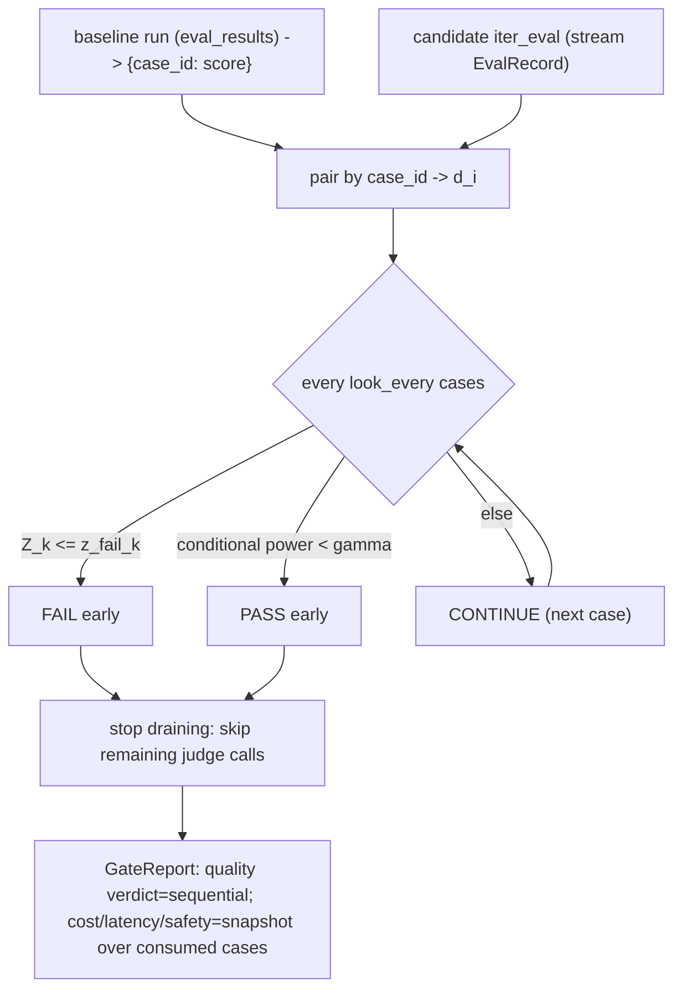

# Phase 15 技术方案 · Sequential Gate（边跑边判，省 judge 调用）

> 对应 [ROADMAP.md](./ROADMAP.md) Phase 15。预估 1 人天 vibe coding。

**状态**：DONE（新增 `evalgate.report.sequential` 纯统计引擎 + `evalgate.gate.sequential` 编排；`evalgate run --gate-mode sequential` 子模式；`GateReport` 加 `sequential` 块 + `SequentialReport`/`SequentialLook` schema；无 migration——baseline 直接复用已有 `eval_results`；新增 5 个测试文件含 1000 次 Monte Carlo 验证 Type-I/power/省调用 + phase15 离线 smoke；全量绿 + lint/format 通过）

---

## 一句话

CI gate 不再等 N 条 case 全判完才出结论：候选 prompt 与"已存 baseline run"**按 case_id 配对**，边跑边在固定间隔"看一眼"——证据足够坏就 **alpha-spending 边界提前 FAIL**，足够好就 **stochastic curtailment 提前 PASS**，于是明显回归 / 明显没问题的候选都能跳过剩下那些贵的 judge 调用，同时把累积误判率（false-fail）锁在 `alpha = 0.05`。

## 已确认的两个设计决策

1. **sequential 决策只跑 quality 一个轴**：每次 judge 调用驱动 quality 分数；cost / latency_p95 / safety 很便宜，在停止点对"已消费的 case"做一次固定-N 快照即可——不值得为它们做 sequential。
2. **提前 PASS 用 stochastic curtailment**（而非 beta-spending / 简单启发式）：curtailment 只会"缩短"运行、永远不会触发 FAIL，所以 Type-I 完全不受影响，控制最干净。

提前 FAIL 边界一律用 **alpha-spending（Lan-DeMets）**。无向后兼容约束——直接加字段 / flag。

## 统计设计（核心）

baseline 与 candidate 跑同一 eval set 的 active case（按 `created_at` 排序），所以做的是 **paired test**——比固定-N gate 的双样本 bootstrap 更有功效，因为 case 一一对应。

- 每条 case `d_i = candidate_score_i - baseline_score_i`。quality 越高越好，所以**回归 = 负 drift**。
- 每 `look_every` 条 case 看一次，第 k 次在 `n_k`；信息分数 `t_k = n_k / N_max`（`N_max` = 配对 active case 数，开跑前已知）。
- 单边统计量 `Z_k = sqrt(n_k) * mean(d) / sd(d)`；换到 B-value 尺度 `B(t_k) = Z_k * sqrt(t_k)`，在 H0 下是带独立增量的布朗运动——正是边界递归所需。
- **alpha-spending 失败边界**：spending 函数 `alpha*(t)`（`alpha*(0)=0`、`alpha*(1)=0.05`、单调）。提供 `obf`：`alpha*(t)=2(1-Phi(z_{a/2}/sqrt(t)))`（早期几乎不花，最严）与 `pocock`：`alpha*(t)=a*ln(1+(e-1)t)`（花得更均匀）。增量花费 `pi_k = alpha*(t_k)-alpha*(t_{k-1})`；用 Armitage-McPherson-Rowe 递归（numpy 网格 + 正态增量卷积 + cumsum 定位）求"在前面都没越界的前提下、这一看恰好花掉 `pi_k`"的下边界 `l_k`，`z_fail_k = l_k/sqrt(t_k)`。
- **stochastic curtailment 提前 PASS**：给定当前 `B(t_k)=b` 与最坏可容忍 drift `mu_alt = -sqrt(N_max)*mde/sd`（`mde` 来自 `--mde`，默认 0.03 分数尺度），"到 t=1 还能越过最终边界 `l_K`"的条件功效 `CP = Phi((l_K - b - mu_alt*(1-t_k)) / sqrt(1-t_k))`。`CP < gamma`（默认 0.2）→ 提前 PASS。这只缩短运行、不会造成 FAIL，所以 Type-I 不变。
- 每次 look 的判定：`Z_k <= z_fail_k` → FAIL；否则 `CP < gamma` → PASS；否则 CONTINUE。`t=1` 时只要没 FAIL → PASS。
- 守卫：`n<2` 或 `sd==0` 退化处理（`sd==0` 且 mean<0 视作铁证 FAIL，mean>=0 则 CONTINUE 到耗尽再 PASS）；baseline 缺该 case 分数的，不参与配对。

只有 numpy（无 scipy），所以 `Phi` 用 `math.erf`、`Phi^-1` 用 Acklam 有理逼近自实现。



## 为什么 sequential 用 paired+parametric，快照仍用 bootstrap

sequential 决策需要"每来一条就能更新、且增量独立"的统计量——配对 t 统计量的布朗运动近似天然满足，而双样本 bootstrap 既无法增量、又不利用配对功效。停止点的 cost/latency/safety 快照不需要 sequential 性质，沿用既有 `build_gate_report` 的 bootstrap 即可，保持与固定-N gate 完全一致的数字与归因。

## 模块布局（沿用 report/ = 纯统计、gate/ = 编排 的分层）

- 新建 [src/evalgate/report/sequential.py](../src/evalgate/report/sequential.py) —— 纯引擎，无 DB/LLM：spending 函数、`norm_cdf`/`norm_ppf`、`compute_fail_boundaries(t, spending)`（Lan-DeMets 递归）、`conditional_power(...)`、有状态 `SequentialGate`（`.update(diff) -> Decision`）、以及供 Monte Carlo + smoke 复用的回放 `evaluate_sequential(baseline, candidate, *, look_every, spending, mde, gamma)`。
- 新建 [src/evalgate/gate/sequential.py](../src/evalgate/gate/sequential.py) —— `run_sequential_gate(...)`：经 [judge/persistence.py](../src/evalgate/judge/persistence.py) `list_results` 载入 baseline，解析 `N_max`，驱动 [evaluator/runner.py](../src/evalgate/evaluator/runner.py) 的 `iter_eval`（`record_stream` 可注入便于测试），喂 gate，一旦终态就 break（真正跳过剩余 judge 调用），最后用 [gate/decision.py](../src/evalgate/gate/decision.py) 的 `build_gate_report` 在"已消费 case"上算 cost/latency/safety + 归因，再用 sequential 决策**覆盖 quality 轴判定**（权威）并挂上 sequential 块。`passed = sequential==PASS 且 非 quality 轴全过`。

## Schema（无 migration——baseline 来自既有 eval_results）

[src/evalgate/core/schemas.py](../src/evalgate/core/schemas.py)：加 `SequentialLook`（`look, n, information_fraction, z, z_fail, conditional_power, decision`）与 `SequentialReport`（`decision, stopped_early, cases_consumed, n_max, spending, mde, gamma, looks`）；`GateReport` 加 `sequential: SequentialReport | None = None`。

## CLI（`evalgate run --gate-mode sequential`）

[cli.py](../src/evalgate/cli.py)：`run` 加 `--gate-mode {fixed,sequential}`（默认 `fixed`，原行为不变）。`sequential` 下必填 `--baseline-run`；可选 `--look-every`(5) / `--spending {obf,pocock}`(obf) / `--mde`(0.03) / `--gamma`(0.2)。此时 `--out` 收到 **GateReport JSON**（per-case 记录照常落库），进程退出码即 gate 判定（`0` pass / `1` fail / `2` error）——与 `evalgate gate` / phase12 同约定。

## 启动方式

```bash
# 离线合成 smoke：回归候选 -> 提前 FAIL；干净候选 -> 提前 PASS；打印省调用比例
make sequential-smoke

# 真实流程（先跑一个 baseline，再用 sequential 模式跑候选）
evalgate run --eval-set billing --prompt baseline.yaml  --out base.json
#   ^ 记下输出里的 run_id
evalgate run --eval-set billing --prompt candidate.yaml --out report.json \
    --gate-mode sequential --baseline-run <run_id> --look-every 5 --spending obf
echo $?   # 0 pass / 1 fail / 2 error
```

## 退出标准达成（与 ROADMAP 对齐）

Monte Carlo（1000 次/场景，见 [tests/test_sequential_montecarlo.py](../tests/test_sequential_montecarlo.py)）：

- **Type-I 受控**：无 drift 时累积 false-fail ≈ 0.05（OBF look_every=5 实测 ~0.05）。
- **有功效**：drift ≤ -mde（-0.10）时 power ≥ 0.8，且平均消费 ≤ 0.5·N_max（≥50% 省调用）。
- **干净候选**：≥90% 提前 PASS，≥50% 省调用。

`make sequential-smoke` 输出（节选）：

```
[regressed] decision=fail consumed=15/60 savings=75%
[clean]     decision=pass consumed=25/60 savings=58%
OK: sequential gate stops early on both regression and clean candidates
```

## 测试矩阵

- [tests/test_sequential_spending.py](../tests/test_sequential_spending.py) — `alpha*(0)=0`/`alpha*(1)=0.05`/单调；边界递归累积花费 == alpha；OBF 早期比 Pocock 更严、末期更松；`norm_cdf`/`norm_ppf` round-trip；零花费 look 不触发。
- [tests/test_sequential_gate.py](../tests/test_sequential_gate.py) — 手搓流的判定逻辑：明显回归 → 提前 FAIL（`cases_consumed < n_max`）；干净 → curtailment 提前 PASS；零方差 / 退化守卫；耗尽 → PASS；`update` 在非 look 点返回 None；`look_every > N` 单 look。
- [tests/test_sequential_montecarlo.py](../tests/test_sequential_montecarlo.py) — 上述 Type-I / power / 省调用三组 + Pocock 也控 Type-I（现实间隔下）。
- [tests/test_sequential_runner.py](../tests/test_sequential_runner.py) — seed baseline run + 注入合成 candidate 流驱动 `run_sequential_gate`：回归提前停、`report.sequential` 落位、quality 轴 FAIL；干净 PASS；无 baseline 分数的 case 不参与配对；缺 baseline run 抛错；`evalgate run --gate-mode sequential` CLI 端到端退出码。
- [scripts/phase15_sequential_smoke.py](../scripts/phase15_sequential_smoke.py) 注册进 [tests/test_smokes.py](../tests/test_smokes.py)，CI 跑其断言。

## 不在 Phase 15 范围

- 多轴 sequential（cost/latency 保持固定-N 快照）。
- 有约束力的 beta-spending futility 边界。
- shadow mode 的 sequential。
- judge 校准（Phase 16）。
- demo 录屏（Phase 17）。
