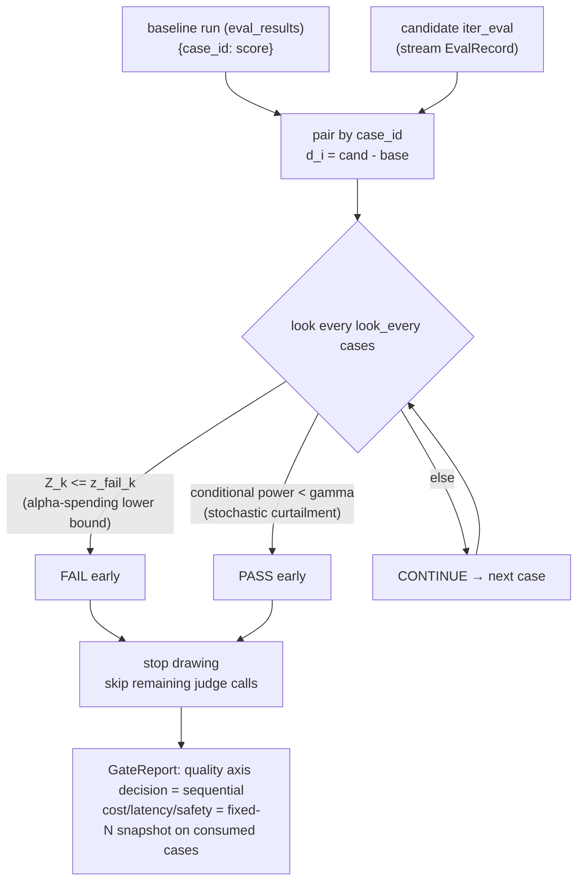
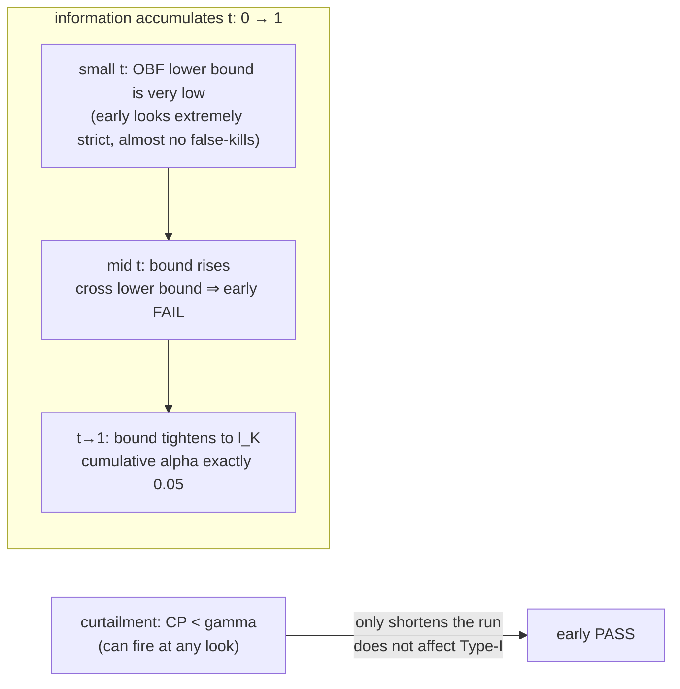

# Sequential Gate · Decide while running, save judge calls

## In one sentence

The CI gate need not wait until all N cases are judged: the candidate prompt is **paired by `case_id`** against an **already stored baseline run**, and at fixed intervals we "take a look"—if evidence is bad enough, **α-spending** (error-spending function that controls cumulative Type-I error under multiple peeks) boundaries **FAIL early**; if evidence is good enough, **stochastic curtailment** (stop early when conditional power is too low / futile) **PASS early**. Obviously-regressed / obviously-fine candidates skip the remaining expensive judge calls, while cumulative false-fail stays locked at `α = 0.05`.

This is **sequential testing** (decide as data arrives; stop when evidence is enough)—unlike a fixed-sample-size test it allows multiple interim looks. Peeks inflate the false-positive rate, so α-spending is required to push it back down.

## Statistical design (core)

Baseline and candidate run the same batch of active cases on the same eval set (sorted by `created_at`), so this is a **paired test**—more powerful than the fixed-N gate's two-sample bootstrap because each case is one-to-one; pairing removes case-difficulty variance.

- Per case, take the difference `d_i = candidate_score_i - baseline_score_i`. Quality is higher-is-better, so **regression = negative drift**.
- Look once every `look_every` cases; look k falls at `n_k`; **information fraction** `t_k = n_k / N_max` (`N_max` = number of paired active cases, known before the run).
- One-sided statistic `Z_k = sqrt(n_k) · mean(d) / sd(d)`; convert to the **B-value scale** `B(t_k) = Z_k · sqrt(t_k)`. Under H0, `B(t)` is a **Brownian motion** approximation with independent increments—exactly the property boundary recursion needs (independent increments, variance linear in t).

### Early FAIL: α-spending boundary

The core intuition of **α-spending**: treat total budget `α = 0.05` as money allocated across peeks. Look k may spend only the increment `π_k = α*(t_k) − α*(t_{k-1})`; cumulative spend at `t=1` equals `α` exactly, so no matter how many looks, cumulative Type-I error never exceeds `α`.

Two common spending functions (under the **Lan-DeMets** framework):

- **O'Brien-Fleming (OBF)**: `α*(t) = 2(1 − Φ(z_{α/2}/sqrt(t)))`. Almost no budget early → early looks are extremely strict, almost never false-kill, money saved for the end; the default.
- **Pocock**: `α*(t) = α·ln(1 + (e−1)t)`. Budget spent more evenly → willing to conclude early, slightly aggressive at small n.

Boundaries use the **Armitage-McPherson-Rowe recursion**: propagate the H0 joint density on a B-value grid (numpy grid + convolution with normal increments + cumsum locate), find the lower boundary `l_k` that spends exactly `π_k` given no prior crossing, then convert back to the Z scale `z_fail_k = l_k/sqrt(t_k)`. `Z_k ≤ z_fail_k` → FAIL.

### Early PASS: stochastic curtailment

**Conditional power** answers: "given current evidence, what is the probability of still crossing the fail boundary by t=1?" Given current `B(t_k)=b` and the worst tolerable drift `μ_alt = −sqrt(N_max)·mde/sd` (`mde` from `--mde`, default 0.03 on the score scale):

`CP = Φ((l_K − b − μ_alt·(1−t_k)) / sqrt(1−t_k))`

If `CP < γ` (default 0.2), even a true MDE-sized regression is almost certain not to fail from here → continuing is futile → PASS early.

Key property: **curtailment only shortens the run, never triggers FAIL**, so it has **no effect on Type-I error**—that fully decouples "save calls" from "control misclassification."

### Decision and guards at each look

- Decision priority: `Z_k ≤ z_fail_k` → FAIL; else `CP < γ` → PASS; else CONTINUE. At `t=1`, if not FAIL → PASS (always a final conclusion).
- Guards: `n<2` or `sd==0` degrade (`sd==0` and mean<0 is ironclad FAIL; mean≥0 CONTINUEs until exhaustion then PASS); cases missing a baseline score are silently excluded from pairing.
- The environment has numpy only (no scipy), so `Φ` (normal CDF) uses `math.erf` and `Φ⁻¹` (inverse CDF) is a self-implemented Acklam rational approximation.

### Decision flow



The two boundaries each own one end; the diagram below is the B-value corridor intuition:



## Why sequential uses paired+parametric, while snapshots still use bootstrap

Sequential decisions need a statistic that updates as each case arrives, with independent increments—the Brownian-motion approximation of the paired t-statistic naturally satisfies that; two-sample bootstrap is neither incremental nor pairing-powered. Cost/latency/safety snapshots at the stop point do not need sequential properties; reuse the existing `build_gate_report` bootstrap so numbers and attribution stay identical to the fixed-N gate.

## Technical choices

> See [DECISIONS.md](../DECISIONS.md) ADR-012. Interview-style fork → choice → cost.

| Fork | Choice | Alternative | Why / cost |
| --- | --- | --- | --- |
| Which test | **paired parametric** (one-sided test on diffs `d_i`) | reuse fixed-N two-sample bootstrap | Same cases one-to-one; pairing removes case-difficulty variance, more power; paired t BM approximation updates independently per case, bootstrap is neither incremental nor pairing-aware—paired parametric is the right tool for sequential. |
| early-FAIL bound | **Lan-DeMets α-spending** (OBF default / Pocock) | fixed-threshold multi-look, Bonferroni | α-spending is the standard answer for "sequential looks without inflating Type-I": cumulative spend exactly 0.05; fixed thresholds inflate FPR with peek count; Bonferroni is overly conservative and loses power. |
| early-PASS mechanism | **stochastic curtailment** (conditional power < γ → futile) | beta-spending, simple heuristics | curtailment only shortens the run, never FAIL, so Type-I is unaffected by the PASS bound—decouples saving calls from misclassification control; beta-spending couples to the α bound, heavier to implement and argue. |
| which axes are sequential | **quality only** | sequential on every axis | Each judge call drives the quality score; that is the whole leverage for saving calls; cost/latency/safety are cheap to compute and not worth sequential treatment. At stop, take a fixed-N snapshot on consumed cases and reuse `build_gate_report` so numbers match the fixed-N gate. |
| numeric deps | **self-implemented `norm_cdf`/`norm_ppf`** | add scipy | environment has numpy only; `Φ` via `math.erf`, `Φ⁻¹` via Acklam rational approx (error <1.2e-9), one fewer heavy dep. |

**Known cost (small-n footnote)**: the normal bound approximates a t distribution and is slightly aggressive at small n. Pocock front-loads budget onto the earliest looks; at `n=5` measured Type-I is ~0.08 (slightly over 0.05); hence default OBF, and Pocock Type-I checks use a realistic first-look spacing of `n=10`. That cost is inherent in approximating t with a normal bound.

## Module layout (keep `report/` = pure stats, `gate/` = orchestration)

- [src/evalgate/report/sequential.py](../src/evalgate/report/sequential.py) — pure engine, no DB/LLM: spending functions, `norm_cdf`/`norm_ppf`, `compute_fail_boundaries(t, spending)` (Lan-DeMets recursion), `conditional_power(...)`, stateful `SequentialGate` (`.update(diff) -> Decision`), plus `evaluate_sequential(baseline, candidate, *, look_every, spending, mde, gamma)` for replay.
- [src/evalgate/gate/sequential.py](../src/evalgate/gate/sequential.py) — `run_sequential_gate(...)`: load baseline via [judge/persistence.py](../src/evalgate/judge/persistence.py) `list_results`, resolve `N_max`, drive [evaluator/runner.py](../src/evalgate/evaluator/runner.py) `iter_eval`, feed the gate, break on a terminal state (truly skip remaining judge calls), then [gate/decision.py](../src/evalgate/gate/decision.py) `build_gate_report` for cost/latency/safety + attribution on **consumed cases**, then **overwrite the quality-axis decision** with the sequential decision (authoritative). `passed = sequential==PASS ∧ all non-quality axes pass`.

Layering motive: `report/` is unit-testable pure functions (seeded synthetic data proves statistical properties); `gate/` only orchestrates DB/LLM—proof of statistical correctness does not depend on external side effects.

## Schema (no migration—baseline reuses existing `eval_results`)

[src/evalgate/core/schemas.py](../src/evalgate/core/schemas.py): add `SequentialLook` (`look, n, information_fraction, z, z_fail, conditional_power, decision`) and `SequentialReport` (`decision, stopped_early, cases_consumed, n_max, spending, mde, gamma, looks`); `GateReport` adds `sequential: SequentialReport | None = None`.

## CLI (`evalgate run --gate-mode sequential`)

[cli.py](../src/evalgate/cli.py): `run` adds `--gate-mode {fixed,sequential}` (default `fixed`, original behavior unchanged). `sequential` requires `--baseline-run`; optional `--look-every`(5) / `--spending {obf,pocock}`(obf) / `--mde`(0.03) / `--gamma`(0.2). `--out` receives **GateReport JSON** (per-case records still persist as usual); process exit code is the gate decision (`0` pass / `1` fail / `2` error).

```bash
# run a baseline first; note the run_id in the output
evalgate run --eval-set billing --prompt baseline.yaml --out base.json

# then run the candidate in sequential mode
evalgate run --eval-set billing --prompt candidate.yaml --out report.json \
    --gate-mode sequential --baseline-run <run_id> --look-every 5 --spending obf
echo $?   # 0 pass / 1 fail / 2 error
```

## Verification strategy

Statistical correctness is proven by **Monte Carlo (1000 trials/scenario)**, not by eye: under no drift, cumulative false-fail ≈ 0.05 (Type-I controlled); under drift ≤ −mde, power ≥ 0.8 and mean calls saved ≥ 50%; clean candidates ≥90% PASS early. These are load-bearing assertions, not decoration.

> Offline note: the mock judge always returns 0.5 (zero variance), so a stats demo cannot run on it. Smoke therefore drives the pure engine directly with seeded normal synthetic `(score, score)` pairs—exactly the shape of real pairing.
