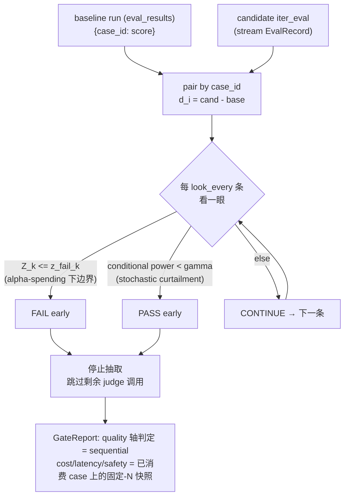
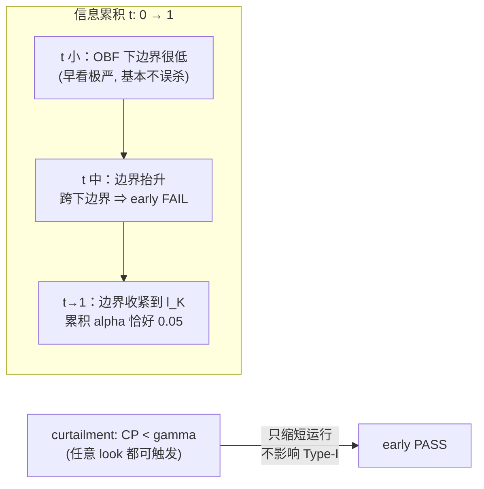

# Sequential Gate · 边跑边判，省 judge 调用

## 一句话

CI gate 不必等 N 条 case 全判完才出结论：候选 prompt 与"已存 baseline run"**按 `case_id` 配对**，边跑边在固定间隔"看一眼"——证据足够坏就 **α-spending（误差消耗函数，控制多次窥视下的累积 Type-I error）边界提前 FAIL**，足够好就 **stochastic curtailment（随机截断，条件功效过低则提前判 futile）提前 PASS**。于是明显回归 / 明显没问题的候选都能跳过剩下那些贵的 judge 调用，同时把累积误判率（false-fail）锁在 `α = 0.05`。

这是一种 **sequential testing（序贯检验，边收集数据边判定、证据足够就提前停）**——与固定样本量检验的区别是它允许多次"中途窥视"（interim look），代价是窥视会膨胀假阳率，所以必须用 α-spending 把它压回去。

## 统计设计（核心）

baseline 与 candidate 跑同一 eval set 的同一批 active case（按 `created_at` 排序），所以做的是 **paired test（配对检验）**——比固定-N gate 的双样本 bootstrap 更有功效，因为同一条 case 一一对应，配对消掉了 case 本身的难度方差。

- 每条 case 取差值 `d_i = candidate_score_i - baseline_score_i`。quality 越高越好，所以**回归 = 负 drift（漂移）**。
- 每 `look_every` 条 case 看一次，第 k 次落在 `n_k`；**information fraction（信息分数）** `t_k = n_k / N_max`（`N_max` = 配对 active case 数，开跑前已知）。
- 单边统计量 `Z_k = sqrt(n_k) · mean(d) / sd(d)`；换到 **B-value 尺度** `B(t_k) = Z_k · sqrt(t_k)`。在 H0 下 `B(t)` 是带独立增量的 **Brownian motion（布朗运动近似）**——正是边界递归所需的性质（增量独立、方差随 t 线性增长）。

### 提前 FAIL：α-spending 边界

**α-spending** 的核心直觉：把总预算 `α = 0.05` 当成一笔钱，分摊到每次窥视。第 k 次只允许花掉增量 `π_k = α*(t_k) − α*(t_{k-1})`，累积花费到 `t=1` 恰好等于 `α`，于是无论看多少次，累积 Type-I error 都不超 `α`。

两类常用的花费函数（**Lan-DeMets** 框架下）：

- **O'Brien-Fleming（OBF）**：`α*(t) = 2(1 − Φ(z_{α/2}/sqrt(t)))`。早期几乎不花预算 → 早看极严、几乎不会误杀，把钱留到末期；默认选它。
- **Pocock**：`α*(t) = α·ln(1 + (e−1)t)`。预算花得更均匀 → 早期就肯下结论，但小样本下略激进。

求边界用 **Armitage-McPherson-Rowe 递归**：在 B-value 网格上传播 H0 联合密度（numpy 网格 + 正态增量卷积 + cumsum 定位），找"在前面都没越界的前提下、这一看恰好花掉 `π_k`"的下边界 `l_k`，再换回 Z 尺度 `z_fail_k = l_k/sqrt(t_k)`。`Z_k ≤ z_fail_k` → FAIL。

### 提前 PASS：stochastic curtailment

**conditional power（条件功效）** 回答的是："以现在的证据，到 t=1 还有多大概率会越过失败边界？" 给定当前 `B(t_k)=b` 与最坏可容忍 drift `μ_alt = −sqrt(N_max)·mde/sd`（`mde` 来自 `--mde`，默认 0.03 分数尺度）：

`CP = Φ((l_K − b − μ_alt·(1−t_k)) / sqrt(1−t_k))`

若 `CP < γ`（默认 0.2），说明哪怕真有 MDE 大小的回归，现在也几乎不可能再失败 → 继续是徒劳（futile）→ 提前 PASS。

关键性质：**curtailment 只会"缩短"运行、永远不会触发 FAIL**，所以它对 Type-I error 完全没有影响——这把"省调用"与"误判控制"两件事彻底解耦。

### 每次 look 的判定与守卫

- 判定优先级：`Z_k ≤ z_fail_k` → FAIL；否则 `CP < γ` → PASS；否则 CONTINUE。`t=1` 时只要没 FAIL → PASS（最终一定给结论）。
- 守卫：`n<2` 或 `sd==0` 退化处理（`sd==0` 且 mean<0 视作铁证 FAIL，mean≥0 则 CONTINUE 到耗尽再 PASS）；baseline 缺该 case 分数的，不参与配对（被静默排除）。
- 环境只有 numpy（无 scipy），所以 `Φ`（normal CDF）用 `math.erf`、`Φ⁻¹`（inverse CDF）用 Acklam 有理逼近自实现。

### 决策流



两类边界各管一端，下图是 B-value 走廊的直觉：



## 为什么 sequential 用 paired+parametric，快照仍用 bootstrap

sequential 决策需要"每来一条就能更新、且增量独立"的统计量——配对 t 统计量的布朗运动近似天然满足，而双样本 bootstrap 既无法增量、又不利用配对功效。停止点的 cost/latency/safety 快照不需要 sequential 性质，沿用既有 `build_gate_report` 的 bootstrap 即可，保持与固定-N gate 完全一致的数字与归因。

## 技术选型与抉择

> 见 [DECISIONS.md](../DECISIONS.md) ADR-012。下面是面试视角的"岔路 → 选择 → 代价"。

| 岔路 | 选择 | 备选 | 为什么 / 代价 |
| --- | --- | --- | --- |
| 用什么检验 | **paired 参数检验**（对差值 `d_i` 做单边检验） | 沿用固定-N 的双样本 bootstrap | 同一组 case 一一对应，配对消掉 case 难度方差、功效更高；配对 t 统计量的布朗运动近似满足"每来一条独立更新"，而 bootstrap 既不增量也不利用配对——序贯场景下配对参数检验才是对的工具。 |
| early-FAIL 边界 | **Lan-DeMets α-spending**（OBF 默认 / Pocock） | 固定阈值多看、Bonferroni 校正 | α-spending 是"序贯多看不抬 Type-I"的标准答案：累积花费恰好 0.05；固定阈值多看会让假阳率随窥视次数膨胀，Bonferroni 又过保守、损失功效。 |
| early-PASS 机制 | **stochastic curtailment**（条件功效 < γ → futile） | beta-spending、简单启发式 | curtailment 只缩短运行、永不触发 FAIL，所以 Type-I 完全不受 PASS 边界影响，把省调用与误判控制解耦；beta-spending 会与 α 边界耦合，实现与论证都更重。 |
| 序贯覆盖哪些轴 | **只 quality 一个轴** | 多轴都序贯 | 每次 judge 调用驱动的就是 quality 分数，省调用的杠杆全在这里；cost/latency/safety 计算便宜、不值得序贯，停止点对已消费 case 做固定-N 快照即可，并复用 `build_gate_report` 保证数字与固定-N gate 一致。 |
| 数值依赖 | **自实现 `norm_cdf`/`norm_ppf`** | 引入 scipy | 环境只有 numpy；`Φ` 用 `math.erf`、`Φ⁻¹` 用 Acklam 有理逼近（误差 <1.2e-9），省一个重依赖。 |

**已知代价（小样本注脚）**：正态边界是对 t 分布的近似，小 n 时略激进。Pocock 把预算前置到最早几次 look，`n=5` 时实测 Type-I ~0.08（略超 0.05）；故默认推荐 OBF，Pocock 的 Type-I 验证用首看 `n=10` 的现实间隔。这是"用正态边界近似 t 分布"的固有代价。

## 模块布局（沿用 `report/` = 纯统计、`gate/` = 编排 的分层）

- [src/evalgate/report/sequential.py](../src/evalgate/report/sequential.py) —— 纯引擎，无 DB/LLM：spending 函数、`norm_cdf`/`norm_ppf`、`compute_fail_boundaries(t, spending)`（Lan-DeMets 递归）、`conditional_power(...)`、有状态 `SequentialGate`（`.update(diff) -> Decision`），以及供回放复用的 `evaluate_sequential(baseline, candidate, *, look_every, spending, mde, gamma)`。
- [src/evalgate/gate/sequential.py](../src/evalgate/gate/sequential.py) —— `run_sequential_gate(...)`：经 [judge/persistence.py](../src/evalgate/judge/persistence.py) `list_results` 载入 baseline，解析 `N_max`，驱动 [evaluator/runner.py](../src/evalgate/evaluator/runner.py) 的 `iter_eval`，喂 gate，一旦终态就 break（真正跳过剩余 judge 调用），最后用 [gate/decision.py](../src/evalgate/gate/decision.py) 的 `build_gate_report` 在"已消费 case"上算 cost/latency/safety + 归因，再用 sequential 决策**覆盖 quality 轴判定**（权威）。`passed = sequential==PASS ∧ 非 quality 轴全过`。

分层动机：`report/` 是可单测的纯函数（喂 seeded 合成数据即可验证统计性质），`gate/` 只做 DB/LLM 编排——统计正确性的证明不依赖任何外部副作用。

## Schema（无 migration——baseline 复用既有 `eval_results`）

[src/evalgate/core/schemas.py](../src/evalgate/core/schemas.py)：加 `SequentialLook`（`look, n, information_fraction, z, z_fail, conditional_power, decision`）与 `SequentialReport`（`decision, stopped_early, cases_consumed, n_max, spending, mde, gamma, looks`）；`GateReport` 加 `sequential: SequentialReport | None = None`。

## CLI（`evalgate run --gate-mode sequential`）

[cli.py](../src/evalgate/cli.py)：`run` 加 `--gate-mode {fixed,sequential}`（默认 `fixed`，原行为不变）。`sequential` 下必填 `--baseline-run`；可选 `--look-every`(5) / `--spending {obf,pocock}`(obf) / `--mde`(0.03) / `--gamma`(0.2)。`--out` 收到 **GateReport JSON**（per-case 记录照常落库），进程退出码即 gate 判定（`0` pass / `1` fail / `2` error）。

```bash
# 先跑一个 baseline，记下输出里的 run_id
evalgate run --eval-set billing --prompt baseline.yaml --out base.json

# 再用 sequential 模式跑候选
evalgate run --eval-set billing --prompt candidate.yaml --out report.json \
    --gate-mode sequential --baseline-run <run_id> --look-every 5 --spending obf
echo $?   # 0 pass / 1 fail / 2 error
```

## 验证策略

统计正确性靠 **Monte Carlo（1000 次/场景）**证明而非肉眼：无 drift 时累积 false-fail ≈ 0.05（Type-I 受控），drift ≤ −mde 时 power ≥ 0.8 且平均省调用 ≥ 50%，干净候选 ≥90% 提前 PASS。这些是 load-bearing 的断言，不是装饰。

> 离线说明：mock judge 恒返 0.5（零方差）使统计 demo 跑不起来，所以 smoke 直接驱动纯引擎、喂 seeded 正态合成的 `(score, score)` 对——这正是真实配对的形状。
