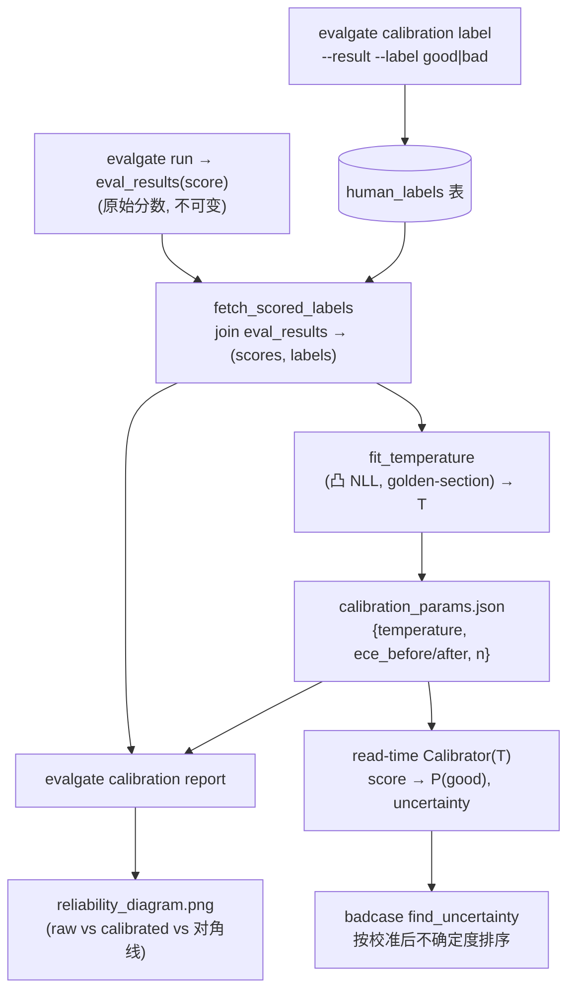
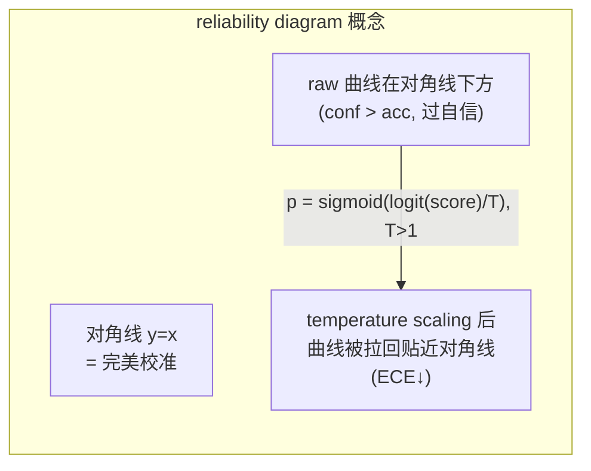

# Judge Calibration · ECE + temperature scaling

## 一句话

让 judge 的 `score` 变成"能当概率读"的数：judge 说 0.8，就应该约等于"人类有 80% 概率判这条 good"。我们用单参数 **temperature scaling（温度缩放，单参数把分数压向/拉离 0.5）**（Guo et al. 2017）把 `score → P(good)` 对齐二元人工标签，用 **ECE（Expected Calibration Error，期望校准误差）/ MCE + reliability diagram（可靠性图）** 度量对齐程度，并由此导出一个**校准后的不确定度**（`1 − |2p−1|`，在 `p=0.5` 处最大）供 BadCase 主动学习采样排序。

## 数据流



## 统计设计（核心）

### 校准目标与变换

把 `score` 看成 P(good) 的"未校准 logit"。校准公式 `p = sigmoid(logit(score) / T)`：

- `T>1`：把分数往 0.5 拉 → 说明 judge 原本**过自信**（overconfident）。
- `T<1`：推往两端 → judge 原本**欠自信**。
- `T=1`：恒等，不动。

### 拟合：单参数凸优化

在标注集上最小化逻辑 **NLL（负对数似然）**。以 `w = 1/T` 为变量，损失：

`NLL(w) = mean[ y·softplus(−w·z) + (1−y)·softplus(w·z) ]`，其中 `z = logit(score)`。

这本质是**单特征、无截距的逻辑回归**，对 `w` **严格凸**，所以一维 **golden-section（黄金分割）** 搜索（`w ∈ [0.05, 20]`）即可得全局最优、无需梯度。守卫：标签需同时含两类且 `n ≥ 10`，否则返回 `T=1.0`（信号不足就不动）。

### 度量：ECE / MCE / reliability diagram

等宽 10 桶。把每条 `(score, label)` 按 score 落桶：

- **ECE**：`Σ (|桶|/N)·|acc − conf|`——各桶"置信度 vs 实际通过率"差距的加权平均。
- **MCE**：`max |acc − conf|`——最坏的那个桶。
- **reliability_curve**：给每个非空桶的 `(mean_confidence, mean_accuracy, count)`。完美校准时每桶 `acc == conf`，点全落在对角线上；点在对角线下方 = 过自信，上方 = 欠自信。



### 校准后不确定度

`uncertainty(score) = 1 − |2·p − 1|`，在校准概率 `p=0.5`（判定边界）处取最大值 1。这是"分数已是概率"之后主动学习采样的正确信号。

> 重要细节：temperature scaling 是**单调**变换，不改变 `|score−0.5|` 的排序。它的价值不在"重排原始分数"，而在**替换掉** badcase 今天用的、与真实模糊度不相关的 `judge_confidence` 启发式。

实现注脚：只有 numpy，所以 `sigmoid` 用 `tanh` 稳定式、`logit` 带 eps 截断（0/1 分数 → 有限 logit）、NLL 用 `logaddexp` 稳定 softplus。今天的 `judge_confidence`（[multi_judge.py](../src/evalgate/judge/multi_judge.py) L68-74）只是个启发式方差代理、**本就不是概率**；校准针对的是 `score`。

## 技术选型与抉择

> 见 [DECISIONS.md](../DECISIONS.md) ADR-013。下面是面试视角的"岔路 → 选择 → 代价"。

| 岔路 | 选择 | 备选 | 为什么 / 代价 |
| --- | --- | --- | --- |
| 校准哪个量 | **`score`** | 启发式 `judge_confidence` | `score` 才是目标信号——"judge 说 0.8 = 80% 通过率"针对的是它；`judge_confidence` 只是个方差代理、本不声称是概率，校准一个本不是概率的量没有意义。 |
| 校准方法 | **temperature scaling**（单参数） | **Platt scaling / isotonic regression（两类替代校准法）** | 单参数、凸、需要的标注量最小，是 reliability 校准的标准基线（Guo et al. 2017），契合"人工标注很贵、能少则少"；Platt 多一个截距、isotonic 非参数更吃数据、易过拟合小标注集。 |
| 标签存哪 | **新 DB 表 `human_labels`**（软引用 `eval_result_id`，无 FK） | JSON 文件 | DB 表能 join `eval_results`、按 run 过滤、可查询，与既有持久化范式一致；更关键它**同时是后续 Cohen's kappa（judge vs 人工一致性）的数据源**——一张表喂两个 phase。软引用让标签在结果删除后存活。 |
| 校准在何处施加 | **读取时（read-time）由纯 `Calibrator`** | eval 时持久化 calibrated score | 延续"存原始、读时变换"的原则：原始分数不可变、校准曲线随时可重拟合 / 替换而无需重跑 judge；runner 零改动；不引入"哪个是原始分、哪个是校准分"的列歧义。 |

**已知代价**：单调变换不重排原始分数（见上），badcase 召回对比因此是"校准后不确定度 vs 启发式 confidence"而非"重排分数"；当前是**单一全局 T**（params JSON 形状已为 per-task-type / per-judge 多曲线预留扩展空间——**Phase 17 已落实**，见 [PHASE_17_PLAN.md](./PHASE_17_PLAN.md) 与 ADR-016）；新增 matplotlib 依赖（仅出 reliability diagram，Agg 懒加载，纯统计路径不触发）。

## 模块布局（沿用 `report/` = 纯统计、子包 = 编排 的分层）

- [src/evalgate/report/calibration.py](../src/evalgate/report/calibration.py) —— 纯引擎，无 DB/LLM：`_sigmoid`/`_logit`、`expected_calibration_error`/`max_calibration_error`、`reliability_curve`、`fit_temperature`（凸一维 NLL + golden-section）、`Calibrator` 数据类（`.transform`/`.uncertainty`/`to_dict`/`from_dict`）、`evaluate_calibration`（before/after 一把出）、`render_reliability_png`（懒加载 matplotlib，模块本身保持纯统计可测）。
- `src/evalgate/calibration/` —— [repository.py](../src/evalgate/calibration/repository.py)：`add_label`/`list_labels`（`human_labels` 标注存储）、`fetch_scored_labels`（join `eval_results`、`good→1`/`bad→0`、同结果多标签取最新、跳过无分数行）、`fit_and_save`（拟合 → 写 params JSON → 返回报告）、`compute_report`（读时算 before/after）、`load_calibrator`（读 JSON，缺失返回 None）。

## Schema + DB + config

- [src/evalgate/core/schemas.py](../src/evalgate/core/schemas.py)：`HumanLabel(StrEnum)` good/bad；`HumanLabelOut`；`ReliabilityBin`；`CalibrationReport`（`n, n_bins, temperature, ece_before/after, mce_before/after, reliability_before/after`）。
- [src/evalgate/db/models.py](../src/evalgate/db/models.py)：`HumanLabelRow`（`id`、`eval_result_id` 软引用 + 索引、`label`、`annotator`、`note`、`created_at`）——无 FK，沿用 `eval_results` 的软引用惯例（标签需在结果删除后存活）。
- [migration 0014](../src/evalgate/db/migrations/versions/0014_create_human_labels.py)（down_revision `0013`）：建表 + 索引；`downgrade` 删表。
- [src/evalgate/core/config.py](../src/evalgate/core/config.py)：`calibration_params_path`（默认 `calibration_params.json`，别名 `EVALGATE_CALIBRATION_PARAMS_PATH`）。

## BadCase 集成

[src/evalgate/badcase/finder.py](../src/evalgate/badcase/finder.py)：`find_uncertainty(..., calibrator=None)`——传 `calibrator` 时按**校准后不确定度降序**排（reason 写 `calibrated_uncertainty=... (p_good=...)`）；不传时维持原 `judge_confidence ASC NULLS LAST` 行为（opt-in，不惊扰既有调用）。`find`/`find_llm` 透传不变。

## CLI

[cli.py](../src/evalgate/cli.py) 的 `_add_calibration_subcommands`（镜像 `_add_adversarial_subcommands`）：

```bash
# 1) 给一条结果打人工标签（good→1 / bad→0）
evalgate calibration label --result <eval_result_id> --label good

# 2) 在标注集上拟合温度，写出 calibration_params.json
evalgate calibration fit [--run <run_id>] [--out calibration_params.json]
#   打印 {params_path, n, temperature, ece_before, ece_after, mce_before, mce_after}

# 3) 出 before/after 报告 + reliability 图
evalgate calibration report [--run <id>] [--params P] [--plot reliability.png]

# 4) badcase 按校准后不确定度排（替代启发式 confidence）
evalgate badcase list --strategy uncertainty --calibration calibration_params.json
```

退出码沿用约定：`0` ok / `1` 预期性缺失（如标签目标结果不存在）/ `2` 错误（如标注集退化、不足以拟合）。

## 验证策略

核心断言：构造系统性过自信的合成判分，`ece_before ≥ 0.15` → 拟合得 `T > 1` → `ece_after ≤ 0.05`；并验证在 `judge_confidence` 与真实模糊度不相关时，按校准后不确定度排序能在 top-K 召回更多真正接近边界的 case。

> 离线说明：mock judge 对每条都返回平的 `0.5`（零信息），校准 demo 在它上面跑不起来，所以 smoke 直接驱动纯引擎、喂 seeded、刻意过自信的 `(score, label)` 对——这正是真实标注集的形状。
