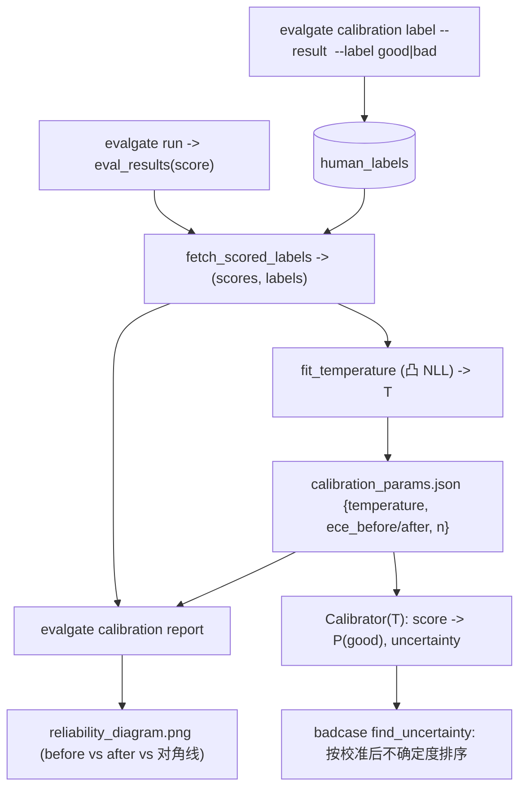

# Phase 16 技术方案 · Judge Calibration（ECE + temperature scaling）

> 对应 [ROADMAP.md](./ROADMAP.md) Phase 16。预估 1 人天 vibe coding。

**状态**：DONE（新增 `evalgate.report.calibration` 纯统计引擎 + `evalgate.calibration` 标注/拟合编排；新建 `human_labels` 表 + migration 0014；`evalgate calibration label|fit|report` 子命令 + reliability PNG；badcase `find_uncertainty` 支持按校准后不确定度排序 + `badcase list --calibration`；新增 5 个单测 + 离线 smoke；新增 matplotlib 依赖；全量绿 + lint/format 通过）

---

## 一句话

让 judge 的 `score` 变成"能当概率读"的数：judge 说 0.8，就应该约等于"人类有 80% 概率判这条 good"。我们用单参数 **temperature scaling**（Guo et al. 2017）把 `score -> P(good)` 对齐二元人工标签，用 **ECE/MCE + reliability diagram** 度量对齐程度，并由此导出一个**校准后的不确定度**（`1 - |2p-1|`，在 `p=0.5` 处最大）供 BadCase 主动学习采样排序。

## 已确认的两个设计决策

1. **人工标签存进新 DB 表 `human_labels`**（migration 0014），按 `eval_result_id` 软引用——它同时也是 Phase 17 Cohen's kappa（judge vs 人工一致性）的数据源。比起 JSON 文件，DB 表可 join `eval_results`、可查询、与既有持久化范式一致。
2. **校准在读取时（read-time）施加**，由纯 `Calibrator` 完成——`eval_results` 里的原始 `score`/`judge_confidence` 保持不可变，不改 runner、不加结果列（延续 Phase 14/15 "存原始、读时变换"的原则）。无向后兼容约束。

今天的 `judge_confidence`（[multi_judge.py](../src/evalgate/judge/multi_judge.py) L68-74）是一个启发式方差代理，**不是概率**；目标针对的是 `score`。环境里只有 numpy（无 scipy/sklearn），所以温度拟合是自实现的一维凸 NLL 最小化。`matplotlib`（Agg，懒加载）仅用于出 PNG。



## 统计设计（核心）

- **校准目标**：把 `score` 看成 P(good) 的"未校准 logit"。校准 `p = sigmoid(logit(score) / T)`。`T>1` 把分数往 0.5 拉（说明 judge 原本**过自信**），`T<1` 推往两端（欠自信），`T=1` 恒等。
- **拟合**：在标注集上最小化逻辑 NLL。以 `w = 1/T` 为变量，损失 `NLL(w) = mean[ y·softplus(-w·z) + (1-y)·softplus(w·z) ]`（`z = logit(score)`）。这是单特征、无截距的逻辑回归，对 `w` **严格凸**，所以一维 **golden-section** 搜索（`w ∈ [0.05, 20]`）即可得全局最优。守卫：标签需同时含两类且 `n >= 10`，否则返回 `T=1.0`（不够信号就不动）。
- **ECE / MCE**：等宽 10 桶。`ECE = Σ (|桶|/N)·|acc - conf|`，`MCE = max |acc - conf|`。`reliability_curve` 给每个非空桶的 `(mean_confidence, mean_accuracy, count)`——完美校准时每桶 `acc == conf`，点落在对角线上。
- **校准后不确定度**：`uncertainty(score) = 1 - |2·p - 1|`，在校准概率 `p=0.5`（判定边界）处取 1。这是"分数已是概率"后主动学习的正确信号。
  - 注意：temperature scaling 是**单调**变换，不会改变 `|score-0.5|` 的排序；它的价值在于替换掉今天 badcase 用的、与真实模糊度不相关的 `judge_confidence` 启发式——而非重排原始分数。

只有 numpy，所以 `sigmoid` 用 `tanh` 稳定式、`logit` 带 eps 截断（0/1 分数 → 有限 logit）、NLL 用 `logaddexp` 稳定 softplus。

## 模块布局（沿用 report/ = 纯统计、子包 = 编排 的分层）

- 新建 [src/evalgate/report/calibration.py](../src/evalgate/report/calibration.py) —— 纯引擎，无 DB/LLM：`_sigmoid`/`_logit`、`expected_calibration_error`/`max_calibration_error`、`reliability_curve`、`fit_temperature`（凸一维 NLL + golden-section）、`Calibrator` 数据类（`.transform`/`.uncertainty`/`to_dict`/`from_dict`）、`evaluate_calibration`（before/after 一把出）、`render_reliability_png`（懒加载 matplotlib，模块本身保持纯统计可测）。
- 新建 `src/evalgate/calibration/`（镜像 `src/evalgate/adversarial/`）—— [repository.py](../src/evalgate/calibration/repository.py)：`add_label`/`list_labels`（`human_labels` 标注存储）、`fetch_scored_labels`（join `eval_results`、`good->1`/`bad->0`、同结果多标签取最新、跳过无分数行）、`fit_and_save`（拟合 → 写 params JSON → 返回 `CalibrationReport`）、`compute_report`（读时算 before/after，给 `report` 命令）、`load_calibrator`（读 JSON，缺失返回 None）。

## Schema + DB + config

- [src/evalgate/core/schemas.py](../src/evalgate/core/schemas.py)：`HumanLabel(StrEnum)` good/bad；`HumanLabelOut`；`ReliabilityBin`；`CalibrationReport`（`n, n_bins, temperature, ece_before/after, mce_before/after, reliability_before/after`）。
- [src/evalgate/db/models.py](../src/evalgate/db/models.py)：`HumanLabelRow`（`id`、`eval_result_id` 软引用 + 索引、`label`、`annotator`、`note`、`created_at`）——无 FK，沿用 `eval_results` 的软引用惯例（标签需在结果删除后存活）。
- 新建 [src/evalgate/db/migrations/versions/0014_create_human_labels.py](../src/evalgate/db/migrations/versions/0014_create_human_labels.py)（down_revision `0013`）：建表 + 索引；`downgrade` 删表。
- [src/evalgate/core/config.py](../src/evalgate/core/config.py)：`calibration_params_path`（默认 `calibration_params.json`，别名 `EVALGATE_CALIBRATION_PARAMS_PATH`）。
- [pyproject.toml](../pyproject.toml)：加 `matplotlib` 依赖。

## BadCase 集成

[src/evalgate/badcase/finder.py](../src/evalgate/badcase/finder.py)：`find_uncertainty(..., calibrator=None)`——传 `calibrator` 时按**校准后不确定度降序**排（reason 写 `calibrated_uncertainty=... (p_good=...)`）；不传时维持原 `judge_confidence ASC NULLS LAST` 行为（opt-in，不惊扰既有调用）。`find`/`find_llm` 透传不变。

## CLI

[cli.py](../src/evalgate/cli.py) 新增 `_add_calibration_subcommands`（镜像 `_add_adversarial_subcommands`）：

```bash
# 1) 给一条结果打人工标签（good->1 / bad->0）
evalgate calibration label --result <eval_result_id> --label good

# 2) 在标注集上拟合温度，写出 calibration_params.json
evalgate calibration fit [--run <run_id>] [--out calibration_params.json]
#   打印 {params_path, n, temperature, ece_before, ece_after, mce_before, mce_after}

# 3) 出 before/after 报告 + reliability 图
evalgate calibration report [--run <id>] [--params P] [--plot reliability.png]

# 4) badcase 按校准后不确定度排（替代启发式 confidence）
evalgate badcase list --strategy uncertainty --calibration calibration_params.json
```

退出码沿用约定：`0` ok / `1` 预期性缺失（如标签目标结果不存在）/ `2` 错误（如标注集退化、不足以拟合）。

## 退出标准达成（与 ROADMAP 对齐）

- **核心指标**：构造系统性过自信的合成判分，`ece_before >= 0.15` → 拟合 `T > 1` → `ece_after <= 0.05`（见 [tests/test_calibration_stats.py](../tests/test_calibration_stats.py) `test_overconfidence_is_fixed_by_temperature_scaling`）。
- **主动学习**：在 `judge_confidence` 与真实模糊度不相关时，按校准后不确定度排序在 top-K 召回更多真正接近边界的 case（[tests/test_badcase_calibrated.py](../tests/test_badcase_calibrated.py)）。

`make calibration-smoke` 输出（节选）：

```
[calibrate] T=3.591 ece_before=0.165 ece_after=0.029 mce_after=0.075
[diagram]   wrote 62566 bytes
[recall]    calibrated=100% judge_confidence=18% (k=281)
OK: temperature scaling calibrates the judge and sharpens badcase sampling
```

## 测试矩阵

- [tests/test_calibration_stats.py](../tests/test_calibration_stats.py) — sigmoid/logit round-trip + 0/1 截断；手搓桶上的 ECE/MCE；reliability 仅非空桶；完美校准 → ECE~0；**系统性过自信 → ece_before≥0.15、T>1、ece_after≤0.05**（退出标准）；退化（单类 / n<10）→ T=1.0；不确定度在 0.5 处峰值；Calibrator dict round-trip。
- [tests/test_calibration_repository.py](../tests/test_calibration_repository.py) — 增/列标签；`fetch_scored_labels` join + good/bad 映射 + 同结果取最新标签；`fit_and_save` 写 JSON 且 `load_calibrator` round-trip；标注不足抛 `InsufficientLabelsError`；未知结果抛 `ResultNotFoundError`。
- [tests/test_badcase_calibrated.py](../tests/test_badcase_calibrated.py) — 构造数据上，按校准后不确定度排序比按原始 `judge_confidence` 在 top-N 召回更多人工 bad；无 calibrator 时行为不变。
- [tests/test_calibration_cli.py](../tests/test_calibration_cli.py) — label → fit → report(+plot) 全流程，PNG 落盘；未知结果退 1；标注退化退 2。
- [tests/test_migration_0014_human_labels.py](../tests/test_migration_0014_human_labels.py) — upgrade/downgrade round-trip + 默认值 + revision 元数据。
- [scripts/phase16_calibration_smoke.py](../scripts/phase16_calibration_smoke.py) 注册进 [tests/test_smokes.py](../tests/test_smokes.py)，CI 跑其断言。

## 为什么离线合成 smoke

mock judge 对每条都返回平的 `0.5`（零信息），校准 demo 在它上面跑不起来（与 Phase 14/15 同一诚实说明）。所以 smoke 直接驱动纯引擎，喂 seeded、刻意过自信的 `(score, label)` 对——这正是真实标注集的形状。

## 不在 Phase 16 范围

- eval 时持久化 `CalibratedJudge`（保持读时变换）。
- per-task-type / per-judge 多条曲线（params JSON 形状已为此预留扩展空间；当前单一全局 T）。
- Platt / isotonic 等其他校准法。
- Cohen's kappa（Phase 17 复用同一 `human_labels` 表）。
- demo 录屏（Phase 17）。
