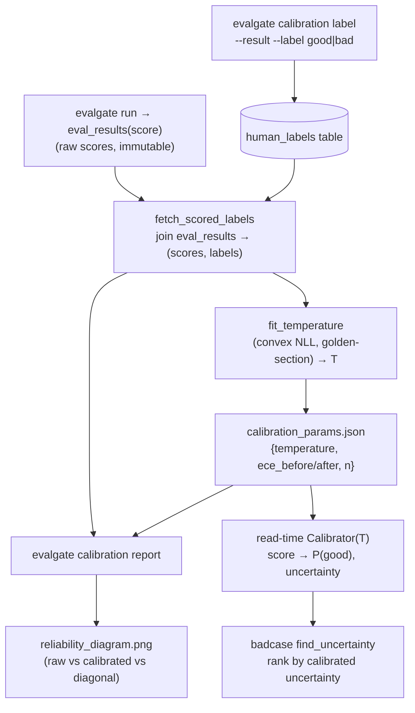
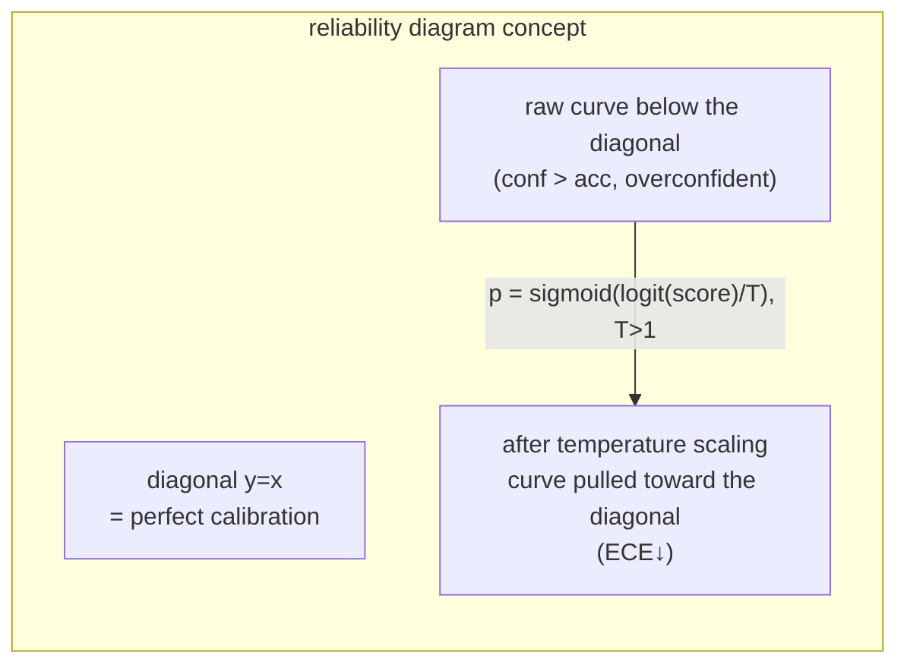

# Judge Calibration · ECE + temperature scaling

## In one sentence

Make the judge `score` a number you can read as a probability: if the judge says 0.8, that should mean "a human would call this good with about 80% probability." We use one-parameter **temperature scaling** (Guo et al. 2017; a single parameter that pushes scores toward/away from 0.5) to align `score → P(good)` with binary human labels, measure alignment with **ECE** (Expected Calibration Error) **/ MCE + a reliability diagram**, and derive a **calibrated uncertainty** (`1 − |2p−1|`, max at `p=0.5`) for BadCase active-learning sampling rank.

## Data flow



## Statistical design (core)

### Calibration target and transform

Treat `score` as an uncalibrated logit of P(good). Calibration formula `p = sigmoid(logit(score) / T)`:

- `T>1`: pull scores toward 0.5 → the judge was originally **overconfident**.
- `T<1`: push toward the extremes → the judge was originally **underconfident**.
- `T=1`: identity, no change.

### Fit: one-parameter convex optimization

Minimize logistic **NLL** (negative log-likelihood) on the labeled set. With `w = 1/T` as the variable, the loss is:

`NLL(w) = mean[ y·softplus(−w·z) + (1−y)·softplus(w·z) ]`, where `z = logit(score)`.

This is essentially **single-feature, no-intercept logistic regression**, **strictly convex** in `w`, so a 1-D **golden-section** search (`w ∈ [0.05, 20]`) finds the global optimum with no gradients. Guard: labels must contain both classes and `n ≥ 10`, else return `T=1.0` (do not move without enough signal).

### Metrics: ECE / MCE / reliability diagram

Equal-width 10 bins. Drop each `(score, label)` into a bin by score:

- **ECE**: `Σ (|bin|/N)·|acc − conf|`—weighted average of per-bin "confidence vs actual pass rate" gaps.
- **MCE**: `max |acc − conf|`—the worst bin.
- **reliability_curve**: per non-empty bin `(mean_confidence, mean_accuracy, count)`. Perfect calibration has `acc == conf` in every bin, points on the diagonal; below the diagonal = overconfident, above = underconfident.



### Calibrated uncertainty

`uncertainty(score) = 1 − |2·p − 1|`, max 1 at calibrated probability `p=0.5` (the decision boundary). That is the correct active-learning sampling signal once scores are probabilities.

> Important: temperature scaling is a **monotonic** transform; it does not change the ranking of `|score−0.5|`. Its value is not "re-rank raw scores," but **replacing** the `judge_confidence` heuristic badcase uses today, which is uncorrelated with true ambiguity.

Implementation footnote: numpy only, so `sigmoid` uses a stable `tanh` form, `logit` clips with eps (0/1 scores → finite logit), NLL uses `logaddexp` for a stable softplus. Today's `judge_confidence` ([multi_judge.py](../src/evalgate/judge/multi_judge.py) L68-74) is only a heuristic variance proxy—**not a probability**; calibration targets `score`.

## Technical choices

> See [DECISIONS.md](../DECISIONS.md) ADR-013. Interview-style fork → choice → cost.

| Fork | Choice | Alternative | Why / cost |
| --- | --- | --- | --- |
| What to calibrate | **`score`** | heuristic `judge_confidence` | `score` is the target signal—"judge says 0.8 = 80% pass rate" is about it; `judge_confidence` is a variance proxy that never claimed to be a probability; calibrating a non-probability is meaningless. |
| Method | **temperature scaling** (one parameter) | **Platt scaling / isotonic regression** | one parameter, convex, smallest labeled-set requirement; the standard reliability-calibration baseline (Guo et al. 2013/2017); fits "human labels are expensive, use as few as possible." Platt adds an intercept; isotonic is nonparametric, hungrier, overfits small label sets. |
| Where labels live | **new DB table `human_labels`** (soft ref `eval_result_id`, no FK) | JSON file | a DB table can join `eval_results`, filter by run, and query, matching the existing persistence paradigm; more importantly it is **also the data source for later Cohen's kappa (judge vs human agreement)**—one table feeds two phases. Soft refs let labels survive result deletion. |
| Where calibration is applied | **read-time, pure `Calibrator`** | persist a calibrated score at eval time | continue "store raw, transform on read": raw scores are immutable; the calibration curve can be refit / replaced without re-running the judge; runner unchanged; no column ambiguity about "which is raw, which is calibrated." |

**Known costs**: a monotonic transform does not re-rank raw scores (see above), so the badcase recall comparison is "calibrated uncertainty vs heuristic confidence," not "re-ranked scores"; currently a **single global T** (the params JSON shape already reserves per-task-type / per-judge multi-curve space—**landed in Phase 17**, see [PHASE_17_PLAN.md](./PHASE_17_PLAN.md) and ADR-016); new matplotlib dependency (only for the reliability diagram, Agg lazy-loaded; the pure stats path does not trigger it).

## Module layout (keep `report/` = pure stats, subpackage = orchestration)

- [src/evalgate/report/calibration.py](../src/evalgate/report/calibration.py) — pure engine, no DB/LLM: `_sigmoid`/`_logit`, `expected_calibration_error`/`max_calibration_error`, `reliability_curve`, `fit_temperature` (convex 1-D NLL + golden-section), `Calibrator` dataclass (`.transform`/`.uncertainty`/`to_dict`/`from_dict`), `evaluate_calibration` (before/after in one shot), `render_reliability_png` (lazy matplotlib; the module itself stays pure-stats testable).
- `src/evalgate/calibration/` — [repository.py](../src/evalgate/calibration/repository.py): `add_label`/`list_labels` (`human_labels` storage), `fetch_scored_labels` (join `eval_results`, `good→1`/`bad→0`, latest of multiple labels on the same result, skip unscored rows), `fit_and_save` (fit → write params JSON → return report), `compute_report` (read-time before/after), `load_calibrator` (read JSON, missing → None).

## Schema + DB + config

- [src/evalgate/core/schemas.py](../src/evalgate/core/schemas.py): `HumanLabel(StrEnum)` good/bad; `HumanLabelOut`; `ReliabilityBin`; `CalibrationReport` (`n, n_bins, temperature, ece_before/after, mce_before/after, reliability_before/after`).
- [src/evalgate/db/models.py](../src/evalgate/db/models.py): `HumanLabelRow` (`id`, `eval_result_id` soft ref + index, `label`, `annotator`, `note`, `created_at`)—no FK, following the `eval_results` soft-ref convention (labels must survive result deletion).
- [migration 0014](../src/evalgate/db/migrations/versions/0014_create_human_labels.py) (`down_revision` `0013`): create table + index; `downgrade` drops the table.
- [src/evalgate/core/config.py](../src/evalgate/core/config.py): `calibration_params_path` (default `calibration_params.json`, alias `EVALGATE_CALIBRATION_PARAMS_PATH`).

## BadCase integration

[src/evalgate/badcase/finder.py](../src/evalgate/badcase/finder.py): `find_uncertainty(..., calibrator=None)`—when `calibrator` is passed, rank by **calibrated uncertainty descending** (reason writes `calibrated_uncertainty=... (p_good=...)`); without it, keep original `judge_confidence ASC NULLS LAST` (opt-in, does not disturb existing callers). `find`/`find_llm` pass through unchanged.

## CLI

[cli.py](../src/evalgate/cli.py) `_add_calibration_subcommands` (mirrors `_add_adversarial_subcommands`):

```bash
# 1) human-label a result (good→1 / bad→0)
evalgate calibration label --result <eval_result_id> --label good

# 2) fit temperature on the labeled set, write calibration_params.json
evalgate calibration fit [--run <run_id>] [--out calibration_params.json]
#   prints {params_path, n, temperature, ece_before, ece_after, mce_before, mce_after}

# 3) before/after report + reliability plot
evalgate calibration report [--run <id>] [--params P] [--plot reliability.png]

# 4) badcase ranked by calibrated uncertainty (replaces heuristic confidence)
evalgate badcase list --strategy uncertainty --calibration calibration_params.json
```

Exit codes follow convention: `0` ok / `1` expected absence (e.g. labeled target result does not exist) / `2` error (e.g. labeled set too degenerate to fit).

## Verification strategy

Core assertion: construct systematically overconfident synthetic scores, `ece_before ≥ 0.15` → fit yields `T > 1` → `ece_after ≤ 0.05`; and verify that when `judge_confidence` is uncorrelated with true ambiguity, ranking by calibrated uncertainty recalls more truly near-boundary cases in top-K.

> Offline note: the mock judge returns a flat `0.5` on every case (zero information), so a calibration demo cannot run on it. Smoke therefore drives the pure engine directly with seeded, deliberately overconfident `(score, label)` pairs—exactly the shape of a real labeled set.
