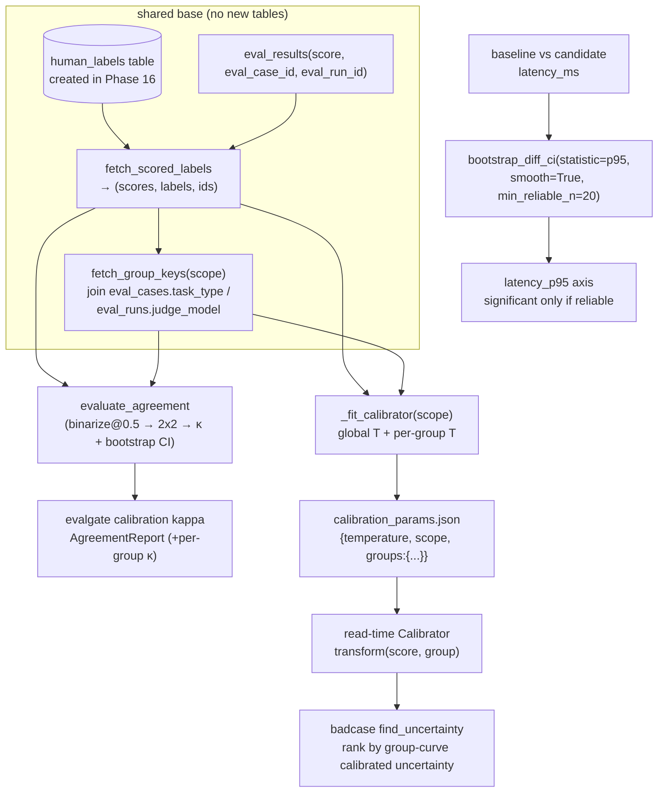

# Judge Agreement + Significance/Calibration follow-through · Cohen's κ · guarded p95 · conditional calibration

## In one sentence

Phase 17 closes three related statistical leftovers: (1) quantify agreement between the judge's binary decision and human labels with **Cohen's κ** (Cohen 1960: "agreed" minus "agreed by chance"), targeting ~0.85 from the design doc; (2) upgrade the gate's **p95 tail-latency significance** from a "bare bootstrap whose resampling interpretation is subtle" to a **smoothed + sample-size-guarded** bootstrap (paying down ADR-004 tech debt); (3) extend Phase 16's **single global temperature** into **conditional calibration curves by `task_type` / `judge_model`** (pick T by group at read time, landing the reserved-but-unimplemented extension from ADR-013). All three reuse the existing `human_labels` table and existing bootstrap/temperature engines—**zero new migrations**.

## Data flow



## Statistical design (core)

### ① Cohen's κ: judge vs human agreement

Binarize the judge `score` at a **decision threshold** `threshold` (default 0.5) into a good/bad decision, pair with human good/bad labels into a 2×2 confusion table `(tp, fp, fn, tn)`:

- **Observed agreement** `p_o = (tp + tn) / n`.
- **Expected (chance) agreement** `p_e = j₊·h₊ + (1−j₊)(1−h₊)`, where `j₊ / h₊` are judge / human "call good" rates (margins).
- **κ = (p_o − p_e) / (1 − p_e)**: 1 = perfect, 0 = chance level, <0 = worse than chance. Degenerate guard: when `p_e ≥ 1` (both raters always the same class) κ is undefined; by convention return 1 if they fully agree, else 0.
- **bootstrap CI**: resample `(judge, human)` pairs 1000 times, take 95% percentiles of the κ distribution—the same resampling idea as gate significance, asking whether "κ is stably above chance."

> Why κ rather than accuracy: accuracy is inflated by the majority class under imbalance (if both judge and human tend to say good, guessing gets you 80% accuracy); κ subtracts that "by chance" component and is the honest measure of **whether the judge can replace a human**. That is the same ruler as the design-doc talking point "κ vs human ~0.85, approaching the double-human ceiling."

### ② p95 significance follow-through: smoothing + sample-size guard (ADR-004 debt)

ADR-004 v1 put the p95 axis "on a threshold first," noting "resampling p95 is subtle to interpret; leave for Phase 17." The subtlety: **a bare nonparametric bootstrap of a high quantile only reshuffles the same 1–2 tail order statistics**, so the CI is discrete/lumpy with under-coverage, worse at small n. Two standard fixes, both applied:

- **Smoothed bootstrap (`smooth=True`)**: each resample adds kernel noise `N(0, h²)` with Silverman's rule of thumb `h = 0.9·σ·n^(−1/5)`. Smear the discrete empirical CDF into a continuous one, giving the tail quantile a more stable, better-covered CI.
- **Reliability guard (`min_reliable_n`)**: below the sample-size threshold (gate uses **20**, roughly the minimum tail support for one observation past the 95th percentile), mark `reliable=False` and **force `significant=False`**—an axis whose tail is too thin **never false-blocks a PR** (exactly why ADR-004 exists).

Keep the 10% relative tolerance band as belt-and-suspenders; significance is now "smoothed bootstrap CI does not contain 0 **and** reliable," not a bare threshold.

### ③ Conditional calibration: per-`task_type` / per-`judge_model` temperature

Judges are often overconfident on one task class and well-calibrated on another (same across judge models); a single global T leaves ECE between groups. Phase 17 generalizes `Calibrator` into a **family of temperatures with groups**:

- At fit: first fit a global `temperature` on **everyone** (read-time fallback), then fit a T per **data-sufficient** group (same `n ≥ 10` + both-classes bar); thin groups get no independent curve and fall back to global T at read time.
- At read: `Calibrator.transform(score, group)` picks T by `group`; unseen/thin groups fall back to global—with `scope="global"` behavior is byte-identical to Phase 16 (strict backward compatibility).
- Badcase: when the calibrator is not global scope, `find_uncertainty` joins each row's group key and ranks by **that curve's** calibrated uncertainty (reason appends e.g. `[task_type=rag]`).

New `calibration_params.json` shape (`groups` empty ≡ old global file):

```json
{ "temperature": 3.14, "scope": "task_type",
  "groups": { "rag":   {"temperature": 2.41, "n": 400, "ece_before": 0.16, "ece_after": 0.03},
              "agent": {"temperature": 3.78, "n": 400, "ece_before": 0.19, "ece_after": 0.03} },
  "n": 800, "ece_before": 0.17, "ece_after": 0.03, "fitted_at": "..." }
```

## Technical choices

> See [DECISIONS.md](../DECISIONS.md) ADR-014 / 015 / 016. Interview-style fork → choice → cost.

| Fork | Choice | Alternative | Why / cost |
| --- | --- | --- | --- |
| Agreement metric | **Cohen's κ** | raw accuracy / F1 | κ subtracts chance agreement and is honest under class imbalance; cost is needing a "judge binary decision" step (threshold `score`). |
| κ label source | **reuse `human_labels`** | new table | ADR-013 already designed this table to "feed two phases"; κ takes `(score, label)` from `fetch_scored_labels` directly—zero new migration, zero new storage. |
| Judge decision | **`score ≥ threshold` (default 0.5, tunable)** | learn a decision threshold | gate pass semantics already are "score over the line"; using the same line is most coherent; `--threshold` adapts "good" per task. |
| p95 significance | **smoothed + sample-guarded bootstrap** | pure threshold / bare bootstrap / studentized bootstrap | smoothing fixes tail-quantile discreteness; the guard prevents small-n false-blocks; simpler than studentized, no need to estimate variance of variance. Cost: bandwidth is an approximation and CIs are slightly wide (conservative—which is what the gate wants). |
| Calibration grouping | **three levels: `global` / `task_type` / `judge_model`** | Cartesian (task×judge) | task_type / judge_model are the two big heterogeneity sources and the granularity the data can support; a Cartesian product thins labels per cell until they cannot fit. Thin groups always fall back to global T. |
| When group info is fetched | **read-time join** (task_type ← eval_cases, judge_model ← eval_runs) | write group onto result rows at fit | continue "store raw, transform on read": no new `eval_results` columns; curves can be refit under a new scope anytime. Cost: badcase read path adds one or two `IN (...)` queries. |

**Known costs**: κ depends on the decision threshold (default 0.5, coherent with gate semantics but not universally optimal); smoothed-bootstrap bandwidth is a rule of thumb and CIs are conservative; conditional-calibration's group bar still uses `n ≥ 10`, so sparse labels mean most groups fall back to global T (then equivalent to Phase 16).

## Module layout (keep `report/` = pure stats, subpackage = orchestration)

- [src/evalgate/report/agreement.py](../src/evalgate/report/agreement.py) — **new** pure engine: `binarize_scores`, `confusion_counts`/`Confusion`, `cohen_kappa`, `evaluate_agreement` (κ + confusion + margins + bootstrap CI); numpy only, no DB/LLM; isomorphic to `calibration.py`.
- [src/evalgate/report/significance.py](../src/evalgate/report/significance.py) — `bootstrap_diff_ci` adds `smooth` / `min_reliable_n`; `BootstrapResult` adds `reliable` / `n_effective`; `_silverman_bandwidth` / `_resample` smoothing kernel. Mean-axis default behavior unchanged.
- [src/evalgate/report/calibration.py](../src/evalgate/report/calibration.py) — `Calibrator` adds `scope` / `group_temperatures` + `temperature_for` / `transform(…, group)` / `transform_array(…, groups)`; `from_dict` accepts old files and the new `groups` shape; `evaluate_calibration(…, groups=)`.
- [src/evalgate/report/multi_axis.py](../src/evalgate/report/multi_axis.py) — `latency_p95` axis uses `smooth=True, min_reliable_n=P95_MIN_RELIABLE_N(=20)`; mean axes unchanged.
- [src/evalgate/calibration/repository.py](../src/evalgate/calibration/repository.py) — `group_keys_for_rows` / `fetch_group_keys` (join group keys), `_fit_calibrator` (global + per-group fit), `fit_and_save(scope=)` / `compute_report(scope=)`, **new** `compute_agreement(run_id, threshold, scope)`.
- [src/evalgate/badcase/finder.py](../src/evalgate/badcase/finder.py) — `find_uncertainty` ranks by group curves when scope is not global.

## Schema

- [src/evalgate/core/schemas.py](../src/evalgate/core/schemas.py): `CalibrationGroup` (per-group temperature + ECE) + `CalibrationReport` adds `scope` / `groups`; **new** `AgreementGroup` + `AgreementReport` (κ, observed/expected agreement, CI, both positive rates, four confusion cells, `scope` / `groups`).

## CLI

Keep `_add_calibration_subcommands` (one table feeds two phases → same command group):

```bash
# κ: judge decision vs human-label agreement (optional grouping + tunable threshold)
evalgate calibration kappa [--run <id>] [--threshold 0.5] [--scope task_type|judge_model]
#   prints {n, threshold, cohen_kappa, ci_low/high, observed/expected_agreement, tp/fp/fn/tn, groups}

# conditional calibration: fit multiple curves by group
evalgate calibration fit --scope task_type [--out calibration_params.json]
#   prints {scope, temperature (global fallback), groups:{rag:{temperature,n,ece_after}, ...}}

# report / badcase auto-detect scope in the params file and pick T by group at read time
evalgate calibration report --params calibration_params.json
evalgate badcase list --strategy uncertainty --calibration calibration_params.json
```

Exit codes follow convention: `0` ok / `1` expected absence / `2` error (e.g. no labels to compute κ / fit).

## Verification strategy

- **κ engine** ([test_agreement_stats.py](../tests/test_agreement_stats.py)): perfect agreement → κ=1; chance level → κ≈0; degenerate single class → convention 1/0; bootstrap CI covers the point estimate and `ci_low>0` under strong agreement.
- **κ orchestration/CLI** ([test_agreement_repository.py](../tests/test_agreement_repository.py)): `compute_agreement` global + per-`task_type`; no labels raise `InsufficientLabelsError`; `calibration kappa` CLI e2e.
- **p95 guard** ([test_significance_bootstrap.py](../tests/test_significance_bootstrap.py)): true tail regression with enough data is `significant & reliable`; 8-sample tail is `reliable=False & significant=False` (no false-block); mean axis still `reliable` by default.
- **Conditional calibration** ([test_calibration_stats.py](../tests/test_calibration_stats.py) / [test_calibration_repository.py](../tests/test_calibration_repository.py) / [test_calibration_cli.py](../tests/test_calibration_cli.py) / [test_badcase_calibrated.py](../tests/test_badcase_calibrated.py)): group T selection + global fallback, dict round-trip, per-`task_type` multi-curve fit, badcase ranked by group curves.
- **Offline smoke**: `make kappa-smoke` ([scripts/phase17_kappa_smoke.py](../scripts/phase17_kappa_smoke.py)) runs three things once on seeded synthetic data—κ≈0.82 with CI above 0, true p95 regression significant while a thin sample is not, conditional-calibration ECE ≤ global ECE.

> Offline note: same honest trade-off as Phases 15/16—the mock judge always returns 0.5 (zero information, zero variance), so κ / significance / calibration demos cannot run on it. Smoke therefore drives the pure engines with seeded data, which is the shape of a real labeled set / real latency sample.
