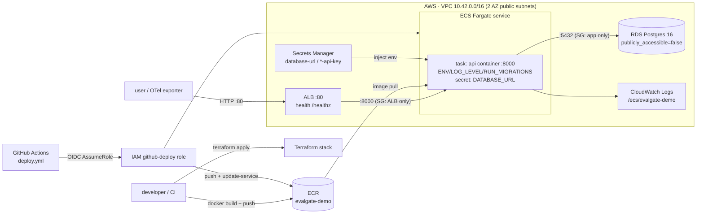

# Cloud Deploy · AWS ECS Fargate + RDS · Terraform stack · GitHub OIDC publish

## In one sentence

Phase 18 delivers the "production demo" half that stayed TODO in the design doc: **Terraform** stands up a managed **AWS ECS Fargate + RDS Postgres + ALB** stack in one shot; the image is a **multi-stage / non-root / HEALTHCHECK** production image (`serve` / `migrate` dual entrypoints); publish uses **GitHub OIDC** (zero long-lived keys) via `update-service --force-new-deployment`. Deliberately use a **single public-subnet layer to skip a NAT gateway**, inject DATABASE_URL via **Secrets Manager**, and run migrations by default on service-task start—**without changing a line of application code** (reuse the existing `/healthz` and `DATABASE_URL` contracts).

## Data flow (deploy topology)



## Choices (core)

> See [DECISIONS.md](../DECISIONS.md) ADR-017. Interview-style fork → choice → cost.

| Fork | Choice | Alternative | Why / cost |
| --- | --- | --- | --- |
| Container orchestration | **ECS Fargate** | EKS / bare EC2 / App Runner | no node/control-plane ops, billed per task, first-class AWS citizen; an order of magnitude simpler than EKS, matching "single-service demo you can explain on a resume." Cost: less portable than the K8s ecosystem, not cross-cloud. |
| IaC | **Terraform** | CloudFormation / CDK / click-ops | declarative, cross-cloud, and a common resume skill; HCL can validate the whole stack offline via `terraform validate`. Cost: you own state (S3+DynamoDB backend comments are provided). |
| Network | **single public-subnet layer (no NAT)** | private app/RDS + NAT gateway | NAT is always-on (~$32/mo) and adds no real security for a single-service demo—SGs already lock inbound to ALB→app and app→RDS; RDS stays `publicly_accessible=false`. Cost: not a production end-state; README documents the private+NAT upgrade path. |
| CI publish auth | **GitHub OIDC AssumeRole** | store AK/SK in repo secrets | zero long-lived keys in the repo; trust policy `sub=repo:owner/repo:*` + permissions narrowed to ECR push / ECS publish / PassRole. Cost: one OIDC provider per account (`create_github_oidc` flag to create or reuse). |
| DB password | **random generation + Secrets Manager inject** | plaintext in task def / tfvars | DATABASE_URL is assembled in Terraform from the RDS endpoint + `random_password`, stored as a secret, injected via ECS `secrets`—plaintext DSN never lands in the task definition or state outputs. |
| Where migrations run | **default: on service-task start** (`RUN_MIGRATIONS=true`) | one-shot task only / manual | `desired_count=1` has no race, "usable after apply"; `desired_count>1` switches to a one-shot `migrate` task (`run_migrations.sh`) so N tasks do not race. Both paths exist. |
| Image | **multi-stage + non-root + HEALTHCHECK** | single-stage root image | builder installs deps; runtime copies only venv/source; run as `appuser` (uid 10001); one `/healthz` probe feeds container/ALB/ECS. Cost: still ships streamlit/ragas and other heavy deps the API runtime does not need (extras not split; listed as a known cost). |

## Module layout

- [Dockerfile](../Dockerfile) — rewritten as **builder → runtime two-stage**: builder `uv sync --frozen --no-dev` installs the venv; runtime copies venv + `src` + `alembic.ini` + entrypoint, installs curl for HEALTHCHECK, creates `appuser` non-root, `ENTRYPOINT docker-entrypoint.sh` / `CMD serve`.
- [docker-entrypoint.sh](../docker-entrypoint.sh) — `serve` (optional `alembic upgrade head` then uvicorn) / `migrate` (run migrations and exit) / else exec passthrough; `set -euo pipefail`.
- [docker-compose.yml](../docker-compose.yml) — api service gets `RUN_MIGRATIONS=true` so local containers auto-create tables (dev convenience, single task, no race); db flow unchanged.
- [deploy/terraform/](../deploy/terraform/) — full stack: `versions`/`variables`/`main` (provider+locals)/`network` (VPC+SG)/`ecr`/`rds`/`secrets`/`iam`/`alb`/`ecs`/`oidc`/`outputs` + `terraform.tfvars.example` + `README.md`.
- [deploy/scripts/](../deploy/scripts/) — `build_and_push.sh` (parse ECR/region from TF outputs, build+push dual tags), `deploy.sh` (push + force-new-deployment + wait stable), `run_migrations.sh` (one-shot `migrate` Fargate task).
- [.github/workflows/deploy.yml](../.github/workflows/deploy.yml) — `workflow_dispatch` manual trigger, OIDC assume role, build→push ECR→`update-service`→`wait services-stable`.
- [Makefile](../Makefile) — `docker-build` / `tf-init` / `tf-plan` / `tf-apply` / `tf-destroy` / `deploy` / `deploy-migrate`.

## One-shot go-live path

```bash
# 1) stand up the cloud stack (VPC + RDS + ECS + ALB + ECR)
cd deploy/terraform && cp terraform.tfvars.example terraform.tfvars   # edit as needed
make tf-init && make tf-apply

# 2) build and push the image, roll the service (migrations on task start, RUN_MIGRATIONS=true)
make deploy

# 3) smoke
curl "$(terraform -chdir=deploy/terraform output -raw alb_url)/healthz"

# when desired_count>1, use a one-shot migrate task instead of on-task migrate
make deploy-migrate
```

CI publish (`deploy.yml`) first creates the role in Terraform with `create_github_oidc=true`, then fills five Actions variables (`AWS_REGION` / `AWS_DEPLOY_ROLE_ARN` / `ECR_REPOSITORY` / `ECS_CLUSTER` / `ECS_SERVICE`, all TF outputs).

## Verification strategy (offline, no AWS spend)

- **Terraform**: `terraform fmt -recursive -check` clean, `terraform validate` passes (validates the whole stack against the AWS provider schema; 10 `.tf` files green).
- **Image/orchestration**: `docker compose config` passes; `docker-entrypoint.sh` and the three deploy scripts pass `bash -n` syntax checks.
- **Not done**: no `terraform apply` against a real AWS account—this round has no cloud credentials and deliberately incurs no spend. Real apply / CI publish wait for an account and follow the path above; application side is zero-change (reuse `/healthz` + `DATABASE_URL`); residual risk sits in IaC and IAM, mostly covered by `validate` + a narrow-permission policy.

> Same "offline honest trade-off" as earlier phases: this phase's artifacts are IaC + a publish pipeline; everything that can be validated offline (HCL semantics, image/script syntax, compose) is green; the step that actually spends money is left explicit for the user and is not triggered locally or in CI.
