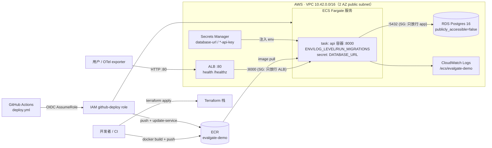

# Cloud Deploy · AWS ECS Fargate + RDS · Terraform 起栈 · GitHub OIDC 发布

## 一句话

Phase 18 把设计文档里一直是 TODO 的"生产 demo"那半兑现：用 **Terraform** 一键起 **AWS ECS Fargate + RDS Postgres + ALB** 的托管栈，镜像做成**多阶段 / 非 root / 带 HEALTHCHECK** 的生产镜像（`serve` / `migrate` 双入口），发布走 **GitHub OIDC**（零长期密钥）的 `update-service --force-new-deployment`。刻意用**单层 public subnet 省掉 NAT gateway**、DATABASE_URL 经 **Secrets Manager** 注入、迁移默认随服务任务启动——全程**不改一行应用代码**（复用既有 `/healthz` 与 `DATABASE_URL` 契约）。

## 数据流（部署拓扑）



## 抉择（核心）

> 见 [DECISIONS.md](../DECISIONS.md) ADR-017。下面是面试视角的"岔路 → 选择 → 代价"。

| 岔路 | 选择 | 备选 | 为什么 / 代价 |
| --- | --- | --- | --- |
| 容器编排 | **ECS Fargate** | EKS / 裸 EC2 / App Runner | 无 node/控制面运维、按任务计费、AWS 一等公民；比 EKS 简单一个数量级，正好匹配"单服务 demo + 简历讲得清"。代价：不如 K8s 生态通用、跨云不可移植。 |
| IaC | **Terraform** | CloudFormation / CDK / 手点 | 声明式、跨云通用、简历高频；HCL 通过 `terraform validate` 就能离线校验整栈。代价：state 要自己管（给了 S3+DynamoDB backend 注释）。 |
| 网络 | **单层 public subnet（无 NAT）** | 私网 app/RDS + NAT gateway | NAT 常驻计费（~$32/mo）且对单服务 demo 无实质安全增益——SG 已把入站锁到 ALB→app、app→RDS；RDS 仍 `publicly_accessible=false`。代价：非生产终局，README 标了切私网+NAT 的升级路径。 |
| CI 发布鉴权 | **GitHub OIDC AssumeRole** | 存 AK/SK 到 repo secret | 仓库零长期密钥；trust policy `sub=repo:owner/repo:*` + 权限窄到只够 ECR push / ECS 发布 / PassRole。代价：OIDC provider 每账号一个（`create_github_oidc` 开关可选建/复用）。 |
| DB 口令 | **随机生成 + Secrets Manager 注入** | 明文写进任务定义/tfvars | DATABASE_URL 在 Terraform 内用 RDS endpoint + `random_password` 组装存 secret，ECS 以 `secrets` 注入——明文 DSN 不落任务定义、不落 state 输出。 |
| 迁移在哪跑 | **默认随服务任务启动**（`RUN_MIGRATIONS=true`） | 只用一次性任务 / 手动 | `desired_count=1` 无竞态，"apply 完即可用"；`desired_count>1` 改用一次性 `migrate` 任务（`run_migrations.sh`）防 N 任务竞争。两条路都留。 |
| 镜像 | **多阶段 + 非 root + HEALTHCHECK** | 单阶段 root 镜像 | builder 装依赖、runtime 只搬 venv/源码，`appuser`(uid 10001) 运行；`/healthz` 一个探针喂容器/ALB/ECS 三处。代价：仍带 streamlit/ragas 等 API 运行期用不到的重依赖（未拆 extras，列为已知代价）。 |

## 模块布局

- [Dockerfile](../Dockerfile) —— 重写为 **builder → runtime 两阶段**：builder `uv sync --frozen --no-dev` 装 venv；runtime 搬 venv + `src` + `alembic.ini` + entrypoint，装 curl 供 HEALTHCHECK，建 `appuser` 非 root 运行，`ENTRYPOINT docker-entrypoint.sh` / `CMD serve`。
- [docker-entrypoint.sh](../docker-entrypoint.sh) —— `serve`（可选先 `alembic upgrade head`，再 uvicorn）/ `migrate`（只跑迁移退出）/ 其余 exec 透传；`set -euo pipefail`。
- [docker-compose.yml](../docker-compose.yml) —— api 服务加 `RUN_MIGRATIONS=true`，本地起容器即自动建表（dev 便利，单任务无竞态）；db 流程不变。
- [deploy/terraform/](../deploy/terraform/) —— 全栈：`versions`/`variables`/`main`（provider+locals）/`network`（VPC+SG）/`ecr`/`rds`/`secrets`/`iam`/`alb`/`ecs`/`oidc`/`outputs` + `terraform.tfvars.example` + `README.md`。
- [deploy/scripts/](../deploy/scripts/) —— `build_and_push.sh`（从 TF 输出解析 ECR/region，build+push 双 tag）、`deploy.sh`（push + force-new-deployment + wait stable）、`run_migrations.sh`（一次性 `migrate` Fargate 任务）。
- [.github/workflows/deploy.yml](../.github/workflows/deploy.yml) —— `workflow_dispatch` 手动触发，OIDC 假借 role，build→push ECR→`update-service`→`wait services-stable`。
- [Makefile](../Makefile) —— `docker-build` / `tf-init` / `tf-plan` / `tf-apply` / `tf-destroy` / `deploy` / `deploy-migrate`。

## 一次性上线路径

```bash
# 1) 起云栈（VPC + RDS + ECS + ALB + ECR）
cd deploy/terraform && cp terraform.tfvars.example terraform.tfvars   # 按需改
make tf-init && make tf-apply

# 2) 构建并推镜像，滚动服务（迁移随任务启动，RUN_MIGRATIONS=true）
make deploy

# 3) 冒烟
curl "$(terraform -chdir=deploy/terraform output -raw alb_url)/healthz"

# desired_count>1 时用一次性迁移任务代替随任务迁移
make deploy-migrate
```

CI 发布（`deploy.yml`）需先在 Terraform 里 `create_github_oidc=true` 建 role，再把 5 个 Actions 变量填好（`AWS_REGION` / `AWS_DEPLOY_ROLE_ARN` / `ECR_REPOSITORY` / `ECS_CLUSTER` / `ECS_SERVICE`，全是 TF 输出）。

## 验证策略（离线，无 AWS 费用）

- **Terraform**：`terraform fmt -recursive -check` 干净、`terraform validate` 通过（对 AWS provider schema 校验整栈，10 个 `.tf` 全绿）。
- **镜像/编排**：`docker compose config` 通过；`docker-entrypoint.sh` 与三个部署脚本 `bash -n` 语法校验通过。
- **未做**：未在真实 AWS 账号 `terraform apply`——本轮无云凭证且刻意不起费用。真 apply / CI 发布留待有账号时按上面路径执行；应用侧零改动（复用 `/healthz` + `DATABASE_URL`），风险集中在 IaC 与 IAM 权限，已由 `validate` + 窄权限 policy 兜住大部分。

> 与前几个 phase 的"离线诚实取舍"一脉相承：这一 phase 的产物是 IaC + 发布管线，能离线校验的（HCL 语义、镜像/脚本语法、compose）全部校验绿；真正需要花钱起资源的一步显式留给使用者，不在本机/CI 触发。
