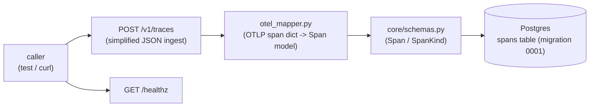
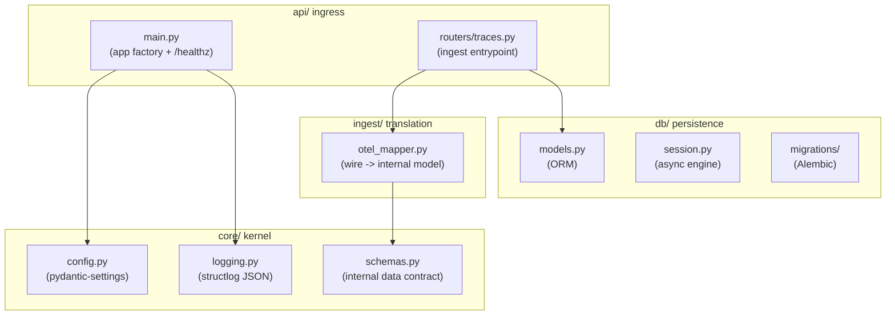

# Phase 1 · Walking Skeleton (FastAPI + DB + OTel mapper)

> Walking skeleton: at minimal cost, cut a vertical slice that can ingest a trace, persist it, and boot the service. This phase establishes layering and data contracts for every later phase; **feature completeness is not the goal**.

## Core idea

A minimal vertical slice runs through the stack: FastAPI app + async SQLAlchemy + an initial Alembic migration + a mapper that translates OTLP (OpenTelemetry wire protocol) spans into the internal `Span` model. Once the skeleton is in place, each later phase only adds to the matching layer—no structural reshuffle.

## Data-flow overview

## Layered architecture: `src/evalgate/`

Packages follow the path of data from wire (on-the-wire format) → DB → eval—a convention that runs through the whole project:

Layer responsibilities:

- `core/`: `config.py` (pydantic-settings: `DATABASE_URL` / `LOG_LEVEL` / `ENV`), `logging.py` (structlog structured JSON logs), `schemas.py` (internal data contract).
- `ingest/`: `otel_mapper.py` (the focus of this phase).
- `db/`: `models.py` (ORM), `session.py` (async engine + sessionmaker), `migrations/` (Alembic).
- `api/`: `main.py` (app factory + `/healthz`), `routers/traces.py` (ingest entrypoint).

## Internal schema: `core/schemas.py`

We deliberately **do not use OTLP protobuf as the internal model**—OTLP semantic conventions (OTel's field-naming norms) are still evolving; the internal model must stay stable. Define a pydantic v2 `Span`:

- `span_id` / `trace_id` (required) / `parent_span_id` (nullable) / `name` / `kind` (`SpanKind` enum: llm / tool / chain / retriever / other) / `start_time` / `end_time` (timezone-aware) / `attributes` (dict) / `status_code` / `status_message`.
- `model_config = ConfigDict(extra="ignore")`: extra OTLP fields do not blow up validation.
- `Trace` (`trace_id` + `list[Span]`) is reserved for later aggregation.

This is the **seam** between wire format and internal model: if the on-the-wire format changes, only the mapper changes; the DB schema and internal model stay put.

## OTel mapper: `ingest/otel_mapper.py` (focus of this phase)

`map_otel_span(raw: dict) -> Span` translates a single OTLP/OTel span dict into an internal `Span`. It is robust to **two input shapes**:

- A simplified flat dict (snake_case, friendly for tests / curl).
- An OTLP attribute key/value list (the protobuf-unpacked `[{key, value: {string_value|int_value|...}}]`). `_attrs_from_payload` flattens the AnyValue union (OTel's union for "value of any type") into a plain dict.

Error-handling highlights:

1. Missing `span_id` / `trace_id` → `ValueError` (reject ownerless spans).
2. Kind normalization: take `raw["kind"]` or `attributes["evalgate.kind"]`; unrecognized values always land on `SpanKind.other` (never throw).
3. Timestamps via `_parse_timestamp`: accept `datetime` / nanos (integer nanoseconds) / nanos-as-string / ISO-8601; naive (timezone-less) values get `UTC`; missing start/end → `ValueError`.
4. `status`: if a dict, take `code`/`message`; otherwise default `OK`.

The mapper is a **pure function with no I/O**—unit tests are fast and never touch the DB. The convention "map, don't rewrite; reuse" is kept in later phases (Phase 3's OTLP protobuf parser ultimately reuses this mapper too).

## DB layer: `db/models.py` + `db/session.py` + migration 0001

- `models.py`: `Base(DeclarativeBase)` + `SpanRow` (fields aligned with `Span`). JSON columns use `JsonType = JSON().with_variant(JSONB(), "postgresql")`—**Postgres uses JSONB (binary JSON, indexable); other dialects fall back to plain JSON**, so tests can run on SQLite while production gets JSONB.
- `session.py`: `create_async_engine` (asyncpg driver) + `async_sessionmaker(expire_on_commit=False)` + `get_session()` dependency. The engine is lazy-built; tests can inject via FastAPI `dependency_overrides`.
- `migrations/versions/0001_create_spans.py`: create the `spans` table (`attributes` as PG `JSONB` + `server_default '{}'::jsonb`) + `ix_spans_trace_id`; `down_revision = None` (head of the migration chain). Alembic `env.py` wires `Base.metadata` for online migrations.

## API: `api/main.py` + `api/routers/traces.py`

- `create_app()` app factory + `lifespan` (configure logging on startup, emit structured `api.startup` logs) + ASGI `app` + `run()` console-script (uvicorn).
- `GET /healthz` → `{"status": "ok", "version": ...}` for probes / CI / later UI health badges.
- `routers/traces.py`: `POST /v1/traces` simplified JSON ingest; calls `map_otel_span` to validate/translate. Persist logic is left as a seam for this phase (filled in when Phase 3 extracts `persistence.persist_spans`).

## Dependencies

Main: `fastapi` / `uvicorn` / `sqlalchemy[asyncio]>=2` / `asyncpg` / `alembic` / `pydantic>=2` / `pydantic-settings` / `structlog`. Dev: `pytest` / `pytest-asyncio` / `httpx` (test client) / `ruff`.

## Test strategy

Mapper coverage is pure-function unit tests for both input shapes plus timestamp/error paths. Endpoints use an in-memory FastAPI `TestClient` to exercise routing without a real Postgres. This split—"pure-function unit tests + in-memory endpoint tests"—carries through later phases.

## Technical choices

### 1. OTel/OTLP as the only wire protocol; no first-party SDK (ADR-001)

- **Alternative**: a first-party reporting SDK, as early LangSmith / Langfuse did—more metadata, smoother DX.
- **Choice**: all trace ingest is OTLP; we do not provide, and do not plan to provide, a first-party SDK. Apps install an `opentelemetry-instrumentation-*` package and are done.
- **Trade-off**: we get "zero app-side migration + no vendor lock-in"—the primary B2B selling point; customers can swap backends (Datadog / Honeycomb / Phoenix) at any time. The cost is less control over SDK DX; missing corner fields wait on upstream. The ingest path must also absorb "future-unknown attributes," which motivates JSONB storage (below). The seam that lands this is this phase's `otel_mapper.py`.

### 2. Postgres + JSONB, not NoSQL (ADR-002)

- **Alternative**: Mongo / DynamoDB and similar—OTel span `attributes` are schema-less key-value, a natural NoSQL fit.
- **Choice**: Postgres as primary store; schema-less fields (OTel attributes, judge raw output, tool args) live in JSONB columns; schema evolution is explicit Alembic migrations.
- **Trade-off**: EvalGate's core queries are "aggregate by tag / p95 over a time window / join eval_run × eval_case"—SQL strengths. JSONB is first-class on PG (GIN indexes, `->` / `->>` / `@>`). A single PG instance can hold tens of millions of traces; a 10^9-scale move to ClickHouse / hot-cold tiering can wait. The cost is that high-throughput OTLP ingest needs async + batch insert to keep up.

### 3. `with_variant` so production gets JSONB and tests skip Docker

- **Alternative**: run Postgres in tests too, for environment parity.
- **Choice**: `JSON().with_variant(JSONB(), "postgresql")`—JSONB on PG, plain JSON on SQLite/other dialects.
- **Trade-off**: one declaration; tests fly on in-memory SQLite with no Docker in CI; production still gets JSONB indexes. Later tables do not re-litigate this (Phase 3+ aiosqlite fixtures benefit directly). SQLite JSON querying is weaker than PG, but tests only check read/write connectivity, not JSONB operators.

### 4. Mapper as a pure function, robust to wire evolution

- **Choice**: flatten the 5-variant AnyValue plus multi-shape kind/timestamp tolerance, and concentrate all the messy work in one I/O-free pure function.
- **Trade-off**: we bet that "when OTLP fields change, we edit the mapper in one place" (ADR-001's core wager). Pure functions keep unit tests off the DB and deterministic. The cost is more branches inside the mapper, all exhaustively covered by tests.
