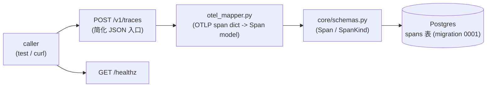
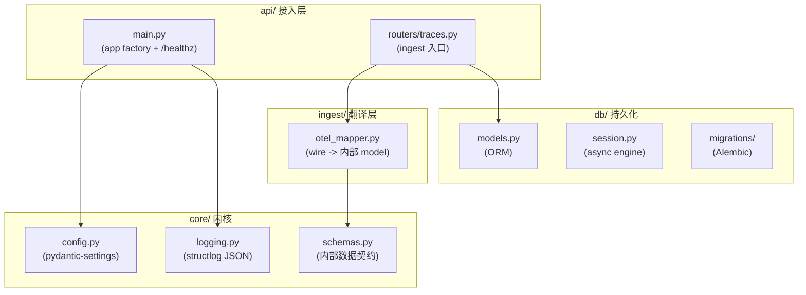

# Phase 1 · Walking Skeleton（FastAPI + DB + OTel mapper）

> Walking skeleton（行走骨架）：先用最小代价把"trace 进得来、能落库、服务起得来"这条竖切打通，为后续所有 phase 立好分层与数据契约，**不求功能完整**。

## 核心思路

一条最小竖切（vertical slice）贯穿全栈：FastAPI app + async SQLAlchemy + Alembic 初始 migration + 一个把 OTLP（OpenTelemetry 线协议）形态的 span 翻译成内部 `Span` model 的 mapper。骨架立好后，每个 phase 只往对应层加东西、不重排结构。

## 数据流总览

## 分层架构：`src/evalgate/`

按"数据从 wire（网络线上格式）→ DB → eval"的方向分包，是一条贯穿全项目的约定：

各层职责：

- `core/`：`config.py`（pydantic-settings：`DATABASE_URL` / `LOG_LEVEL` / `ENV`）、`logging.py`（structlog 结构化 JSON 日志）、`schemas.py`（内部数据契约）。
- `ingest/`：`otel_mapper.py`（本期核心）。
- `db/`：`models.py`（ORM）、`session.py`（async engine + sessionmaker）、`migrations/`（Alembic）。
- `api/`：`main.py`（app factory + `/healthz`）、`routers/traces.py`（ingest 入口）。

## 内部 schema：`core/schemas.py`

刻意**不把 OTLP protobuf 当内部模型**——OTLP semantic convention（语义约定，OTel 对字段命名的规范）还在演进，内部模型必须稳。定义 pydantic v2 `Span`：

- `span_id` / `trace_id`（必填）/ `parent_span_id`(nullable) / `name` / `kind`（`SpanKind` enum：llm / tool / chain / retriever / other）/ `start_time` / `end_time`（timezone-aware，带时区）/ `attributes`(dict) / `status_code` / `status_message`。
- `model_config = ConfigDict(extra="ignore")`：OTLP 多塞的字段不炸。
- `Trace`（`trace_id` + `list[Span]`）留作后续聚合用。

这是 wire format 与内部模型之间的**接缝（seam）**：未来线上格式怎么变只改 mapper，DB schema / 内部模型不动。

## OTel mapper：`ingest/otel_mapper.py`（本期核心）

`map_otel_span(raw: dict) -> Span`，把单个 OTLP/OTel span dict 翻译成内部 `Span`，对**两种输入形态**都鲁棒：

- 简化 flat dict（snake_case，测试 / curl 友好）。
- OTLP attribute key/value list（protobuf 解包后的 `[{key, value: {string_value|int_value|...}}]`），由 `_attrs_from_payload` 把 AnyValue union（OTel 用来装"任意类型值"的联合体）摊平成普通 dict。

容错要点：

1. `span_id` / `trace_id` 缺失 → `ValueError`（拒绝无主 span）。
2. `kind` 归一化：取 `raw["kind"]` 或 `attributes["evalgate.kind"]`，无法识别一律落 `SpanKind.other`（永不抛）。
3. 时间戳 `_parse_timestamp`：同时吃 `datetime` / nanos（纳秒整数）/ nanos-as-string / ISO-8601；naive（无时区）一律补 `UTC`；start/end 缺失 → `ValueError`。
4. `status`：dict 取 `code`/`message`，否则默认 `OK`。

mapper 是**纯函数、无 IO**，单测飞快、不碰 DB。"映射不重写、只复用"这条惯例后续 phase 一直保留（Phase 3 的 OTLP protobuf 解析最终也复用它）。

## DB 层：`db/models.py` + `db/session.py` + migration 0001

- `models.py`：`Base(DeclarativeBase)` + `SpanRow`（字段对齐 `Span`）。JSON 列用 `JsonType = JSON().with_variant(JSONB(), "postgresql")`——**PG 走 JSONB（Postgres 二进制 JSON 列，可建索引），其它方言 fallback 普通 JSON**，让测试能在 SQLite 上跑、生产享受 JSONB。
- `session.py`：`create_async_engine`（asyncpg 驱动）+ `async_sessionmaker(expire_on_commit=False)` + `get_session()` 依赖。engine 懒建，测试可用 FastAPI `dependency_overrides` 注入。
- `migrations/versions/0001_create_spans.py`：建 `spans` 表（`attributes` 用 PG `JSONB` + `server_default '{}'::jsonb`）+ `ix_spans_trace_id` 索引；`down_revision = None`（迁移链头）。Alembic `env.py` 接 `Base.metadata` 走 online migration。

## API：`api/main.py` + `api/routers/traces.py`

- `create_app()` app factory + `lifespan`（启动配 logging、打 `api.startup` 结构化日志）+ ASGI `app` + `run()` console-script（uvicorn）。
- `GET /healthz` → `{"status": "ok", "version": ...}`，给探活 / CI / 后续 UI 健康徽章用。
- `routers/traces.py`：`POST /v1/traces` 简化 JSON ingest 入口，调 `map_otel_span` 校验/翻译。本期写库逻辑先留接缝（Phase 3 抽出 `persistence.persist_spans` 时补全）。

## 依赖

主依赖：`fastapi` / `uvicorn` / `sqlalchemy[asyncio]>=2` / `asyncpg` / `alembic` / `pydantic>=2` / `pydantic-settings` / `structlog`。dev：`pytest` / `pytest-asyncio` / `httpx`（test client）/ `ruff`。

## 测试策略

mapper 用纯函数单测覆盖两种输入形态与时间戳/错误路径；端点用 in-memory FastAPI `TestClient` 走通路由，不依赖真 Postgres——这条"纯函数单测 + in-memory 端点测试"的分工贯穿后续 phase。

## 技术选型与抉择

### 1. OTel/OTLP 作为唯一 wire 协议，不做自家 SDK（ADR-001）

- **备选**：像 LangSmith / Langfuse 早期那样做自家上报 SDK——能塞更多 metadata、体验顺滑。
- **选择**：所有 trace ingest 走 OTLP，不提供也不计划提供自家 SDK；应用方装一个 `opentelemetry-instrumentation-*` 即可接入。
- **代价/收益**：换来"应用方零迁移 + 无 vendor lock-in（厂商锁定）"——这是 B 端工具的首要卖点，客户随时能换 backend（Datadog / Honeycomb / Phoenix）。代价是失去对 SDK 体验的精细控制，边角字段缺失要等上游；并且 ingest 路径必须能消化"未来不确定的 attribute"，于是引出 JSONB 列存（见下）。落地接缝就是本期的 `otel_mapper.py`。

### 2. Postgres + JSONB，而非 NoSQL（ADR-002）

- **备选**：Mongo / DynamoDB 等 NoSQL——OTel span 的 `attributes` 是 schema-less key-value，NoSQL 天然适配。
- **选择**：主存储用 Postgres；不固定 schema 的字段（OTel attributes、judge raw output、tool args）用 JSONB 列；schema 演进用 Alembic 显式 migration。
- **代价/收益**：EvalGate 的核心查询是"按 tag 聚合 / 按时间窗算 p95 / join eval_run × eval_case"，全是 SQL 强项；JSONB 在 PG 上是一等公民，可建 GIN 索引，`->` / `->>` / `@>` 都顺。单实例 PG 撑到几千万行 trace 不成问题，真到 10^9 量级再切 ClickHouse / 冷热分层也来得及。代价是高吞吐 OTLP ingest 要靠 async + batch insert 顶。

### 3. `with_variant` 同时满足"生产要 JSONB / 测试要免 Docker"

- **备选**：测试也起一个 Postgres 容器，保持环境一致。
- **选择**：`JSON().with_variant(JSONB(), "postgresql")`——PG 上是 JSONB，SQLite/其它方言降级普通 JSON。
- **代价/收益**：一处声明，测试在 in-memory SQLite 上飞快跑、CI 无需 Docker，生产仍享 JSONB 索引能力；避免后续每张表重复纠结这件事（Phase 3+ 的 aiosqlite fixture 直接受益）。代价是 SQLite 上 JSON 查询能力弱于 PG，但测试只验证读写连通性，不依赖 JSONB 算子。

### 4. mapper 设计成纯函数、对 wire 演进鲁棒

- **选择**：用 5-variant AnyValue 摊平 + kind/timestamp 多形态容错，把所有"脏活"集中在一个无 IO 的纯函数里。
- **代价/收益**：押注"未来 OTLP 字段变了，改 mapper 一处即可"（即 ADR-001 的核心赌注）；纯函数让单测不碰 DB、确定性强。代价是 mapper 内部分支较多，但都被单测穷举覆盖。
