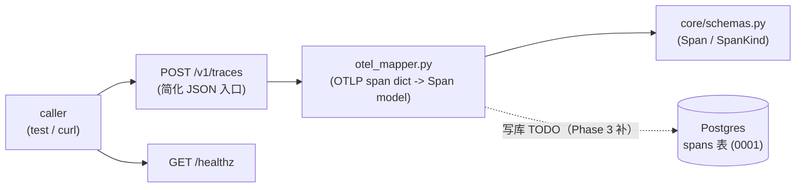

# Phase 1 技术方案 · Walking skeleton（FastAPI + DB + OTel mapper）

> 对应 [ROADMAP.md](ROADMAP.md) Phase 1。预估 1 人天 vibe coding。
> 本文档随实现演进；最终交付完成后只更新顶部状态行 + 在 [JOURNAL.md](../JOURNAL.md) 记里程碑。
>
> **历史快照说明**：本 plan 为回填补写（Phase 3+ 才开始每 phase 配 plan）。内容对齐 Phase 1 当时的实际交付与 commit `039d9fc`；后续 phase 已在此骨架上演进（`traces` 汇总表 / OTLP protobuf 端点是 Phase 3 加的，见 [PHASE_3_PLAN.md](PHASE_3_PLAN.md)），阅读时以"当时形态"理解。

**状态**：done（commit `039d9fc`，in-memory FastAPI 测试全绿，lint/format clean）

---

## 思路（一句话）

先把"trace 进得来、能落库、服务起得来"这条最小竖切打通——FastAPI app + async SQLAlchemy + Alembic 初始 migration + 一个把 OTLP 形态 span 翻译成内部 `Span` model 的 mapper——为后续所有 phase 立骨架，但**不求功能完整**。

## 数据流总览

---

## 1. 仓库内部结构：`src/evalgate/` 分层

按"数据从 wire 到 DB 到 eval"的方向分包，后续每个 phase 往对应层加东西，不重排：

- `core/`：`config.py`（pydantic-settings，`DATABASE_URL` / `LOG_LEVEL` / `ENV`）、`logging.py`（structlog JSON）、`schemas.py`（内部数据契约）。
- `ingest/`：`otel_mapper.py`（本期核心）。
- `db/`：`models.py`（ORM）、`session.py`(async engine + sessionmaker)、`migrations/`（Alembic）。
- `api/`：`main.py`（app factory + `/healthz`）、`routers/traces.py`（ingest 入口）。

## 2. 内部 schema：`src/evalgate/core/schemas.py`

不直接拿 OTLP protobuf 当内部模型——OTLP semantic convention 还在演进，**内部模型要稳**。定义 pydantic v2 `Span`：

- `span_id` / `trace_id`（必填）/ `parent_span_id`(nullable) / `name` / `kind`(`SpanKind` enum: llm / tool / chain / retriever / other) / `start_time` / `end_time`(timezone-aware) / `attributes`(dict) / `status_code` / `status_message`。
- `model_config = ConfigDict(extra="ignore")`：OTLP 多塞的字段不炸。
- `Trace`（`trace_id` + `list[Span]`）留作后续聚合用。

> 这是 ADR-001（拥抱 OTel 当 wire，不做自家 SDK）+ ADR-002（PG + JSONB）落地的接缝点：未来 wire format 怎么变只改 mapper，DB schema / 内部模型不动。

## 3. OTel mapper：`src/evalgate/ingest/otel_mapper.py`（本期核心）

`map_otel_span(raw: dict) -> Span`，把单个 OTLP/OTel span dict 翻译成内部 `Span`。设计成对**两种输入形态**都鲁棒：

- 简化 flat dict（snake_case，测试 / curl 友好）。
- OTLP attribute key/value list（protobuf unwrap 后的 `[{key, value: {string_value|int_value|...}}]`），由 `_attrs_from_payload` 把 AnyValue union 摊平成普通 dict。

要点：

1. `span_id` / `trace_id` 缺失 → `ValueError`（拒绝无主 span）。
2. `kind` 归一化：取 `raw["kind"]` 或 `attributes["evalgate.kind"]`，无法识别一律落 `SpanKind.other`（永不抛）。
3. 时间戳 `_parse_timestamp`：同时吃 `datetime` / nanos 整数 / nanos-as-string / ISO-8601；naive 一律补 `UTC`；start/end 缺失 → `ValueError`。
4. `status`：dict 取 `code`/`message`，否则默认 `OK`。

> **mapper 是纯函数、无 IO**，所以单测飞快、不碰 DB。这条"映射不重写"的惯例后续 phase 一直保留（Phase 3 的 OTLP protobuf 解析最终也复用它）。

## 4. DB 层：`db/models.py` + `db/session.py` + 0001 migration

- `models.py`：`Base(DeclarativeBase)` + `SpanRow`（字段对齐 `Span`）。JSON 列用 `JsonType = JSON().with_variant(JSONB(), "postgresql")`——**PG 走 JSONB，其它方言 fallback 普通 JSON**，让测试能在 SQLite 上跑、生产享受 JSONB。
- `session.py`：`create_async_engine`（asyncpg）+ `async_sessionmaker(expire_on_commit=False)` + `get_session()` 依赖。engine 懒建，测试可用 FastAPI `dependency_overrides` 注入。
- [migrations/versions/0001_create_spans.py](../src/evalgate/db/migrations/versions/0001_create_spans.py)：建 `spans` 表（`attributes` 用 PG `JSONB` + `server_default '{}'::jsonb`）+ `ix_spans_trace_id` 索引；`down_revision = None`（链头）。Alembic `env.py` 接 `Base.metadata` 走 online migration。

## 5. API：`api/main.py` + `api/routers/traces.py`

- `create_app()` app factory + `lifespan`（启动配 logging、打 `api.startup` 结构化日志）+ ASGI `app` + `run()` console-script（uvicorn）。
- `GET /healthz` → `{"status": "ok", "version": ...}`，给探活 / CI / 后续 UI 健康徽章用。
- `routers/traces.py`：`POST /v1/traces` 简化 JSON ingest 入口，调 `map_otel_span` 校验/翻译。**本期写库逻辑先挂 TODO**（Phase 3 抽 `persistence.persist_spans` 时补全），Phase 1 的退出标准只要求"路由通 + mapper 通 + 能起服务"。

## 6. 依赖（[pyproject.toml](../pyproject.toml)）

主依赖：`fastapi` / `uvicorn` / `sqlalchemy[asyncio]>=2` / `asyncpg` / `alembic` / `pydantic>=2` / `pydantic-settings` / `structlog`。dev：`pytest` / `pytest-asyncio` / `httpx`（test client）/ `ruff`。

## 7. 测试（`tests/`）

- `test_otel_mapper.py`：纯函数覆盖——flat dict、OTLP attribute list、各种时间戳形态、缺 id / 缺时间戳报错、kind fallback。
- `test_healthz` + `test_traces_endpoint.py`：in-memory FastAPI `TestClient`，POST 假 OTLP payload 走通路由（不依赖真 Postgres）。

---

## 退出标准（对齐 [ROADMAP.md](ROADMAP.md) Phase 1）

- `uv run evalgate-api` 能起服务，`GET /healthz` 返 `{"status":"ok"}`。
- `uv run alembic upgrade head` 在本地 Postgres 上建出 `spans` 表。
- `map_otel_span` 单测覆盖两种输入形态 + 时间戳/错误路径，全绿。
- `make test` / `make lint` 全绿。
- commit message：`feat(api,db,ingest): walking skeleton — FastAPI app, async SQLAlchemy, Alembic, OTel mapper`（实际 `039d9fc`）。

## 风险点 / 范围控制

- **不做的事（留给 Phase 3）**：真 OTLP protobuf 端点、`traces` 汇总表、持久化层 `persist_spans`、list/detail 查询接口、demo app 推真 span。Phase 1 只到"骨架 + mapper + 能起服务"。
- **mapper 对 wire 演进的鲁棒性**：用 5-variant AnyValue 摊平 + kind/timestamp 容错，赌的是"未来 OTLP 字段变了，改 mapper 一处即可"——这是 ADR-001 的核心押注。
- **JSONB vs SQLite**：用 `with_variant` 一次解决"生产要 JSONB / 测试要免 docker"，避免后续每张表重复纠结（Phase 3+ 的 aiosqlite fixture 直接受益）。
