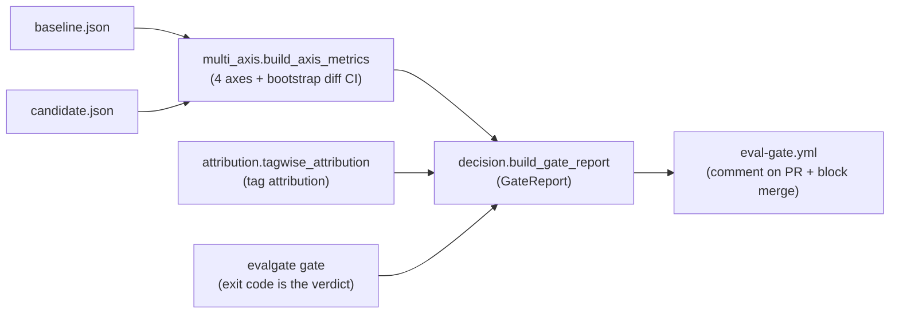
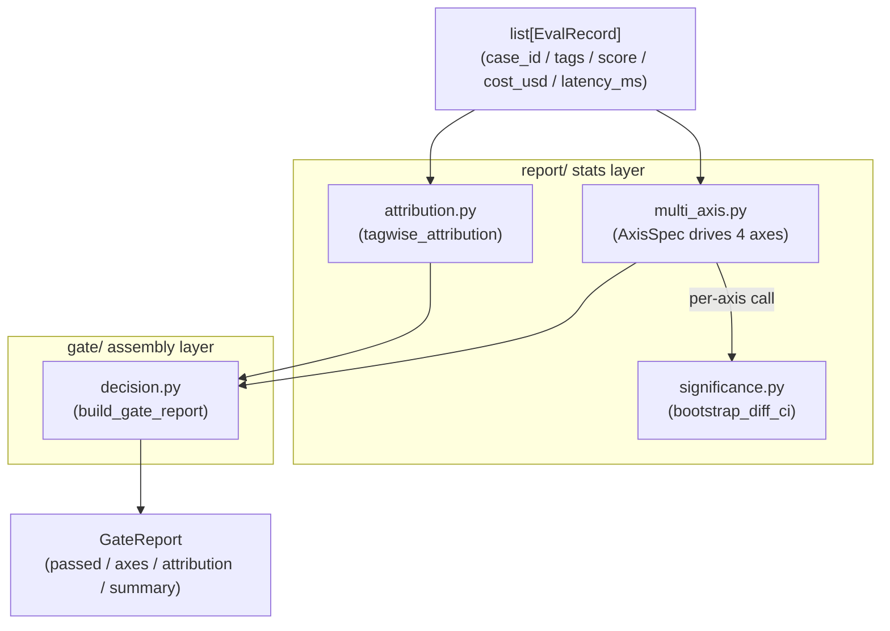
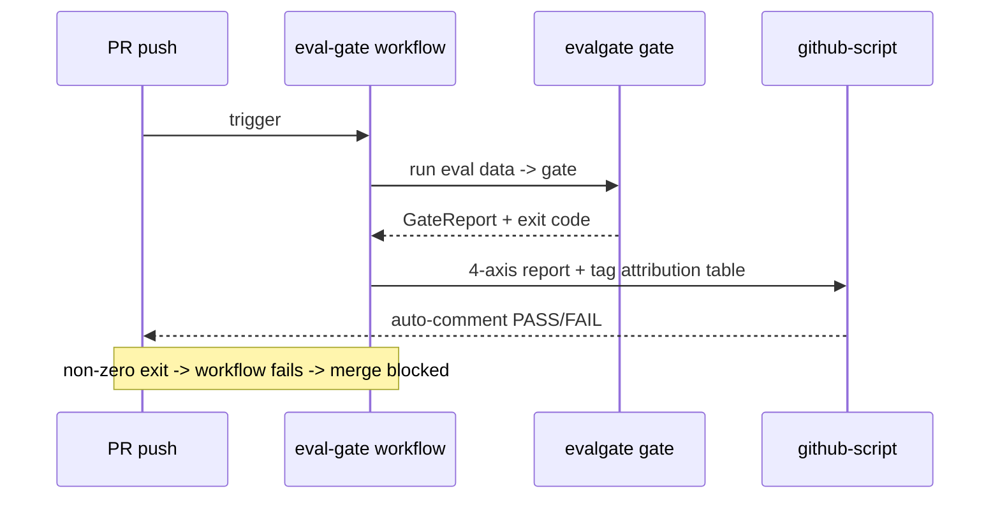

# Phase 2 · Multi-axis CI Gate (bootstrap CI + tag attribution)

> This is EvalGate's quality-gate kernel: aggregate two eval result sets into multi-axis metrics, use statistical significance to tell real regressions from noise, attribute the drop to case clusters, and emit a verdict that can block a PR merge.

## Core idea

Given baseline and candidate per-case eval JSON, aggregate them into **four-axis metrics: quality / cost / latency_p95 / safety**. Each axis uses the same bootstrap CI (bootstrap resampling confidence interval) to decide whether a delta is a real regression or noise, then tag attribution answers "which class of cases dragged us down," and the pieces assemble into a `GateReport`—pass/fail decides whether the PR can merge.

## Data-flow overview



Three-layer separation is what makes this design reusable:



## 1. Significance engine: `report/significance.py`

The core problem of stochastic eval: on a small, noisy eval set, is a 0.5% drop of candidate vs baseline a real regression or sampling noise? **Bootstrap diff CI** answers that:

- `bootstrap_diff_ci(baseline, candidate, statistic="mean", n_resamples=1000, confidence=0.95, seed=42)`: resample each array with replacement 1000 times, form the distribution of `statistic(candidate) - statistic(baseline)`, and take the 95% percentile interval.
- `significant = (ci_low > 0 or ci_high < 0)`—**significant only if the CI does not cross 0**.
- `statistic` is pluggable (`STATISTICS = {"mean": ..., "p95": ...}`, vectorized reduce on `axis=1`), so mean-style axes (quality/cost) and tail-style axes (latency p95) share **the same** decision machinery instead of a one-off p95 threshold.
- Fixed `seed` → deterministic, reproducible CIs.

## 2. Multi-axis aggregation: `report/multi_axis.py`

`build_axis_metrics(baseline, candidate) -> list[AxisMetric]`, driven by declarative `AxisSpec` (`name` / `direction` / `extractor` / `aggregator`):

| Axis | Direction | extractor | Aggregation |
| --- | --- | --- | --- |
| quality | higher_is_better | `score` | mean |
| cost | lower_is_better | `cost_usd` | mean |
| latency_p95 | lower_is_better | `latency_ms` | p95 |
| safety | lower_is_better | (breakdown-only, no scalar) | — |

- Each axis computes `baseline_agg` / `candidate_agg` / `delta`, then calls `bootstrap_diff_ci` for CI + significant.
- **Regression test** `_is_regression`: all of (a) worse direction, (b) statistically significant, and (c) (if a tolerance band is set) beyond `rel_tolerance * |baseline|` must hold—any miss means no fail, so noisy tail latency does not trip the gate.
- Output is `AxisMetric` (`name/baseline/candidate/delta/ci_low/ci_high/significant/passed`).

## 3. Tag attribution: `report/attribution.py`

A drop in overall pass-rate is only an alarm; attribution turns it into a root cause. `tagwise_attribution(baseline, candidate)`:

- Collect `tags` from records on both sides; for each tag compute baseline/candidate mean score + `delta` + `n_baseline`/`n_candidate`.
- Output `{tag: {baseline, candidate, delta, n_baseline, n_candidate}}` so the report can say "billing intent dropped 8 points" instead of "overall pass rate dropped 0.5%".

## 4. Report assembly: `gate/decision.py`

`build_gate_report(baseline, candidate) -> GateReport`:

- Calls `build_axis_metrics` + `tagwise_attribution`.
- `passed = all(axis.passed for axis in axes)`.
- `_summarize`: on pass, "All axes within tolerance."; on fail, name the regressed axes + worst tag.

The three-way split (`multi_axis` computes axes / `attribution` attributes / `decision` assembles) exists so **the data source can be swapped without touching gate logic**—when a real judge is wired in, only the source changes (fixtures → judge output); the gate logic is unchanged.

The contract lives in `core/schemas.py`: `EvalRecord` (`case_id` / `tags` / `score` / `cost_usd` / `latency_ms`, `extra="allow"`), `AxisMetric`, `GateReport` (`passed` / `axes` / `attribution` / `summary`). `EvalRecord` field names are a **public contract**—gate extractors read these keys directly; later shadow `/v1/shadow/observe` reuses the same shape.

## 5. CLI: `evalgate gate`

```bash
evalgate gate --baseline baseline.json --candidate candidate.json [--out report.json]
```

- Read two `list[EvalRecord]`-shape JSON files → `build_gate_report` → print the 4-axis report + attribution table → `--out` writes JSON.
- **Exit code is the verdict**: pass → 0, fail → non-zero (CI can enforce / block merge).
- Talks to files only; zero HTTP / DB dependency; easy to run in CI.

## 6. CI integration: `.github/workflows/eval-gate.yml`



- PR trigger → generate eval data → `evalgate gate` → upload report artifact.
- `actions/github-script@v7` **auto-comments the PR** with the 4-axis report + tag attribution table + overall PASS/FAIL.
- Gate fail (non-zero exit) → workflow fails → **merge is blocked**.

## Technical choices

### 1. Four axes + significance + attribution, not a single pass-rate gate (ADR-004)

- **Alternative**: the default OSS eval shape—"pass rate below a threshold → fail".
- **Choice**: a CI gate needs three pieces—multi-axis (quality / cost / latency_p95 / safety in parallel; any regression fails), statistical significance (bootstrap CI for true vs noise), and tag attribution (which cluster of cases dropped together).
- **Trade-off**: a single pass-rate gate has three fatal holes—**missed regressions** (pass rate unchanged but cost doubles / p95 doubles / safety worsens), **false blocks** (92%→89% may be noise; one false block and people `--force` past the gate, and the system is dead), **uninterpretable** ("dropped 3%" is an alarm, not a root cause). The three pieces close those holes: multi-axis for misses, significance for false blocks, attribution for interpretability. The cost is tag-maintenance burden on the app side, plus more gate complexity.

### 2. Bootstrap CI, not a paired t-test

- **Alternative**: paired t-test—classic, cheaper to compute.
- **Choice**: bootstrap with-replacement resampling 1000 times to estimate a CI on the delta.
- **Trade-off**: eval scores are often non-normal (bimodal or truncated); bootstrap is insensitive to distribution shape and more stable than a t-test. Cost is `O(N × resamples)`; a few hundred cases × 1000 resamples is milliseconds, negligible vs judge calls. Small N (e.g. N=3 demos) makes the significance call itself high-variance—a known limit; a full-N reproduction experiment is left for a dedicated recap phase.

### 3. One statistical machine for every axis (pluggable `statistic`)

- **Alternative**: bootstrap for mean-style axes, a one-off threshold for p95-style axes.
- **Choice**: make `statistic` pluggable (`mean` / `p95`); every axis shares `bootstrap_diff_ci`.
- **Trade-off**: unified decision logic, fewer special cases; a new axis is just an `AxisSpec`. Early latency p95 used a threshold fallback (resampled p95 is subtle to interpret—known tech debt, recorded in ADR-004); it later landed `statistic="p95"` bootstrap CI + a relative tolerance band (`LATENCY_REL_TOLERANCE`).

### 4. Three-layer split decouples data source from gate logic

- **Choice**: `multi_axis` (axes) / `attribution` / `decision` (assembly), with `EvalRecord` as the stable intermediate contract.
- **Trade-off**: this phase's source is fixtures (`seed_demo.py` fake data for connectivity + flow demo). Later real judge output, and even shadow-mode live observations, feed the same `EvalRecord` shape—gate logic reused with zero changes. The cost is an extra schema constraint, which is exactly the reuse premise.
