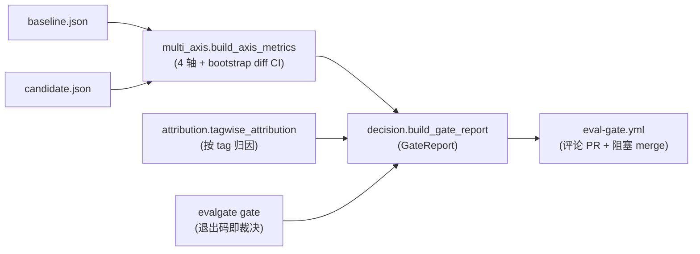
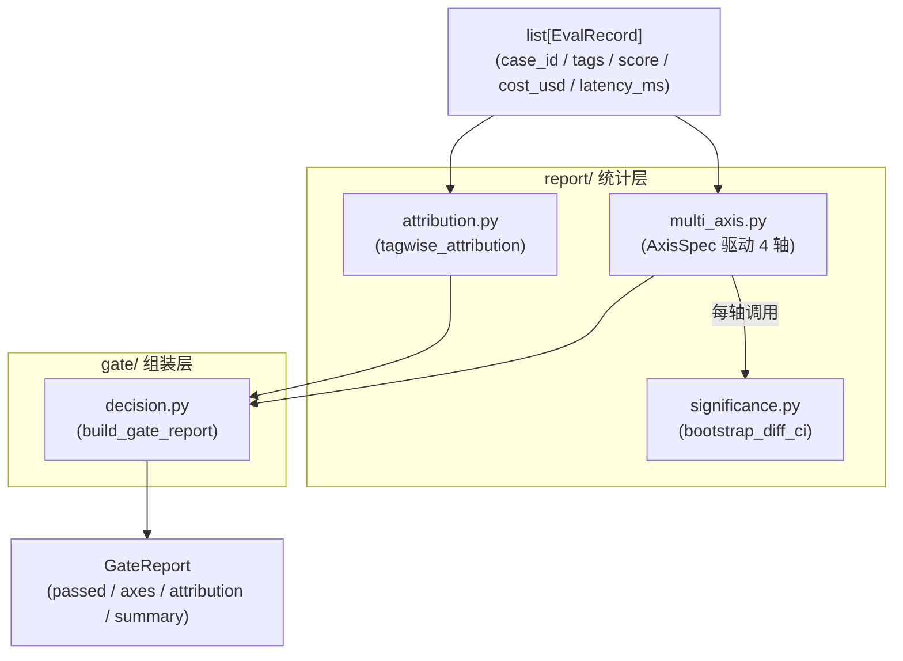
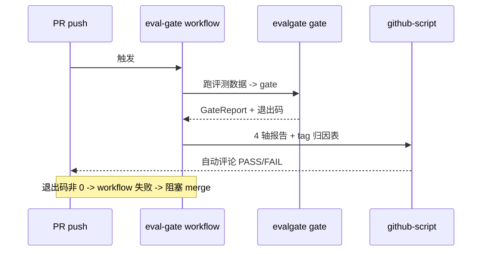

# Phase 2 · 多轴 CI Gate（bootstrap CI + tag 归因）

> 这是 EvalGate 的"质检岗"内核：把两份评测结果聚成多轴 metric，用统计显著性判定回归真伪，再归因到具体 case 簇，最终产出能阻塞 PR merge 的裁决。

## 核心思路

给定 baseline / candidate 两份 per-case 评测 JSON，把它们聚成 **quality / cost / latency_p95 / safety 四轴 metric**，每轴用同一套 bootstrap CI（自助重采样置信区间）判"这个 delta 是真回归还是噪声"，再按 tag 归因出"哪一类 case 拖垮了"，最后拼成 `GateReport`——pass/fail 决定 PR 能不能 merge。

## 数据流总览



三层职责分离，是这套设计能复用的关键：



## 1. 显著性引擎：`report/significance.py`

stochastic eval（随机性评测）的核心问题——小而抖的 eval set 上，candidate 比 baseline 低 0.5% 到底是真回归还是采样噪声？用 **bootstrap diff CI** 回答：

- `bootstrap_diff_ci(baseline, candidate, statistic="mean", n_resamples=1000, confidence=0.95, seed=42)`：对两个数组各自有放回重采样 1000 次，算 `statistic(candidate) - statistic(baseline)` 的分布，取 95% 分位区间。
- `significant = (ci_low > 0 or ci_high < 0)`——**CI 不跨 0 才算显著**。
- `statistic` 可插拔（`STATISTICS = {"mean": ..., "p95": ...}`，向量化按 `axis=1` reduce），让 mean 类轴（quality/cost）和 tail 类轴（latency p95）走**同一套**判定机器，而不是给 p95 单独写阈值特判。
- `seed` 固定 → CI 上确定性可复现。

## 2. 多轴聚合：`report/multi_axis.py`

`build_axis_metrics(baseline, candidate) -> list[AxisMetric]`，由声明式 `AxisSpec`（`name` / `direction` / `extractor` / `aggregator`）驱动：

| 轴 | 方向 | extractor | 聚合 |
| --- | --- | --- | --- |
| quality | higher_is_better | `score` | mean |
| cost | lower_is_better | `cost_usd` | mean |
| latency_p95 | lower_is_better | `latency_ms` | p95 |
| safety | lower_is_better | （breakdown-only，无标量） | — |

- 每轴算 `baseline_agg` / `candidate_agg` / `delta`，调 `bootstrap_diff_ci` 拿 CI + significant。
- **回归判定** `_is_regression`：必须同时满足 (a) 坏方向 + (b) 统计显著 + (c)（若设了容差带）超过 `rel_tolerance * |baseline|`——三者缺一不判 fail，避免噪声尾延迟把 gate 跳掉。
- 输出 `AxisMetric`（`name/baseline/candidate/delta/ci_low/ci_high/significant/passed`）。

## 3. tag 归因：`report/attribution.py`

整体 pass-rate 掉只是"报警"，归因把它变成"根因"。`tagwise_attribution(baseline, candidate)`：

- 收集两边所有 record 的 `tags`，对每个 tag 算 baseline/candidate 的 mean score + `delta` + `n_baseline`/`n_candidate`。
- 输出 `{tag: {baseline, candidate, delta, n_baseline, n_candidate}}`——让报告能说"billing 意图掉了 8 个点"而不是"整体 pass rate 掉 0.5%"。

## 4. 报告组装：`gate/decision.py`

`build_gate_report(baseline, candidate) -> GateReport`：

- 调 `build_axis_metrics` + `tagwise_attribution`。
- `passed = all(axis.passed for axis in axes)`。
- `_summarize`：pass 时输出 "All axes within tolerance."；fail 时点名 regressed 轴 + 最差 tag。

三层分离（`multi_axis` 算轴 / `attribution` 归因 / `decision` 组装）的核心目的：**数据源可替换而 gate 逻辑不动**——后续真 judge 接入时只换数据源（fixtures → judge 输出），gate 逻辑一行不改。

契约固化在 `core/schemas.py`：`EvalRecord`（`case_id` / `tags` / `score` / `cost_usd` / `latency_ms`，`extra="allow"`）、`AxisMetric`、`GateReport`（`passed` / `axes` / `attribution` / `summary`）。`EvalRecord` 的字段名是**公开契约**——gate extractor 直接读这些 key，后续 shadow `/v1/shadow/observe` 也复用同一 shape。

## 5. CLI：`evalgate gate`

```bash
evalgate gate --baseline baseline.json --candidate candidate.json [--out report.json]
```

- 读两份 `list[EvalRecord]`-shape JSON → `build_gate_report` → 打印 4 轴报告 + 归因表 → `--out` 写 JSON。
- **退出码即裁决**：pass → 0，fail → 非 0（CI 直接 enforce / 阻塞 merge）。
- 直连文件、零 HTTP / DB 依赖，CI 里好跑。

## 6. CI 集成：`.github/workflows/eval-gate.yml`



- PR 触发 → 生成评测数据 → `evalgate gate` → 上传 report artifact。
- 用 `actions/github-script@v7` 把 4 轴报告 + tag 归因表 + 整体 PASS/FAIL **自动评论到 PR**。
- gate fail（退出码非 0）→ workflow 失败 → **阻塞 merge**。

## 技术选型与抉择

### 1. 四轴 + 显著性 + 归因，而非单 pass-rate gate（ADR-004）

- **备选**：市面 OSS eval 工具的默认形态——"pass rate 跌破阈值 → fail"。
- **选择**：CI gate 必备三件套——多轴（quality / cost / latency_p95 / safety 并联，任一 regress 即 fail）、统计显著性（bootstrap CI 判真伪）、tag 归因（指出哪簇 case 集体跌）。
- **代价/收益**：单 pass-rate gate 有三个致命坑——**漏判**（pass rate 不变但 cost 翻倍 / p95 涨 2 倍 / safety 恶化）、**误 block**（92%→89% 可能只是噪声，误 block 一次大家就 `--force` 跳过 gate，整个系统作废）、**不可解释**（"跌了 3%"是 alarm 不是 root cause）。三件套分别堵这三个坑：漏判靠多轴、误 block 靠显著性、不可解释靠归因。代价是 tag 维护成本下放给应用方，以及 gate 实现复杂度上升。

### 2. bootstrap CI，而非 paired t-test

- **备选**：配对 t 检验——经典、计算更省。
- **选择**：bootstrap（自助法）有放回重采样 1000 次估 delta 的置信区间。
- **代价/收益**：eval 分数经常非正态（双峰或截断），bootstrap 对分布形状不敏感，比 t-test 更稳。计算量是 `O(N × resamples)`，几百条 case × 1000 重采样在毫秒级，相比 judge 调用本身可忽略。代价是小 N（如 N=3 的 demo 体量）下显著性判定本身方差大——这是已知局限，足量 N 的正式复现实验留待专门的复盘 phase。

### 3. 同一套统计机器跑所有轴（statistic 可插拔）

- **备选**：mean 类轴用 bootstrap、p95 类轴单独写阈值特判。
- **选择**：把 `statistic` 做成可插拔（`mean` / `p95`），所有轴共用 `bootstrap_diff_ci`。
- **代价/收益**：统一判定逻辑、减少特判分支，新增轴只需声明 `AxisSpec`。早期 latency p95 轴曾先用阈值兜底（重采样的 p95 解释较微妙，属当时的已知技术债，ADR-004 记录在案），后续已接上 `statistic="p95"` 的 bootstrap CI + 相对容差带（`LATENCY_REL_TOLERANCE`）消化该债。

### 4. 三层分离让数据源与 gate 逻辑解耦

- **选择**：`multi_axis`（算轴）/ `attribution`（归因）/ `decision`（组装）三层，`EvalRecord` 作为稳定中间契约。
- **代价/收益**：本期数据源是 fixtures（`seed_demo.py` 造的假数据，纯连通性 + 流程演示），后续真 judge 输出、乃至 shadow mode 线上观测都喂同一 `EvalRecord` shape——gate 逻辑零改动即可复用。代价是多一层 schema 约束，但这正是复用的前提。
