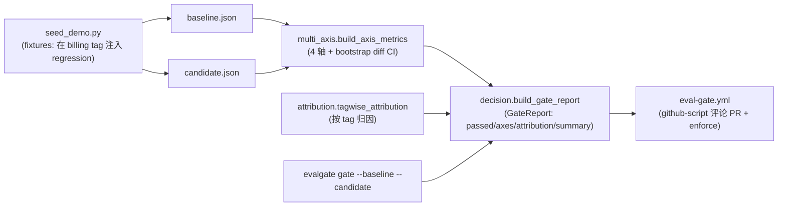

# Phase 2 技术方案 · 多轴 CI Gate v1（fixtures 驱动）

> 对应 [ROADMAP.md](ROADMAP.md) Phase 2。预估 1 人天 vibe coding。
> 本文档随实现演进；最终交付完成后只更新顶部状态行 + 在 [JOURNAL.md](../JOURNAL.md) 记里程碑。
>
> **历史快照说明**：本 plan 为回填补写（Phase 3+ 才开始每 phase 配 plan）。内容对齐 Phase 2 当时的实际交付与 commit `be3a749`。后续 phase 在此 gate 引擎上做了演进：p95 轴从"阈值"升级成 bootstrap CI + 相对容差带、`sub_metrics → axis_breakdown` 改名 + quality/safety 子轴派生（Phase 8/10）、sequential gate（Phase 15）。本文描述的是 v1 形态，关键演进点会内联标注。

**状态**：done（commit `be3a749`，gate 引擎单测全绿，CI 端到端在 PR 上自动评论 + 阻塞 merge）

---

## 思路（一句话）

给定 baseline / candidate 两份 per-case 评测 JSON，把它们聚成 **quality / cost / latency_p95 / safety 四轴 metric**，每轴用同一套 bootstrap CI 判"这个 delta 是真回归还是噪声"，再按 tag 归因出"哪一类 case 拖垮了"，最后拼成 `GateReport`——pass/fail 决定 PR 能不能 merge。

## 数据流总览



---

## 1. 显著性引擎：`src/evalgate/report/significance.py`

stochastic eval 的核心问题——小而抖的 eval set 上，candidate 比 baseline 低 0.5% 到底是真回归还是采样噪声？用 **bootstrap diff CI** 回答：

- `bootstrap_diff_ci(baseline, candidate, statistic="mean", n_resamples=1000, confidence=0.95, seed=42)`：对两个数组各自有放回重采样 1000 次，算 `statistic(candidate) - statistic(baseline)` 的分布，取 95% 分位区间。
- `significant = (ci_low > 0 or ci_high < 0)`——**CI 不跨 0 才算显著**。
- `statistic` 可插拔（`STATISTICS = {"mean": ..., "p95": ...}`，向量化按 `axis=1` reduce），让 mean 类轴（quality/cost）和 tail 类轴（latency p95）走**同一套**判定机器，而不是 p95 特判阈值。
- `seed` 固定 → CI 上确定性可复现。

> **v1 的技术债（见 ADR-004）**：Phase 2 当时 latency p95 轴先用阈值兜底（bootstrap p95 还没接进 multi_axis）。后续 phase 已把 p95 轴接上 `statistic="p95"` 的 bootstrap CI + 相对容差带（`LATENCY_REL_TOLERANCE=0.10`），消化了这笔债。

## 2. 多轴聚合：`src/evalgate/report/multi_axis.py`

`build_axis_metrics(baseline, candidate) -> list[AxisMetric]`，声明式 `AxisSpec`（`name` / `direction` / `extractor` / `aggregator`）驱动：

| 轴 | 方向 | extractor | 聚合 |
| --- | --- | --- | --- |
| quality | higher_is_better | `score` | mean |
| cost | lower_is_better | `cost_usd` | mean |
| latency_p95 | lower_is_better | `latency_ms` | p95 |
| safety | lower_is_better | （breakdown-only，无标量） | — |

- 每轴算 `baseline_agg` / `candidate_agg` / `delta`，调 `bootstrap_diff_ci` 拿 CI + significant。
- **回归判定** `_is_regression`：必须同时 (a) 坏方向 + (b) 统计显著 + (c)（若设了容差带）超过 `rel_tolerance * |baseline|`——三者缺一不判 fail，避免噪声尾延迟把 gate 跳掉。
- 输出 `AxisMetric`（`name/baseline/candidate/delta/ci_low/ci_high/significant/passed`）。

> **后续演进**：Phase 8/10 给 quality / safety 加了 `sub_metrics` 嵌套子轴（RAG ragas 指标 / PII+jailbreak 速率），父轴 `passed = main_passed AND all(sub.passed)`，并把字段从 `sub_metrics` 统一成 `axis_breakdown`。v1 只有四个扁平主轴。

## 3. tag 归因：`src/evalgate/report/attribution.py`

整体 pass-rate 掉只是"报警"，归因把它变成"根因"。`tagwise_attribution(baseline, candidate)`：

- 收集两边所有 record 的 `tags`，对每个 tag 算 baseline/candidate 的 mean score + `delta` + `n_baseline`/`n_candidate`。
- 输出 `{tag: {baseline, candidate, delta, n_baseline, n_candidate}}`——让报告能说"billing 意图掉了 8 个点"而不是"整体 pass rate 掉 0.5%"。

## 4. 报告组装：`src/evalgate/gate/decision.py`

`build_gate_report(baseline, candidate) -> GateReport`：

- 调 `build_axis_metrics` + `tagwise_attribution`。
- `passed = all(axis.passed for axis in axes)`。
- `_summarize`：pass 时 "All axes within tolerance."；fail 时点名 regressed 轴 + 最差 tag（+ 后续 phase 的 regressed 子指标）。
- 三层分离（`multi_axis` 算轴 / `attribution` 归因 / `decision` 组装）的目的：**Phase 5/6 真 judge 接入时只换数据源（fixtures → judge 输出），gate 逻辑一行不动**。

`core/schemas.py` 固化契约：`EvalRecord`（`case_id` / `tags` / `score` / `cost_usd` / `latency_ms`，`extra="allow"`）、`AxisMetric`、`GateReport`（`passed` / `axes` / `attribution` / `summary`）。`EvalRecord` 的字段名是公开契约——gate extractor 直接读这些 key，后续 Phase 13 shadow `/v1/shadow/observe` 也复用同一 shape。

## 5. CLI：`evalgate gate`

```bash
evalgate gate --baseline baseline.json --candidate candidate.json [--out report.json]
```

- 读两份 `list[EvalRecord]`-shape JSON → `build_gate_report` → 打印 4 轴报告 + 归因表 → `--out` 写 JSON。
- **退出码即裁决**：pass → 0，fail → 非 0（CI 直接 enforce / 阻塞 merge）。
- 直连文件、零 HTTP / DB 依赖，CI 里好跑。

## 6. demo 数据：`scripts/seed_demo.py`

v1 用 fixtures（不是真 judge——那是 Phase 5/6/12 的事）。seeder 造 baseline，再在 candidate 的 **`billing` tag 上注入 -0.22 的 score regression**，让整条 demo 链路有一个"必然被抓到的回归"可演示。

## 7. CI 集成：`.github/workflows/eval-gate.yml`

- PR 触发 → 跑 seeder → `evalgate gate` → 上传 report artifact。
- 用 `actions/github-script@v7` 把 4 轴报告 + tag 归因表 + 整体 PASS/FAIL **自动评论到 PR**。
- gate fail（退出码非 0）→ workflow 失败 → **阻塞 merge**。

> **后续演进**：Phase 12 把这条 workflow 的 fixtures 换成 Phase 5/6 真 judge 的输出（orchestrator + `EVALGATE_MOCK_LLM=1` 离线确定性），见 [PHASE_12_PLAN.md](PHASE_12_PLAN.md)。

## 8. 测试（`tests/`）

- `significance`：CI 跨 0 / 不跨 0、mean vs p95、seed 确定性、空数组报错。
- `multi_axis`：四轴方向、回归判定三条件（坏方向 + 显著 + 超容差）、单边空样本降级。
- `attribution`：多 tag、单 tag、缺 tag、空集。
- `decision` / gate 端到端：注入 billing regression 的 fixtures → 断言 `passed=False` + summary 点名 quality 轴 + 最差 tag = billing。

---

## 退出标准（对齐 [ROADMAP.md](ROADMAP.md) Phase 2）

- `evalgate gate --baseline ... --candidate ...` 跑通，注入回归的 fixtures 让退出码非 0。
- PR 上能看到 github-script 自动评论的四轴报告 + tag 归因表。
- gate fail 时 CI 失败、阻塞 merge。
- `make test` / `make lint` 全绿。
- commit message：`feat(gate): end-to-end multi-axis CI gate with bootstrap CI + tag attribution`（实际 `be3a749`）。

## 风险点 / 范围控制

- **bootstrap 在小 N 上功效低**：N=3 这种 demo 体量，"显著"判定本身方差大（Phase 6/12 的 JOURNAL 记过这事）。v1 接受这个局限——足量 N 的正式复现实验留给 Phase 17。
- **p95 阈值是已知债（ADR-004）**：v1 latency 轴先用阈值，bootstrap p95 留到后续接入（已由后续 phase 消化）。
- **fixtures 不是真信号**：Phase 2 跑的是 `seed_demo.py` 假数据，纯连通性 + 流程演示；真 judge 输出驱动 gate 是 Phase 12。
- **不做的事**：sequential / early-stop（Phase 15）、quality/safety 子指标（Phase 8/10）、judge 校准（Phase 16）。
