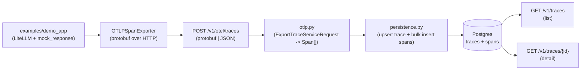
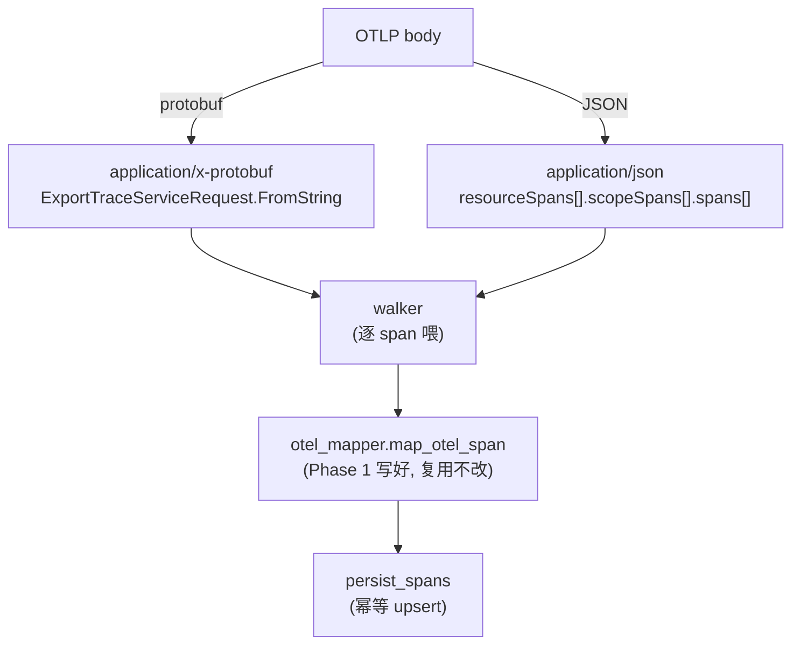

# Phase 3 · OTel 端到端打通 + Trace 浏览 API

> 把 ADR-001（OTel 作为 wire 协议）真正落地：从应用方一次带 instrumentation 的调用，到 OTLP/HTTP 上报、解析、落库、查询，跑通完整链路。

## 核心思路

应用方（demo_app）用 LiteLLM 跑一次假调用 → OTel SDK 把 span 用 OTLP/HTTP（OpenTelemetry 线协议走 HTTP）推到 EvalGate → EvalGate 解析后写进 `traces` + `spans` 两张表 → 两个 GET 接口能查回来。

## 数据流总览



两种 content-type 最终汇流到同一 mapper，是本期解析层的关键设计：



## 1. DB schema：加 `traces` 汇总表

只有 `spans` 表时做 trace 列表很重（每次 `SELECT DISTINCT trace_id`）。加一张 `traces` 汇总表，每来一个 trace 算一次 min/max time、span 数量、root span 缓存住。

- 新建 `0002_create_traces.py` migration，字段：`trace_id`(PK) / `root_span_id` / `service_name` / `start_time` / `end_time` / `span_count` / `resource_attributes`(JSONB，Postgres 二进制 JSON 列，可建索引)。
- 索引：`ix_traces_start_time DESC` 用于 `?since=` 翻页。
- `src/evalgate/db/models.py` 加 `TraceRow` ORM 映射。

## 2. OTLP 解析层：`ingest/otlp.py`（新建）

OTLP/HTTP 的 body 有两种 content-type，按 [DECISIONS.md](../DECISIONS.md) ADR-001（拥抱 OTel）两种都收：

- `application/x-protobuf` → `ExportTraceServiceRequest.FromString(body)`（来自 `opentelemetry.proto.collector.trace.v1.trace_service_pb2`）。
- `application/json` → 解析 OTLP-JSON envelope（`resourceSpans[].scopeSpans[].spans[]`）。

两路最终都走同一个 walker：把每个 OTLP span 喂给 Phase 1 已写好的 `src/evalgate/ingest/otel_mapper.py` 里的 `map_otel_span`（它已能吃 OTLP attribute list 形态），同时把 `Resource.attributes`（含 `service.name`）单独抽出来传给持久化层。**复用 mapper、不重写**，延续 Phase 1 的"映射不重写"惯例。

## 3. 持久化层：`ingest/persistence.py`（新建）

单独抽一层的理由：现有 `POST /v1/traces`（Phase 1 留的接缝）也要补 DB 写入，与新 OTLP endpoint 共用同一份写库逻辑，避免两边漂移。

```python
async def persist_spans(session, spans: list[Span], resource_attrs: dict) -> list[str]:
    # 1) bulk insert SpanRow（ON CONFLICT (span_id) DO NOTHING，保证重推幂等）
    # 2) 按 trace_id 分组，算 min(start)/max(end)/count/root_span_id
    # 3) UPSERT TraceRow（ON CONFLICT (trace_id) DO UPDATE，合并 span 数与时间窗）
    # 返回写入的 trace_id 列表
```

用 PG 的 `INSERT ... ON CONFLICT`（SQLAlchemy 的 `postgresql.insert(...).on_conflict_do_update`）做 idempotent（幂等，重复写入不重复计数）。同一 trace 分两次 batch 上来也能合并。SQLite 测试用 `sqlite.insert(...).on_conflict_do_*` 走同一抽象。

## 4. 新 endpoint：`api/routers/otlp.py`（新建）

```python
@router.post("/otel/traces")
async def ingest_otlp(request: Request, session=Depends(get_session)):
    ctype = request.headers.get("content-type", "").lower()
    body = await request.body()
    if "protobuf" in ctype:
        spans, resource_attrs = parse_otlp_protobuf(body)
    else:  # 默认 JSON
        spans, resource_attrs = parse_otlp_json(json.loads(body))
    await persist_spans(session, spans, resource_attrs)
    # OTel SDK 期待返回 ExportTraceServiceResponse（空 partial_success 即 OK）
    return Response(content=b"", media_type=ctype, status_code=200)
```

注：OTel Python SDK 的 `OTLPSpanExporter` 默认走 `/v1/traces`，这里用 `/v1/otel/traces` 以避开和现有简化 JSON 端点的冲突——demo app 里显式传 `endpoint=`。

## 5. List/Detail：扩展 `api/routers/traces.py`

- `GET /v1/traces?limit=50&since=<ISO8601>&service=<name>` → 按 `start_time DESC` 翻页，返回 `[{trace_id, service_name, start_time, end_time, span_count}]`。
- `GET /v1/traces/{trace_id}` → `{trace_id, service_name, resource_attributes, spans: [...]}`（spans 按 `start_time ASC`，前端可直接画 span tree）。
- 同时把现有 `POST /v1/traces` 简化端点的接缝补上：调 `persist_spans`（保留简化 JSON 入口，给测试 / 手动 curl 用）。

## 6. Demo app：`examples/demo_app/`

走 LiteLLM + `mock_response`（离线假响应）。后续引入真 judge 时这一层升级成真调用，端到端代码不动。

```python
# examples/demo_app/pipeline.py
import litellm
from opentelemetry import trace
from opentelemetry.sdk.trace import TracerProvider
from opentelemetry.sdk.trace.export import BatchSpanProcessor
from opentelemetry.exporter.otlp.proto.http.trace_exporter import OTLPSpanExporter
from opentelemetry.sdk.resources import Resource

resource = Resource.create({"service.name": "demo-app"})
provider = TracerProvider(resource=resource)
provider.add_span_processor(BatchSpanProcessor(
    OTLPSpanExporter(endpoint="http://localhost:8000/v1/otel/traces")
))
trace.set_tracer_provider(provider)

def main() -> None:
    tracer = trace.get_tracer("demo")
    with tracer.start_as_current_span("rag-pipeline") as root:
        root.set_attribute("evalgate.kind", "chain")
        with tracer.start_as_current_span("llm.call") as s:
            s.set_attribute("evalgate.kind", "llm")
            s.set_attribute("gen_ai.system", "openai")
            s.set_attribute("gen_ai.request.model", "gpt-4o-mini")
            litellm.completion(
                model="gpt-4o-mini",
                messages=[{"role": "user", "content": "what is 2+2?"}],
                mock_response="4",
            )
    provider.force_flush()
```

## 7. 依赖

- `opentelemetry-proto>=1.27` — protobuf 消息类（运行时依赖，约 200KB）。
- `protobuf>=5` — 上面 transitive，显式锁一下。

demo / dev 用：`opentelemetry-api`、`opentelemetry-sdk`、`opentelemetry-exporter-otlp-proto-http`、`litellm`、`aiosqlite`（测试 fixture）。

主依赖只新增 `opentelemetry-proto` + `protobuf`（加起来不到 2MB）；OTel SDK / LiteLLM 进 `dev` 依赖组，避免污染线上镜像（demo app 是 example，不是生产路径）。

## 测试策略

所有 DB-touching 测试用 in-memory aiosqlite engine fixture + `dependency_override` `get_session`，靠 `Base.metadata.create_all` 绕过 alembic（SQLite 不支持 JSONB，但 `JsonType` 已做 fallback），覆盖 protobuf / OTLP-JSON 两路 ingest、list 排序与 detail span 数。

## 技术选型与抉择

### 1. protobuf 与 OTLP-JSON 双 content-type 都收，汇流单一 walker

- **备选**：只支持一种编码（如只收 protobuf）。
- **选择**：两种 content-type 都解析，但解析后立刻汇流到同一个 `map_otel_span` walker。
- **代价/收益**：兼容标准 OTel SDK（默认 protobuf）与手写 / 调试场景（JSON 更可读），符合 ADR-001"拥抱 OTel 标准、降低应用方接入门槛"。代价是多一条 JSON envelope 解析路径，但两路共用 mapper，增量极小。

### 2. 写库幂等：`INSERT ... ON CONFLICT`（ADR-002）

- **备选**：先 `SELECT` 查重再决定 insert/update，或不防重直接插。
- **选择**：span 用 `ON CONFLICT (span_id) DO NOTHING`、trace 用 `ON CONFLICT (trace_id) DO UPDATE`，方言间用 SQLAlchemy 抽象统一（PG / SQLite 各走各的 dialect insert）。
- **代价/收益**：OTLP 的 `BatchSpanProcessor` 会重推、同一 trace 也可能分批到达，幂等保证"重推不重复计数 / 时间窗正确合并"，且一条 SQL 完成、无 select-then-write 竞态。代价是依赖各方言的 upsert 语法，但已封装在持久化层。

### 3. 单独抽 `persistence.py` 持久化层

- **备选**：写库逻辑直接写在两个 router 里。
- **选择**：抽出 `persist_spans`，OTLP endpoint 与简化 `POST /v1/traces` 共用。
- **代价/收益**：消除两个入口写库逻辑漂移的风险，是单一职责的体现；代价是多一个模块，但换来后续任何 ingest 入口都复用同一份幂等写库代码。

### 4. `traces` 汇总表 + 单列时间索引，先不上 GIN / 维表（ADR-002）

- **备选**：列表查询直接在 `spans` 上 `DISTINCT`；或一开始就抽 `services` 维表、给 attributes 上 GIN 索引。
- **选择**：加一张 `traces` 汇总表缓存 root span / 时间窗 / span 数，列表只配 `ix_traces_start_time DESC` 单列索引；resource_attributes 接受按 trace 冗余存。
- **代价/收益**：列表 / 翻页查询从"扫 spans"降到"扫汇总表"，单列索引足够支撑当前量级。冗余 resource_attributes（一行 trace 才几 KB）和延后 GIN 索引，符合 ADR-002"够用就行、到百万量级再优化"的原则——避免过早抽维表带来的 join 复杂度。
