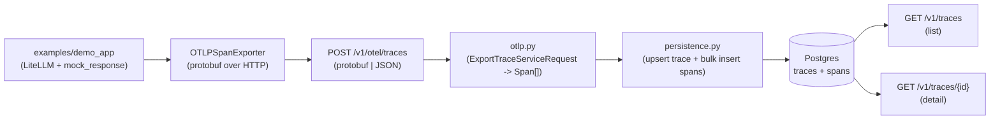
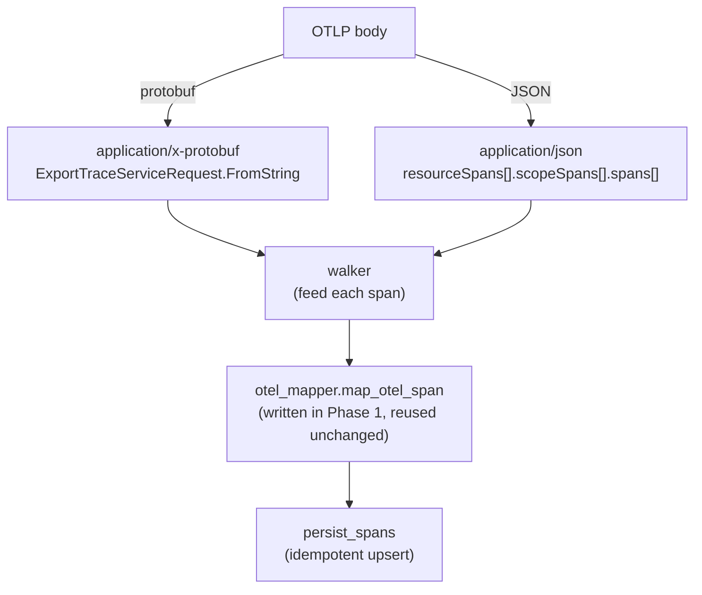

# Phase 3 · End-to-end OTel + Trace browse API

> Land ADR-001 (OTel as the wire protocol) for real: from one instrumented app call, through OTLP/HTTP export, parse, persist, and query—the full path.

## Core idea

The app (demo_app) makes one fake LiteLLM call → the OTel SDK pushes spans via OTLP/HTTP (OpenTelemetry wire protocol over HTTP) to EvalGate → EvalGate parses and writes `traces` + `spans` → two GET endpoints can read them back.

## Data-flow overview



Both content-types converge on the same mapper—the key design of this phase's parse layer:



## 1. DB schema: add a `traces` summary table

With only `spans`, listing traces is heavy (a `SELECT DISTINCT trace_id` every time). Add a `traces` summary table: for each incoming trace, cache min/max time, span count, and root span.

- New `0002_create_traces.py` migration, fields: `trace_id` (PK) / `root_span_id` / `service_name` / `start_time` / `end_time` / `span_count` / `resource_attributes` (JSONB, Postgres binary JSON, indexable).
- Index: `ix_traces_start_time DESC` for `?since=` pagination.
- `src/evalgate/db/models.py` adds `TraceRow` ORM mapping.

## 2. OTLP parse layer: `ingest/otlp.py` (new)

OTLP/HTTP bodies have two content-types; per [DECISIONS.md](../DECISIONS.md) ADR-001 (embrace OTel) we accept both:

- `application/x-protobuf` → `ExportTraceServiceRequest.FromString(body)` (from `opentelemetry.proto.collector.trace.v1.trace_service_pb2`).
- `application/json` → parse the OTLP-JSON envelope (`resourceSpans[].scopeSpans[].spans[]`).

Both paths share one walker: each OTLP span is fed to Phase 1's `map_otel_span` in `src/evalgate/ingest/otel_mapper.py` (already able to eat OTLP attribute-list shape), while `Resource.attributes` (including `service.name`) is extracted separately for persistence. **Reuse the mapper; do not rewrite**—continuing Phase 1's "map, don't rewrite" convention.

## 3. Persistence layer: `ingest/persistence.py` (new)

Why a separate layer: the existing `POST /v1/traces` (the Phase 1 seam) also needs DB writes, and should share write logic with the new OTLP endpoint so the two cannot drift.

```python
async def persist_spans(session, spans: list[Span], resource_attrs: dict) -> list[str]:
    # 1) bulk insert SpanRow (ON CONFLICT (span_id) DO NOTHING — idempotent re-export)
    # 2) group by trace_id, compute min(start)/max(end)/count/root_span_id
    # 3) UPSERT TraceRow (ON CONFLICT (trace_id) DO UPDATE, merge span count and time window)
    # return list of written trace_ids
```

Use PG `INSERT ... ON CONFLICT` (SQLAlchemy `postgresql.insert(...).on_conflict_do_update`) for idempotent writes (repeats do not double-count). The same trace arriving in two batches still merges. SQLite tests use `sqlite.insert(...).on_conflict_do_*` through the same abstraction.

## 4. New endpoint: `api/routers/otlp.py` (new)

```python
@router.post("/otel/traces")
async def ingest_otlp(request: Request, session=Depends(get_session)):
    ctype = request.headers.get("content-type", "").lower()
    body = await request.body()
    if "protobuf" in ctype:
        spans, resource_attrs = parse_otlp_protobuf(body)
    else:  # default JSON
        spans, resource_attrs = parse_otlp_json(json.loads(body))
    await persist_spans(session, spans, resource_attrs)
    # OTel SDK expects ExportTraceServiceResponse (empty partial_success == OK)
    return Response(content=b"", media_type=ctype, status_code=200)
```

Note: the OTel Python SDK `OTLPSpanExporter` defaults to `/v1/traces`. We use `/v1/otel/traces` to avoid colliding with the simplified JSON endpoint—the demo app passes `endpoint=` explicitly.

## 5. List/Detail: extend `api/routers/traces.py`

- `GET /v1/traces?limit=50&since=<ISO8601>&service=<name>` → paginate by `start_time DESC`, return `[{trace_id, service_name, start_time, end_time, span_count}]`.
- `GET /v1/traces/{trace_id}` → `{trace_id, service_name, resource_attributes, spans: [...]}` (spans by `start_time ASC`; the UI can draw a span tree directly).
- Also close the `POST /v1/traces` simplified-endpoint seam: call `persist_spans` (keep the simplified JSON entrypoint for tests / manual curl).

## 6. Demo app: `examples/demo_app/`

LiteLLM + `mock_response` (offline fake response). When a real judge is introduced later, this layer upgrades to real calls; the end-to-end code stays put.

```python
# examples/demo_app/pipeline.py
import litellm
from opentelemetry import trace
from opentelemetry.sdk.trace import TracerProvider
from opentelemetry.sdk.trace.export import BatchSpanProcessor
from opentelemetry.exporter.otlp.proto.http.trace_exporter import OTLPSpanExporter
from opentelemetry.sdk.resources import Resource

resource = Resource.create({"service.name": "demo-app"})
provider = TracerProvider(resource=resource)
provider.add_span_processor(BatchSpanProcessor(
    OTLPSpanExporter(endpoint="http://localhost:8000/v1/otel/traces")
))
trace.set_tracer_provider(provider)

def main() -> None:
    tracer = trace.get_tracer("demo")
    with tracer.start_as_current_span("rag-pipeline") as root:
        root.set_attribute("evalgate.kind", "chain")
        with tracer.start_as_current_span("llm.call") as s:
            s.set_attribute("evalgate.kind", "llm")
            s.set_attribute("gen_ai.system", "openai")
            s.set_attribute("gen_ai.request.model", "gpt-4o-mini")
            litellm.completion(
                model="gpt-4o-mini",
                messages=[{"role": "user", "content": "what is 2+2?"}],
                mock_response="4",
            )
    provider.force_flush()
```

## 7. Dependencies

- `opentelemetry-proto>=1.27` — protobuf message classes (runtime dep, ~200KB).
- `protobuf>=5` — transitive above; pin explicitly.

Demo / dev: `opentelemetry-api`, `opentelemetry-sdk`, `opentelemetry-exporter-otlp-proto-http`, `litellm`, `aiosqlite` (test fixture).

Main deps add only `opentelemetry-proto` + `protobuf` (under 2MB together); OTel SDK / LiteLLM go in the `dev` group so they do not pollute the production image (the demo app is an example, not a production path).

## Test strategy

All DB-touching tests use an in-memory aiosqlite engine fixture + `dependency_override` of `get_session`, with `Base.metadata.create_all` to skip Alembic (SQLite has no JSONB, but `JsonType` already falls back). Coverage: protobuf and OTLP-JSON ingest, list sort order, and detail span counts.

## Technical choices

### 1. Accept both protobuf and OTLP-JSON; converge on one walker

- **Alternative**: support one encoding only (e.g. protobuf only).
- **Choice**: parse both content-types, then immediately converge on the same `map_otel_span` walker.
- **Trade-off**: compatible with the standard OTel SDK (protobuf by default) and handwritten / debug paths (JSON is more readable), matching ADR-001 "embrace OTel, lower the app integration bar." The cost is a second JSON-envelope parse path; both share the mapper, so the increment is tiny.

### 2. Idempotent writes: `INSERT ... ON CONFLICT` (ADR-002)

- **Alternative**: `SELECT` then insert/update, or insert without dedup.
- **Choice**: spans `ON CONFLICT (span_id) DO NOTHING`, traces `ON CONFLICT (trace_id) DO UPDATE`, unified via SQLAlchemy (PG / SQLite each use their dialect insert).
- **Trade-off**: OTLP `BatchSpanProcessor` retries, and one trace may arrive in batches. Idempotency guarantees "retries do not double-count / time windows merge correctly," in one SQL statement, with no select-then-write race. The cost is dialect upsert syntax, already wrapped in the persistence layer.

### 3. Extract a `persistence.py` layer

- **Alternative**: write logic inlined in both routers.
- **Choice**: extract `persist_spans`, shared by the OTLP endpoint and simplified `POST /v1/traces`.
- **Trade-off**: no drift between the two ingest write paths (single responsibility). Extra module, but any future ingest entrypoint reuses the same idempotent write code.

### 4. `traces` summary table + a single time index; no GIN / dimension table yet (ADR-002)

- **Alternative**: list via `DISTINCT` on `spans`; or extract a `services` dimension table and GIN-index attributes from day one.
- **Choice**: a `traces` summary table caching root span / time window / span count; list uses only `ix_traces_start_time DESC`; resource_attributes are stored redundantly per trace.
- **Trade-off**: list / pagination goes from "scan spans" to "scan the summary table"; a single-column index is enough at current scale. Redundant resource_attributes (a few KB per trace) and deferred GIN match ADR-002 "good enough until millions of rows"—avoid premature dimension tables and join complexity.
