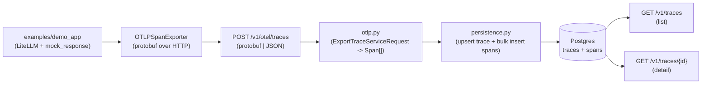

# Phase 3 技术方案 · OTel 端到端打通 + Trace 浏览 API

> 对应 [ROADMAP.md](ROADMAP.md) Phase 3。预估 1 人天 vibe coding。
> 本文档随实现演进；最终交付完成后只更新顶部状态行 + 在 [JOURNAL.md](../JOURNAL.md) 记里程碑。

**状态**：done（端到端本地验证通过，30/30 测试绿，lint/format clean）

---

## 思路（一句话）

应用方（demo_app）用 LiteLLM 跑一次假调用 → OTel SDK 把 span 用 OTLP/HTTP 推到 EvalGate → EvalGate 解析后写进 `traces` + `spans` 两张表 → 两个 GET 接口能查回来。

## 数据流总览



---

## 1. DB schema：加 `traces` 汇总表

现状只有 [src/evalgate/db/models.py](../src/evalgate/db/models.py) 的 `spans` 表，没法直接做 trace 列表（每次 `SELECT DISTINCT trace_id` 太重）。加一张 `traces` 汇总表，每来一个 trace 算一次 min/max time、span 数量、root span 缓存住。

- 新建 `0002_create_traces.py` migration，字段：`trace_id`(PK) / `root_span_id` / `service_name` / `start_time` / `end_time` / `span_count` / `resource_attributes`(JSONB)
- 索引：`ix_traces_start_time DESC` 用于 `?since=` 翻页
- `src/evalgate/db/models.py` 加 `TraceRow` ORM 映射

## 2. OTLP 解析层：`src/evalgate/ingest/otlp.py`（新建）

OTLP/HTTP 的 body 有两种 content-type，按 [DECISIONS.md](../DECISIONS.md) ADR-001（拥抱 OTel）我们两种都收：

- `application/x-protobuf` → `ExportTraceServiceRequest.FromString(body)`（从 `opentelemetry.proto.collector.trace.v1.trace_service_pb2`）
- `application/json` → 解析 OTLP-JSON envelope（`resourceSpans[].scopeSpans[].spans[]`）

两路最终都走同一个 walker：把每个 OTLP span 喂给已经写好的 [src/evalgate/ingest/otel_mapper.py](../src/evalgate/ingest/otel_mapper.py) 里的 `map_otel_span`（它已经能吃 OTLP attribute list 形态），同时把 `Resource.attributes`（含 `service.name`）单独抽出来传给持久化层。

## 3. 持久化层：`src/evalgate/ingest/persistence.py`（新建）

为啥单独抽一层：现有 [src/evalgate/api/routers/traces.py](../src/evalgate/api/routers/traces.py) 里 `POST /v1/traces` 那个 TODO 也要补 DB 写入，跟新 OTLP endpoint 共用同一份写库逻辑，避免两边漂移。

```python
async def persist_spans(session, spans: list[Span], resource_attrs: dict) -> list[str]:
    # 1) bulk insert SpanRow（ON CONFLICT (span_id) DO NOTHING，保证重推幂等）
    # 2) 按 trace_id 分组，算 min(start)/max(end)/count/root_span_id
    # 3) UPSERT TraceRow（ON CONFLICT (trace_id) DO UPDATE，合并 span 数与时间窗）
    # 返回写入的 trace_id 列表
```

> 用 PG 的 `INSERT ... ON CONFLICT`（SQLAlchemy 的 `postgresql.insert(...).on_conflict_do_update`）做幂等。同一 trace 分两次 batch 上来也能合并。SQLite 测试用 `sqlite.insert(...).on_conflict_do_*` 走同一抽象。

## 4. 新 endpoint：`src/evalgate/api/routers/otlp.py`（新建）

```python
@router.post("/otel/traces")
async def ingest_otlp(request: Request, session=Depends(get_session)):
    ctype = request.headers.get("content-type", "").lower()
    body = await request.body()
    if "protobuf" in ctype:
        spans, resource_attrs = parse_otlp_protobuf(body)
    else:  # 默认 JSON
        spans, resource_attrs = parse_otlp_json(json.loads(body))
    await persist_spans(session, spans, resource_attrs)
    # OTel SDK 期待返回 ExportTraceServiceResponse（空 partial_success 即 OK）
    return Response(content=b"", media_type=ctype, status_code=200)
```

注：OTel Python SDK 的 `OTLPSpanExporter` 默认走 `/v1/traces`，我们用了 `/v1/otel/traces` 以避开和现有简化 JSON 端点的冲突 — demo app 里显式传 `endpoint=`。

## 5. List/Detail：扩展 `src/evalgate/api/routers/traces.py`

- `GET /v1/traces?limit=50&since=<ISO8601>&service=<name>` → 按 `start_time DESC` 翻页，返回 `[{trace_id, service_name, start_time, end_time, span_count}]`
- `GET /v1/traces/{trace_id}` → `{trace_id, service_name, resource_attributes, spans: [...]}`（spans 按 `start_time ASC`，前端可直接画 span tree）
- 同时把现有 `POST /v1/traces` 简化端点的 TODO 补上：调 `persist_spans`（保留简化 JSON 入口，给测试 / 手动 curl 用）

## 6. Demo app：`examples/demo_app/`

走 LiteLLM + `mock_response`。Phase 5 引入真 judge 时这一层就升级成真调用，端到端代码不动。

```python
# examples/demo_app/pipeline.py
import litellm
from opentelemetry import trace
from opentelemetry.sdk.trace import TracerProvider
from opentelemetry.sdk.trace.export import BatchSpanProcessor
from opentelemetry.exporter.otlp.proto.http.trace_exporter import OTLPSpanExporter
from opentelemetry.sdk.resources import Resource

resource = Resource.create({"service.name": "demo-app"})
provider = TracerProvider(resource=resource)
provider.add_span_processor(BatchSpanProcessor(
    OTLPSpanExporter(endpoint="http://localhost:8000/v1/otel/traces")
))
trace.set_tracer_provider(provider)

def main() -> None:
    tracer = trace.get_tracer("demo")
    with tracer.start_as_current_span("rag-pipeline") as root:
        root.set_attribute("evalgate.kind", "chain")
        with tracer.start_as_current_span("llm.call") as s:
            s.set_attribute("evalgate.kind", "llm")
            s.set_attribute("gen_ai.system", "openai")
            s.set_attribute("gen_ai.request.model", "gpt-4o-mini")
            litellm.completion(
                model="gpt-4o-mini",
                messages=[{"role": "user", "content": "what is 2+2?"}],
                mock_response="4",
            )
    provider.force_flush()
```

新增 `examples/demo_app/README.md` 几行说明 + `examples/demo_app/__init__.py`。

## 7. `make demo-trace` target

```makefile
demo-trace: db-up
	uv run alembic upgrade head
	uv run uvicorn evalgate.api.main:app --port 8000 &  echo $$! > /tmp/evalgate.pid
	sleep 2
	uv run python -m examples.demo_app.pipeline
	sleep 1
	curl -s http://localhost:8000/v1/traces?limit=5 | python -m json.tool
	kill `cat /tmp/evalgate.pid`
```

（最终细节会保证 trap/退出码干净，必要时拆 `demo-trace-up` / `demo-trace-down`。）

## 8. 依赖增加（[pyproject.toml](../pyproject.toml)）

- `opentelemetry-proto>=1.27` — protobuf 消息类（运行时依赖，约 200KB）
- `protobuf>=5` — 上面 transitive，但显式锁一下

demo / dev 用：`opentelemetry-api`、`opentelemetry-sdk`、`opentelemetry-exporter-otlp-proto-http`、`litellm`、`aiosqlite`（测试 fixture）。

主依赖只新增 `opentelemetry-proto` + `protobuf`；OTel SDK / LiteLLM 进 `dev` 依赖组，避免污染线上镜像（demo app 是 example，不是生产路径）。

## 9. 测试（`tests/`）

- `tests/conftest.py` 加一个 in-memory aiosqlite engine fixture + dependency_override `get_session`，让所有 DB-touching 测试不需要 Postgres（用 `Base.metadata.create_all` 绕过 alembic，sqlite 不支持 JSONB 但 SQLAlchemy 已经做了 fallback —— 见 [src/evalgate/db/models.py](../src/evalgate/db/models.py) `JsonType`）
- `tests/test_otlp_ingest_protobuf.py`：用 `opentelemetry-proto` 构造 `ExportTraceServiceRequest`，序列化后 POST，断言 DB 有 1 trace + N spans
- `tests/test_otlp_ingest_json.py`：同样意思，发 OTLP-JSON envelope
- `tests/test_traces_list_detail.py`：写 3 trace 后 list 看顺序，detail 看 span 数
- 现有 [tests/test_traces_endpoint.py](../tests/test_traces_endpoint.py) 跟着改成真正断言写库

## 10. 与现有 ADR 的一致性检查

- ADR-001（OTel as wire protocol）：本期就是落地这条。
- ADR-002（PG + JSONB + Alembic）：新表用 JSONB + Alembic migration，符合。
- 现有 [src/evalgate/ingest/otel_mapper.py](../src/evalgate/ingest/otel_mapper.py) 不动接口，只多复用 — Phase 1 的"映射不重写"惯例保留。

---

## 退出标准（对齐 [ROADMAP.md](ROADMAP.md) Phase 3）

- `make demo-trace` 能跑完不报错
- `curl http://localhost:8000/v1/traces` 看到刚才那条 trace
- `curl .../v1/traces/{trace_id}` 看到完整 span tree
- `make test` 全绿；`make lint` 全绿
- 新增 commit message：`feat(ingest,api): OTLP/HTTP ingest + traces list/detail + demo app`

## 风险点 / 范围控制

- **protobuf 依赖体积**：`protobuf` + `opentelemetry-proto` 加起来不到 2MB，可接受。
- **List 接口性能**：上 GIN 索引留到 Phase 11 真 UI 落地时再补，本期 `ix_traces_start_time` 单列索引足够。
- **资源 attributes 去重**：同一 service 多 trace 推上来 resource_attributes 会重复存。本期接受冗余（一行 trace 才几 KB），不抽 `services` 维表 — 等量级到百万再说，符合 ADR-002 的"够用就行"原则。
- **不做的事**：gRPC OTLP、span events / links、trace sampling 配置、按 attribute 过滤的 list — 都放到后续 phase。
