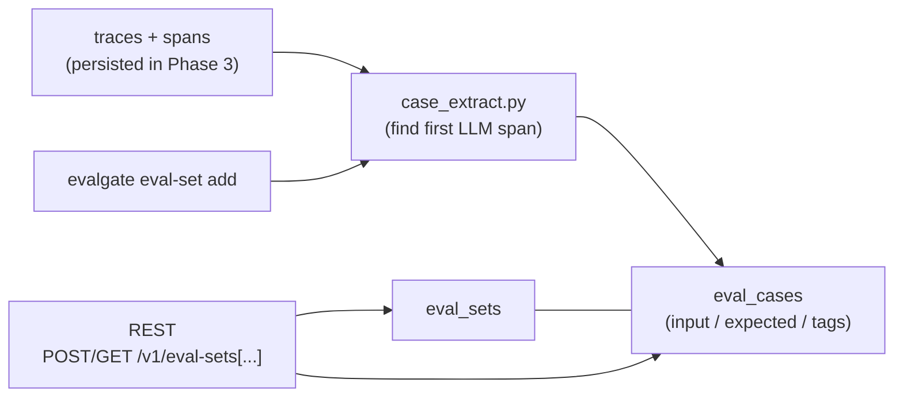
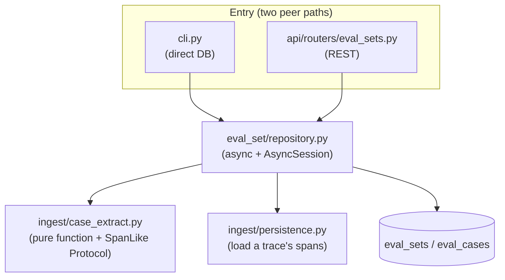

# Phase 4 design · Eval Set Manager

## In one sentence

Traces already sit in the DB → one CLI command `evalgate eval-set add --from-trace <id>` → the first LLM span in that trace is extracted as an `eval_case` and attached to a named `eval_set`; a REST API then lists them for the later judge runner (Phase 5) to consume. This layer is the bridge from "a real call observed in production" to "a rerunnable eval sample."

## Data flow



## Module structure



CLI and REST are peer entrypoints; **both land in the same `repository.py`**, so sample-creation logic exists only once.

## 1. DB schema: two new tables + 0003 migration

[src/evalgate/db/models.py](../src/evalgate/db/models.py) adds two ORMs:

- `EvalSetRow`: `id` (String PK, UUID hex) / `name` (indexed) / `description` (nullable) / `created_at` (timezone-aware, `func.now()`) / `updated_at` (`func.now()` + onupdate)
- `EvalCaseRow`: `id` / `eval_set_id` (FK → eval_sets.id, CASCADE, indexed) / `task_type` (default `"generic"`) / `input` (JSONB) / `expected` (JSONB, nullable) / `tags` (JSONB list) / `source_trace_id` (indexed, **soft reference, not an FK**) / `source_span_id` (nullable) / `created_at`

Migration [0003_create_eval_sets.py](../src/evalgate/db/migrations/versions/0003_create_eval_sets.py) uses JSONB + indexes on PG (`ix_eval_cases_eval_set_id`, `ix_eval_cases_source_trace_id`, `ix_eval_sets_name`).

## 2. Extract a case from a trace: [ingest/case_extract.py](../src/evalgate/ingest/case_extract.py)

Pure function + `SpanLike` Protocol (duck typing: input may be an ORM row or a pydantic `Span`); unit tests need no DB. Extraction strategy:

1. Sort spans by `start_time` ascending; find the first LLM span: `evalgate.kind == "llm"` OR `span.kind == "llm"` OR any `gen_ai.*` key in attributes.
2. `input`: prefer `gen_ai.prompt` / `gen_ai.request.messages` / `messages` / `prompt` / `input`; else collect all `gen_ai.request.*` + `gen_ai.input.*`; finally dump all attributes.
3. `expected`: any of `gen_ai.response.content` / `gen_ai.completion` / `gen_ai.response` / `response` / `output`.
4. `task_type` heuristics: a span with `evalgate.kind == "retriever"` → `rag`; ≥2 spans with `evalgate.kind == "tool"` → `agent`; else `generic`.
5. `tags`: from the root span, `evalgate.tags` / `evalgate.tag` (list or single str); caller may append.
6. No LLM span → raise `NoLLMSpanError` (API returns 422).

> **Multi-level fallback is intentional**: OTel `gen_ai.*` semantic conventions (the naming standard for LLM telemetry fields) are still evolving. A 5-key priority list plus a last-resort dump of all attributes is more robust to version drift.

## 3. Repository: [eval_set/repository.py](../src/evalgate/eval_set/repository.py)

Same style as [ingest/persistence.py](../src/evalgate/ingest/persistence.py)—a set of `async def` + `AsyncSession`, **fully dialect-agnostic** (ORM `session.add` + `select`, not `pg_insert`), so the same code runs on Postgres and on aiosqlite in tests. Main interface:

- `create_eval_set` / `list_eval_sets` / `get_eval_set`
- `resolve_set_id(session, identifier)`: UUID first; if missing, latest match by name—so CLI / API can use a human-readable set name
- `list_cases` / `add_case`
- `add_case_from_trace(...)`: internally `persistence.get_trace` for spans → `case_extract.extract_case_from_trace` → `add_case`

Defines `EvalSetNotFoundError` / `TraceNotFoundError`, and re-exports `NoLLMSpanError`.

## 4. API router: [api/routers/eval_sets.py](../src/evalgate/api/routers/eval_sets.py)

- `POST /v1/eval-sets` → 201 + `EvalSetOut`
- `GET  /v1/eval-sets?limit=&since=` → list
- `GET  /v1/eval-sets/{set_id_or_name}` → set meta + all cases
- `POST /v1/eval-sets/{set_id_or_name}/cases` → persist a hand-written case
- `POST /v1/eval-sets/{set_id_or_name}/cases/from-trace/{trace_id}` → promote from a trace

Error convention: missing set / trace → 404; trace has no LLM span → 422. Reuses Phase 3's `SessionDep = Annotated[AsyncSession, Depends(get_session)]`.

## 5. CLI: extend [cli.py](../src/evalgate/cli.py)

**Direct-DB mode** (same as `evalgate gate`: zero HTTP dependency, CI-friendly):

```bash
evalgate eval-set create --name billing-regress [--description "..."]
evalgate eval-set add    --set <id-or-name> --from-trace <trace_id> [--tag t1] [--task-type rag|agent|generic]
evalgate eval-set show   --set <id-or-name>
```

CLI gets a session via `evalgate.db.session.SessionLocal`; errors are `{"error": ..., "detail": ...}` JSON plus a non-zero exit code.

## 6. Schema alignment

[core/schemas.py](../src/evalgate/core/schemas.py): `EvalCase.task_kind` → `task_type`; add `source_trace_id` / `source_span_id` / `created_at`; add `EvalSetOut` / `EvalCaseOut` / `EvalSetDetail` (API response shape, decoupled from ORM rows so internal columns do not leak).

## Technical choices

### 1. Decouple `eval_case` from `trace`: soft reference, not an FK

- **Decision**: `source_trace_id` is indexed **but not an FK**; `eval_case` outlives the trace lifecycle.
- **Alternative**: FK + `ON DELETE CASCADE` so cases die with traces.
- **Why**: traces will have retention / archival (cold write, hot read; possibly S3 / ClickHouse). An eval_case is a "carefully chosen long-lived eval asset" and must not be cascade-deleted when the raw trace expires. A soft reference + index is enough for "which trace did this case come from."
- **Cost**: no referential integrity; `source_trace_id` may dangle at a deleted trace—which is the intended semantics (cases live longer than traces).

### 2. Schema-less fields as JSONB (ADR-002)

- **Decision**: `input` / `expected` / `tags` are all JSONB; `tags` is not PG native `TEXT[]`.
- **Alternative**: `tags` as a PG array; `input` / `expected` as normalized columns.
- **Why**: (1) LLM I/O shapes vary wildly (message arrays / plain text / structured args); a normalized table would be awkward. JSONB is first-class on PG (GIN, `@>` containment). (2) JSONB for `tags` instead of `TEXT[]` is **dialect-agnostic**: test aiosqlite has no PG arrays, but the project's `JsonType` already falls back on SQLite, so one repository runs on both DBs.
- **Cost**: no strong typing on JSONB columns; cross-field unique indexes are limited; tag aggregation uses JSON operators rather than a simple `WHERE`. Acceptable at current scale.

### 3. Case dedup: accept duplicates this phase

- **Decision**: promoting the same trace twice yields two cases; no dedup.
- **Why**: dedup needs a definition of "duplicate" (exact input equality? semantic?). That belongs to the BadCase finder (Phase 7); introducing it early would complicate a simple promote path.
- **Cost**: eval sets may contain duplicate cases; later cleanup is needed.

## Test strategy

All tests use the aiosqlite fixture; no Docker / Postgres. `case_extract` is unit-tested as a pure function across span shapes (generic / rag / agent / fallback / no LLM span). CRUD and from-trace promote are end-to-end on an in-memory session. **Core invariants**: every promoted case has non-empty `input`; name resolution hits the latest set.
