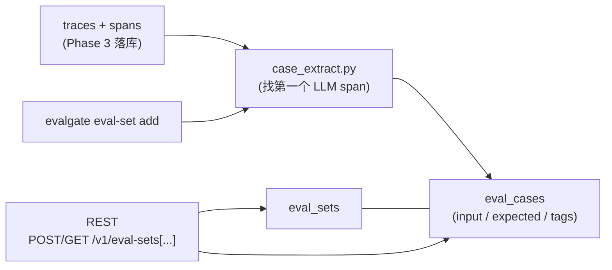
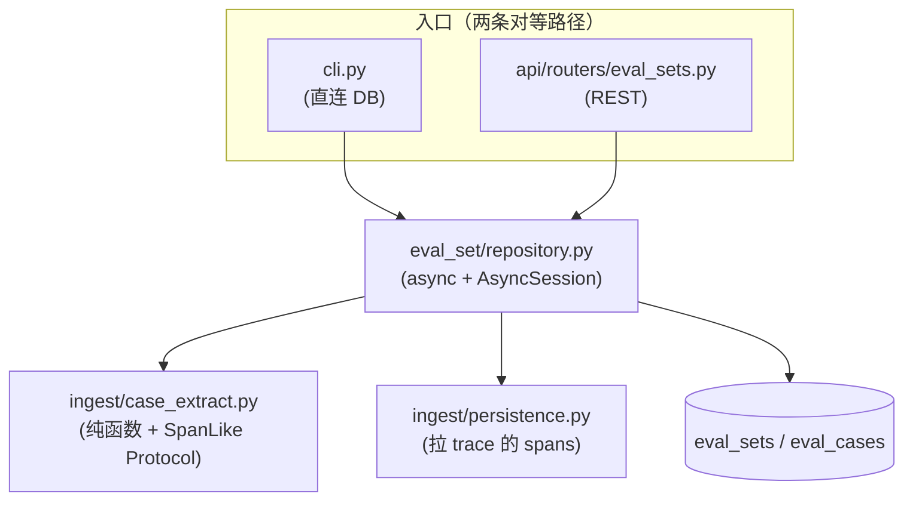

# Phase 4 技术方案 · Eval Set Manager

## 一句话

trace 已经躺在 DB 里 → CLI 一句 `evalgate eval-set add --from-trace <id>` → 这条 trace 里的第一个 LLM span 被抽成一条 `eval_case`，归到指定 `eval_set`；REST API 再把它们列出来给后续 judge runner（Phase 5）直接消费。这一层是把「线上观测到的真实调用」转化为「可复跑的评测样本」的桥梁。

## 数据流



## 模块结构



CLI 与 REST 是两条对等入口，**都落到同一个 `repository.py`**，因此评测样本的产生逻辑只有一份。

## 1. DB schema：两张新表 + 0003 migration

[src/evalgate/db/models.py](../src/evalgate/db/models.py) 加两个 ORM：

- `EvalSetRow`：`id`(String PK, UUID hex) / `name`(indexed) / `description`(nullable) / `created_at`(timezone-aware, `func.now()`) / `updated_at`(`func.now()` + onupdate)
- `EvalCaseRow`：`id` / `eval_set_id`(FK → eval_sets.id, CASCADE, indexed) / `task_type`(default `"generic"`) / `input`(JSONB) / `expected`(JSONB, nullable) / `tags`(JSONB list) / `source_trace_id`(indexed, **软引用不做 FK**) / `source_span_id`(nullable) / `created_at`

迁移 [0003_create_eval_sets.py](../src/evalgate/db/migrations/versions/0003_create_eval_sets.py) 在 PG 用 JSONB + 索引（`ix_eval_cases_eval_set_id`、`ix_eval_cases_source_trace_id`、`ix_eval_sets_name`）。

## 2. 从 trace 抽 case：[ingest/case_extract.py](../src/evalgate/ingest/case_extract.py)

纯函数 + `SpanLike` Protocol（鸭子类型协议，输入可以是 ORM 行也可以是 pydantic `Span`），单测无需 DB。抽取策略：

1. 按 `start_time` 升序排序 spans，找第一个 LLM span：`evalgate.kind == "llm"` OR `span.kind == "llm"` OR attributes 里有任意 `gen_ai.*` key。
2. `input`：优先 `gen_ai.prompt` / `gen_ai.request.messages` / `messages` / `prompt` / `input`；否则收集所有 `gen_ai.request.*` + `gen_ai.input.*`；最后兜底 dump 全部 attributes。
3. `expected`：`gen_ai.response.content` / `gen_ai.completion` / `gen_ai.response` / `response` / `output` 任一。
4. `task_type` 启发式：有 `evalgate.kind == "retriever"` 的 span → `rag`；有 ≥2 个 `evalgate.kind == "tool"` 的 span → `agent`；否则 `generic`。
5. `tags`：从根 span 抽 `evalgate.tags` / `evalgate.tag`（list 或单 str 都接受），caller 可追加。
6. 找不到 LLM span → raise `NoLLMSpanError`（API 返 422）。

> **多层 fallback 是有意为之**：OTel 的 `gen_ai.*` semantic convention（语义约定，LLM 遥测字段命名标准）还在演进，5-key 优先级 + 最后 dump 全量 attributes，对版本漂移比较 robust。

## 3. Repository：[eval_set/repository.py](../src/evalgate/eval_set/repository.py)

与 [ingest/persistence.py](../src/evalgate/ingest/persistence.py) 同款 — 一组 `async def` + `AsyncSession`，**纯方言无关**（用 ORM `session.add` + `select`，不走 `pg_insert`），所以同一份代码在 Postgres 与测试用的 aiosqlite 上都能跑。主要接口：

- `create_eval_set` / `list_eval_sets` / `get_eval_set`
- `resolve_set_id(session, identifier)`：UUID 优先，找不到再按 name 取最新匹配 —— 让 CLI / API 都能用人类可读的 set 名
- `list_cases` / `add_case`
- `add_case_from_trace(...)`：内部调 `persistence.get_trace` 拉 spans → `case_extract.extract_case_from_trace` → `add_case`

定义 `EvalSetNotFoundError` / `TraceNotFoundError`，并 re-export `NoLLMSpanError`。

## 4. API router：[api/routers/eval_sets.py](../src/evalgate/api/routers/eval_sets.py)

- `POST /v1/eval-sets` → 201 + `EvalSetOut`
- `GET  /v1/eval-sets?limit=&since=` → 列表
- `GET  /v1/eval-sets/{set_id_or_name}` → set meta + 全部 cases
- `POST /v1/eval-sets/{set_id_or_name}/cases` → 手工 case 落库
- `POST /v1/eval-sets/{set_id_or_name}/cases/from-trace/{trace_id}` → 从 trace promote

错误约定：set / trace 不存在 → 404；trace 无 LLM span → 422。沿用 Phase 3 的 `SessionDep = Annotated[AsyncSession, Depends(get_session)]`。

## 5. CLI：扩 [cli.py](../src/evalgate/cli.py)

走**直连 DB 模式**（与 `evalgate gate` 一致，零 HTTP 依赖，CI 友好）：

```bash
evalgate eval-set create --name billing-regress [--description "..."]
evalgate eval-set add    --set <id-or-name> --from-trace <trace_id> [--tag t1] [--task-type rag|agent|generic]
evalgate eval-set show   --set <id-or-name>
```

CLI 通过 `evalgate.db.session.SessionLocal` 拿 session，错误以 `{"error": ..., "detail": ...}` JSON 输出 + 非零 exit code。

## 6. schemas 对齐

[core/schemas.py](../src/evalgate/core/schemas.py)：`EvalCase.task_kind` → `task_type`；加 `source_trace_id` / `source_span_id` / `created_at`；新增 `EvalSetOut` / `EvalCaseOut` / `EvalSetDetail`（API response shape，与 ORM row 解耦，避免泄漏内部列）。

## 技术选型与抉择

### 1. `eval_case` 与 `trace` 解耦：软引用而非外键

- **决策**：`source_trace_id` 只建索引、**不建 FK**，`eval_case` 独立于 trace 生命周期存在。
- **备选**：建 FK + `ON DELETE CASCADE`，让 case 跟随 trace 删除。
- **为什么**：trace 后续有保留期 / 归档策略（冷写热读、可能搬去 S3 / ClickHouse），而 eval_case 是「精挑出来的长期评测资产」，绝不能因为原始 trace 过期被级联删掉。软引用 + 索引足够支撑「这条 case 来自哪条 trace」的溯源查询。
- **代价**：失去引用完整性保证，可能出现 `source_trace_id` 指向已删 trace 的悬空引用 —— 但这正是我们想要的语义（case 比 trace 活得久）。

### 2. schema-less 字段用 JSONB（对应 ADR-002）

- **决策**：`input` / `expected` / `tags` 全用 JSONB；`tags` 不用 PG 原生 `TEXT[]`。
- **备选**：`tags` 用 PG array 类型；`input` / `expected` 拆成规范化的多列。
- **为什么**：(1) LLM 调用的输入输出形状千变万化（messages 数组 / 纯文本 / 结构化 args），规范化建表会非常别扭，JSONB 在 PG 上是一等公民（可建 GIN 索引、`@>` 包含查询）。(2) `tags` 选 JSONB 而非 `TEXT[]` 是为了**方言无关**：测试用的 aiosqlite 不支持 PG array，但项目的 `JsonType` 已做了 SQLite fallback，同一套 repository 代码因此能在两种 DB 上跑。
- **代价**：JSONB 字段做不了强类型约束、跨字段唯一索引受限；按 tag 聚合要靠 JSON 操作符而非简单 `WHERE`。量级可控时完全可接受。

### 3. case 去重：本期接受重复

- **决策**：同一 trace promote 两次会生成两条 case，不做去重。
- **为什么**：去重需要定义「什么算重复」（input 完全相等？语义相等？），这是 BadCase finder（Phase 7）的范畴；过早引入会把简单的 promote 路径复杂化。
- **代价**：eval set 里可能有重复 case，需后续清洗。

## 测试策略

全部走 aiosqlite fixture，无需 docker / Postgres：`case_extract` 作为纯函数直接单测各类 span 形状（generic / rag / agent / fallback / 无 LLM span），CRUD 与 from-trace promote 经 in-memory session 端到端验证。**核心不变量**：promote 出的每条 case 都有非空 `input`；按 name 解析能命中最新 set。
