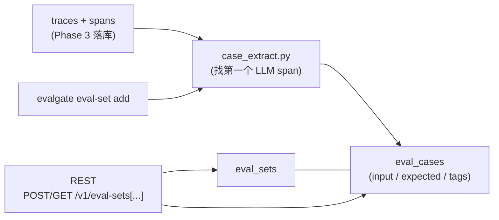

# Phase 4 技术方案 · Eval Set Manager

> 对应 [ROADMAP.md](ROADMAP.md) Phase 4。预估 1 人天 vibe coding。
> 本文档随实现演进；最终交付完成后只更新顶部状态行 + 在 [JOURNAL.md](../JOURNAL.md) 记里程碑。

**状态**：done（53/53 测试绿，lint/format clean，本地 promote 5 条 case 走通退出标准）

---

## 一句话

应用方：trace 已经躺在 DB 里 → CLI 一句 `evalgate eval-set add --from-trace <id>` → 这条 trace 里的第一个 LLM span 抽成一条 eval_case，归到指定 eval_set；REST API 列出来给后续 Phase 5 judge runner 直接消费。

## 数据流



---

## 1. DB schema：两张新表 + 0003 migration

[src/evalgate/db/models.py](../src/evalgate/db/models.py) 加两个 ORM：

- `EvalSetRow`: `id`(String PK, UUID hex) / `name`(String, indexed) / `description`(String, nullable) / `created_at`(timezone-aware, `func.now()`) / `updated_at`(`func.now()` + onupdate)
- `EvalCaseRow`: `id`(String PK, UUID hex) / `eval_set_id`(String FK → eval_sets.id, CASCADE delete, indexed) / `task_type`(String, default "generic") / `input`(JSONB) / `expected`(JSONB, nullable) / `tags`(JSONB list, default `[]`) / `source_trace_id`(String, indexed, **soft ref 不做 FK**) / `source_span_id`(String, nullable) / `created_at`

> **tags 用 JSONB 不用 PG `TEXT[]`**：跟 ADR-002 + Phase 3 测试 fixture 一致（aiosqlite 不支持 PG array，但 `JsonType` 已经做了 SQLite fallback）。
>
> **source_trace_id 不做 FK**：trace 后续会有保留期/归档策略，eval_case 必须独立于 trace 生命周期存在。软引用 + 索引就够。

新建 [src/evalgate/db/migrations/versions/0003_create_eval_sets.py](../src/evalgate/db/migrations/versions/0003_create_eval_sets.py)，PG 用 JSONB + 索引（`ix_eval_cases_eval_set_id`、`ix_eval_cases_source_trace_id`、`ix_eval_sets_name`）。

## 2. 从 trace 抽 case：[src/evalgate/ingest/case_extract.py](../src/evalgate/ingest/case_extract.py)（新建）

纯函数 + `SpanLike` Protocol，输入可以是 ORM 行也可以是 pydantic `Span`，单测无需 DB。

策略：

1. 按 `start_time` 升序排序 spans，找第一个 LLM span：`evalgate.kind == "llm"` OR `span.kind == "llm"` OR attributes 里有任意 `gen_ai.*` key。
2. `input`：优先 `gen_ai.prompt` / `gen_ai.request.messages` / `messages` / `prompt` / `input`，否则收集所有 `gen_ai.request.*` + `gen_ai.input.*`，最后兜底 dump 全部 attributes。
3. `expected`：`gen_ai.response.content` / `gen_ai.completion` / `gen_ai.response` / `response` / `output` 任一。
4. `task_type` 启发式：trace 里有 `evalgate.kind == "retriever"` 的 span → `rag`；有 ≥2 个 `evalgate.kind == "tool"` 的 span → `agent`；否则 `generic`。
5. `tags`：从根 span（无 parent）抽 `evalgate.tags` / `evalgate.tag`（list 或单 str 都接受）。caller 可追加。
6. 找不到 LLM span → raise `NoLLMSpanError`（API 返 422）。

## 3. Repository：[src/evalgate/eval_set/repository.py](../src/evalgate/eval_set/repository.py)（新建）

跟 [src/evalgate/ingest/persistence.py](../src/evalgate/ingest/persistence.py) 同款 — 一组 `async def` + `AsyncSession`，纯方言无关（用 ORM `session.add` + `select`，不走 `pg_insert`）：

- `create_eval_set(session, name, description) -> EvalSetRow`
- `list_eval_sets(session, limit, since) -> list[EvalSetRow]`
- `get_eval_set(session, set_id) -> EvalSetRow | None`
- `resolve_set_id(session, identifier) -> str`：UUID 优先，找不到再按 name 最新匹配
- `list_cases(session, set_id) -> list[EvalCaseRow]`
- `add_case(session, ...) -> EvalCaseRow`
- `add_case_from_trace(session, set_id, trace_id, extra_tags, task_type_override) -> EvalCaseRow`
  - 内部：调 `persistence.get_trace` 拉 spans → 调 `case_extract.extract_case_from_trace` → `add_case`

定义了 `EvalSetNotFoundError` / `TraceNotFoundError`，并 re-export `NoLLMSpanError`。

## 4. API router：[src/evalgate/api/routers/eval_sets.py](../src/evalgate/api/routers/eval_sets.py)（新建）

- `POST /v1/eval-sets` body `{name, description?}` → 201 + `EvalSetOut`
- `GET  /v1/eval-sets?limit=&since=` → 列表
- `GET  /v1/eval-sets/{set_id_or_name}` → set meta + 全部 cases
- `POST /v1/eval-sets/{set_id_or_name}/cases` → 手工 case 落库
- `POST /v1/eval-sets/{set_id_or_name}/cases/from-trace/{trace_id}` → 从 trace promote

错误约定：set 不存在 → 404；trace 不存在 → 404；trace 无 LLM span → 422 `{detail: "no LLM span ..."}`。沿用 Phase 3 的 `SessionDep = Annotated[AsyncSession, Depends(get_session)]`。

## 5. CLI：扩 [src/evalgate/cli.py](../src/evalgate/cli.py)

走**直连 DB 模式**（跟现有 `evalgate gate` 一致，零 HTTP 依赖）：

```bash
evalgate eval-set create --name billing-regress [--description "..."]
evalgate eval-set add    --set <id-or-name> --from-trace <trace_id> [--tag t1 --tag t2] [--task-type rag|agent|generic]
evalgate eval-set show   --set <id-or-name>
```

CLI 通过 `evalgate.db.session.SessionLocal` 拿 session，错误以 `{"error": ..., "detail": ...}` JSON 输出 + 非零 exit code。测试侧 `monkeypatch.setattr(cli, "SessionLocal", db_session_factory)` 注入 aiosqlite。

## 6. schemas 对齐

[src/evalgate/core/schemas.py](../src/evalgate/core/schemas.py)：

- `EvalCase.task_kind` → `task_type`（`TaskKind` enum 名保留）
- 加 `source_trace_id`、`source_span_id`、`created_at`
- 新增 `EvalSetOut`、`EvalCaseOut`、`EvalSetDetail`（API response shape，跟 ORM row 解耦）

## 7. 测试

全部走 Phase 3 的 aiosqlite fixture，不需要 docker / PG。

- [tests/test_case_extract.py](../tests/test_case_extract.py)：纯函数 8 个 case（generic / rag / agent / override / tag dedup / fallback input / 找不到 LLM / 空 spans）
- [tests/test_eval_sets_crud.py](../tests/test_eval_sets_crud.py)：create / list / manual add case / by-name lookup
- [tests/test_eval_sets_from_trace.py](../tests/test_eval_sets_from_trace.py)：promote 单条 + 按 name 解析 + **退出标准 5 条 case 验证**
- [tests/test_eval_sets_404.py](../tests/test_eval_sets_404.py)：4 种错误路径（set / trace / no-LLM-span）
- [tests/test_eval_sets_cli.py](../tests/test_eval_sets_cli.py)：CLI 四件套（create / show 缺失 / add 缺失 trace / 端到端 promote + show）

## 8. 退出标准（已达成）

- `make test`：53/53 绿
- `make lint`：clean
- 本地手动验证：5 trace → 5 promoted case，`evalgate eval-set show` + `curl /v1/eval-sets/demo` 都返回 5 条 case，每条 case 有非空 `input`
- commit message：`feat(eval-set,api,cli): eval set manager + from-trace case extraction`

## 9. 风险点 / 范围控制

- **`gen_ai.*` semantic convention 还在演进**：抽 case 时 5-key fallback + 最后 dump 全部 attributes，对版本演进比较 robust。
- **case 去重**：同一 trace promote 两次会生成两条 case。本期接受重复，Phase 7 BadCase finder 再处理。
- **list 排序在 SQLite 上不可靠**：`func.now()` SQLite 是秒级，同秒插入的 set 顺序非确定。测试只断言成员，不断言顺序；生产 Postgres 是 µs 级，没事。
- **不做的事**：eval_set / case 删除 / 修改；分页 cases（< 1000 假设）；prompt 字段（按 ADR-003 prompt 不归 eval_set 管）；CLI 走 HTTP（保留直连 DB）。

## 10. docker 小插曲（独立于 Phase 4）

terminal 截图里 `make db-up` 报 `docker: No such file or directory`。Phase 4 测试不需要 docker（aiosqlite），但如果要本地跑真 Postgres，要装 Docker Desktop / OrbStack / colima 任意一个。
