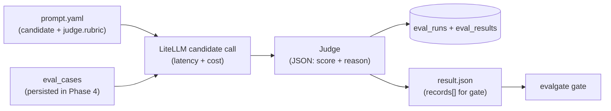

# Phase 5 design · Generic LLM-as-Judge Runner v1 (LiteLLM)

> Paths match **current code**: the runner moved from `judge/runner.py` to [src/evalgate/evaluator/runner.py](../src/evalgate/evaluator/runner.py) (Phase 8 introduced `EvaluatorRouter`). The single-judge `RubricJudge` described here was split in Phase 6 into [pointwise.py](../src/evalgate/judge/pointwise.py) + [pairwise.py](../src/evalgate/judge/pairwise.py). This doc focuses on runner v1's core ideas and choices, which still hold.

## In one sentence

`evalgate run --eval-set X --prompt p.yaml --out r.json` → for each case in the eval set, run the candidate LLM from `p.yaml` to produce output, then have a judge emit `score ∈ [0,1] + reason`; persist `eval_runs / eval_results` and write JSON in the `evalgate gate` input shape. One baseline run and one candidate run feed the gate for a four-axis report. This is the smallest closed loop from "a prompt" to "a comparable score."

## Data flow



For each case the runner does "candidate generation → judge score → persist + yield," then aggregates into a `RunResult`.

## Core design

- **Rubric lives in prompt.yaml**: candidate prompt and scoring rubric go to git together; `eval_set` gets no extra field and no migration.
- **Judge sees only `(input, output)`**, not `case.expected`—reference-free scoring. Reference-based scoring waits for Phase 6/8.
- **CLI talks to the DB directly** (Phase 4 style), zero HTTP dependency.
- **safety axis v1 is always false**; real signal lands in Phase 10.

### Mock switch

- CLI `--mock` or env `EVALGATE_MOCK_LLM=1` → every litellm call uses `mock_response=`, offline and deterministic (for CI; see ADR-009).
- Default uses the real model in prompt.yaml (local Ollama).

## 1. prompt.yaml schema

Stored under [examples/prompts/](../examples/prompts/). Validation in [src/evalgate/judge/prompt_spec.py](../src/evalgate/judge/prompt_spec.py): pydantic `PromptSpec` / `CandidateSpec` / `JudgeSpec`, loaded with `pyyaml`; `render(case_input)` returns a messages list via `str.format_map` + `defaultdict(str)` so missing fields are tolerated.

```yaml
name: billing-v1
candidate:
  model: ollama/qwen2.5:7b
  system: "You are a careful billing assistant."
  user_template: "User question: {question}"   # {field} from case.input dict
  params: { temperature: 0.0 }
judge:
  model: ollama/qwen2.5:7b
  rubric: |
    Rate the assistant's answer from 0 to 1 on correctness and helpfulness.
    Return STRICT JSON: {"score": <0..1>, "reason": "<one sentence>"}
  params: { temperature: 0.0 }
```

> Note: Phase 6 changes singular `judge:` to plural `judges: [...]` + `judge_policy:` (multi-judge). This shows the v1 single-judge shape.

## 2. Judge (v1 RubricJudge)

- Single responsibility: `async def score(input, output, *, spec) -> JudgeScore`
- Internally `litellm.acompletion(..., response_format={"type": "json_object"})`, prompt = `rubric` + `INPUT/OUTPUT`
- **Three-level parse fallback**: `json.loads` → regex `r"\"?score\"?\s*:\s*([0-9.]+)"` → if both fail, `score=0.0` + `reason=raw_text`
- Scores clamped to `[0, 1]`

The point of the fallback: **a single case's judge parse failure must not kill the whole run**.

## 3. Candidate call + metering: [judge/candidate.py](../src/evalgate/judge/candidate.py)

`run_candidate(case_input, spec) -> CandidateOutput`: render messages → `litellm.acompletion(...)`; `latency_ms` wraps the call with `time.perf_counter`; `cost_usd` prefers `litellm.completion_cost(...)`, else fallback `0.0`. Returns `CandidateOutput(text, latency_ms, cost_usd, raw)`.

## 4. Runner (streaming + thin wrapper)

```python
async def iter_eval(session, *, eval_set_id, spec, run_id, mock=False) -> AsyncIterator[EvalRecord]:
    """Yield EvalRecord one by one (persist + yield)."""

async def run_eval(session, *, eval_set_id, prompt_path, judge_model_override=None,
                   limit=None, mock=False) -> RunResult:
    """Collect all iter_eval results → finalize_run → return RunResult."""
```

Records strictly follow the `EvalRecord` model: `case_id` / `tags` / `score` / `cost_usd` / `latency_ms` (v1 also has boolean `safety_violation`; from Phase 10 it moves into `axis_breakdown["safety"]` and is dropped by migration 0011).

> **`iter_eval` is an `AsyncIterator`; `run_eval` is a thin wrapper**: this is the interface reserved for Phase 15 Sequential Gate (evaluate while running, stop early when evidence is enough). Sequential gating can consume this stream without a runner rewrite.

## 5. DB schema + 0004 migration

[db/models.py](../src/evalgate/db/models.py) adds two tables:

- `EvalRunRow`: `id` / `eval_set_id` (FK, CASCADE, indexed) / `prompt_path` / `prompt_hash` / `candidate_model` / `judge_model` / `total_cases` / `mean_score` (nullable) / `created_at`
- `EvalResultRow`: `id` / `eval_run_id` (FK, CASCADE, indexed) / `eval_case_id` (soft reference / nullable) / `tags` / `output` (`{"text": ...}`) / `score` / `reason` / `cost_usd` / `latency_ms` / `judge_confidence` (float, nullable, **reserved for Phase 16**) / `judge_raw` (JSONB, nullable, **reserved for Phase 16 calibration recompute**) / `created_at`

Migration [0004_create_eval_runs.py](../src/evalgate/db/migrations/versions/0004_create_eval_runs.py): JSONB on PG; indexes `ix_eval_results_eval_run_id`, `ix_eval_runs_eval_set_id`. `EvalRecord` pydantic model is added to [core/schemas.py](../src/evalgate/core/schemas.py), freezing the gate JSON record shape (Phase 13 shadow `/v1/shadow/observe` reuses it directly).

## 6. Repository: [judge/persistence.py](../src/evalgate/judge/persistence.py)

Own file (separation of concerns; not stuffed into `eval_set/repository.py`): `create_run` / `add_result` / `finalize_run` (aggregate mean_score) / `get_run` / `list_results`.

## 7. CLI

```bash
evalgate run --eval-set <id-or-name> --prompt examples/prompts/billing_v1.yaml \
  --out runs/candidate.json [--judge-model ...] [--mock] [--limit 20]
```

Behavior: call `run_eval` → write `RunResult.records` as `{"records": [...]}` to `--out`; stdout prints `{run_id, eval_set_id, total_cases, mean_score}`. Exit codes: `EvalSetNotFoundError` → 1; prompt.yaml validation failure → 2.

## Technical choices

### 1. LiteLLM as the unified LLM call layer (ADR-008)

- **Decision**: every external LLM call goes through LiteLLM `completion()` / `acompletion()`.
- **Alternative**: each vendor SDK (openai / anthropic / google) separately; or a homegrown thin wrapper.
- **Why**: (1) One interface covers 100+ providers; adding / switching models is free—this is the direct prerequisite for Phase 6 multi-judge **cross-vote** (different model families vote to cancel single-model preference). (2) Built-in retry / fallback / `completion_cost` tracking. (3) Built-in `mock_response=` so CI can test offline and deterministically without burning API quota.
- **Cost**: an extra abstraction; a few provider-specific features (e.g. Anthropic prompt caching) need a workaround; we depend on LiteLLM's maintenance pace (currently very active).

### 2. Rubric in prompt.yaml, not in the DB

- **Decision**: scoring rubric and candidate prompt share a file and go to git together.
- **Alternative**: add a rubric field on `eval_set`, migrate, store scoring rules in the DB.
- **Why**: matches ADR-003 "prompt as config (git-native)"—the rubric is part of "how this eval scores," so it should be versioned and code-reviewed with the prompt under test, not scattered in DB rows. The eval_set stays "samples only, no scoring logic."
- **Cost**: the same eval_set with different rubrics needs multiple yaml files; rubric reuse is by file, not DB reference.

### 3. v1 is serial: no parallelism / retry / cache

- **Decision**: runner v1 is serial, relies on litellm's default timeout, no concurrency / retry / judge cache.
- **Why**: 100 cases × ~2s ≈ 3 min is fine for local validation. Land the data flow and freeze the `EvalRecord` contract first; complexity (concurrency / Semaphore) waits until Phase 6 actually needs multi-judge.
- **Cost**: large eval sets are slow. A conscious "correct first, optimize later" trade-off.

### 4. Cost axis is 0 for local models

- **Background**: `litellm.completion_cost` returns None for Ollama and other local models, so we fall back to `0.0`. Local demo cost axis is always 0—expected. Real cost appears with cloud models or later token estimates.

## Test strategy

Throughout: aiosqlite + `litellm.mock_response=`; CI never calls a real model (ADR-009). Coverage: prompt_spec load/tolerance, three-level judge parse (including clamp), candidate metering, runner persist row counts and field completeness. **End-to-end invariant**: run the runner twice (baseline / candidate) → `build_gate_report` → four axes non-null, and the `--out` file can be fed straight to `evalgate gate`.

## Forward-compat: interfaces reserved for later highlight phases

| For Phase | What we do now | Benefit |
|-----------|----------------|---------|
| **15 Sequential Gate** | `iter_eval` is `AsyncIterator[EvalRecord]`; `run_eval` is a thin wrapper | Sequential gate consumes the stream; no runner rewrite |
| **16 Judge Calibration** | `EvalResultRow.judge_raw` stores the full litellm response (usage / model version) | Recalibrate without re-running the judge |
| **16 Judge Calibration** | `EvalResultRow.judge_confidence: float \| None` (v1 writes None) | Avoid a later migration |
| **13 Shadow Mode** | `EvalRecord` field names frozen in `core/schemas.py` | `/v1/shadow/observe` payload reused as-is |
