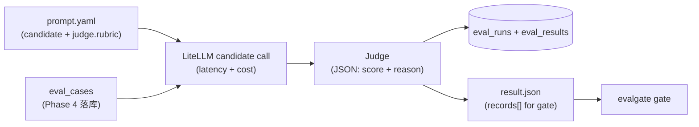

# Phase 5 技术方案 · Generic LLM-as-Judge Runner v1（LiteLLM）

> 路径以**当前代码**为准：runner 已从 `judge/runner.py` 移到 [src/evalgate/evaluator/runner.py](../src/evalgate/evaluator/runner.py)（Phase 8 引入 `EvaluatorRouter`）；本文档描述的单 judge `RubricJudge` 已在 Phase 6 拆成 [pointwise.py](../src/evalgate/judge/pointwise.py) + [pairwise.py](../src/evalgate/judge/pairwise.py)。本文聚焦 runner v1 的核心思路与选型，仍然成立。

## 一句话

`evalgate run --eval-set X --prompt p.yaml --out r.json` → 对 eval set 里每条 case，用 `p.yaml` 跑一次候选 LLM 出 output，再用 judge 打 `score ∈ [0,1] + reason`；同步落 `eval_runs / eval_results` 两表，并写出符合 `evalgate gate` 输入格式的 JSON。baseline / candidate 各跑一次就能直接喂 gate 出四轴报告。这是把「一个 prompt」变成「一份可比较评分」的最小闭环。

## 数据流



runner 对每条 case 做「候选生成 → judge 打分 → 落库 + yield」，最终聚成一份 `RunResult`。

## 核心设计

- **Rubric（评分标准）写在 prompt.yaml 里**：候选 prompt 和评分标准一起进 git，`eval_set` 不加字段、不发 migration。
- **Judge 只看 `(input, output)`**，不读 `case.expected`，即 reference-free（无参考答案）打分。reference-based（带参考答案）留到 Phase 6/8。
- **CLI 直连 DB**（沿用 Phase 4 风格），零 HTTP 依赖。
- **safety 轴 v1 一律 false**，留到 Phase 10 落地真信号。

### Mock 开关

- CLI 加 `--mock` 或环境变量 `EVALGATE_MOCK_LLM=1` → 所有 litellm 调用走 `mock_response=`，离线确定性（CI 用，见 ADR-009）。
- 默认走 prompt.yaml 里的真模型（本机 Ollama）。

## 1. prompt.yaml schema

存放路径：[examples/prompts/](../examples/prompts/)。校验在 [src/evalgate/judge/prompt_spec.py](../src/evalgate/judge/prompt_spec.py)：pydantic `PromptSpec` / `CandidateSpec` / `JudgeSpec`，加载用 `pyyaml`；`render(case_input)` 返回 messages 列表，用 `str.format_map` + `defaultdict(str)` 容忍缺字段。

```yaml
name: billing-v1
candidate:
  model: ollama/qwen2.5:7b
  system: "You are a careful billing assistant."
  user_template: "User question: {question}"   # {field} 从 case.input dict 取
  params: { temperature: 0.0 }
judge:
  model: ollama/qwen2.5:7b
  rubric: |
    Rate the assistant's answer from 0 to 1 on correctness and helpfulness.
    Return STRICT JSON: {"score": <0..1>, "reason": "<one sentence>"}
  params: { temperature: 0.0 }
```

> 注：Phase 6 把单数 `judge:` 改为复数 `judges: [...]` + `judge_policy:`（multi-judge）。这里展示的是 v1 的单 judge 形态。

## 2. Judge（v1 RubricJudge）

- 单一职责：`async def score(input, output, *, spec) -> JudgeScore`
- 内部 `litellm.acompletion(..., response_format={"type": "json_object"})`，prompt = `rubric` + `INPUT/OUTPUT`
- **解析容错三级**：`json.loads` → regex `r"\"?score\"?\s*:\s*([0-9.]+)"` 兜底 → 都失败给 `score=0.0` + `reason=raw_text`
- 分数 clamp 到 `[0, 1]`

容错的目的是：**单条 case 的 judge 解析失败不能炸掉整个 run**。

## 3. Candidate 调用 + 计量：[judge/candidate.py](../src/evalgate/judge/candidate.py)

`run_candidate(case_input, spec) -> CandidateOutput`：渲染 messages → `litellm.acompletion(...)`；`latency_ms` 用 `time.perf_counter` 包住调用；`cost_usd` 优先 `litellm.completion_cost(...)`，拿不到 fallback `0.0`。返回 `CandidateOutput(text, latency_ms, cost_usd, raw)`。

## 4. Runner（流式 + 薄包装）

```python
async def iter_eval(session, *, eval_set_id, spec, run_id, mock=False) -> AsyncIterator[EvalRecord]:
    """逐条产出 EvalRecord（直接落库 + yield）。"""

async def run_eval(session, *, eval_set_id, prompt_path, judge_model_override=None,
                   limit=None, mock=False) -> RunResult:
    """收集 iter_eval 全部结果 → finalize_run → 返回 RunResult。"""
```

记录严格遵守 `EvalRecord` 模型：`case_id` / `tags` / `score` / `cost_usd` / `latency_ms`（v1 还有 `safety_violation` 布尔，Phase 10 起移入 `axis_breakdown["safety"]`，由 migration 0011 删除）。

> **`iter_eval` 设计成 `AsyncIterator`、`run_eval` 是薄包装**：这是给 Phase 15 Sequential Gate（序贯门禁，边跑边判、证据足够就提前停）留的接口 —— 序贯门禁可以直接消费这个 stream，runner 不必重构。

## 5. DB schema + 0004 migration

[db/models.py](../src/evalgate/db/models.py) 加两表：

- `EvalRunRow`：`id` / `eval_set_id`(FK, CASCADE, indexed) / `prompt_path` / `prompt_hash` / `candidate_model` / `judge_model` / `total_cases` / `mean_score`(nullable) / `created_at`
- `EvalResultRow`：`id` / `eval_run_id`(FK, CASCADE, indexed) / `eval_case_id`(软引用 / nullable) / `tags` / `output`(`{"text": ...}`) / `score` / `reason` / `cost_usd` / `latency_ms` / `judge_confidence`(float, nullable，**预留 Phase 16**) / `judge_raw`(JSONB, nullable，**预留 Phase 16 重算 calibration**) / `created_at`

迁移 [0004_create_eval_runs.py](../src/evalgate/db/migrations/versions/0004_create_eval_runs.py)：PG 用 JSONB；索引 `ix_eval_results_eval_run_id`、`ix_eval_runs_eval_set_id`。`EvalRecord` pydantic model 加进 [core/schemas.py](../src/evalgate/core/schemas.py)，固化 gate JSON 的 record 形状（Phase 13 shadow `/v1/shadow/observe` 直接复用）。

## 6. Repository：[judge/persistence.py](../src/evalgate/judge/persistence.py)

单独成文件（关注点分离，不挤进 `eval_set/repository.py`）：`create_run` / `add_result` / `finalize_run`（汇总 mean_score）/ `get_run` / `list_results`。

## 7. CLI

```bash
evalgate run --eval-set <id-or-name> --prompt examples/prompts/billing_v1.yaml \
  --out runs/candidate.json [--judge-model ...] [--mock] [--limit 20]
```

行为：调 `run_eval` → `RunResult.records` 写成 `{"records": [...]}` 到 `--out`；stdout 打印 `{run_id, eval_set_id, total_cases, mean_score}` 概要。退出码：`EvalSetNotFoundError` → 1；prompt.yaml 校验失败 → 2。

## 技术选型与抉择

### 1. LiteLLM 作为统一 LLM 调用层（对应 ADR-008）

- **决策**：所有外部 LLM 调用走 LiteLLM 的 `completion()` / `acompletion()` 统一接口。
- **备选**：各家官方 SDK（openai / anthropic / google）各写一遍；或自建薄封装。
- **为什么**：(1) 一个接口覆盖 100+ provider，加 / 切模型零成本 —— 这是 Phase 6 multi-judge **cross-vote（跨模型投票，用不同家族模型互投以抵消单模型偏好）** 的直接前提。(2) 自带 retry / fallback / `completion_cost` 成本追踪，省去自己写。(3) 自带 `mock_response=`，CI 可离线确定性测试，不烧 API quota。
- **代价**：多一层抽象，极少数 provider-specific feature（如 Anthropic prompt caching）要绕一下；依赖 LiteLLM 的维护节奏（目前非常活跃）。

### 2. Rubric 进 prompt.yaml，不进 DB

- **决策**：评分标准与候选 prompt 同文件、一起进 git。
- **备选**：给 `eval_set` 加 rubric 字段、发 migration，把评分标准存 DB。
- **为什么**：呼应 ADR-003「prompt 当配置文件（git-native）」—— 评分标准是「这次评测怎么打分」的一部分，理应和被评测的 prompt 一起版本化、走 code review，而不是散落在 DB 行里。eval_set 因此保持「只装样本、不装评分逻辑」的纯粹。
- **代价**：同一 eval_set 用不同 rubric 评测时要维护多个 yaml；rubric 复用靠文件而非 DB 引用。

### 3. v1 串行、不做并行 / 重试 / 缓存

- **决策**：runner v1 串行跑，依赖 litellm 默认 timeout，不做并发 / 重试 / judge 缓存。
- **为什么**：100 case × ~2s ≈ 3 min，本地验证完全可接受；先把数据流跑通、把 `EvalRecord` 契约固化，复杂度（并发 / Semaphore）留给 Phase 6 真正需要 multi-judge 时再引入。
- **代价**：大 eval set 慢。这是有意识的「先正确、后优化」取舍。

### 4. cost 轴对本地模型为 0

- **背景**：`litellm.completion_cost` 对 Ollama 等本地模型返回 None，fallback 成 `0.0`，本地 demo 的 cost 轴恒为 0 —— 这是预期行为，云模型或后续 token 估算才会有真实成本。

## 测试策略

全程 aiosqlite + `litellm.mock_response=`，CI 不真调模型（见 ADR-009）。覆盖 prompt_spec 加载/容错、judge 解析三级容错（含分数 clamp）、candidate 计量、runner 落库行数与字段完整性。**端到端不变量**：跑两次 runner（baseline / candidate）→ `build_gate_report` → 四轴非 null，且 `--out` 文件能直接喂 `evalgate gate`。

## Forward-compat：给后续亮点 phase 留的接口

| For Phase | 现在做的事 | 收益 |
|-----------|----------|------|
| **15 Sequential Gate** | `iter_eval` 是 `AsyncIterator[EvalRecord]`，`run_eval` 是薄包装 | 序贯门禁直接消费 stream，runner 不重构 |
| **16 Judge Calibration** | `EvalResultRow.judge_raw` 存全量 litellm response（含 usage / 模型版本） | 重算 calibration 不用重跑 judge |
| **16 Judge Calibration** | `EvalResultRow.judge_confidence: float \| None`（v1 写 None） | 避免后续再发 migration |
| **13 Shadow Mode** | `EvalRecord` 在 `core/schemas.py` 固化字段名 | `/v1/shadow/observe` payload 直接复用 |
