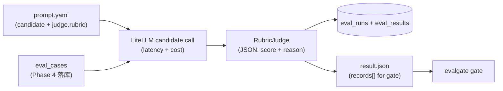

# Phase 5 技术方案 · Generic LLM-as-Judge Runner v1（LiteLLM）

> 对应 [ROADMAP.md](ROADMAP.md) Phase 5。预估 1 人天 vibe coding。
> 本文档随实现演进；最终交付完成后只更新顶部状态行 + 在 [JOURNAL.md](../JOURNAL.md) 记里程碑。

**状态**：done（72/72 测试绿，lint/format clean；本地 Ollama qwen2.5:7b 端到端 demo 验证通过）

---

## 一句话

`evalgate run --eval-set X --prompt p.yaml --out r.json` → 对 eval set 里每条 case，用 `p.yaml` 跑一次候选 LLM 出 output，再用 RubricJudge 打 `score ∈ [0,1] + reason`；同步落 `eval_runs / eval_results` 两表，并写出符合 Phase 2 `evalgate gate` 输入格式的 JSON。baseline / candidate 各跑一次就能直接喂 gate 出 4 轴报告。

## 数据流



---

## 关键设计决策（已与用户对齐）

- **Rubric 在 prompt.yaml 里**：候选 prompt 和评分标准一起进 git，eval_set 不加字段、不发 migration。
- **Judge 只看 `(input, output)`**，不读 `case.expected`。reference-based 留到 Phase 6/8。
- **CLI 直连 DB**（沿用 Phase 4 风格），零 HTTP 依赖，CI 友好。
- **CI / 单测全程 `litellm.mock_response=`**，不引 record-replay 库。
- **safety 轴 v1 一律 false**，留到 Phase 10 落地真信号。
- **本地真 LLM 用本机 Ollama**：candidate + judge 均 `ollama/qwen2.5:7b`（已 `ollama list` 检测到）。

## 本地 LLM：Ollama（已确认选型）

| 模型 | 用途 |
|------|------|
| **`qwen2.5:7b`** | **candidate + judge（默认）** |
| `qwen2.5:32b` | 可选升级：裁判更稳但更慢（19GB） |
| `agent-sft-qwen:latest` | 可选：agent 场景 candidate，不当 judge |
| `qwen3-embedding:8b` | 不用，embedding 不能 completion |

LiteLLM 约定：`model: ollama/qwen2.5:7b`；默认 `api_base=http://localhost:11434`，无需在 YAML 中重复写。

Mock 开关：

- CLI 加 `--mock` 或环境变量 `EVALGATE_MOCK_LLM=1` → 所有 litellm 调用走 `mock_response=`
- 默认（未设 mock）走 prompt.yaml 里的真 Ollama 模型

---

## 1. prompt.yaml schema

存放路径：[examples/prompts/](../examples/prompts/)

```yaml
name: billing-v1
candidate:
  model: ollama/qwen2.5:7b
  system: "You are a careful billing assistant."
  user_template: "User question: {question}"   # {field} 直接从 case.input dict 取
  params: { temperature: 0.0 }
judge:
  model: ollama/qwen2.5:7b
  rubric: |
    Rate the assistant's answer from 0 to 1 on correctness and helpfulness.
    Return STRICT JSON: {"score": <0..1>, "reason": "<one sentence>"}
  params: { temperature: 0.0 }
```

校验放在 [src/evalgate/judge/prompt_spec.py](../src/evalgate/judge/prompt_spec.py)：pydantic `PromptSpec` / `CandidateSpec` / `JudgeSpec`，加载用 `pyyaml`；`render(case_input)` 返回 messages 列表，用 `str.format_map` + `defaultdict(str)` 容忍缺字段。

## 2. RubricJudge

文件：[src/evalgate/judge/rubric_judge.py](../src/evalgate/judge/rubric_judge.py)

- 单一职责：`async def score(input: dict, output: str, *, spec: JudgeSpec) -> JudgeScore`
- 内部 `litellm.acompletion(..., response_format={"type": "json_object"})`，prompt = `rubric` + `f"INPUT: ...\nOUTPUT: ..."`
- 解析顺序：`json.loads` → regex `r"\"?score\"?\s*:\s*([0-9.]+)"` 兜底 → 都失败给 `score=0.0`、`reason=raw_text`
- 分数 clamp 到 `[0, 1]`

## 3. Candidate 调用 + 计量

文件：[src/evalgate/judge/candidate.py](../src/evalgate/judge/candidate.py)

`async def run_candidate(case_input: dict, spec: CandidateSpec) -> CandidateOutput`：

- 渲染 messages → `litellm.acompletion(...)`
- `latency_ms`：`time.perf_counter` 包住调用
- `cost_usd`：优先 `litellm.completion_cost(completion_response=resp)`，拿不到 fallback `0.0`
- 返回 `CandidateOutput(text, latency_ms, cost_usd, raw)`

## 4. Runner（流式 + 薄包装）

文件：[src/evalgate/judge/runner.py](../src/evalgate/judge/runner.py)

```python
async def iter_eval(session, *, eval_set_id, spec, run_id, mock=False) -> AsyncIterator[EvalRecord]:
    """逐条产出 EvalRecord（直接落库 + yield）。Phase 16 Sequential Gate 直接消费。"""

async def run_eval(session, *, eval_set_id, prompt_path, judge_model_override=None,
                   limit=None, mock=False) -> RunResult:
    """收集 iter_eval 全部结果 → finalize_run → 返回 RunResult。"""
```

records 元素严格遵守 `EvalRecord` 模型（见 §5）：

```python
{
  "case_id": "<eval_case.id>",
  "tags": [...],
  "score": 0.87,
  "cost_usd": 0.0012,
  "latency_ms": 643,
  "safety_violation": False,   # Phase 5 字段；Phase 10 起 safety 移入 axis_breakdown["safety"]，此布尔由 0011 删除
}
```

并行 / 重试 / 超时不做：v1 串行 + litellm 默认 timeout，复杂度留给 Phase 6。

## 5. DB schema + 0004 migration

[src/evalgate/db/models.py](../src/evalgate/db/models.py) 加两表：

- `EvalRunRow`：`id` / `eval_set_id`(FK eval_sets, CASCADE, indexed) / `prompt_path` / `prompt_hash` / `candidate_model` / `judge_model` / `total_cases` / `mean_score` (nullable) / `created_at`
- `EvalResultRow`：`id` / `eval_run_id`(FK eval_runs, CASCADE, indexed) / `eval_case_id`(soft ref / nullable) / `tags`(JsonType) / `output`(JsonType, `{"text": ...}`) / `score` / `reason` / `cost_usd` / `latency_ms` / `safety_violation`（Phase 5 字段，已由 migration 0011 删除，safety 现走 `axis_breakdown["safety"]`）/ `judge_confidence`(float, nullable，**预留给 Phase 17**) / `judge_raw`(JsonType nullable，**预留给 Phase 17 重算 calibration**) / `created_at`

新建 [src/evalgate/db/migrations/versions/0004_create_eval_runs.py](../src/evalgate/db/migrations/versions/0004_create_eval_runs.py)：PG 用 JSONB；索引 `ix_eval_results_eval_run_id`、`ix_eval_runs_eval_set_id`。

[src/evalgate/core/schemas.py](../src/evalgate/core/schemas.py) 新增 `EvalRecord` pydantic model，固化 gate JSON 的 record 形状（Phase 18 shadow `/v1/shadow/observe` 直接复用）。

## 6. Repository

文件：[src/evalgate/judge/persistence.py](../src/evalgate/judge/persistence.py)

不挤进 `eval_set/repository.py`：关注点分离。

- `create_run(session, *, eval_set_id, prompt_path, prompt_hash, candidate_model, judge_model) -> EvalRunRow`
- `add_result(session, *, run_id, case_id, tags, output_text, score, reason, cost_usd, latency_ms, judge_raw) -> EvalResultRow`
- `finalize_run(session, run_id, total_cases, mean_score)`：汇总
- `get_run` / `list_results`：v1 实现，CLI 暂不接

## 7. CLI

[src/evalgate/cli.py](../src/evalgate/cli.py) 加：

```bash
evalgate run \
  --eval-set <id-or-name> \
  --prompt examples/prompts/billing_v1.yaml \
  --out runs/candidate.json \
  [--judge-model ollama/qwen2.5:7b] \
  [--mock] \
  [--limit 20]
```

行为：调 `runner.run_eval` → `RunResult.records` 写成 `{"records": [...]}` 到 `--out`；stdout 打印 `{run_id, eval_set_id, total_cases, mean_score}` 概要。

退出码：

- `EvalSetNotFoundError` → exit 1 + JSON error
- prompt.yaml 校验失败 → exit 2

## 8. 测试（全部 aiosqlite，CI 不真调）

litellm 通过 `mock_response="..."` 兜底，必要时 `monkeypatch` 直接打桩 `litellm.acompletion`。

- [tests/test_prompt_spec.py](../tests/test_prompt_spec.py)：YAML 加载 / 缺字段 / render 容忍
- [tests/test_rubric_judge.py](../tests/test_rubric_judge.py)：合法 JSON → 正常 score；文本兜底 regex；分数 1.5 → clamp 到 1
- [tests/test_candidate_call.py](../tests/test_candidate_call.py)：`latency_ms > 0`；`completion_cost` 异常 → `cost_usd=0.0`
- [tests/test_judge_runner.py](../tests/test_judge_runner.py)：种 1 set + 3 cases，runner 落 3 行 result + records 字段齐
- [tests/test_judge_runner_to_gate.py](../tests/test_judge_runner_to_gate.py)：跑两次 runner → `build_gate_report` → 4 轴非 null（覆盖退出标准）
- [tests/test_run_cli.py](../tests/test_run_cli.py)：CLI 端到端，`--out` 文件再喂 `evalgate gate` 不报错

## 9. 依赖变更

[pyproject.toml](../pyproject.toml)：

- 主依赖加 `litellm>=1.50`（从 dev 升上来：Phase 5 起 runner 是产品路径）
- 主依赖加 `pyyaml>=6`
- dev 不动

## 10. 退出标准

- `make test`：现有 53 + 新 ~12 全绿
- `make lint`：clean
- **真实数据 demo**（拿掉 fixtures，本机 Ollama 真调）：
  1. `ollama list` 含 `qwen2.5:7b`；`curl http://localhost:11434/api/tags` 通
  2. Phase 4 `demo-trace` → promote 5 条 case
  3. 写 `examples/prompts/baseline.yaml` / `candidate.yaml`，model 均 `ollama/qwen2.5:7b`，candidate 故意改弱（system 删 reasoning）
  4. **不设** `EVALGATE_MOCK_LLM`，`evalgate run` 跑两次 → `baseline.json` / `candidate.json`（~20 次 Ollama 调用）
  5. `evalgate gate --baseline baseline.json --candidate candidate.json` 出 4 轴报告
- commit message：`feat(judge,cli,db): LLM-as-judge runner v1 (litellm RubricJudge + eval_runs/eval_results)`

## 11. 风险点 / 范围控制

- **litellm `completion_cost` 对 Ollama 返 None**：fallback 0.0，本地 demo cost 轴全 0 属预期；云模型或 Phase 6 token 估算再补。
- **Ollama 7B judge 方差偏大**：功能验证够用；Phase 6/14 要对标论文方差时切 `ollama/qwen2.5:32b` 或云 judge。
- **Judge 不出合法 JSON**：rubric 显式要求 STRICT JSON + `response_format`；regex 兜底 + 都失败 → `score=0.0` 不抛异常（单条 case 失败不能炸整 run）。
- **串行慢**：100 case × 2s ≈ 3 min，可接受；并行留到 Phase 6。
- **不做的事**：rerun / 增量 / 重试、judge 缓存、cost token 估算、record-replay cassette、`evalgate run show` CLI、UI、A/B Judge（Phase 6）、RAG/Agent 评测（Phase 8/9）。

## 12. Forward-compat：给亮点 Phase 15–18 留接口

| For Phase | 现在做的事 | 收益 |
|-----------|----------|------|
| **16 Sequential Gate** | `iter_eval` 是 `AsyncIterator[EvalRecord]`，`run_eval` 是薄包装 | 后续 SequentialGate 直接消费 stream，runner 不重构 |
| **17 Judge Calibration** | `EvalResultRow.judge_raw` 存全量 litellm response（含 usage / 模型版本） | Phase 17 重算 calibration 不用重跑 judge |
| **17 Judge Calibration** | `EvalResultRow.judge_confidence: float \| None`（v1 写 None） | 避免 Phase 17 再发 migration |
| **18 Shadow Mode** | `EvalRecord` 在 `core/schemas.py` 固化字段名 | Phase 18 `/v1/shadow/observe` payload 直接复用 |

Phase 15（Adversarial）走 eval_set 那条线，本期无 forward-compat 工作。
