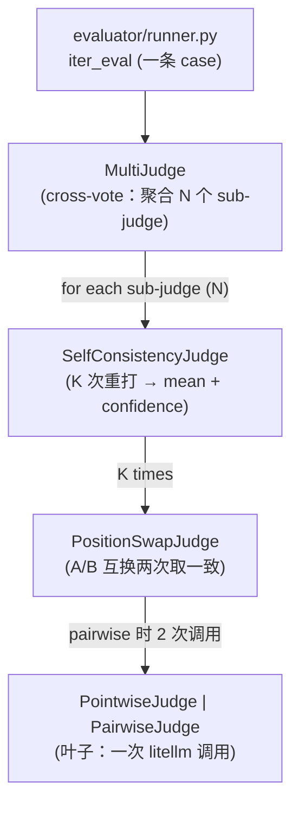
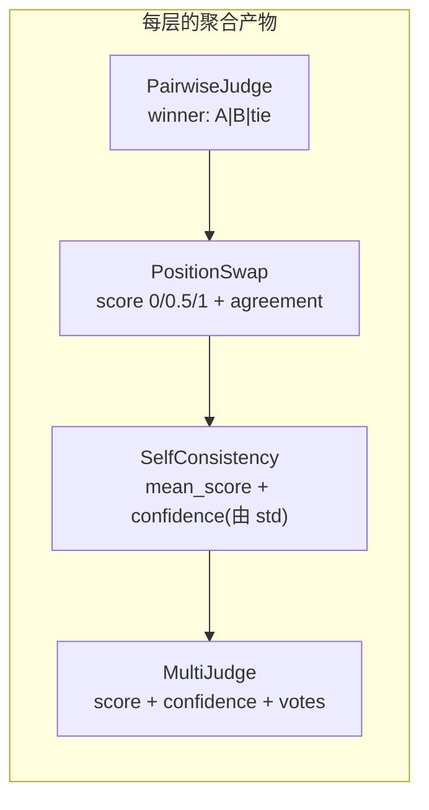

# Phase 6 技术方案 · Judge Robustness（cross-vote + position-swap + self-consistency）

> 路径以**当前代码**为准：runner 已从 `judge/runner.py` 移到 [src/evalgate/evaluator/runner.py](../src/evalgate/evaluator/runner.py)（Phase 8 引入 `EvaluatorRouter` 统一分派）；下文描述的 judge wrapper 嵌套拓扑本身不变。

## 一句话

Phase 5 是「1 个 judge 给 1 条 case 打 1 次分」，方差大、且带已知 bias。Phase 6 把它升级成「**N 个 judge × A/B 互换 × K 次重打**」的聚合分数，并把每一次原始 judge 调用都落库（新表 `eval_judge_calls`），方便后面复盘 / 标定（Phase 16/17）。这是让 gate 的「显著性判定」不被 judge 噪声主导的前提（呼应 ADR-005）。

## 三层去偏栈解决的三个问题

| 偏差 / 噪声 | 含义 | 对应机制 |
|---|---|---|
| variance（单次方差） | 同一 `(input, output)` 重打 K 次给不同分 | self-consistency |
| position bias（位置偏好，A/B 比较时偏好某一侧） | pairwise judge 偏爱先读到的答案 | position-swap |
| self-preference bias（自我偏好，模型偏爱同家族输出） | judge 偏爱与自己同源的模型输出 | cross-vote（跨模型投票） |

## Judge wrapper 嵌套（外到内）

每条 case 的评分由四层 wrapper 包裹一个 leaf judge 构成，从外到内逐层「聚合 + 去偏」：



- **pointwise 模式**：`SelfConsistencyJudge` 直接包 `PointwiseJudge`（无 PositionSwap 层，P=1）。
- **pairwise 模式**：`SelfConsistencyJudge` 包 `PositionSwapJudge` 包 `PairwiseJudge`（P=2）。

每条 case 的总调用次数：`N × K × P`（pointwise P=1；pairwise P=2）。默认 N=2、K=3、P=2 → **12 次/case**，可调。



## 各层职责

| 类 | 输入 | 输出 | 作用 |
|----|------|------|------|
| `PointwiseJudge` | input, candidate_output | `score`, `reason` | 通用打分叶子（reference-free） |
| `PairwiseJudge` | input, candidate, reference, position | `winner: A\|B\|tie`, `reason` | A/B 比较叶子，**只判胜负不出分** |
| `PositionSwapJudge` | (同上) | `score` 0/0.5/1 + `agreement` | 去 position bias |
| `SelfConsistencyJudge` | 包上述叶子 | `mean_score`, `confidence` | K 次重打，std → confidence |
| `MultiJudge` | 包 N 个 SC | `score`, `confidence`, `votes` | cross-vote 聚合 |

### 关键聚合规则（与代码一致）

- **PositionSwap**（[position_swap.py](../src/evalgate/judge/position_swap.py)）：A/B 两个顺序都偏 candidate → `score=1.0, agreement=True`；都偏 reference → `0.0, True`；不一致 / 出现 tie / 解析失败 → `0.5, agreement=False`。即「只信两个顺序都同意的结论」。
- **SelfConsistency**（[self_consistency.py](../src/evalgate/judge/self_consistency.py)）：`confidence = 1 - std / MAX_STD_SCORE_SPREAD`。K=1 退化为 `confidence=1.0`（单样本无方差信号，诚实地这么标）。K>1 时强制 `temperature=max(spec.temperature, 0.7)`，否则采样确定、self-consistency 无意义。
- **MultiJudge**（[multi_judge.py](../src/evalgate/judge/multi_judge.py)）：`score = mean(各 sub-judge 的 mean)`；`confidence = (∏ 各 sub confidence) × (1 - cross_std/MAX_SPREAD)` —— 既要每个 judge 自己稳，又要 judge 之间彼此一致，才给高置信。

## 1. prompt.yaml schema（breaking）

```yaml
name: billing-multi-pairwise
candidate:
  model: ollama/qwen2.5:7b
  user_template: "{prompt}"
judges:                      # 复数，min_length=1
  - model: ollama/qwen2.5:7b
    rubric: |
      Rate 0..1 ... STRICT JSON {"score":..., "reason":...}
  - model: ollama/qwen2.5:32b
    rubric: |
      ...
judge_policy:
  mode: pairwise          # 必填：pointwise | pairwise
  k: 3                    # self-consistency 次数
  position_swap: true     # 仅 pairwise；false 用于对照实验
  concurrency: 4          # 单 case 内并发上限
```

校验在 [prompt_spec.py](../src/evalgate/judge/prompt_spec.py)：`PromptSpec` 只接受 `judges: list[JudgeSpec]` + `judge_policy: JudgePolicySpec`。旧单数 `judge:` → `ValidationError` 并附迁移示例。`build_judge_stack(spec)`（在 [multi_judge.py](../src/evalgate/judge/multi_judge.py)）按 `judge_policy.mode` 选 leaf、组装整个嵌套栈。

pairwise 模式下 `judges[].rubric` v1 暂忽略（只用 `JudgeSpec.model`），因为 `PairwiseJudge` 用固定模板：

```text
Compare Answer A and Answer B for the user question.
Return STRICT JSON: {"winner": "A"|"B"|"tie", "reason": "..."}
```

## 2. Judge 文件分布

- [protocol.py](../src/evalgate/judge/protocol.py)：`JudgeCallRecord`、`LeafJudge` / `LeafVerdict` 协议、`_completion()` litellm 壳、`_parse_json_then_regex()`、`MAX_STD_SCORE_SPREAD` 常量
- [pointwise.py](../src/evalgate/judge/pointwise.py)：`PointwiseJudge`、`PointwiseVerdict`
- [pairwise.py](../src/evalgate/judge/pairwise.py)：`PairwiseJudge`、`PairwiseVerdict(winner, reason)`
- [position_swap.py](../src/evalgate/judge/position_swap.py) / [self_consistency.py](../src/evalgate/judge/self_consistency.py) / [multi_judge.py](../src/evalgate/judge/multi_judge.py)：三个 wrapper

> **为什么 PairwiseJudge 只出 `winner` 不出 `score`**：分数（0/0.5/1）是「两个位置顺序一致性」的产物，逻辑天然属于外层 `PositionSwapJudge`。叶子只回答「哪个更好」，由外层把「比较结果 + 去偏」翻译成分数 —— 职责清晰，去偏逻辑只有一份。

## 3. DB schema：新表 + 0005 migration

[db/models.py](../src/evalgate/db/models.py) 加 per-call 明细表，**每次 judge 调用一行**：

```python
class EvalJudgeCallRow(Base):
    __tablename__ = "eval_judge_calls"
    id: PK
    eval_result_id: FK -> eval_results.id, CASCADE, indexed
    judge_model: str
    sub_run_index: int          # 0..K-1
    position: str | None        # "A_FIRST" | "B_FIRST" | None (pointwise)
    score: float | None         # pointwise score 或 swap 后的 0/0.5/1
    winner: str | None          # "A" | "B" | "tie" | None
    reason: str | None
    raw: JSONB | None
    created_at: timestamptz
```

迁移 [0005_create_eval_judge_calls.py](../src/evalgate/db/migrations/versions/0005_create_eval_judge_calls.py)：PG 用 JSONB；索引 `ix_eval_judge_calls_eval_result_id`。`eval_results` **不发 migration** —— Phase 5 已预留 `judge_confidence` 和 `judge_raw`，Phase 6 真填。

## 4. 持久化 + Runner

[judge/persistence.py](../src/evalgate/judge/persistence.py) 加 `add_judge_calls(...)` bulk insert。runner 单 case 内部：

```python
agg = await judge_stack.score(case_input, candidate_text, reference=case.expected)
# add_result(score=agg.score, judge_confidence=agg.confidence, judge_raw={"votes": agg.votes, ...})
# add_judge_calls(result_id=row.id, calls=agg.raw_calls)
```

`iter_eval` 对外的 `EvalRecord` 契约不变（向后兼容 gate）。**pairwise 模式缺 `expected`**：在 case 循环里检测，写 `EvalRecord(score=0.0, ..., error=True, error_kind="missing_reference")`，不调 judge stack —— fail-fast skip，不静默 fallback。

## 5. CLI（方差实验用）

`evalgate run` 扩三个覆盖参数：`--k N`、`--concurrency N`、`--policy-mode {pointwise,pairwise}`，方便复现实验脚本 [scripts/phase6_variance.py](../scripts/phase6_variance.py) 在 single / multi 配置间切换。

## 6. 复现实验：方差是否真降

这是 Phase 6 的「load-bearing」验证 —— 多层栈如果不能把跨次方差压下来，整个 ADR-005 就站不住脚。脚本对同一组 billing case，跑：

- `single_pointwise`（1 judge / K=1 / temp=0.7，**故意带噪**否则 stdev 平凡为 0）
- `multi_pairwise`（2 judges 7B+32B / K=3 / swap on）

各跑多次，算 case-wise score stdev across runs 取均值。实测：

| Config | Mean per-case score stdev |
|---|---|
| single_pointwise | **0.0377** |
| multi_pairwise | **0.0136** |

多层栈把跨次评分波动压到 ~1/2.8，方向上验证了核心收益。

## 技术选型与抉择

### 1. 三层去偏栈 vs 单 judge（对应 ADR-005）

- **决策**：用 `MultiJudge → SelfConsistency → PositionSwap → leaf` 的嵌套栈，分别对治 self-preference / variance / position 三类问题。
- **备选**：继续用 Phase 5 的单 judge 单次调用；或只做其中一层（如只 self-consistency）。
- **为什么**：单 judge 的方差（±15%）和 bias 是论文与工业界共识（Zheng 2023 MT-Bench）。不修方差，gate 的「显著性判定」会被 judge 噪声主导 —— 92%→89% 究竟是真回归还是噪声分不清，gate 就会误 block，进而被团队绕过（ADR-004 最想避免的失败模式）。三类问题各有针对机制，故三层并存。
- **代价**：**评测成本 ×6-10**（N×K×P）。这是有意识接受的代价 —— CI gate 的「可信度」是产品根本；生产可加 caching / sampling 把成本压回 ×2-3。复杂度也上升（多了几层抽象类），故必须有复现实验脚本兜底证明方差真的降了。

### 2. wrapper 嵌套（组合）而非单个大 judge 类

- **决策**：每层是一个独立的小 wrapper，靠组合（composition）叠成栈，`build_judge_stack` 根据 policy 拼装。
- **备选**：一个 `RobustJudge` 大类，内部 if/else 处理 K / swap / multi。
- **为什么**：每层职责单一、可单独单测（PositionSwap 的一致性规则、SelfConsistency 的 std→confidence 公式都能孤立验证）；pointwise / pairwise 只是「换叶子 + 是否插 PositionSwap 层」，组合天然支持。
- **代价**：层数多，初读要理解嵌套关系（故本文给了拓扑图）。

### 3. cross-vote 用 size diversity（7B + 32B）顶 family diversity

- **决策**：本机只有 qwen 家族，用 `qwen2.5:7b` + `qwen2.5:32b` 做 size 多样性近似 cross-vote。
- **备选**：跨家族（GPT-4 + Claude）才是去 self-preference bias 的正解。
- **为什么**：本地零成本能跑通完整拓扑、验证方差收益；cross-family 是 LiteLLM（ADR-008）已支撑的能力，换 model 名即可，生产环境直接配跨家族 judge。
- **代价**：本地 demo 演不出真正的 self-preference 去偏效果（同家族无法体现），这部分依赖云模型 / 后续 κ 实验补足。

### 4. 每次调用落明细表 `eval_judge_calls`

- **决策**：per-call 一行存全量（含 raw response），而不只存聚合分数。
- **为什么**：Phase 16 校准、Phase 17 Cohen's κ 都要回看「每一次原始 judge 怎么打的」。存明细让这些后续 phase 直接查表，**不必重跑昂贵的 judge**。
- **代价**：明细表行数 = 结果数 × N×K×P，存储放大；可接受（文本量小，且 JSONB 压缩）。

## 测试策略

aiosqlite + `mock_response`，CI 不真调。各 wrapper 单独单测其聚合 / 去偏规则（position-swap 一致/冲突、self-consistency 的 K=3 同分→conf=1 与高方差→低 conf、multi-judge 聚合）。**结构不变量**：跑一条 case 后 `eval_judge_calls` 行数恰为 `N×K×P`；端到端断言 records 与 DB 一致。真实方差数字由复现实验脚本在本机 Ollama 真调产出。

## Forward-compat

- **Phase 7（BadCase Finder）**：`judge_confidence` 现在有真信号 → 可做 uncertainty sampling（按不确定度排序找疑难 case）。
- **Phase 16（Calibration）/ Phase 17（κ 实验）**：直接查 `eval_judge_calls` + 人工标注 join，不重跑 judge。
