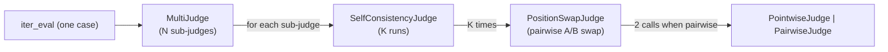

# Phase 6 技术方案 · Judge Robustness（cross-vote + position-swap + self-consistency）

> 对应 [ROADMAP.md](ROADMAP.md) Phase 6。预估 1 人天 vibe coding。
> 本文档随实现演进；最终交付完成后只更新顶部状态行 + 在 [JOURNAL.md](../JOURNAL.md) 记里程碑。

**状态**：DONE

## 真实数据（本机 Ollama, 2026-05-14）

5 条 billing case（带 `expected.output` reference），N=3 次重复，
[scripts/phase6_variance.py](../scripts/phase6_variance.py)：

| Config | Mean per-case score stdev |
|---|---|
| single_pointwise（1 judge / K=1 / temp=0.7） | **0.0377** |
| multi_pairwise（2 judges 7B+32B / K=3 / swap on） | **0.0136** |

多层栈把跨次评分波动压到 ~1/2.8，方向上验证了 Phase 6 的核心收益。
（注：用 K=1 + temp=0.7 让 single 配置带噪而不是 deterministic，否则
stdev 会平凡地等于 0，对比无信息。）

---

## 一句话

Phase 5 是「1 个 judge 给 1 条 case 打 1 次分」。Phase 6 把它变成「**N 个 judge × A/B 互换 × K 次重打**」的聚合分数，并把每一次原始 judge 调用都落库（新表 `eval_judge_calls`），方便后面 Phase 14 / 17 复盘 / 标定。

## 三层结构（外到内）



每条 case 的调用次数：`N × K × P`（pointwise P=1；pairwise P=2）。默认 N=2、K=3、P=2 → **12 次/case**，可调。

## 关键设计决策（不考虑向后兼容，与用户确认）

- **拆 RubricJudge → PointwiseJudge / PairwiseJudge 两个类**，删除原 `rubric_judge.py`；公共 litellm 壳抽到 `protocol.py`。
- **PairwiseJudge 只输出 `winner: A|B|tie`**，不直接返回 `score`；`score`（0/0.5/1）由外层 `PositionSwapJudge` 聚合。
- **新加 `eval_judge_calls` 明细表 + 0005 migration**：per-call 一行；Phase 14/17 直接查表，不重跑 judge。
- **prompt.yaml breaking**：删除单数 `judge:`；必须 `judges: [...]` + `judge_policy:`。
- **`case.expected` 缺失（pairwise 模式）**：fail-fast skip 该 case 并打 `error` 字段，不静默 fallback。
- **并发**：跨 case 串行（保留 Phase 16 stream），单 case 内 `N × K × P` 次 judge 调用走 `asyncio.gather + Semaphore`，默认 4。
- **CLI**：`evalgate run` 保持，扩 `--k` / `--concurrency` / `--policy-mode` 用于复现实验脚本。

## 1. prompt.yaml schema（breaking）

```yaml
name: billing-multi-pairwise
candidate:
  model: ollama/qwen2.5:7b
  user_template: "{prompt}"
judges:
  - model: ollama/qwen2.5:7b
    rubric: |
      Rate 0..1 ... return STRICT JSON {"score":..., "reason":...}
  - model: ollama/qwen2.5:32b
    rubric: |
      ...
judge_policy:
  mode: pairwise          # 必填：pointwise | pairwise
  k: 3                    # self-consistency 次数
  position_swap: true     # 仅 pairwise；false 用于对照实验
  concurrency: 4          # 单 case 内并发上限
```

校验：[src/evalgate/judge/prompt_spec.py](../src/evalgate/judge/prompt_spec.py) — `PromptSpec` 只接受 `judges: list[JudgeSpec]`（`min_length=1`）+ `judge_policy: JudgePolicySpec`。旧 `judge:` 单数 → `ValidationError` 报错并附迁移示例。

## 2. Judge 拆分

| 类 | 输入 | 输出 | 用途 |
|----|------|------|------|
| `PointwiseJudge` | input, candidate_output | `score`, `reason` | 方差脚本 single 基线 |
| `PairwiseJudge` | input, candidate, reference, position | `winner`, `reason` | position-swap 叶子 |
| `PositionSwapJudge` | (同上) | `score` 0/0.5/1 + `position_agreement` | 去 position bias |
| `SelfConsistencyJudge` | 包上述叶子 | `mean_score`, `confidence` | K 次 + std → confidence |
| `MultiJudge` | 包 N 个 SC | `score`, `confidence`, `votes` | cross-vote |

文件分布：

- [src/evalgate/judge/protocol.py](../src/evalgate/judge/protocol.py)：`JudgeCall` dataclass、`_completion()` litellm 壳、`_parse_json_then_regex()`
- [src/evalgate/judge/pointwise.py](../src/evalgate/judge/pointwise.py)：`PointwiseJudge`、`PointwiseVerdict`
- [src/evalgate/judge/pairwise.py](../src/evalgate/judge/pairwise.py)：`PairwiseJudge`、`PairwiseVerdict(winner, reason)`，固定 prompt 模板
- [src/evalgate/judge/position_swap.py](../src/evalgate/judge/position_swap.py)
- [src/evalgate/judge/self_consistency.py](../src/evalgate/judge/self_consistency.py)
- [src/evalgate/judge/multi_judge.py](../src/evalgate/judge/multi_judge.py)

PairwiseJudge 模板（固定，不复用 rubric pointwise 文案）：

```text
Compare Answer A and Answer B for the user question.
Return STRICT JSON: {"winner": "A"|"B"|"tie", "reason": "..."}
```

pairwise 模式下 `judges[].rubric` v1 暂忽略，只用 `JudgeSpec.model`。pointwise 模式仍用 `rubric`。

## 3. DB schema：新表 + 0005 migration

[src/evalgate/db/models.py](../src/evalgate/db/models.py)：

```python
class EvalJudgeCallRow(Base):
    __tablename__ = "eval_judge_calls"
    id: PK
    eval_result_id: FK -> eval_results.id, CASCADE, indexed
    judge_model: str
    sub_run_index: int          # 0..K-1
    position: str | None        # "A_FIRST" | "B_FIRST" | None (pointwise)
    score: float | None         # pointwise score 或 swap 后的 0/0.5/1
    winner: str | None          # "A" | "B" | "tie" | None
    reason: str | None
    raw: JSONB | None
    created_at: timestamptz
```

[src/evalgate/db/migrations/versions/0005_create_eval_judge_calls.py](../src/evalgate/db/migrations/versions/0005_create_eval_judge_calls.py)：PG 用 JSONB；索引 `ix_eval_judge_calls_eval_result_id`。

`eval_results` 不发 migration——Phase 5 已经预留了 `judge_confidence` 和 `judge_raw`。

## 4. 持久化层扩展

[src/evalgate/judge/persistence.py](../src/evalgate/judge/persistence.py) 加：

- `add_judge_calls(session, *, result_id, calls: list[JudgeCallRecord])`：bulk insert
- `add_result` 已有 `judge_confidence` 入参（Phase 5 预留），Phase 6 真填

## 5. Runner 改造

[src/evalgate/judge/runner.py](../src/evalgate/judge/runner.py) 单 case 内部：

```python
agg = await judge_stack.score(case_input, candidate_text, reference=case.expected)
# add_result(score=agg.score, judge_confidence=agg.confidence, judge_raw={"votes": agg.votes, ...})
# add_judge_calls(result_id=row.id, calls=agg.raw_calls)
```

`build_judge_stack(spec)` 根据 `judge_policy.mode` 选 leaf；`iter_eval` 对外 `EvalRecord` contract 不变。

**`expected` 缺失（pairwise 模式）**：在 case 循环里检测，写 `EvalRecord(score=0.0, ..., error=True, error_kind="missing_reference")`（`EvalRecord` 已是 `extra="allow"`），不调 judge stack。

## 6. CLI

[src/evalgate/cli.py](../src/evalgate/cli.py) 的 `run` 子命令加：

- `--k N`：覆盖 `judge_policy.k`（方差实验用）
- `--concurrency N`：覆盖 `judge_policy.concurrency`
- `--policy-mode {pointwise,pairwise}`：覆盖 `judge_policy.mode`（方差实验用）

## 7. 复现实验脚本

[scripts/phase6_variance.py](../scripts/phase6_variance.py)：

1. 同一 eval set（5 条 billing case，有 `expected`）
2. `single_pointwise.yaml`（1 judge, K=1） vs `multi_pairwise.yaml`（2 judges, K=3, swap）
3. 各跑 **5 次** → 算 case-wise score stdev across runs → 求 mean → 单 vs multi 对比
4. 输出 markdown 表追加到 [JOURNAL.md](../JOURNAL.md)
5. 允许 `EVALGATE_MOCK_LLM=1`（结构验证）；真数字真调 Ollama

## 8. 示例 prompt.yaml

- [examples/prompts/baseline.yaml](../examples/prompts/baseline.yaml)：迁移到新 schema，仍 pointwise + K=1（demo 友好）
- [examples/prompts/candidate.yaml](../examples/prompts/candidate.yaml)：同上
- [examples/prompts/single_pointwise.yaml](../examples/prompts/single_pointwise.yaml)：方差脚本 single 基线
- [examples/prompts/multi_pairwise.yaml](../examples/prompts/multi_pairwise.yaml)：方差脚本 multi 实验

## 9. 测试（aiosqlite + mock_response）

- [tests/test_prompt_spec_judges.py](../tests/test_prompt_spec_judges.py)：`judges` 必填；旧 `judge:` 单数 → `ValidationError`；`judge_policy.mode` 必填
- [tests/test_pointwise_judge.py](../tests/test_pointwise_judge.py)：替代旧 test_rubric_judge.py
- [tests/test_pairwise_judge.py](../tests/test_pairwise_judge.py)：A_FIRST/B_FIRST 解析 winner；非法 JSON fallback
- [tests/test_position_swap.py](../tests/test_position_swap.py)：两次同向 → 0/1；冲突 → 0.5 + position_agreement=False
- [tests/test_self_consistency.py](../tests/test_self_consistency.py)：K=3 同分 → conf=1.0；方差大 → conf 低；K=1 退化
- [tests/test_multi_judge.py](../tests/test_multi_judge.py)：N 个 sub-judge mock 不同 score → 聚合 mean/votes/agreement
- [tests/test_judge_calls_persistence.py](../tests/test_judge_calls_persistence.py)：跑一条 case → `eval_judge_calls` 行数 = N×K×P
- [tests/test_runner_multi_judge.py](../tests/test_runner_multi_judge.py)：端到端，断言 records / DB

**迁移**：Phase 5 的 `tests/test_judge_runner.py`、`tests/test_judge_runner_to_gate.py`、`tests/test_run_cli.py` 里的 YAML fixture 改成新 schema。

## 10. 退出标准

- `make test`：现有 72 + 新 ~16 全绿
- `make lint`：clean
- **复现实验真数据**（本机 Ollama 真调）：
  1. 5 条 billing case（每条有 `expected`，从 trace promote）
  2. single vs multi 各 5 次，case-wise stdev multi **方向性低于** single
  3. 数字写 JOURNAL.md
- commit message：`feat(judge,db): multi-judge + position-swap + self-consistency (eval_judge_calls)`

## 11. 风险点 / 范围控制

- **本机只有 qwen 家族**：cross-family 防 self-preference bias 演不出来，用 7b + 32b 做 size diversity；CI 全程 mock。
- **pairwise 需要 `expected`**：promote 的 case 一般有；没有则 skip + error，不静默 fallback。
- **调用爆炸**：N×K×P 默认 12 倍，本机 Ollama 7B 一条 case 约 30~60s。Semaphore concurrency 默认 4。
- **temperature 与 self-consistency**：K>1 时 `SelfConsistencyJudge` 强制 `temperature=max(spec.params.temperature, 0.7)`；K=1 不动。
- **Breaking change**：所有 `examples/prompts/*.yaml` 与 Phase 5 测试 fixture 一次性迁移。
- **不做的事**：verbosity normalization、judge 缓存、record-replay cassette、UI、CLI 强制单 judge 模式开关。

## 12. Forward-compat

- Phase 7（BadCase Finder）：`judge_confidence` 现在真有信号 → uncertainty sampling 排序可用。
- Phase 17（Calibration）：直接查 `eval_judge_calls` 表 + 人工标注 join，不重跑 judge。
- Phase 14（κ 实验）：同上。
