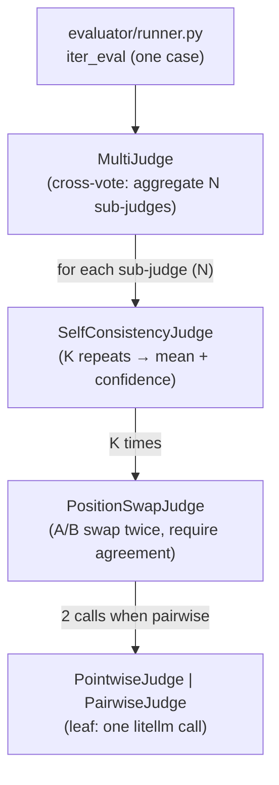
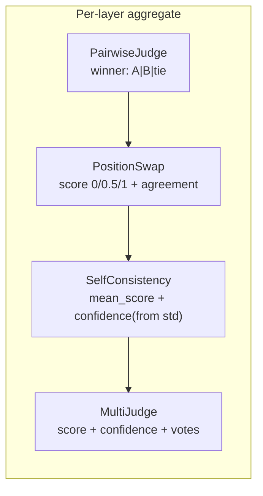

# Phase 6 design · Judge Robustness (cross-vote + position-swap + self-consistency)

> Paths match **current code**: the runner moved from `judge/runner.py` to [src/evalgate/evaluator/runner.py](../src/evalgate/evaluator/runner.py) (Phase 8 introduced `EvaluatorRouter` for unified dispatch). The nested judge-wrapper topology described below is unchanged.

## In one sentence

Phase 5 was "1 judge scores 1 case once"—high variance and known bias. Phase 6 upgrades that to an aggregated score of **N judges × A/B swap × K repeats**, and persists every raw judge call (new table `eval_judge_calls`) for later recap / calibration (Phase 16/17). That is the prerequisite so the gate's significance test is not dominated by judge noise (ADR-005).

## Three-layer debias stack: three problems

| Bias / noise | Meaning | Mechanism |
|---|---|---|
| variance (single-shot) | Same `(input, output)` scored K times yields different scores | self-consistency |
| position bias (preferring one side in A/B) | Pairwise judges prefer the answer they read first | position-swap |
| self-preference bias (preferring same-family output) | Judge prefers outputs from models of its own family | cross-vote |

## Nested judge wrappers (outer to inner)

Each case is scored by four wrappers around a leaf judge, aggregating and debiasing layer by layer:



- **Pointwise mode**: `SelfConsistencyJudge` wraps `PointwiseJudge` directly (no PositionSwap layer, P=1).
- **Pairwise mode**: `SelfConsistencyJudge` wraps `PositionSwapJudge` wraps `PairwiseJudge` (P=2).

Total calls per case: `N × K × P` (pointwise P=1; pairwise P=2). Defaults N=2, K=3, P=2 → **12 calls/case**, tunable.



## Layer responsibilities

| Class | Input | Output | Role |
|----|------|------|------|
| `PointwiseJudge` | input, candidate_output | `score`, `reason` | Generic scoring leaf (reference-free) |
| `PairwiseJudge` | input, candidate, reference, position | `winner: A\|B\|tie`, `reason` | A/B comparison leaf; **verdict only, no score** |
| `PositionSwapJudge` | (same) | `score` 0/0.5/1 + `agreement` | Remove position bias |
| `SelfConsistencyJudge` | wraps the above | `mean_score`, `confidence` | K repeats; std → confidence |
| `MultiJudge` | wraps N SC judges | `score`, `confidence`, `votes` | Cross-vote aggregate |

### Key aggregation rules (match the code)

- **PositionSwap** ([position_swap.py](../src/evalgate/judge/position_swap.py)): both A/B orders prefer candidate → `score=1.0, agreement=True`; both prefer reference → `0.0, True`; disagreement / tie / parse failure → `0.5, agreement=False`. Trust only conclusions both orders agree on.
- **SelfConsistency** ([self_consistency.py](../src/evalgate/judge/self_consistency.py)): `confidence = 1 - std / MAX_STD_SCORE_SPREAD`. K=1 degrades to `confidence=1.0` (one sample has no variance signal; labeled honestly). For K>1, force `temperature=max(spec.temperature, 0.7)` or sampling is deterministic and self-consistency is meaningless.
- **MultiJudge** ([multi_judge.py](../src/evalgate/judge/multi_judge.py)): `score = mean(each sub-judge mean)`; `confidence = (∏ each sub confidence) × (1 - cross_std/MAX_SPREAD)` — high confidence only if each judge is stable **and** judges agree with each other.

## 1. prompt.yaml schema (breaking)

```yaml
name: billing-multi-pairwise
candidate:
  model: ollama/qwen2.5:7b
  user_template: "{prompt}"
judges:                      # plural, min_length=1
  - model: ollama/qwen2.5:7b
    rubric: |
      Rate 0..1 ... STRICT JSON {"score":..., "reason":...}
  - model: ollama/qwen2.5:32b
    rubric: |
      ...
judge_policy:
  mode: pairwise          # required: pointwise | pairwise
  k: 3                    # self-consistency repeats
  position_swap: true     # pairwise only; false for ablation
  concurrency: 4          # per-case concurrency cap
```

Validation in [prompt_spec.py](../src/evalgate/judge/prompt_spec.py): `PromptSpec` only accepts `judges: list[JudgeSpec]` + `judge_policy: JudgePolicySpec`. Old singular `judge:` → `ValidationError` with a migration example. `build_judge_stack(spec)` (in [multi_judge.py](../src/evalgate/judge/multi_judge.py)) picks the leaf from `judge_policy.mode` and assembles the nested stack.

In pairwise mode, `judges[].rubric` is ignored in v1 (only `JudgeSpec.model` is used) because `PairwiseJudge` uses a fixed template:

```text
Compare Answer A and Answer B for the user question.
Return STRICT JSON: {"winner": "A"|"B"|"tie", "reason": "..."}
```

## 2. Judge file layout

- [protocol.py](../src/evalgate/judge/protocol.py): `JudgeCallRecord`, `LeafJudge` / `LeafVerdict` protocols, `_completion()` litellm shell, `_parse_json_then_regex()`, `MAX_STD_SCORE_SPREAD` constant
- [pointwise.py](../src/evalgate/judge/pointwise.py): `PointwiseJudge`, `PointwiseVerdict`
- [pairwise.py](../src/evalgate/judge/pairwise.py): `PairwiseJudge`, `PairwiseVerdict(winner, reason)`
- [position_swap.py](../src/evalgate/judge/position_swap.py) / [self_consistency.py](../src/evalgate/judge/self_consistency.py) / [multi_judge.py](../src/evalgate/judge/multi_judge.py): the three wrappers

> **Why PairwiseJudge emits `winner` and not `score`**: the 0/0.5/1 score is a product of "agreement across two position orders," which belongs in outer `PositionSwapJudge`. The leaf only answers "which is better"; the outer layer translates "comparison + debias" into a score—clear responsibilities, one copy of the debias logic.

## 3. DB schema: new table + 0005 migration

[db/models.py](../src/evalgate/db/models.py) adds a per-call detail table, **one row per judge call**:

```python
class EvalJudgeCallRow(Base):
    __tablename__ = "eval_judge_calls"
    id: PK
    eval_result_id: FK -> eval_results.id, CASCADE, indexed
    judge_model: str
    sub_run_index: int          # 0..K-1
    position: str | None        # "A_FIRST" | "B_FIRST" | None (pointwise)
    score: float | None         # pointwise score or swapped 0/0.5/1
    winner: str | None          # "A" | "B" | "tie" | None
    reason: str | None
    raw: JSONB | None
    created_at: timestamptz
```

Migration [0005_create_eval_judge_calls.py](../src/evalgate/db/migrations/versions/0005_create_eval_judge_calls.py): JSONB on PG; index `ix_eval_judge_calls_eval_result_id`. **No migration on `eval_results`**—Phase 5 already reserved `judge_confidence` and `judge_raw`; Phase 6 actually fills them.

## 4. Persistence + Runner

[judge/persistence.py](../src/evalgate/judge/persistence.py) adds `add_judge_calls(...)` bulk insert. Inside each case the runner:

```python
agg = await judge_stack.score(case_input, candidate_text, reference=case.expected)
# add_result(score=agg.score, judge_confidence=agg.confidence, judge_raw={"votes": agg.votes, ...})
# add_judge_calls(result_id=row.id, calls=agg.raw_calls)
```

`iter_eval`'s outward `EvalRecord` contract is unchanged (backward-compatible with the gate). **Pairwise mode missing `expected`**: detect in the case loop, write `EvalRecord(score=0.0, ..., error=True, error_kind="missing_reference")`, do not call the judge stack—fail-fast skip, no silent fallback.

## 5. CLI (for variance experiments)

`evalgate run` gains three overrides: `--k N`, `--concurrency N`, `--policy-mode {pointwise,pairwise}`, so the reproduction script [scripts/phase6_variance.py](../scripts/phase6_variance.py) can switch between single / multi configs.

## 6. Reproduction experiment: did variance actually drop?

This is Phase 6's load-bearing check—if the multi-layer stack cannot compress cross-run variance, ADR-005 does not hold. On the same billing cases the script runs:

- `single_pointwise` (1 judge / K=1 / temp=0.7, **intentionally noisy**; otherwise stdev is trivially 0)
- `multi_pairwise` (2 judges 7B+32B / K=3 / swap on)

Each config is run multiple times; mean of case-wise score stdev across runs:

| Config | Mean per-case score stdev |
|---|---|
| single_pointwise | **0.0377** |
| multi_pairwise | **0.0136** |

The stack compressed cross-run score fluctuation to ~1/2.8, confirming the core benefit in direction.

## Technical choices

### 1. Three-layer debias stack vs a single judge (ADR-005)

- **Decision**: nested `MultiJudge → SelfConsistency → PositionSwap → leaf`, each targeting self-preference / variance / position.
- **Alternative**: keep Phase 5's single judge, single call; or only one layer (e.g. self-consistency only).
- **Why**: single-judge variance (±15%) and bias are consensus in papers and industry (Zheng 2023 MT-Bench). Unfixed variance lets judge noise dominate the gate's significance test—92%→89% cannot be told apart from noise, the gate false-blocks, and teams bypass it (the failure mode ADR-004 most wants to avoid). Each problem has a dedicated mechanism, so all three layers stay.
- **Cost**: **eval cost ×6–10** (N×K×P). Accepted on purpose—CI-gate credibility is the product. Production can add caching / sampling to bring cost back to ×2–3. Complexity also rises (more wrapper classes), so a reproduction script must prove variance actually dropped.

### 2. Nested wrappers (composition) rather than one large judge class

- **Decision**: each layer is a small independent wrapper; composition builds the stack; `build_judge_stack` assembles from policy.
- **Alternative**: one `RobustJudge` class with if/else for K / swap / multi.
- **Why**: single responsibility per layer, independently unit-testable (PositionSwap agreement rules, SelfConsistency std→confidence). Pointwise / pairwise is "swap the leaf + optionally insert PositionSwap"—composition supports that naturally.
- **Cost**: more layers; first readers need the topology (hence the diagrams in this doc).

### 3. Cross-vote via size diversity (7B + 32B) standing in for family diversity

- **Decision**: locally we only have the Qwen family, so `qwen2.5:7b` + `qwen2.5:32b` approximate cross-vote via size diversity.
- **Alternative**: cross-family (GPT-4 + Claude) is the real fix for self-preference bias.
- **Why**: local, zero-cost run of the full topology and variance benefit; cross-family is already supported by LiteLLM (ADR-008)—change model names. Production just configures cross-family judges.
- **Cost**: the local demo cannot show true self-preference debiasing (same family cannot exhibit it); that waits on cloud models / later κ experiments.

### 4. Persist every call in `eval_judge_calls`

- **Decision**: one row per call with the full payload (including raw response), not just the aggregate score.
- **Why**: Phase 16 calibration and Phase 17 Cohen's κ both need "how each raw judge scored." Detail rows let those phases query the table **without re-running expensive judges**.
- **Cost**: row count = results × N×K×P; storage blow-up is acceptable (small text, JSONB compresses).

## Test strategy

aiosqlite + `mock_response`; CI never calls a real model. Each wrapper is unit-tested for its aggregate / debias rules (position-swap agree/conflict, self-consistency K=3 same scores → conf=1 vs high variance → low conf, multi-judge aggregate). **Structural invariant**: after one case, `eval_judge_calls` row count is exactly `N×K×P`; end-to-end asserts records match the DB. Real variance numbers come from the reproduction script against local Ollama.

## Forward-compat

- **Phase 7 (BadCase Finder)**: `judge_confidence` now has a real signal → uncertainty sampling (rank hard cases by uncertainty).
- **Phase 16 (Calibration) / Phase 17 (κ experiment)**: query `eval_judge_calls` joined to human labels; do not re-run judges.
