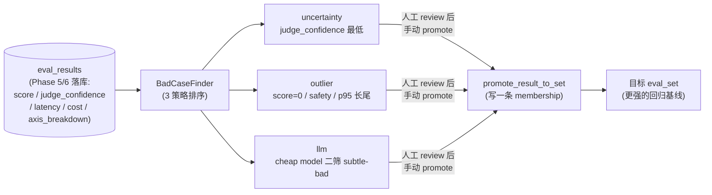
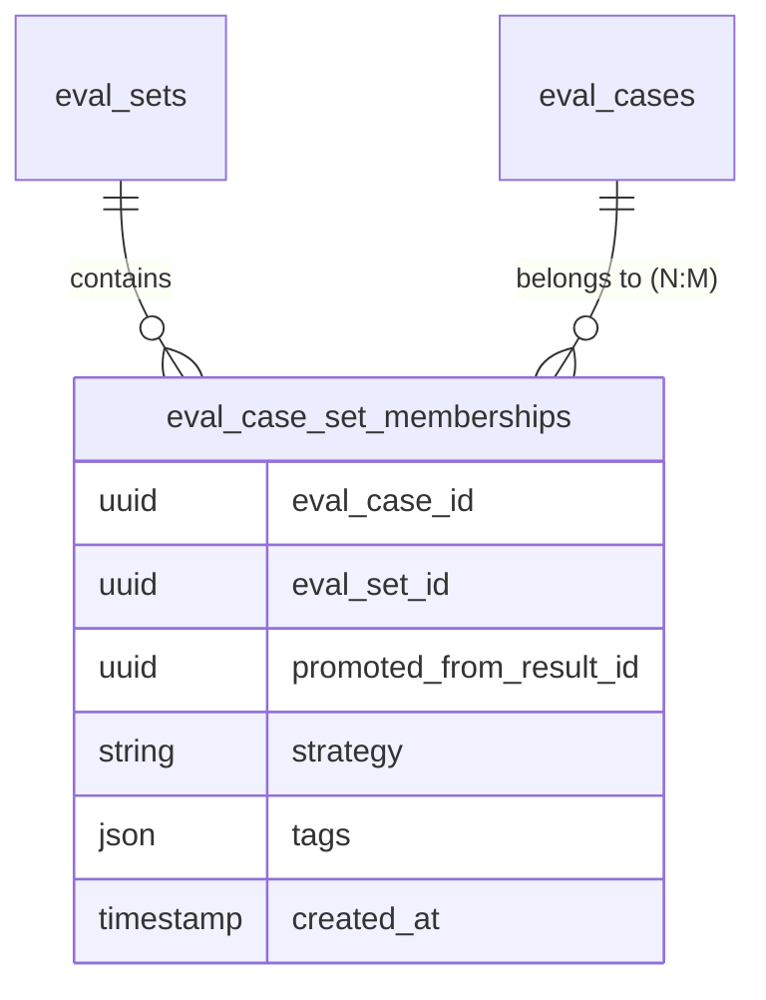

# Phase 7 技术方案 · BadCase Finder（主动学习的第一步）

## 一句话

跑完 `evalgate run` 之后，从 `eval_results` 里**自动捞出最值得加进 eval_set 的 case**，再用一行 `evalgate badcase promote ...` 把它挂到目标 eval_set，让回归（regression，回归测试）基线越用越强。这是把「一次性评测」升级成 active learning（主动学习，让模型/系统主动挑选最有价值的样本来标注与学习）闭环的第一步。

三条互补的挑选策略：

- **uncertainty sampling（不确定性采样，主动学习里优先选模型最没把握的样本）**：判官（judge）打分时 `judge_confidence` 最低的 case。
- **outlier（离群点）**：已知坏（score=0 / safety 命中）或长尾（latency/cost 超 p95）的 case。
- **llm**：让一个便宜模型（cheap model）二次筛选，专挑「看起来对、其实微妙错」的 subtle-bad case。

## 整体架构与数据流

关键点：**promote 必须人工触发**，finder 只负责排序与召回，不自动写库——避免把噪声样本污染进基线。

## 三条策略的排序逻辑

`BadCase` 是 finder 的统一返回结构（[src/evalgate/badcase/finder.py](../src/evalgate/badcase/finder.py)），核心字段：`eval_result_id`、`score`、`judge_confidence`、`latency_ms`、`cost_usd`、`strategy`、`reason`（人类可读的一句话），以及 llm 策略才填的 `llm_label`。

| Strategy | 排序 / 逻辑 | 直觉 |
|---|---|---|
| `uncertainty` | `ORDER BY judge_confidence ASC NULLS LAST` | judge 越没把握，越有研究价值（典型 uncertainty sampling） |
| `outlier` | `score=0` OR `axis_breakdown["safety"]` 任一速率 > 0 OR `latency_ms > p95` OR `cost_usd > p95` | 已知坏 + 资源长尾 |
| `llm` | 先取 uncertainty top-`2*limit` → cheap model 给「subtle bad」评 0/1 → 留 1 的取 `limit` | 用便宜算力放大召回 |

p95 既可在 run 内算（带 `run_id`），也可全局算（不带），用 `numpy.percentile`。数据稀疏时（少于 4 条）跳过 p95，避免无意义的分位数。

llm 策略复用 [src/evalgate/judge/protocol.py](../src/evalgate/judge/protocol.py) 的 `acompletion_json`，提示词要求模型严格返回 `{"subtle_bad": true|false, "reason": "..."}`，并支持 `mock` 模式让 CI 离线可跑。

## Promote 语义（关键设计）

[src/evalgate/badcase/repository.py](../src/evalgate/badcase/repository.py) 的 `promote_result_to_set(session, *, result_id, target_set_id, extra_tags)`：

- 输入是 finder 返回的 `eval_result_id`，解析出它背后的 `EvalCaseRow`。
- 在 `target_set_id` 里登记这条 case，并保留 `source_trace_id` / `source_span_id`，让 lineage（血缘，可追溯到原始 trace）追得回去。
- 自动追加 `tags = ["from-badcase", "strategy:<s>"] + 用户额外 tags`。
- 同一 (case, set) 二次 promote 结构上即被拒绝（HTTP 409 / CLI 报错）。

接口形态：

- REST（[src/evalgate/api/routers/badcase.py](../src/evalgate/api/routers/badcase.py)）：`GET /v1/badcases?strategy=&limit=&run_id=` 与 `POST /v1/badcases/{eval_result_id}/promote`。
- CLI（[src/evalgate/cli.py](../src/evalgate/cli.py)）：`evalgate badcase list --strategy ...` 与 `evalgate badcase promote --result ... --eval-set ...`。

## 数据模型抉择：从「复制 case」到 many-to-many membership

这是 Phase 7 最值得讲的演进，分两步落地。

**第一版（朴素做法）**：promote = 复制一份 `EvalCaseRow`（新 `id`、相同 payload）。受早期 `eval_cases.eval_set_id` 的 N:1（一个 case 只属于一个 set）约束。三个问题：

1. 同一 case 进多个 set 要复制 N 份 `input/expected`，编辑和版本管理割裂。
2. lineage 只能靠 tags 字符串软追溯，没法 SQL JOIN。
3. 「同 case 二次 promote」只能在应用层查重，结构上没有保护。

**终版（many-to-many membership，多对多归属表）**：

- 新表 `eval_case_set_memberships` + `UniqueConstraint(case, set)`，case 与 set 解耦成多对多。
- `promote_result_to_set` 不再复制 case，只 insert 一条 membership——**结构性 dedup**：重复 promote 直接撞唯一约束（`AlreadyPromotedError` → 409），不再靠应用层查重。
- `list_cases(set_id)` 改为按 membership JOIN 取 case，Phase 5 的 runner 无需感知这层变化。
- promote 响应从 `EvalCaseOut` 换成 `PromotionOut`，暴露 membership 元数据（`promoted_from_result_id` / `strategy` / `tags` / `created_at`），lineage 现在能 JOIN 查询。
- 最终把过渡期保留的 `EvalCaseRow.eval_set_id` 列删除，membership 表成为 case→set 归属的**唯一真理源**；为此 migration 先 backfill 旧数据再 drop 列（反过来会触发 PG 外键违反），并写了可逆的 `downgrade`（取每个 case 最早一条 membership 还原 primary set）。

## 技术选型与抉择

**1. 数据源：只看 `eval_results` vs 双源（再加原始 spans）**

最初权衡过两种数据源：

- **A·只看 `eval_results`**：三条策略都基于「已被 judge 跑过的 case」。优点是单表、SQL 简单、与「先有 confidence 数据」的前置一致；缺点是 raw trace 里那些从没进过 eval_set 的 latency/cost 异常覆盖不到。
- **B·`eval_results` + 原始 `spans` 双源**：额外扫 `spans.attributes` 找未评测的长尾 trace。优点是能发现 production 里完全没被评测的异常；缺点是多一条路径、`uncertainty` 对未跑 judge 的 trace 不适用、且与已有的 `eval-set add --from-trace` 功能重叠。

**选 A**。Phase 7 是「评测闭环 → 主动学习」的第一步，先把 `eval_results` 里的信号榨干；trace-source outlier 留给后续迭代，避免一上来就把两条路径都做成半成品。

**2. 不引入 LLM 标签缓存表**

llm 策略每次重跑都重新调一次 cheap model（成本约等于 0）。本可以加 `bad_case_labels` 缓存表，但 MVP 阶段「决策路径清晰」优先于「省那点调用」，缓存留给后续校准阶段顺手补。

**3. 不建 hard reference（硬外键）**

promote 出来的 case 与原 case **不建外键**，只用 tags 弱耦合记录来源。理由与 `source_trace_id` 一致——eval_case 必须能独立删除/归档，硬外键会让清理链路互相绑死。

**4. 选 Postgres + JSONB 承载 membership（ADR-002）**

membership 的 `tags` 是 schema-less 列表、`strategy` 等元数据也可能演进，用 JSONB 列存最灵活；同时 case→set 的归属查询本质是 JOIN + 聚合，是 SQL 的强项。这正是 ADR-002「不固定 schema 的字段用 JSONB，其余吃 SQL 关系能力」在本阶段的具体落点。删列时数据迁移写在 Python 里跨 SQLite/PG 方言，CI 用 ephemeral SQLite、生产用 PG 走同一套 repository 代码。

## 与后续阶段的衔接

- **校准阶段**：直接消费 promote 出来的 hard case 与人标对照，验证 judge 的可信度。
- **对抗样本合成**：`find_llm` 的提示词可替换成「生成更难的变体」，复用同一条召回管线。

## 测试策略

围绕「三策略排序正确 + promote 语义（合并 tags、拒绝重复、list 能看到 promoted case）」做端到端覆盖，从 repository 层一路测到 REST / CLI，全程走 mock LLM 与临时 SQLite 保证离线可重现。
