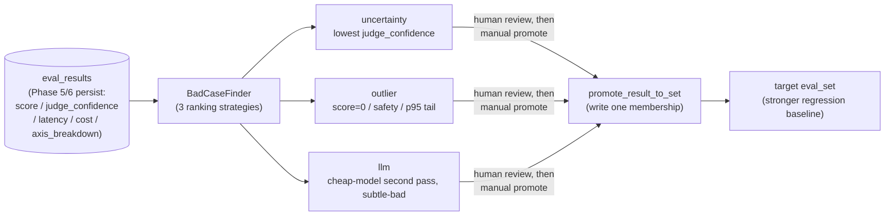
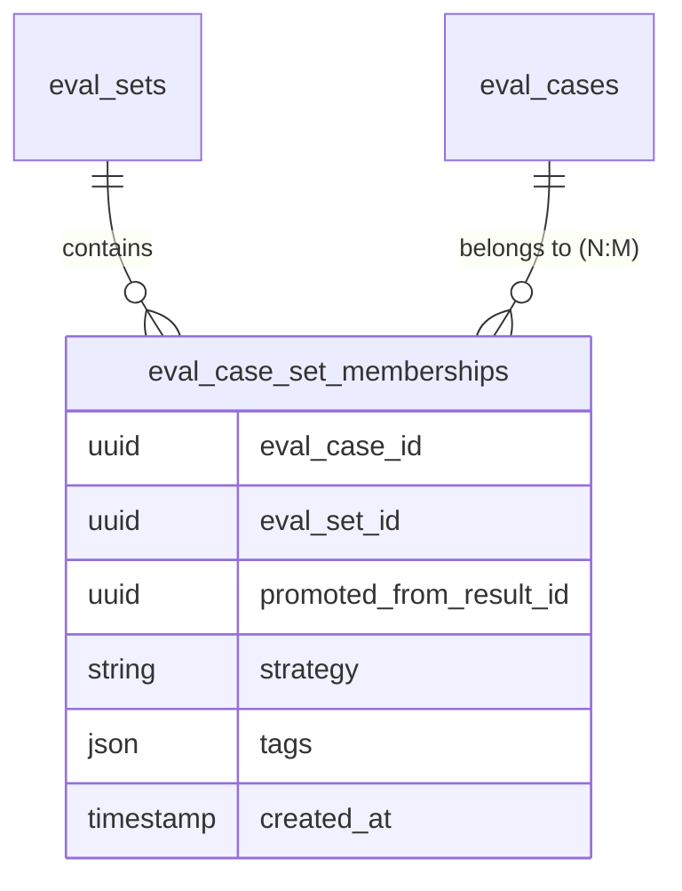

# Phase 7 design · BadCase Finder (first step of active learning)

## In one sentence

After `evalgate run`, **automatically surface the cases most worth adding to an eval_set** from `eval_results`, then one command `evalgate badcase promote ...` attaches them to the target eval_set so the regression baseline gets stronger over time. This is the first step from one-shot eval to an active-learning loop (the system picks the most valuable samples to label and learn from).

Three complementary selection strategies:

- **Uncertainty sampling** (in active learning, prefer samples the model is least sure about): cases with the lowest `judge_confidence`.
- **Outlier**: known-bad (score=0 / safety hit) or long-tail (latency/cost above p95).
- **llm**: a cheap model second-pass, targeting subtle-bad cases that "look right but are quietly wrong."

## Architecture and data flow

Key point: **promote must be human-triggered**. The finder only ranks and recalls; it never writes automatically—so noisy samples do not pollute the baseline.

## Ranking logic for the three strategies

`BadCase` is the finder's unified return type ([src/evalgate/badcase/finder.py](../src/evalgate/badcase/finder.py)). Core fields: `eval_result_id`, `score`, `judge_confidence`, `latency_ms`, `cost_usd`, `strategy`, `reason` (one human-readable sentence), and `llm_label` (llm strategy only).

| Strategy | Ranking / logic | Intuition |
|---|---|---|
| `uncertainty` | `ORDER BY judge_confidence ASC NULLS LAST` | Lower judge confidence → more worth studying (classic uncertainty sampling) |
| `outlier` | `score=0` OR any rate in `axis_breakdown["safety"]` > 0 OR `latency_ms > p95` OR `cost_usd > p95` | Known-bad + resource long tail |
| `llm` | Take uncertainty top-`2*limit` → cheap model labels "subtle bad" 0/1 → keep 1s up to `limit` | Cheap compute to boost recall |

p95 can be computed within a run (`run_id` set) or globally (unset), via `numpy.percentile`. With sparse data (fewer than 4 rows) skip p95 so the quantile is not meaningless.

The llm strategy reuses `acompletion_json` from [src/evalgate/judge/protocol.py](../src/evalgate/judge/protocol.py). The prompt requires strict `{"subtle_bad": true|false, "reason": "..."}`, with a `mock` mode so CI can run offline.

## Promote semantics (the critical design)

`promote_result_to_set(session, *, result_id, target_set_id, extra_tags)` in [src/evalgate/badcase/repository.py](../src/evalgate/badcase/repository.py):

- Input is the finder's `eval_result_id`; resolve the underlying `EvalCaseRow`.
- Register that case in `target_set_id`, keeping `source_trace_id` / `source_span_id` so lineage (traceability back to the original trace) survives.
- Auto-append `tags = ["from-badcase", "strategy:<s>"] + user extra tags`.
- A second promote of the same (case, set) is rejected structurally (HTTP 409 / CLI error).

Interface:

- REST ([src/evalgate/api/routers/badcase.py](../src/evalgate/api/routers/badcase.py)): `GET /v1/badcases?strategy=&limit=&run_id=` and `POST /v1/badcases/{eval_result_id}/promote`.
- CLI ([src/evalgate/cli.py](../src/evalgate/cli.py)): `evalgate badcase list --strategy ...` and `evalgate badcase promote --result ... --eval-set ...`.

## Data-model choice: from "copy the case" to many-to-many membership

This is Phase 7's most important evolution, landed in two steps.

**v1 (naive)**: promote = copy an `EvalCaseRow` (new `id`, same payload). Forced by the early N:1 `eval_cases.eval_set_id` (a case belongs to one set). Three problems:

1. The same case in N sets means N copies of `input/expected`; edits and versioning split.
2. Lineage is only a tag string; no SQL JOIN.
3. "Promote the same case twice" can only be deduped in the application layer; no structural protection.

**Final (many-to-many membership)**:

- New table `eval_case_set_memberships` + `UniqueConstraint(case, set)`; case and set decouple into many-to-many.
- `promote_result_to_set` no longer copies the case; it inserts one membership—**structural dedup**: a duplicate promote hits the unique constraint (`AlreadyPromotedError` → 409), not an application-layer lookup.
- `list_cases(set_id)` JOINs via membership; the Phase 5 runner need not know about this change.
- Promote response changes from `EvalCaseOut` to `PromotionOut`, exposing membership metadata (`promoted_from_result_id` / `strategy` / `tags` / `created_at`); lineage is now JOIN-able.
- Eventually drop the transitional `EvalCaseRow.eval_set_id` column; the membership table becomes the **single source of truth** for case→set membership. The migration backfills old rows then drops the column (the reverse would violate PG FKs), with a reversible `downgrade` (restore primary set from each case's earliest membership).

## Technical choices

**1. Data source: `eval_results` only vs dual-source (plus raw spans)**

Two sources were weighed:

- **A · `eval_results` only**: all three strategies operate on cases already judged. Pros: one table, simple SQL, matches the "confidence data already exists" prerequisite. Cons: latency/cost anomalies in raw traces that never entered an eval_set are invisible.
- **B · `eval_results` + raw `spans`**: also scan `spans.attributes` for unevaluated long-tail traces. Pros: find production anomalies never evaluated. Cons: a second path; `uncertainty` does not apply to unjudged traces; overlaps existing `eval-set add --from-trace`.

**Chose A.** Phase 7 is the first step from "eval loop → active learning"; squeeze signal from `eval_results` first. Trace-source outliers wait for a later iteration rather than shipping two half-finished paths.

**2. No LLM-label cache table**

The llm strategy re-calls the cheap model on every run (cost ≈ 0). A `bad_case_labels` cache table was possible, but at MVP "clear decision path" beats "save a few calls"; cache can land with later calibration.

**3. No hard FK**

Promoted cases do **not** take a hard FK to the original case; tags weakly record origin. Same rationale as `source_trace_id`—eval_case must be independently deletable/archivable; hard FKs would couple cleanup chains.

**4. Postgres + JSONB for membership (ADR-002)**

Membership `tags` is a schema-less list; `strategy` and other metadata may evolve—JSONB is the flexible store. Case→set queries are JOIN + aggregate, a SQL strength. This is ADR-002 applied here: "schema-less fields in JSONB, everything else as SQL relations." Column-drop data migration is Python across SQLite/PG dialects; CI uses ephemeral SQLite, production uses PG, same repository code.

## Handoff to later phases

- **Calibration**: consume promoted hard cases vs human labels to validate judge trustworthiness.
- **Adversarial sample synthesis**: swap the `find_llm` prompt to "generate harder variants" and reuse the same recall pipeline.

## Test strategy

End-to-end coverage of "three-strategy ranking is correct + promote semantics (merge tags, reject duplicates, list shows promoted cases)," from repository through REST / CLI, always with mock LLM and ephemeral SQLite so it is offline-reproducible.
