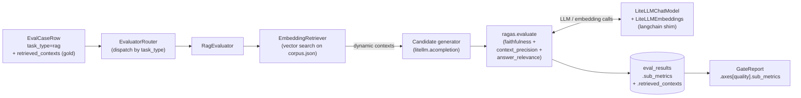

# Phase 8 design · RAG-aware Evaluator (RAGAS)

## In one sentence

Introduce a dedicated RAG (Retrieval-Augmented Generation) eval path for `task_type=rag` cases: the candidate side retrieves contexts dynamically, then the real `ragas` package scores **RAGAS faithfulness / context-precision / answer-relevance**. At the same time, replace the hardcoded "candidate → MultiJudge" pipeline in the runner with a `task_type`-driven `EvaluatorRouter`, leaving a branch slot for Phase 9 (agent).

## Architecture and data flow



The core of the data flow is that **retrieval happens on the candidate side**: the retriever first fetches dynamic contexts for the question, the candidate generator renders `{contexts}` into the prompt and produces an answer, then ragas scores (question, answer, contexts, gold). Runtime-retrieved contexts are persisted (`EvalResultRow.retrieved_contexts`) for badcase audit.

## Module layout: from judge.runner to an evaluator abstraction

The refactor's main line is pulling **orchestration** out of the judge module. `judge/` retreats to LLM-as-judge primitives, reused by `evaluator.generic`:

```
src/evalgate/evaluator/
  base.py            # Evaluator Protocol + EvaluationOutcome + UnsupportedTaskTypeError
  router.py          # EvaluatorRouter + build_router
  runner.py          # iter_eval / run_eval (replaces old judge.runner)
  generic.py         # GenericEvaluator (former run_candidate + MultiJudge path)
  rag/
    evaluator.py     # RagEvaluator + _RagasScorer
    retriever.py     # Retriever Protocol + EmbeddingRetriever
    ragas_adapter.py # LiteLLMChatModel + LiteLLMEmbeddings + build_ragas_components
```

**`EvaluationOutcome` is the new common currency**: every evaluator returns `(score, sub_metrics, confidence, output_text, retrieved_contexts, candidate_cost, candidate_latency, raw_calls, reason, error)`. The runner no longer cares how the candidate ran or how the judge aggregated—every task type converges on this one structure.

`EvaluatorRouter` dispatches by `task_type`:

```python
def build_router(spec, *, mock) -> EvaluatorRouter:
    registry = {TaskKind.generic: GenericEvaluator(spec)}
    if spec.retriever and spec.rag_evaluator:
        registry[TaskKind.rag] = RagEvaluator(spec, mock=mock)   # lazy-import ragas
    return EvaluatorRouter(registry)
```

`agent` is not registered yet; Phase 9 adds one line. If `runner.iter_eval` hits an unregistered `task_type`, the exception becomes an `EvaluationOutcome` with `error=True` and does not poison the whole run.

## RagEvaluator scoring flow

```python
async def evaluate(self, case, *, mock=False) -> EvaluationOutcome:
    question = case.input["question"] or case.input["prompt"]
    ref_answer = (case.expected or {}).get("answer")        # ground truth answer
    ref_contexts = list(case.retrieved_contexts or [])      # gold contexts

    contexts = await self.retriever.retrieve(question)       # dynamic retrieval
    candidate = await run_candidate(                         # reuse judge.candidate
        {**case.input, "contexts": "\n\n".join(contexts)}, spec, ...)
    sub_metrics, raw_calls = await self.scorer.score(        # ragas package
        question=question, answer=candidate.text, contexts=contexts,
        reference_answer=ref_answer, reference_contexts=ref_contexts)
    return EvaluationOutcome(score=mean(sub_metrics.values()),
                             sub_metrics=sub_metrics, raw_calls=raw_calls, ...)
```

- `case.retrieved_contexts` is **gold / reference contexts**, used by `context_precision_with_reference` (gap between dynamic retrieval and gold); `expected.answer` remains the ground-truth answer.
- `_RagasScorer.score` wraps the row as a `datasets.Dataset` and hands it to `ragas.evaluate` (ragas v0.2 is a sync entrypoint, run via `loop.run_in_executor`), then turns each metric's 0..1 score into a `JudgeCallRecord` (`judge_model="ragas:<metric>"`) persisted on `eval_judge_calls` so later calibration can be per-metric.
- Exceptions are caught in three bands, none of which escape the case: retriever failure → `retrieve_failure`; candidate failure → `candidate_failure`; ragas failure → `ragas_failure`.

**EmbeddingRetriever**: load `corpus.json`; on first `retrieve`, lazily embed the whole corpus (`asyncio.Lock` prevents concurrent double-embed); cosine similarity, take top-k (`top_k` clamped to corpus size).

## Nested gate sub-metrics

`AxisMetric` gains a recursive field `sub_metrics: dict[str, "AxisMetric"] | None`. After the four main axes, [`multi_axis.py`](../src/evalgate/report/multi_axis.py) scans `records[*].sub_metrics` on the quality axis and builds a higher-is-better mean axis per RAGAS metric (with bootstrap CI), nested under `quality.sub_metrics`.

Decision rule: `quality.passed = passed AND all(sub.passed)`—**any significantly regressed sub-metric fails the quality axis as a whole** (the aggregate still uses score for baseline/candidate). On mixed sets (half generic, half rag), sub-metrics aggregate only over RAG records so generic cases do not pollute the mean; the gate summary names which item (faithfulness / context_precision / answer_relevance) dropped by how many points.

## Schema changes

- `EvalCaseRow.retrieved_contexts: list[str]` (gold contexts, NOT NULL, default `[]`).
- `EvalResultRow.sub_metrics: dict[str, float] | None`, e.g. `{"faithfulness":0.83,"context_precision":0.71,"answer_relevance":0.90}`.
- `EvalResultRow.retrieved_contexts: list[str] | None`: actual retrieval at runtime.

SQLite adds columns via `batch_alter_table`; PG uses JSONB; `server_default '[]'` covers existing rows.

## Technical choices

**1. Task-layered evaluators: RAG uses RAGAS, not a generic rubric (ADR-005)**

A pure LLM-as-judge plus one generic rubric will distort RAG—RAG quality is "did the answer stay faithful to retrieved context, and was retrieval precise," not a vague "was the answer good." ADR-005 therefore layers evaluators by `task_type`: RAG → RAGAS, Agent → trajectory eval, generic → rubric LLM-as-judge, dispatched by `EvaluatorRouter`. The cost is more abstraction and higher eval cost, but that is a quality constraint: one rubric shared by RAG and Agent is inaccurate for both.

**2. Use the real ragas package + a LiteLLM↔langchain adapter, not a self-maintained metric implementation**

RAGAS metric definitions (claim extraction, context-precision algorithm, etc.) evolve with versions. Forking prompts/algorithms means forever chasing upstream. We write a minimal langchain shim ([`ragas_adapter.py`](../src/evalgate/evaluator/rag/ragas_adapter.py)) that steers ragas through our unified LiteLLM gateway:

- `LiteLLMChatModel(BaseChatModel)`: convert messages to LiteLLM format and call `litellm.acompletion`; `mock_text` short-circuits to a fixed string in tests; litellm exceptions become an embedded `{"error":...}` string instead of raise, so ragas can degrade on its own.
- `LiteLLMEmbeddings(Embeddings)`: `litellm.aembedding`; in `mock_mode`, SHA-256 → 384-dim deterministic pseudo-vectors so CI never talks to Ollama.

Benefit: we consume ragas prompt/version evolution instead of maintaining a fork. Cost: an adapter layer and ragas version compatibility (pin `>=0.1.21,<0.3`; CI is fully mocked and does not depend on ragas fetching prompts online).

**3. Retrieval on the candidate side; gold contexts as reference**

Hanging the retriever on the candidate side evaluates end-to-end "real retrieval + generation," not generation given a fixed context. A separate gold context list on the case is the reference for `context_precision_with_reference`.

**4. Persist sub-metrics on `eval_judge_calls`, one score per metric**

Each RAGAS metric's per-call score is stored as a `JudgeCallRecord`, not only the aggregate. The UI can render RAG detail from the DB, and later calibration can fit the three metrics separately, without re-running eval.

**5. No backward compatibility: delete `judge.runner`**

The refactor explicitly drops the old orchestration path: `judge.runner` is deleted; CLI / tests / scripts all move to `evaluator.runner`. Overlapping `judge/` and `evaluator/` duties would create lasting confusion; one clean cut is cheaper than two stacks in parallel.

## Known limits

- In mock mode ragas receives a fixed placeholder string it cannot parse (claim extraction needs real structured output), so sub_metrics collapse to 0—end-to-end plumbing works, but **meaningful scores need real-LLM mode**.
- `context_recall`, multiple retriever kinds, dynamic corpus reload, custom ragas metrics, etc. are left for later iterations.

## Handoff to later phases

- **Agent**: `EvaluatorRouter` already supports registering `TaskKind.agent`; Phase 9 adds one line; runner / persistence / records flow stay put.
- **Safety**: `EvaluationOutcome` uniformly carries per-case results; safety is a cross-cutting concern on the runner (augment after each evaluator returns); none of the three evaluators know about safety.
- **UI**: `EvalResultRow.sub_metrics` + `retrieved_contexts` persist; the UI reads the DB for a RAG detail page, no re-run.

## Test strategy

End-to-end coverage of router dispatch, retriever search, RagEvaluator's three exception bands, langchain adapter translate/mock, sub-metric persist, and per-item gate decisions. Throughout: aiosqlite + mock; CI does not talk to Ollama.
