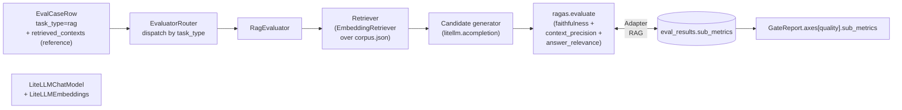

# Phase 8 技术方案 · RAG-aware Evaluator (RAGAS)

> 对应 [ROADMAP.md](ROADMAP.md) Phase 8。预估 1 人天 vibe coding。
> 本文档随实现演进；最终交付完成后只更新顶部状态行 + 在 [JOURNAL.md](../JOURNAL.md) 记里程碑。

**状态**：DONE（153/153 测试绿，lint/format clean；mock 模式 smoke 端到端跑通；quality 轴显示三项 sub-metric 嵌套）

---

## 一句话

为 `task_type=rag` 的 case 引入专用 RAG 评测路径——用真 `ragas` 包跑 `faithfulness` / `context_precision` / `answer_relevance` 三项，candidate 端做动态检索产出 contexts。同步把 runner 的硬编码"candidate→MultiJudge"流水重构成 `task_type` 驱动的 `EvaluatorRouter`，为 Phase 9（agent）留好分支位。

## 数据流



---

## 关键设计决策（已与用户对齐）

- **Evaluator 抽象层（新）**：[`src/evalgate/evaluator/`](../src/evalgate/evaluator/) 取代 `judge.runner` 当 orchestrator。`judge/` 退守做 LLM-as-judge 原语，被 `evaluator.generic` 复用。
- **EvaluationOutcome 是新货币**：每个 evaluator 返回 `(score, sub_metrics, confidence, output_text, retrieved_contexts, candidate_cost, candidate_latency, raw_calls, reason, error)`，runner 不再关心 candidate 怎么跑、judge 怎么聚合。
- **真 ragas 包 + LiteLLM adapter**：写一个最小的 `BaseChatModel` shim 把 ragas 的 langchain 调用导向 `litellm.acompletion`；embedding 同理用 `litellm.aembedding`。这样 ragas 的 prompts/版本演进我们直接吃，不维护自己的副本。
- **Retriever 在 candidate 端**：`PromptSpec.retriever` 决定怎么查；candidate generator 拿到 `{contexts}` 后渲染 prompt。`EvalResultRow` 新增 `retrieved_contexts` 列存运行时实际检索结果（badcase 审计用）。
- **`eval_case.retrieved_contexts` 是 reference**：用于 `context_precision_with_reference`（衡量动态检索 vs 金标）。case 上 `expected.answer` 仍然是 ground truth answer。
- **Gate quality 轴显示分项**：`AxisMetric.sub_metrics: dict[str, AxisMetric] | None`。当 records 携带 `sub_metrics` 时 multi_axis 自动算每个 sub-metric 的 mean + bootstrap CI 嵌进 quality 轴下。**任一 sub-metric 显著回归 → quality 轴整体 fail**（aggregate 仍按 score 主指标算 baseline/candidate）。
- **不考虑向后兼容**：用户明确放权"该重构的时候就重构"。`judge.runner` 直接删除，`judge/` 模块只保留 LLM-as-judge 原语，CLI / 测试 / scripts 一并迁移到 `evaluator.runner`。

## Schema 变更（migration 0008）

[`src/evalgate/db/migrations/versions/0008_rag_columns.py`](../src/evalgate/db/migrations/versions/0008_rag_columns.py)：

- `EvalCaseRow.retrieved_contexts: list[str]`（JsonType, NOT NULL, default `[]`）— 金标 contexts，用于 ragas `context_precision_with_reference` / `context_recall`。
- `EvalResultRow.sub_metrics: dict[str, float] | None` — 例 `{"faithfulness":0.83,"context_precision":0.71,"answer_relevance":0.90}`。
- `EvalResultRow.retrieved_contexts: list[str] | None` — 运行时 candidate retriever 真正取到的 contexts。

`AxisMetric`（pydantic, [`core/schemas.py`](../src/evalgate/core/schemas.py)）：新增 `sub_metrics: dict[str, "AxisMetric"] | None = None`（递归类型）。

`EvalRecord`：新增 `sub_metrics: dict[str, float] | None = None`（不破坏 `extra="allow"` 旧消费者）。

SQLite 走 `batch_alter_table` 加列；PG 用 JSONB；`server_default '[]'` 兜底已有行。

## 模块布局

```
src/evalgate/evaluator/
  __init__.py
  base.py            # Evaluator Protocol + EvaluationOutcome dataclass + UnsupportedTaskTypeError
  router.py          # EvaluatorRouter + build_router
  runner.py          # iter_eval / run_eval (替代旧 judge.runner)
  generic.py         # GenericEvaluator (现有 run_candidate + MultiJudge 路径)
  rag/
    __init__.py
    evaluator.py     # RagEvaluator + _RagasScorer
    retriever.py     # Retriever Protocol + EmbeddingRetriever
    ragas_adapter.py # LiteLLMChatModel + LiteLLMEmbeddings (langchain shim) + build_ragas_components
```

`src/evalgate/judge/runner.py` 已删除。CLI / scripts / 测试已切到 `evalgate.evaluator.runner`。

## PromptSpec 扩展

[`src/evalgate/judge/prompt_spec.py`](../src/evalgate/judge/prompt_spec.py) 新增：

- `RetrieverSpec`：`kind=embedding`、`corpus_path`、`embedding_model`、`top_k`。
- `RagEvaluatorSpec`：`llm_model`、`embedding_model`、`metrics: list[Literal[...]]`。
- `PromptSpec.retriever / rag_evaluator`：可选；`model_validator` 强制要么都写要么都省。

`render_messages` 不动；RagEvaluator 自行渲染 generator template（`{contexts}` + `{question}`）。

## RagEvaluator 流程

```python
async def evaluate(self, case, *, mock=False) -> EvaluationOutcome:
    question = case.input["question"] or case.input["prompt"]
    ref_answer = (case.expected or {}).get("answer")
    ref_contexts = list(case.retrieved_contexts or [])

    contexts = await self.retriever.retrieve(question)            # dynamic
    candidate = await run_candidate(                              # 复用 judge.candidate
        {**case.input, "question": question, "contexts": "\n\n".join(contexts)},
        spec, mock_response=...,
    )
    sub_metrics, raw_calls = await self.scorer.score(             # ragas package
        question=question, answer=candidate.text,
        contexts=contexts, reference_answer=ref_answer,
        reference_contexts=ref_contexts,
    )
    return EvaluationOutcome(
        score=mean(sub_metrics.values()),
        sub_metrics=sub_metrics, raw_calls=raw_calls, ...
    )
```

`_RagasScorer.score`：构造 `datasets.Dataset.from_dict(row)` → `ragas.evaluate(metrics=...)` 在 `loop.run_in_executor` 跑（ragas v0.2 是同步入口）→ 把每个 metric 的 0..1 分转成 `JudgeCallRecord`（`judge_model="ragas:<metric_name>"`，`raw={"metric": ..., "value": ...}`）写到 `eval_judge_calls`。

异常拦截分三档：retriever 失败 → `error_kind=retrieve_failure`；candidate 失败 → `error_kind=candidate_failure`；ragas 失败 → `error_kind=ragas_failure`。任意一档不会 raise 出 case 边界。

## LiteLLM ↔ langchain adapter

[`ragas_adapter.py`](../src/evalgate/evaluator/rag/ragas_adapter.py)：

- `LiteLLMChatModel(BaseChatModel)`：实现 `_agenerate(messages, ...)`，messages 转 LiteLLM 格式，调 `litellm.acompletion`。`mock_text` 字段在测试里短路返回固定字符串（不走 LiteLLM 的 mock_response，那需要构造完整 call kwargs）。`_generate` 走 `asyncio.run(_agenerate)`，langchain sync 回调能用。litellm 异常吞成 `'{"error": "..."}'` 内嵌字符串而不是 raise，让 ragas 自己降级。
- `LiteLLMEmbeddings(Embeddings)`：`embed_documents` / `embed_query` → `litellm.aembedding`。`mock_mode=True` 时走 SHA-256 → 384-dim 浮点向量，确定性 + 区分度。
- `build_ragas_components(spec, mock) -> (LangchainLLMWrapper, LangchainEmbeddingsWrapper)`：ragas 0.2 的 wrapper 类。

## EmbeddingRetriever

[`retriever.py`](../src/evalgate/evaluator/rag/retriever.py)：

- 加载 corpus.json（`[{"id":..,"text":..}]` 列表）。
- 首次 `retrieve` 触发 lazy embed 全 corpus（`asyncio.Lock` 防并发重复 embed）。
- 余弦排序（numpy）取 top_k；`top_k > corpus 大小` 自动 clamp。
- `mock=True` 时 LiteLLMEmbeddings 走 hash 伪向量，CI 不连 Ollama。

## EvaluatorRouter

```python
class EvaluatorRouter:
    def for_case(self, case) -> Evaluator:
        kind = TaskKind(case.task_type)            # raises UnsupportedTaskTypeError
        return self._registry[kind]                # raises UnsupportedTaskTypeError

def build_router(spec, *, mock) -> EvaluatorRouter:
    registry = {TaskKind.generic: GenericEvaluator(spec)}
    if spec.retriever and spec.rag_evaluator:
        registry[TaskKind.rag] = RagEvaluator(spec, mock=mock)   # 延迟导入 ragas
    return EvaluatorRouter(registry)
```

`agent` 不注册 → Phase 9 直接补一行就接上。

`runner.iter_eval` 拿 `router.for_case(case).evaluate(case)`，未注册 task_type 时把异常转成一个 `error=True` 的 EvaluationOutcome（不污染整 run）。

## Gate report 分项

[`multi_axis.py`](../src/evalgate/report/multi_axis.py)：跑完四主轴后，对 quality 轴扫 `records[*].sub_metrics`，每个 metric 名构造一个 higher-is-better mean axis（bootstrap CI），嵌到 `quality.sub_metrics`。`quality.passed = passed AND all(sub.passed)`。

混合 set（一半 generic 一半 rag）：sub-metric 只聚合在那部分 RAG records 上，generic case 不污染均值。

[`gate.decision`](../src/evalgate/gate/decision.py) `_summarize`：quality 因 sub-metric 挂的时候，summary 显式列出哪些 sub 跌了（faithfulness / context_precision / answer_relevance）+ 多少个百分点。

## CLI / API / Demo

- CLI `evalgate run` 行为不变；YAML 里有 `retriever:` + `rag_evaluator:` 块就自动启用 RAG 路径。
- 新 `evalgate eval-set add-rag-case --question --answer --context X --context Y`：demo seeder 用。
- REST `POST /v1/eval-sets/{id}/cases` 加 `retrieved_contexts` 字段（默认 `[]`），`EvalCaseOut` 同步暴露。
- [`examples/rag_demo/`](../examples/rag_demo/)：10 条 corpus chunk + `seed.py`（5 条 billing/account case）+ `prompts/rag_baseline.yaml` & `prompts/rag_candidate.yaml`（candidate 故意改弱：去掉"only use context"约束 + 高温 + verbosity 倾向）。
- [`scripts/phase8_rag_smoke.py`](../scripts/phase8_rag_smoke.py)：bootstrap → seed → run baseline → run candidate → gate report → 断言 quality.sub_metrics 三项齐全；mock 模式默认临时 SQLite，`DATABASE_URL` 切真 PG。

## 退出标准

1. `make test`：123 旧测试 + 30 新测试 = **153/153 全绿** ✓
2. `make lint`：clean ✓
3. `make format`：clean ✓
4. mock 模式 smoke：`EVALGATE_MOCK_LLM=1 PYTHONPATH=. python scripts/phase8_rag_smoke.py` 端到端跑通 5 case → 报告 `quality.sub_metrics = {faithfulness, context_precision, answer_relevance}` ✓
5. 真 LLM 模式：本机 Ollama（`qwen2.5:7b` + `qwen3-embedding:8b`）跑同一 smoke，candidate 故意改弱后 baseline mean_score > candidate mean_score（待用户在本机执行）

## 测试矩阵（aiosqlite + mock，CI 不连 Ollama）

| 文件 | 覆盖 |
|------|------|
| [tests/test_evaluator_router.py](../tests/test_evaluator_router.py) | dispatch 正确性、未注册 task_type、build_router 条件、空 registry 拒绝、label 顺序 |
| [tests/test_rag_retriever.py](../tests/test_rag_retriever.py) | top_k、确定性、不同 query、缺 corpus、top_k clamp |
| [tests/test_rag_evaluator.py](../tests/test_rag_evaluator.py) | happy path（sub_metrics + raw_calls）、candidate failure、ragas failure、缺 retriever block |
| [tests/test_litellm_chat_model_adapter.py](../tests/test_litellm_chat_model_adapter.py) | mock_text 短路、message 翻译、litellm 异常吞、embedding mock 确定性、embedding 真调 |
| [tests/test_eval_case_retrieved_contexts.py](../tests/test_eval_case_retrieved_contexts.py) | ORM 持久化、默认空、REST round-trip |
| [tests/test_run_cli_rag.py](../tests/test_run_cli_rag.py) | runner 端到端 → records 含 sub_metrics → gate 正确分项；DB 侧 `eval_results.sub_metrics` + `retrieved_contexts` 落库 |
| [tests/test_gate_decision_subaxes.py](../tests/test_gate_decision_subaxes.py) | 无 sub_metrics 不嵌套、有 sub_metrics 嵌套、显著 sub 回归带挂 quality、混合 set 部分聚合 |

## 依赖变更

[`pyproject.toml`](../pyproject.toml) 主依赖加：

- `ragas>=0.1.21,<0.3`（实测装上 `ragas==0.2.15`）
- `datasets>=2.14`（ragas 必需，传 `Dataset` 对象给 `evaluate`）
- `langchain-core>=0.2`（adapter shim 用 `BaseChatModel` / `Embeddings`）

ragas 自动拉来 langchain / langchain-openai / langgraph 等一票（评测期不走它们的 LLM provider，仅依赖类型签名）。

## 风险 / 范围控制

- **ragas 版本不稳**：固定 minor 范围（`>=0.1.21,<0.3`），CI 全 mock 不依赖 ragas 在线 prompt fetching；adapter 异常吞成 `EvaluationOutcome.error=True`。
- **Ollama embedding 慢/缺失**：`EVALGATE_MOCK_LLM=1` 时 retriever 走 hash 伪向量；本机 demo 切到 `qwen3-embedding:8b`。
- **mock 下 ragas 给 score=0**：mock 模式下 ragas 拿到我们固定的 `'{"score":0.8,...}'` 字符串无法解析（claims 抽取等需要特定格式），因此 sub_metric 统一收敛到 0；端到端 plumbing 仍然全通。真 LLM 模式才能产出有意义分数（这是 Phase 8 实测验证步骤的 5 条退出标准之一）。
- **不做的事**：`context_recall`（不在三项里，留给后续）、retriever 多种 kind、动态 reload corpus、ragas 自定义 metric、Streamlit 展示分项（Phase 11）、agent task_type（Phase 9）。

## Forward-compat：给后续 phase 留接口

| For Phase | 现在做的事 | 收益 |
|-----------|-----------|------|
| **9 Agent** | `EvaluatorRouter` 已支持注册 `TaskKind.agent`；`build_router` 加一行即可 | Phase 9 不用动 runner / persistence / records 流 |
| **10 Safety** | `EvaluationOutcome` 统一承载逐 case 结果；safety 作为横切关注点 | Phase 10 实际把 `SafetyPipeline` 挂在 runner 层（每个 evaluator 返回后 augment），把 4 项速率写进 `axis_breakdown["safety"]`，三类 evaluator 都不感知 safety |
| **11 Streamlit UI** | `EvalResultRow.sub_metrics` + `retrieved_contexts` 落库 | UI 直接读 DB 渲染 RAG 详情页（不重跑） |
| **17 Calibration** | `EvalJudgeCallRow` 已存每 metric per-call score（`raw={"metric":..,"value":..}`）+ `judge_confidence` | Phase 17 直接对 ragas 三项分别拟合 calibration 不重跑 |
