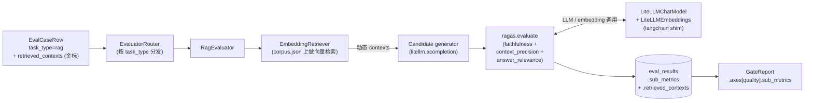

# Phase 8 技术方案 · RAG-aware Evaluator（RAGAS）

## 一句话

为 `task_type=rag` 的 case 引入专用 RAG（Retrieval-Augmented Generation，检索增强生成）评测路径：candidate 端动态检索产出 contexts，再用真 `ragas` 包跑 **RAGAS faithfulness / context-precision / answer-relevance（忠实度 / 上下文精确率 / 答案相关性）** 三项打分。同时把 runner 里硬编码的「candidate → MultiJudge」流水重构成由 `task_type` 驱动的 `EvaluatorRouter`，给 Phase 9（agent）留好分支位。

## 整体架构与数据流



数据流的核心是「**检索发生在 candidate 端**」：retriever 先按 question 查出动态 contexts，candidate generator 拿 `{contexts}` 渲染 prompt 产出答案，ragas 再用 (question, answer, contexts, 金标) 算三项分数。运行时实际检索到的 contexts 会落库（`EvalResultRow.retrieved_contexts`）供 badcase 审计。

## 模块布局：从 judge.runner 到 evaluator 抽象层

重构的主线是把「编排（orchestration）」从 judge 模块抽出来，`judge/` 退守为 LLM-as-judge（用 LLM 当判官）原语，被 `evaluator.generic` 复用：

```
src/evalgate/evaluator/
  base.py            # Evaluator Protocol + EvaluationOutcome + UnsupportedTaskTypeError
  router.py          # EvaluatorRouter + build_router
  runner.py          # iter_eval / run_eval（替代旧 judge.runner）
  generic.py         # GenericEvaluator（原 run_candidate + MultiJudge 路径）
  rag/
    evaluator.py     # RagEvaluator + _RagasScorer
    retriever.py     # Retriever Protocol + EmbeddingRetriever
    ragas_adapter.py # LiteLLMChatModel + LiteLLMEmbeddings + build_ragas_components
```

**`EvaluationOutcome` 是新的统一货币**：每个 evaluator 返回 `(score, sub_metrics, confidence, output_text, retrieved_contexts, candidate_cost, candidate_latency, raw_calls, reason, error)`。runner 从此不再关心 candidate 怎么跑、judge 怎么聚合——任何任务类型都收敛到这一个结构。

`EvaluatorRouter` 按 `task_type` 分发：

```python
def build_router(spec, *, mock) -> EvaluatorRouter:
    registry = {TaskKind.generic: GenericEvaluator(spec)}
    if spec.retriever and spec.rag_evaluator:
        registry[TaskKind.rag] = RagEvaluator(spec, mock=mock)   # 延迟导入 ragas
    return EvaluatorRouter(registry)
```

`agent` 暂不注册，Phase 9 加一行即可接上；`runner.iter_eval` 遇到未注册的 task_type，会把异常转成 `error=True` 的 `EvaluationOutcome`，不污染整个 run。

## RagEvaluator 评测流程

```python
async def evaluate(self, case, *, mock=False) -> EvaluationOutcome:
    question = case.input["question"] or case.input["prompt"]
    ref_answer = (case.expected or {}).get("answer")        # ground truth answer
    ref_contexts = list(case.retrieved_contexts or [])      # 金标 contexts

    contexts = await self.retriever.retrieve(question)       # 动态检索
    candidate = await run_candidate(                         # 复用 judge.candidate
        {**case.input, "contexts": "\n\n".join(contexts)}, spec, ...)
    sub_metrics, raw_calls = await self.scorer.score(        # 走 ragas 包
        question=question, answer=candidate.text, contexts=contexts,
        reference_answer=ref_answer, reference_contexts=ref_contexts)
    return EvaluationOutcome(score=mean(sub_metrics.values()),
                             sub_metrics=sub_metrics, raw_calls=raw_calls, ...)
```

- `case.retrieved_contexts` 是**金标 contexts（reference）**，用于 `context_precision_with_reference`（衡量动态检索 vs 金标的差距）；`expected.answer` 仍是 ground truth answer。
- `_RagasScorer.score` 把 row 包成 `datasets.Dataset` 交给 `ragas.evaluate`（ragas v0.2 是同步入口，放进 `loop.run_in_executor` 跑），再把每个 metric 的 0..1 分转成 `JudgeCallRecord`（`judge_model="ragas:<metric>"`）落 `eval_judge_calls`，方便后续按单项做校准。
- 异常分三档拦截，都不越出 case 边界：retriever 失败 → `retrieve_failure`；candidate 失败 → `candidate_failure`；ragas 失败 → `ragas_failure`。

**EmbeddingRetriever**：加载 `corpus.json`，首次 `retrieve` 时 lazy embed 全 corpus（`asyncio.Lock` 防并发重复 embed），余弦相似度排序取 top-k（`top_k` 超 corpus 大小自动 clamp）。

## Gate 的 sub-metric 嵌套

`AxisMetric` 新增递归字段 `sub_metrics: dict[str, "AxisMetric"] | None`。[`multi_axis.py`](../src/evalgate/report/multi_axis.py) 跑完四主轴后，对 quality 轴扫 `records[*].sub_metrics`，每个 RAGAS 指标各算一个 higher-is-better 的 mean 轴（带 bootstrap CI，自助法置信区间），嵌进 `quality.sub_metrics`。

判定规则：`quality.passed = passed AND all(sub.passed)`——**任一 sub-metric 显著回归，quality 轴整体 fail**（聚合主指标仍按 score 算 baseline/candidate）。混合 set（一半 generic 一半 rag）时，sub-metric 只在 RAG records 上聚合，generic case 不污染均值；gate summary 会显式列出是哪一项（faithfulness / context_precision / answer_relevance）跌了多少个百分点。

## Schema 变更

- `EvalCaseRow.retrieved_contexts: list[str]`（金标 contexts，NOT NULL，default `[]`）。
- `EvalResultRow.sub_metrics: dict[str, float] | None`，例 `{"faithfulness":0.83,"context_precision":0.71,"answer_relevance":0.90}`。
- `EvalResultRow.retrieved_contexts: list[str] | None`：运行时实际检索结果。

SQLite 走 `batch_alter_table` 加列，PG 用 JSONB，`server_default '[]'` 兜底已有行。

## 技术选型与抉择

**1. 任务分层 evaluator：RAG 走 RAGAS，而非通用 rubric（ADR-005）**

纯 LLM-as-judge + 单一通用 rubric 评 RAG 必然失真——RAG 的质量约束是「答案有没有忠于检索到的上下文、上下文检得准不准」，不是泛泛的「回答好不好」。ADR-005 据此把 evaluator 按 `task_type` 分层：RAG → RAGAS，Agent → trajectory eval，通用 → rubric LLM-as-judge，由 `EvaluatorRouter` 分发。代价是抽象层变多、评测成本上升，但这是 evaluator 质量的根本约束，否则 RAG 和 Agent 共用一套 rubric 两边都不准。

**2. 直接吃真 ragas 包 + 写 LiteLLM↔langchain adapter，而非自维护指标实现**

RAGAS 的指标定义（claims 抽取、context precision 算法等）会随版本演进。自己复刻一份 prompts/算法意味着要永久追平上游。选择写一个最小的 langchain shim（[`ragas_adapter.py`](../src/evalgate/evaluator/rag/ragas_adapter.py)）把 ragas 的调用导向我们统一的 LiteLLM 网关：

- `LiteLLMChatModel(BaseChatModel)`：把 messages 转 LiteLLM 格式调 `litellm.acompletion`；`mock_text` 在测试里短路返回固定串；litellm 异常吞成内嵌 `{"error":...}` 字符串而不是 raise，让 ragas 自行降级。
- `LiteLLMEmbeddings(Embeddings)`：走 `litellm.aembedding`；`mock_mode` 下用 SHA-256 → 384 维确定性伪向量，CI 不连 Ollama。

收益：ragas 的 prompt/版本演进我们直接吃，不维护副本；成本是多一层 adapter 和对 ragas 版本的兼容（固定 `>=0.1.21,<0.3`，CI 全 mock 不依赖其在线 prompt fetching）。

**3. 检索放在 candidate 端，金标 contexts 当 reference**

把 retriever 挂在 candidate 端，才能评测「真实检索 + 生成」的端到端质量，而不是只评一段给定上下文上的生成。case 上另存一份金标 contexts 作为 reference，用于 `context_precision_with_reference` 衡量动态检索与金标的差距。

**4. sub-metric 落库到 `eval_judge_calls`，per-metric 存分**

每个 RAGAS 指标的 per-call score 都以 `JudgeCallRecord` 落库，而非只存聚合值。这样 UI 能直接读 DB 渲染 RAG 详情、后续校准能对三项分别拟合，都不必重跑评测。

**5. 不追求向后兼容，直接删 `judge.runner`**

重构时明确放弃兼容旧编排路径：`judge.runner` 直接删除，CLI / 测试 / scripts 一并迁到 `evaluator.runner`。理由是 `judge/` 与 `evaluator/` 职责重叠会长期制造混乱，一次切干净比留两套并存更省心。

## 已知边界

- mock 模式下 ragas 拿到固定的占位字符串无法解析（claims 抽取等需要真实结构化输出），sub_metric 会统一收敛到 0——端到端 plumbing 全通，但**有意义的分数需要真 LLM 模式**才能产出。
- 三项之外的 `context_recall`、多种 retriever kind、动态 reload corpus、自定义 ragas metric 等留给后续迭代。

## 与后续阶段的衔接

- **Agent**：`EvaluatorRouter` 已支持注册 `TaskKind.agent`，Phase 9 加一行即可，不动 runner / persistence / records 流。
- **Safety**：`EvaluationOutcome` 统一承载逐 case 结果，safety 作为横切关注点挂在 runner 层（每个 evaluator 返回后 augment），三类 evaluator 都不感知 safety。
- **UI**：`EvalResultRow.sub_metrics` + `retrieved_contexts` 落库，UI 直接读 DB 渲染 RAG 详情页，不重跑。

## 测试策略

围绕 router 分发、retriever 检索、RagEvaluator 三档异常、langchain adapter 翻译/mock、sub-metric 落库与 gate 分项判定做端到端覆盖，全程 aiosqlite + mock，CI 不连 Ollama。
