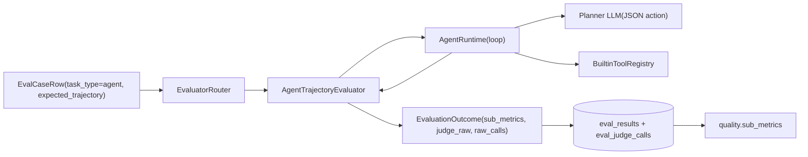

# Phase 9 技术方案 · Agent Trajectory Evaluator（Tool Runtime）

> 对应 [ROADMAP.md](./ROADMAP.md) Phase 9。预估 1 人天 vibe coding。  
> 完成后仅更新状态与里程碑记录。

**状态**：DONE（新增 agent runtime + trajectory evaluator；phase9 smoke 跑通；全量测试/ lint/format 通过）

---

## 一句话

当 `task_type=agent` 时，runner 不再复用 GenericJudge，而是走 `AgentTrajectoryEvaluator`：在 evaluator 内执行真实 tool runtime 产出 `actual_trajectory`，再与 `eval_case.expected_trajectory` 对齐计算 `tool_call_accuracy` 与 `step_wise_success`，并通过 `quality.sub_metrics` 进入 gate。

## 数据流

## 关键设计决策

- **真实轨迹来源**：来自 runtime 的真实 tool 执行，而不是让模型“自报轨迹”。
- **匹配策略**：tool 名 + step 顺序严格；args 采用 expected ⊆ actual 深度子集匹配。
- **step_wise_success 定义**：按前缀连续成功率计算，遇到首个 mismatch 即截断。
- **质量汇总**：`score = (tool_call_accuracy + step_wise_success) / 2`。
- **不加新 result 列**：实际轨迹存在 `judge_raw.actual_trajectory` + `eval_judge_calls.raw`，避免 schema 冗余。

## Schema 与迁移

### `eval_cases`

在 [`src/evalgate/db/models.py`](../src/evalgate/db/models.py) `EvalCaseRow` 新增：

- `expected_trajectory: list[dict[str, Any]]`（JsonType，`nullable=False`，`default=list`）

新增 migration：

- [`src/evalgate/db/migrations/versions/0009_add_expected_trajectory.py`](../src/evalgate/db/migrations/versions/0009_add_expected_trajectory.py)
  - `down_revision = "0008"`
  - 添加 `eval_cases.expected_trajectory`
  - `server_default='[]'`
  - SQLite 走 `batch_alter_table`

## API / CLI / Repository threading

- shared schema：[`src/evalgate/core/schemas.py`](../src/evalgate/core/schemas.py)
  - `EvalCaseOut.expected_trajectory`
  - 内部 `EvalCase` 也补齐对应字段
- repository：[`src/evalgate/eval_set/repository.py`](../src/evalgate/eval_set/repository.py)
  - `add_case(... expected_trajectory=...)`
  - `add_case_from_trace` 透传 extractor 输出
- REST：[`src/evalgate/api/routers/eval_sets.py`](../src/evalgate/api/routers/eval_sets.py)
  - `CreateCaseRequest.expected_trajectory`
  - `_case_out` 返回该字段
- CLI：[`src/evalgate/cli.py`](../src/evalgate/cli.py)
  - `_case_to_dict` 输出 `expected_trajectory`
  - 新增 `evalgate eval-set add-agent-case`（`--step` repeatable JSON）

## 新增模块

目录：[`src/evalgate/evaluator/agent/`](../src/evalgate/evaluator/agent/)

- `types.py`：`ParsedAction`, `TrajectoryStep`, `AgentRuntimeResult`
- `parser.py`：严格 JSON action 解析
- `tools.py`：`BuiltinToolRegistry`（`lookup_invoice`, `fetch_policy`, `get_payment_attempts`）
- `runtime.py`：planner loop + tool execution + scratchpad observation
- `evaluator.py`：`AgentTrajectoryEvaluator`

并在 [`src/evalgate/evaluator/router.py`](../src/evalgate/evaluator/router.py) 完成注册：

- `spec.agent_runtime is not None` 时，注册 `TaskKind.agent -> AgentTrajectoryEvaluator`
- 未配置时继续保持 `unsupported_task_type` per-case error 语义

## PromptSpec 扩展

在 [`src/evalgate/judge/prompt_spec.py`](../src/evalgate/judge/prompt_spec.py) 新增：

- `AgentRuntimeSpec`
  - `max_steps: int = 6`
  - `tool_names: list[str]`（必填）
  - `planner_model: str | None`
- `PromptSpec.agent_runtime: AgentRuntimeSpec | None`
- validator：
  - `tool_names` 非空
  - 去空白后不允许重复

## Extractor 扩展（可选项已落地）

在 [`src/evalgate/ingest/case_extract.py`](../src/evalgate/ingest/case_extract.py) 增加：

- `_extract_expected_trajectory`：从 `evalgate.kind=tool` spans 按时间顺序抽取
- tool 名读取顺序：`tool.name` / `gen_ai.tool.name` / `tool` / `name` / `span.name`
- args 读取顺序：`tool.args` / `gen_ai.tool.args` / `tool.arguments` / `args`（字符串尝试 JSON 解析）

这样 `add_case_from_trace` 可自动补初稿轨迹。

## Demo 与 smoke

新增目录：[`examples/agent_demo/`](../examples/agent_demo/)

- `tools_catalog.json`
- `seed.py`（3 条 agent case，显式 `expected_trajectory`）
- `prompts/agent_baseline.yaml`
- `prompts/agent_candidate.yaml`（有意把第二步工具顺序改错）

新增脚本：[`scripts/phase9_agent_smoke.py`](../scripts/phase9_agent_smoke.py)

流程：seed -> baseline run -> candidate run -> gate -> 断言

- `quality.sub_metrics` 包含 `tool_call_accuracy` 与 `step_wise_success`
- 至少一条 case 出现 step-wise regression（中间步骤错）

## 测试矩阵

- [`tests/test_agent_runtime.py`](../tests/test_agent_runtime.py)
  - mock loop、max_steps、action parse error
- [`tests/test_agent_trajectory_evaluator.py`](../tests/test_agent_trajectory_evaluator.py)
  - 缺失轨迹错误、subset args 匹配、中间步骤错导致分数下降
- [`tests/test_eval_case_expected_trajectory.py`](../tests/test_eval_case_expected_trajectory.py)
  - ORM + REST round-trip
- [`tests/test_run_eval_agent.py`](../tests/test_run_eval_agent.py)
  - runner 端到端落库 + 无 `agent_runtime` 时 unsupported 分支
- [`tests/test_evaluator_router.py`](../tests/test_evaluator_router.py)
  - build_router 注册 agent 分支
- [`tests/test_case_extract.py`](../tests/test_case_extract.py)
  - tool spans -> expected_trajectory
- [`tests/test_gate_decision_subaxes.py`](../tests/test_gate_decision_subaxes.py)
  - agent sub-metrics 在 quality 下正确聚合
- [`tests/test_prompt_spec.py`](../tests/test_prompt_spec.py)
  - `agent_runtime` 校验规则
- [`tests/test_eval_sets_cli.py`](../tests/test_eval_sets_cli.py)
  - `add-agent-case` 正常与异常路径

## 风险与边界

- v1 不做并行工具调用，不做语义同义工具映射。
- 工具实现是 deterministic builtin mock（便于 CI 与 smoke），后续可替换为真实业务工具 registry。
- planner 输出采用 strict JSON contract，避免 provider-specific function-calling 差异。

## 退出标准

- `pytest` 全绿
- `ruff check` / `ruff format --check` 通过
- `PYTHONPATH=. .venv/bin/python scripts/phase9_agent_smoke.py` 通过
